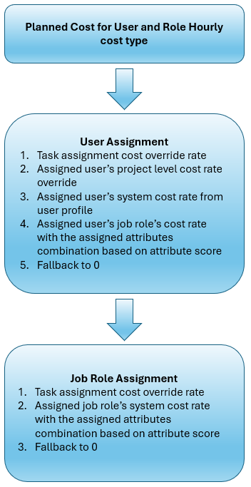
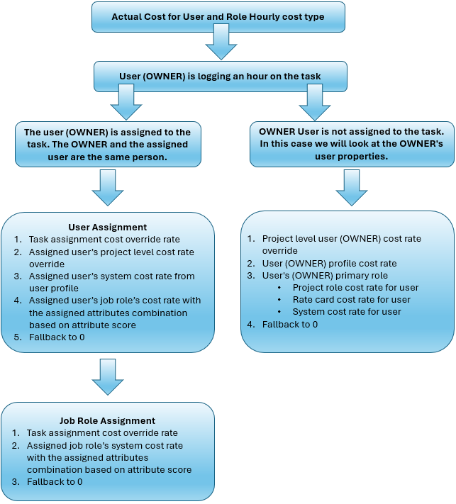

# 收入和成本层次结构概览

{{highlighted-preview-article-level}}

{{ultimate-package}}

为了提供精确的财务计算，Workfront在计算任务或项目的收入时使用适当的记帐费率。 必须在所有级别上明确界定工作角色和用户费率，以实现准确的财务计算。

本文中的各节概述了确定工作角色和用户的相应计费和成本费率的分步流程，这些角色和用户对应于“用户”和“角色每小时”收入类型和成本类型。

有关记帐费率、收入类型以及如何计算收入的更多信息，请参阅[记帐和收入概览](/help/quicksilver/manage-work/projects/project-finances/billing-and-revenue-overview.md)。

## 有效日期概览

Workfront管理员可以选择设置有效日期，以确定记帐费率、成本费率和其他财务属性在系统中生效的时间。 例如，工作角色或用户的默认记帐费率可能为$50。 在适用生效日期后，50美元的利率可以设定在3月31日到期，55美元的新利率将从4月1日自动开始。

对于计划收入计算，记帐费率基于计划小时数的日期。 计划的小时数平均分布在任务持续时间中。 对于上一个示例，计划于3月31日或更早时间段的小时数使用$50费率，计划于4月1日或之后时间段的小时数使用$55费率。

对于实际收入计算，记帐费率基于记录的小时数的日期。 使用上一个示例，3月31日或之前记录的小时数使用$50费率，4月1日或之后记录的小时数使用$55费率。

>[!NOTE]
>
>未使用有效日期定义任务分配。 相反，分配会从系统提取适用的费率，无论这些费率来自费率卡、用户配置文件还是分配层覆盖。 有效日期可确保根据工作的时间应用正确的费率，但它们不会直接定义分配。

## 开单的工作角色概览

在分配级别或项目级别为用户设置了计费&#x200B;**的**&#x200B;工作角色。 它仅适用于用户，不能用于其他工作角色。 例如，用户的主要工作角色是Designer，但在某个任务或项目中，他们作为高级Designer的角色，该比率应反映这一点。

开单的分配层工作角色仅适用于该特定分配，不会自动应用于用户的其它分配。 用于计费的项目级别工作角色适用于用户在该项目中的所有分配。 如果需要，您可以在单个分配层改写它。

当计费工作角色在用户分配或项目层应用时，可以在收入计算中使用附加到计费工作角色的费率，而不是用户或工作角色费率。 只有在使用“用户”和“角色每小时”收入类型时，计费工作角色才可用。

>[!NOTE]
>
>虽然出于计费目的，用户可能使用不同的角色进行操作，但成本计算仍继续使用其主要工作角色。 开单的工作角色仅影响开单计算。

有关详细信息，请参阅[设置工作角色以进行计费](/help/quicksilver/manage-work/projects/project-finances/set-up-job-role-for-billing.md)。

## 保留率概述

项目上的&#x200B;**保留项目记帐费率信息**&#x200B;标志控制系统在费率卡完成时是否将记帐信息用于分配，或是否允许根据项目过程中的更改进行修改。 对用户工作角色、薪金、费率卡或其他计费相关信息的任何更改都不会影响分配的计费费率。 在激活项目标志时，根据最终费率卡保留费率。 这些分配属性（如工作角色和薪金）仍会更新，以确保分配的真实成本是准确的。

当该标志打开时，系统锁定项目持续期间的日期有效计费费率（在附加到项目的已完成费率卡上设置）。

当工作已开始，并且工作分派和小时数已存在时，可以在项目上激活该标志。 当时：

* 最终批准的费率卡费率将成为所有项目分配的记帐费率的来源。
* 所有过去、当前和将来分配均使用最终批准的费率重新计算。
* 实际值和计划值会重新计算。

>[!NOTE]
>
>一旦打开该标志以保留记帐费率，除非项目没有分配和小时数，否则无法将其关闭。 这可确保所有财务报告反映真实合约利率。
>当该标志关闭时，系统允许重新计算或动态调整计费费率。 对用户角色、薪金或记帐费率的任何更新都会立即反映在分配的记帐费率中。

有关详细信息，请参阅[编辑项目](/help/quicksilver/manage-work/projects/manage-projects/edit-projects.md)和[管理费率卡](/help/quicksilver/administration-and-setup/manage-enterprise-operations/manage-rate-cards.md)。

## 计划收入 — 每小时用户和角色

当任务的收入类型为“每小时”和“用户”时，Workfront会同时使用用户和工作角色费率层次结构来确定计划收入的记帐费率。

此图显示了计划收入层次结构的流量：

当用户被分配给任务时，Workfront将按照以下层次结构搜索：

1. 系统首先会在用户的分配中查找保留的速率。

   保留的比率仍遵循该层次结构，但在保留项目时会冻结该比率。 有关详细信息，请参阅[保留费率概览](#overview-of-preserved-rates)。

1. 接下来，系统在费率卡上查找主要工作角色或工作角色以计费分配给任务的用户。 如果某个比率存在并且被锁定，则该比率用于收入计算。

   如果费率卡中存在费率且已解锁，则系统不会使用该费率并在层次结构中搜索下一个费率。

1. 接下来，系统会查找用户的分配层覆盖率。 这是与特定分配关联的手动添加费率，它覆盖该分配中用户的所有其他费率（费率卡锁定费率除外）。 如果找到费率，则在收入计算中使用该费率。
1. 接下来，系统在任务分配层查找工作角色以进行计费。

   用于计费的工作角色仅适用于特定分配，并应用于该分配，而不是用户的主要工作角色费率。 例如，用户的主要工作角色是Designer，但在某项任务中，他们作为高级Designer处理，且记帐费率较高。

   Workfront会查找记帐费率的工作角色：

   * 系统首先从分配中查找工作角色的计费率（在本例中为“高级Designer”），并将有效日期考虑在内。 您将在项目的费率>计费区域的&#x200B;**费率Source：覆盖>资源类型：工作角色**&#x200B;分组中看到此信息。 这是项目的覆盖率。
   * 接下来，系统从费率卡查找记帐费率的工作角色，并考虑有效日期。 您将在项目的费率>计费区域的&#x200B;**费率Source：附加的费率卡>资源类型：工作角色**&#x200B;分组中看到此信息。
   * 如果计费工作角色的费率不在项目上或费率卡上，则系统会查找系统级别的工作角色费率（在本例中为“高级Designer”），并将有效日期考虑在内。
   * 如果为开单分配了工作角色，并且未找到前面步骤中的任何费率，则开单费率为0。

     >[!NOTE]
     >
     >当分配了计费工作角色，但计费率为0时，这是重新访问费率设置的指示器。 0比率意味着该工作角色（示例中的高级Designer）没有在Workfront中设置比率。 您应该为工作角色添加费率，或从分配中删除要计费的工作角色。
     >
     >由于任务会从项目继承工作角色费率（当这些费率在项目层可用时），因此，当Workfront在任务分配层搜索工作角色以进行计费时，会找到搜索工作角色以进行项目计费的任何费率。 对于计费工作角色的项目级别搜索仍保留在搜索层次结构中。

1. 如果在任务分配层没有工作角色可记帐，则系统会为分配给任务的特定用户查找项目的记帐费率，并将有效日期考虑在内。 您将在项目的费率>计费区域的&#x200B;**费率Source：覆盖>资源类型：用户**&#x200B;分组中看到此信息。 这是项目的覆盖率。
1. 接下来，系统在用户配置文件中查找系统级别的记帐费率，并将有效日期考虑在内。
1. 接下来，系统会查找用户的主要工作角色（示例中为Designer）的计费率。

   * 系统首先查找项目的记帐费率（用户的主要工作角色），并将有效日期考虑在内。 您将在项目的费率>计费区域的&#x200B;**费率Source：覆盖>资源类型：工作角色**&#x200B;分组中看到此信息。 这是项目的覆盖率。
   * 接下来，系统会从费率卡中查找工作角色费率，并将有效日期考虑在内。 您将在项目的费率>计费区域的&#x200B;**费率Source：附加的费率卡>资源类型：工作角色**&#x200B;分组中看到此信息。
   * 接下来，系统会查找系统级别的工作角色比率，并将有效日期考虑在内。

1. 如果未找到这些费率，则记帐费率为0。

当用户未分配给任务时，Workfront将根据以下层次结构搜索工作角色费率：

1. 系统首先会在工作角色的分配中查找保留的费率。
1. 系统在费率卡上查找分配给任务的工作角色的记帐费率。 如果某个比率存在并且被锁定，则该比率用于收入计算。

   如果费率卡中存在费率且已解锁，则系统不会使用该费率并在层次结构中搜索下一个费率。

1. 接下来，系统会查找工作角色的分配任务覆盖率。 这是为特定分配上的工作角色手动添加的费率，并覆盖此任务上工作角色的所有其他费率。 如果找到费率，则在收入计算中使用该费率。
1. 接下来，系统会查找分配给任务的工作角色的记帐费率。

   * 系统首先查找工作角色在项目上的计费率，并将有效日期考虑在内。 您将在项目的费率>计费区域的&#x200B;**费率Source：覆盖>资源类型：工作角色**&#x200B;分组中看到此信息。 这是项目的覆盖率。
   * 接下来，系统会从费率卡中查找工作角色费率，并将有效日期考虑在内。 您将在项目的费率>计费区域的&#x200B;**费率Source：附加的费率卡>资源类型：工作角色**&#x200B;分组中看到此信息。
   * 接下来，系统会查找系统级别的工作角色比率，并将有效日期考虑在内。

1. 如果未找到这些费率，则记帐费率为0。

## 实际收入 — 每小时用户和角色

当任务的收入类型为“每小时”和“用户”时，Workfront使用两个层次结构来确定实际收入的记帐费率。 记帐费率基于用户记录任务的小时数。

层级中的“用户”是分配给任务的人员。 “所有者”是记录其时间的任务相关人员，即使他们未分配到任务。 例如，Michael被分配到一个任务，但Joanna由于Michael生病而完成了工作。 经理可以记录任务的时间，并将记录小时数的所有者设置为Joanna。 计划收入值基于层次结构中Michael的分配和费率，而实际收入值基于Joanna的费率。

此图显示了实际收入层次结构的流量：

### 当记录小时数的所有者和任务中的已分配用户相同时

Workfront首先按用户分配搜索记帐费率。 如果未将用户分配给任务，则它将按工作角色分配搜索记帐费率。

此方案的层次结构与计划的收入层次结构相同。 查看此工作流的[计划收入 — 每小时用户和角色](#planned-revenue--user-and-role-hourly)。

### 当记录的小时数的所有者不是任务中的已分配用户时

Workfront将根据以下层次结构搜索所有者的用户属性：

1. 系统首先在分配中查找所有者的保留费率。
1. 接下来，系统在费率卡上为所有者的主要工作角色查找计费费率。 如果某个比率存在并且被锁定，则该比率用于收入计算。

   如果费率卡中存在费率且已解锁，则系统不会使用该费率并在层次结构中搜索下一个费率。

1. 接下来，系统会为所有者查找项目的记帐费率，并将有效日期考虑在内。 您将在项目的费率>计费区域（在费率Source：覆盖>资源类型：用户分组中）看到此信息。 这是项目的覆盖率。
1. 接下来，系统在项目级别查找用于计费的工作角色。

   计费工作角色仅适用于特定项目，并应用于项目而非所有者的主要工作角色费率。 例如，所有者的主要工作角色是Designer，但在某个项目中，他们作为高级Designer使用，且记帐费率较高。

   Workfront会查找记帐费率的工作角色：

   * 系统首先从费率卡中查找记帐费率的工作角色，并将有效日期考虑在内。 您将在项目的费率>计费区域的&#x200B;**费率Source：附加的费率卡>资源类型：工作角色**&#x200B;分组中看到此信息。
   * 如果计费工作角色的费率不在费率卡上，则系统会查找系统级别的工作角色费率（在本例中为“高级Designer”），并将有效日期考虑在内。
   * 如果为开单分配了工作角色，并且未找到前面步骤中的任何费率，则开单费率为0。

     >[!NOTE]
     >
     >当分配了计费工作角色，但计费率为0时，这是重新访问费率设置的指示器。 0比率意味着该工作角色（示例中的高级Designer）没有在Workfront中设置比率。 您应该为工作角色添加费率，或从项目中删除要计费的工作角色。

1. 接下来，系统在所有者的用户配置文件中查找系统级别的记帐费率，并将有效日期考虑在内。
1. 接下来，系统会查找所有者主要工作角色的计费率（示例中为Designer）。

   * 系统首先查找项目的记帐费率（所有者的主要工作角色），并将有效日期考虑在内。 您将在项目的费率>计费区域的&#x200B;**费率Source：覆盖>资源类型：工作角色**&#x200B;分组中看到此信息。 这是项目的覆盖率。
   * 接下来，系统会从费率卡中查找工作角色费率，并将有效日期考虑在内。 您将在项目的费率>计费区域的&#x200B;**费率Source：附加的费率卡>资源类型：工作角色**&#x200B;分组中看到此信息。
   * 接下来，系统会查找系统级别的工作角色比率，并将有效日期考虑在内。

1. 如果未找到这些费率，则记帐费率为0。

## 计划成本 — 每小时用户和角色

当任务的成本类型为“每小时用户”和“每小时角色”时，Workfront将使用用户和工作角色费率层次结构来确定计划成本的费率。

此图显示了计划成本层次结构的流程：

当用户被分配给任务时，Workfront将按照以下层次结构搜索：

1. 系统会为用户查找分配任务覆盖率。 这是针对特定分配的用户的手动添加费率，并覆盖此任务中用户的所有其他费率。 如果找到了费率，则该费率用于成本计算。
1. 接下来，系统会查找项目的成本费率，以及分配给任务的特定用户，并将有效日期考虑在内。 您将在项目的费率>成本区域的&#x200B;**费率Source：覆盖>资源类型：用户**&#x200B;分组中看到此信息。 这是项目的覆盖率。
1. 接下来，系统在用户配置文件中查找系统级别的成本率，并将有效日期考虑在内。
1. 接下来，系统将根据属性得分查找用户的主要工作角色与分配的属性组合的成本率。
1. 如果未找到这些费率，则成本率为0。

当用户未分配给任务时，Workfront将根据以下层次结构搜索工作角色成本率：

1. 系统会查找工作角色的分配任务覆盖率。 这是为特定分配上的工作角色手动添加的费率，并覆盖此任务上工作角色的所有其他费率。 如果找到了费率，则该费率用于成本计算。
1. 接下来，系统根据属性得分，并考虑有效日期，使用分配的属性组合，查找系统级别的工作角色成本率。
1. 如果未找到这些费率，则成本率为0。

## 实际成本 — 每小时用户和角色

当任务的成本类型为“用户”和“每小时角色”时，Workfront使用两个层次结构来确定实际成本的记帐费率。 记帐费率基于用户记录任务的小时数。

层级中的“用户”是分配给任务的人员。 “所有者”是记录其时间的任务相关人员，即使他们未分配到任务。 例如，Michael被分配到一个任务，但Joanna由于Michael生病而完成了工作。 经理可以记录任务的时间，并将记录小时数的所有者设置为Joanna。 计划收入值基于层次结构中Michael的分配和费率，而实际收入值基于Joanna的费率。

此图显示了实际成本层次结构的流程：

### 当记录小时数的所有者和任务中的已分配用户相同时

Workfront首先按用户分配搜索成本率。 如果未将用户分配给任务，则它将按工作角色分配搜索成本费率。

此方案的层次结构与计划成本层次结构相同。 查看此工作流的[计划成本 — 每小时用户和角色](#planned-cost--user-and-role-hourly)。

### 当记录的小时数的所有者不是任务中的已分配用户时

Workfront将根据以下层次结构搜索所有者的用户属性：

1. 系统将为责任人查找项目的成本率，并将有效日期考虑在内。 您将在项目的费率>成本区域的&#x200B;**费率Source：覆盖>资源类型：用户**&#x200B;分组中看到此信息。 这是项目的覆盖率。
1. 接下来，系统在所有者的用户配置文件中查找系统级别的成本率，并将有效日期考虑在内。
1. 接下来，系统会查找所有者主要工作角色的成本率（示例中为Designer）。

   * 系统首先查找项目的成本率（所有者的主要工作职责），并将有效日期考虑在内。 您将在项目的费率>成本区域的&#x200B;**费率Source：覆盖>资源类型：工作角色**&#x200B;分组中看到此信息。 这是项目的覆盖率。
   * 接下来，系统会从费率卡中查找工作角色费率，并将有效日期考虑在内。 您将在项目的费率>成本区域的&#x200B;**费率Source：附加的费率卡>资源类型：工作角色**&#x200B;分组中看到此信息。
   * 接下来，系统会查找系统级别的工作角色比率，并将有效日期考虑在内。

1. 如果未找到这些费率，则记帐费率为0。

