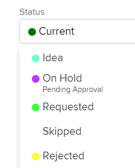

# 将状态应用于与组关联的工作

<!--
Alina, I moved this out of an admin article about statuses (Create and customize statuses)
-->

如果项目与组关联，您可以将系统级别状态以及与该组关联的自定义状态应用到项目，或应用该项目上的任务和问题。 有关Adobe Workfront中组状态的信息，请参阅[创建或编辑状态](../../../administration-and-setup/customize-workfront/creating-custom-status-and-priority-labels/create-or-edit-a-status.md)。

>[!TIP]
>
>您只能将项目与组关联。 问题和任务从所属的项目继承组。

## 访问要求

<!--drafted for P&P:

<table style="table-layout:auto"> 
 <col> 
 <col> 
 <tbody> 
  <tr> 
   <td role="rowheader">Adobe Workfront plan*</td> 
   <td> 
Any
 </td> 
  </tr> 
  <tr> 
   <td role="rowheader">Adobe Workfront license*</td> 
   <td> 
Current license: Standard 
 
   Or
   
Legacy license: Plan 
 
   </td> 
  </tr> 
  <tr> 
   <td role="rowheader">Access level configurations*</td> 
   <td> 
Edit access to Projects
 
<b>NOTE</b>
   
   If you still don't have access, ask your Workfront administrator if they set additional restrictions in your access level. For information on how a Workfront administrator can modify your access level, see <a href="../../../administration-and-setup/add-users/configure-and-grant-access/create-modify-access-levels.md" class="MCXref xref">Create or modify custom access levels</a>.
 </td> 
  </tr> 
  <tr> 
   <td role="rowheader">Object permissions</td> 
   <td> 
Manage permissions to the project
 
For information on requesting additional access, see <a href="../../../workfront-basics/grant-and-request-access-to-objects/request-access.md" class="MCXref xref">Request access to objects </a>.
 </td> 
  </tr> 
 </tbody> 
</table>
-->

您必须具有以下权限才能执行本文中的步骤：

<table style="table-layout:auto"> 
 <col> 
 <col> 
 <tbody> 
  <tr> 
   <td role="rowheader">Adobe Workfront计划*</td> 
   <td> 
任何
 </td> 
  </tr> 
  <tr> 
   <td role="rowheader">Adobe Workfront许可证*</td> 
   <td> 
规划 
 </td> 
  </tr> 
  <tr> 
   <td role="rowheader">访问级别配置*</td> 
   <td> 
编辑对项目的访问权限
 
<b>注释</b>

如果您仍然没有访问权限，请咨询Workfront管理员是否对您的访问级别设置了其他限制。 有关Workfront管理员如何修改您的访问级别的信息，请参阅<a href="../../../administration-and-setup/add-users/configure-and-grant-access/create-modify-access-levels.md" class="MCXref xref">创建或修改自定义访问级别</a>。
 </td>
</tr> 
  <tr> 
   <td role="rowheader">对象权限</td> 
   <td> 
管理项目的权限
 
有关请求其他访问权限的信息，请参阅<a href="../../../workfront-basics/grant-and-request-access-to-objects/request-access.md" class="MCXref xref">请求访问对象</a>。
 </td> 
  </tr> 
 </tbody> 
</table>

&#42;要了解您拥有什么计划、许可证类型或访问权限，请与Workfront管理员联系。

## 更新项目组和状态

当您更新项目的组时，任务、问题或项目的状态可用的选项将更改为匹配组。

1. 转至项目或创建新项目，如[创建项目](../../../manage-work/projects/create-projects/create-project.md)中所述。
1. 单击&#x200B;**更多**&#x200B;图标，然后单击&#x200B;**编辑**。

1. 在显示的&#x200B;**编辑项目**&#x200B;框中（靠近&#x200B;**概述**&#x200B;部分的底部），从&#x200B;**组**&#x200B;下拉菜单中选择组。

1. 在&#x200B;**状态**&#x200B;下拉菜单中，选择自定义状态。

   >[!NOTE]
   >
   >如果在&#x200B;**组**&#x200B;下拉菜单中选择其他组，则&#x200B;**状态**&#x200B;菜单中的自定义状态会自动更改以与新组关联。
   >
   >
   >的自定义状态   >
   >

1. 选择项目的状态。 您创建并应用于该组的自定义状态将显示在列表中。
