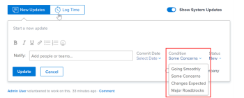

# 任务和问题的更新条件

任务或问题的条件是放置在其上以指示其进展情况的标记。 这与工作项的“状态”不同，“状态”指示该项目开发的当前阶段。

您可以自动或手动设置任务或问题的条件。

Adobe Workfront管理员可以为您的环境创建自定义条件，如 [创建或编辑自定义条件](../../../administration-and-setup/customize-workfront/create-manage-custom-conditions/create-edit-custom-conditions.md)

<!--You can manually update the Condition of a task or issue if you are assigned to it or if you have permissions to it, as described in the [Access requirements](#access-requirements) section of this article.-->

## 访问要求 {#access-requirements}

<!--drafted for P&P:

<table style="table-layout:auto"> 
 <col> 
 <col> 
 <tbody> 
  <tr> 
   <td role="rowheader">Adobe Workfront plan*</td> 
   <td> 
Any
 </td> 
  </tr> 
  <tr> 
   <td role="rowheader">Adobe Workfront license*</td> 
   <td> 
   
   For the current licenses:
   <ul><li>
Standard for tasks
</li>
   <li>
Contributor or higher for issues
</li></ul>

   For legacy licenses:
   <ul><li>
Work or higher for tasks
</li>
   <li>
Request or higher for issues
</li></ul>
    </td> 
  </tr> 
  <tr> 
   <td role="rowheader">Access level configurations*</td> 
   <td> 
View or higher access to projects
 
Edit access to tasks and issues 
 
<b>NOTE</b> 
   
   If you still don't have access, ask your Workfront administrator if they set additional restrictions in your access level. For information on how a Workfront administrator can change your access level, see <a href="../../../administration-and-setup/add-users/configure-and-grant-access/create-modify-access-levels.md" class="MCXref xref">Create or modify custom access levels</a>.
 </td> 
  </tr> 
  <tr> 
   <td role="rowheader">Object permissions</td> 
   <td> 
View or higher permissions on tasks and issues to view their Condition

   
Manage permissions on tasks and issues to update the Condition

    
For information on requesting additional access, see <a href="../../../workfront-basics/grant-and-request-access-to-objects/request-access.md" class="MCXref xref">Request access to objects </a>.
 </td> 
  </tr> 
 </tbody> 
</table>
-->

您必须具有以下访问权限才能执行本文中的步骤：

<table style="table-layout:auto"> 
 <col> 
 <col> 
 <tbody> 
  <tr> 
   <td role="rowheader">Adobe Workfront计划*</td> 
   <td> 
任意
 </td> 
  </tr> 
  <tr> 
   <td role="rowheader">Adobe Workfront许可证*</td> 
   <td> 
工作或更高级别完成任务

   
请求或更高级别的问题

    </td> 
  </tr> 
  <tr> 
   <td role="rowheader">访问级别配置*</td> 
   <td> 
查看或更高程度地访问项目
 
编辑对任务和问题的访问权限 
 
<b>注释</b>

如果您仍然没有访问权限，请咨询Workfront管理员，他们是否在您的访问级别设置了其他限制。 有关Workfront管理员如何更改访问级别的信息，请参阅 <a href="../../../administration-and-setup/add-users/configure-and-grant-access/create-modify-access-levels.md" class="MCXref xref">创建或修改自定义访问级别</a>.
 </td>
</tr> 
  <tr> 
   <td role="rowheader">对象权限</td> 
   <td> 
查看任务和问题的权限或更高权限，以查看其条件

   
管理任务和问题的权限以更新条件

    
有关请求其他访问权限的信息，请参阅 <a href="../../../workfront-basics/grant-and-request-access-to-objects/request-access.md" class="MCXref xref">请求对对象的访问 </a>.
 </td> 
  </tr> 
 </tbody> 
</table>

*要了解您拥有的计划、许可证类型或访问权限，请联系您的Workfront管理员。

## 找到任务和问题的条件

条件显示为与任务或问题关联的标记。 它们还可以与可在报表中显示而不是标签的数字关联。 有关将条件与数字关联的详细信息，请参阅 [创建或编辑自定义条件](../../../administration-and-setup/customize-workfront/create-manage-custom-conditions/create-edit-custom-conditions.md).

您可以在以下区域中找到任务和问题的条件：

* 当您被分配到任务或问题时，在更新内的“任务和问题更新”区域。
* 在“视图”或“分组”中显示“条件”字段时，报表和列表。

>[!NOTE]
>
>当“条件”一词显示在“日记帐分录”报表的“字段名称”字段中时，这表示项目的条件已更新。 在“日记帐分录”报表中跟踪“条件”字段时，“新编号值”和“旧编号值”显示与该条件关联的编号，而不是其名称。 如果最初没有为任务或问题定义条件，稍后又更新了该条件，则捕获该更新的日记帐分录将显示“条件”字段的“旧数值”为–2,147,483,648。

## 通过更新状态自动更新条件

为您分配任务或问题后，单击 **It工作** 、启动任务或启动问题，或更新其状态，任务或问题的条件会自动更改为与 **顺利前进**.

有关将自定义条件用作默认条件的信息，请参阅文章  [将自定义条件设置为任务和问题的默认条件](../../../administration-and-setup/customize-workfront/create-manage-custom-conditions/set-custom-condition-default-tasks-issues.md) 和 [将自定义条件设置为项目的默认条件](../../../administration-and-setup/customize-workfront/create-manage-custom-conditions/set-custom-condition-default-projects.md).

有关更改任务状态的信息，请参阅 [更新任务状态](../../../manage-work/projects/updating-work-in-a-project/update-task-status.md).

有关更改问题状态的信息，请参阅 [更新问题状态](../../../manage-work/projects/updating-work-in-a-project/update-issue-status.md).

有关将“Work On It”按钮设置为“开始任务”或“开始问题”按钮的信息，请参阅 [将“Work On It（处理它）”按钮替换为“Start（开始）”按钮](../../../people-teams-and-groups/create-and-manage-teams/work-on-it-button-to-start-button.md).

## 手动更新条件

必须为任务或问题分配权限，或者拥有任务的“管理”权限，才能在任务或问题上设置条件。

根据是否为任务或问题分配了条件，更新条件会有所不同：

* 您可以在“更新”选项卡或任务列表中更新条件（如果已为其分配）。
* 您只能在任务或问题列表中更新条件（如果您未分配给这些任务或问题，但拥有这些任务或问题的“管理”权限）。 在这种情况下，您无法更新任务或问题的“更新”选项卡中的“条件”。

要手动设置任务或问题的条件，请执行以下操作：

1. 转到要为其设置条件的任务或问题。

   或

   转到您拥有“管理”权限但未分配给您的任务或问题列表。

1. 按如下方式更改问题或任务的条件：

   * 如果已为您分配任务或问题，并且您拥有该任务或问题的“管理”权限，请在 **更新** ，单击 **开始新更新**，选择 **条件** 这最能反映任务的进行方式，请在 **开始新更新** 区域（可选），然后单击 **更新**.

      

      >[!NOTE]
      >
      >可以针对您的环境自定义条件，因此您可能会在您的环境中找到三个以上的“条件”选项。 “条件”的名称可能与上面所列的名称不同。 有关在Workfront中自定义条件的信息，请参阅 [创建或编辑自定义条件](../../../administration-and-setup/customize-workfront/create-manage-custom-conditions/create-edit-custom-conditions.md).

      有关更新工作项时可用的其他功能的信息，请参阅 [更新工作](../../../workfront-basics/updating-work-items-and-viewing-updates/update-work.md).

      <!--   
     <li data-mc-conditions="QuicksilverOrClassic.Draft mode">
(NOTE: drafted because I can't do this anymore)

If you have Manage permissions to the task or issue but are not assigned to it, perhaps as a project manager, add the <strong>Condition</strong> column to any view you use in a task or issue list, then set the <strong>Condition</strong> in inline edit and press Enter.

For information about adding a column to a view, see <a href="../../../reports-and-dashboards/reports/reporting-elements/views-overview.md" class="MCXref xref">Views overview in Adobe Workfront</a>.
</li>   
     -->
