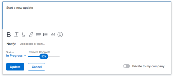

# 更新任务状态

您可以更新任务的状态，以告知其他任务的位置（以及整个项目）及其进展情况。

默认状态为“新建”、“进行中”和“完成”。 您的Adobe Workfront管理员可以为您的组织添加自定义状态。 有关更多信息，请参阅 [创建或编辑状态](../../../administration-and-setup/customize-workfront/creating-custom-status-and-priority-labels/create-or-edit-a-status.md).

您可以手动更新任务状态，也可以让Workfront在执行某些操作时自动更新它们。

## 访问要求

<!--drafted for P&P:

<table style="table-layout:auto"> 
 <col> 
 <col> 
 <tbody> 
  <tr> 
   <td role="rowheader">Adobe Workfront plan*</td> 
   <td> 
Any
 </td> 
  </tr> 
  <tr> 
   <td role="rowheader">Adobe Workfront license*</td> 
   <td> 
Current license: Standard
 
   Or
   
Legacy license: Work or higher

   </td> 
  </tr> 
  <tr> 
   <td role="rowheader">Access level configurations*</td> 
   <td> 
Edit access to Tasks
 
<b>NOTE</b>
   
   If you still don't have access, ask your Workfront administrator if they set additional restrictions in your access level. For information on how a Workfront administrator can modify your access level, see <a href="../../../administration-and-setup/add-users/configure-and-grant-access/create-modify-access-levels.md" class="MCXref xref">Create or modify custom access levels</a>.
 </td> 
  </tr> 
  <tr> 
   <td role="rowheader">Object permissions</td> 
   <td> 
Manage permissions to the task
 
For information on requesting additional access, see <a href="../../../workfront-basics/grant-and-request-access-to-objects/request-access.md" class="MCXref xref">Request access to objects </a>.
 </td> 
  </tr> 
 </tbody> 
</table>
-->

您必须具有以下访问权限才能手动更新任务：

<table style="table-layout:auto"> 
 <col> 
 <col> 
 <tbody> 
  <tr> 
   <td role="rowheader">Adobe Workfront计划*</td> 
   <td> 
任意
 </td> 
  </tr> 
  <tr> 
   <td role="rowheader">Adobe Workfront许可证*</td> 
   <td> 
工作或更高
 </td> 
  </tr> 
  <tr> 
   <td role="rowheader">访问级别配置*</td> 
   <td> 
编辑任务访问权限
 
<b>注释</b>

如果您仍然没有访问权限，请咨询Workfront管理员，他们是否在您的访问级别设置了其他限制。 有关Workfront管理员如何修改访问级别的信息，请参阅 <a href="../../../administration-and-setup/add-users/configure-and-grant-access/create-modify-access-levels.md" class="MCXref xref">创建或修改自定义访问级别</a>.
 </td>
</tr> 
  <tr> 
   <td role="rowheader">对象权限</td> 
   <td> 
管理任务的权限
 
有关请求其他访问权限的信息，请参阅 <a href="../../../workfront-basics/grant-and-request-access-to-objects/request-access.md" class="MCXref xref">请求对对象的访问 </a>.
 </td> 
  </tr> 
 </tbody> 
</table>

&#42;要了解您拥有的计划、许可证类型或访问权限，请联系您的Workfront管理员。

## 手动更新任务状态

在更新任务状态时，您还可以键入有关新状态的说明并更改其他任务信息，如到期日期。

1. 转到已分配给您以更新状态的任务。
1. 单击 **状态** 字段，然后选择新状态。
1. （可选）执行以下任一操作以提供有关更新的其他信息，然后单击 **更新** 或者，如果任务具有 **完成** 状态，单击 **完成：**

   * 要添加有关更新的注释，请转到 **更新** 单击 **开始新更新**，然后键入您的注释。

   * 要通知某些用户有关更新的信息，请在 **通知** 框。 有关更多信息，请参阅 [更新时标记其他人](../../../workfront-basics/updating-work-items-and-viewing-updates/tag-others-on-updates.md).
   * 要更新任务的条件，请单击 **选择条件** 权利 **通知** 框（在您键入有关更新的注释时会显示这些注释），然后选择最能反映任务当前条件的条件。

   * 要更新任务的提交日期，请展开 **提交日期** 下拉日历，然后选择新的提交日期。
   * 要提供任务完成的可视指示，请将气泡拖动到“完成百分比”下，或双击该气泡以输入百分比值。\
      

## 自动更新任务状态

当发生下表中列出的操作时，Workfront会自动将任务的现有状态更新为其他状态。

>[!NOTE]
>
>下表中的状态是默认的系统状态。 您的Workfront管理员或组管理员可以重命名Workfront实例中的状态。 有关在Workfront中创建和管理状态的信息，请参阅 [创建或编辑状态](../../../administration-and-setup/customize-workfront/creating-custom-status-and-priority-labels/create-or-edit-a-status.md).

<table style="table-layout:auto"> 
 <col> 
 <col> 
 <col> 
 <tbody> 
  <tr> 
   <td>操作</td> 
   <td>原始状态</td> 
   <td>新状态</td> 
  </tr> 
  <tr> 
   <td>将任务完成百分比更新为100%</td> 
   <td>新建或正在进行中</td> 
   <td>完成</td> 
  </tr> 
  <tr> 
   <td>将任务完成百分比从100%更新为较低的数字</td> 
   <td>完成</td> 
   <td>进行中</td> 
  </tr> 
  <tr data-mc-conditions=""> 
   <td>单击开始任务按钮以接受处理分配给您的任务 </td> 
   <td>新 </td> 
   <td> 
与“主团队”设置中的“开始任务”按钮关联的任何状态。
 
有关将“Work On It（处理）”按钮替换为“Start Task（开始任务）”按钮的信息，请参阅 <a href="../../../people-teams-and-groups/create-and-manage-teams/work-on-it-button-to-start-button.md" class="MCXref xref">将“Work On It（处理它）”按钮替换为“Start（开始）”按钮</a>.
 
提示： 单击 “撤消”按钮单击“开始任务”后，状态将还原为“新建”。 
 </td> 
  </tr> 
 </tbody> 
</table>
