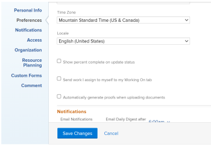

# 查看和更新任务的完成百分比

您可以更新任务的完成百分比，以指明完成任务的进度。

## 访问要求

<!--drafted for P&P:

<table style="table-layout:auto"> 
 <col> 
 <col> 
 <tbody> 
  <tr> 
   <td role="rowheader">Adobe Workfront plan*</td> 
   <td> 
Any
 </td> 
  </tr> 
  <tr> 
   <td role="rowheader">Adobe Workfront license*</td> 
   <td> 
Current license: Standard
 
   Or
   
Legacy license: Work or higher

   </td> 
  </tr> 
  <tr> 
   <td role="rowheader">Access level configurations*</td> 
   <td> 
Edit access to Tasks
 
<b>NOTE</b>
   
   If you still don't have access, ask your Workfront administrator if they set additional restrictions in your access level. For information on how a Workfront administrator can modify your access level, see <a href="../../../administration-and-setup/add-users/configure-and-grant-access/create-modify-access-levels.md" class="MCXref xref">Create or modify custom access levels</a>.
 </td> 
  </tr> 
  <tr> 
   <td role="rowheader">Object permissions</td> 
   <td> 
Manage permissions to the task
 
For information on requesting additional access, see <a href="../../../workfront-basics/grant-and-request-access-to-objects/request-access.md" class="MCXref xref">Request access to objects </a>.
 </td> 
  </tr> 
 </tbody> 
</table>
-->

您必须具有以下权限才能手动更新任务：

<table style="table-layout:auto"> 
 <col> 
 <col> 
 <tbody> 
  <tr> 
   <td role="rowheader">Adobe Workfront计划*</td> 
   <td> 
任何
 </td> 
  </tr> 
  <tr> 
   <td role="rowheader">Adobe Workfront许可证*</td> 
   <td> 
工作或更高
 </td> 
  </tr> 
  <tr> 
   <td role="rowheader">访问级别配置*</td> 
   <td> 
编辑任务访问权限
 
<b>注释</b>

如果您仍然没有访问权限，请咨询Workfront管理员是否对您的访问级别设置了其他限制。 有关Workfront管理员如何修改您的访问级别的信息，请参阅 <a href="../../../administration-and-setup/add-users/configure-and-grant-access/create-modify-access-levels.md" class="MCXref xref">创建或修改自定义访问级别</a>.
 </td>
</tr> 
  <tr> 
   <td role="rowheader">对象权限</td> 
   <td> 
管理任务的权限
 
有关请求其他访问权限的信息，请参阅 <a href="../../../workfront-basics/grant-and-request-access-to-objects/request-access.md" class="MCXref xref">请求访问对象 </a>.
 </td> 
  </tr> 
 </tbody> 
</table>

&#42;要了解您拥有的计划、许可证类型或访问权限，请联系您的Workfront管理员。

## 您可以更新任务的完成百分比的区域

您可以在以下任意区域更新任务的完成百分比：

* **在任务列表中**：当显示完成百分比列时，您可以更新任务的完成百分比。\
  有关内联编辑的更多信息，请参阅 [Adobe Workfront中列表的内联编辑项目](../../../workfront-basics/navigate-workfront/use-lists/inline-edit-objects.md).

* **在里程碑视图中**：在项目列表或项目报告中使用里程碑视图时，您可以更新任务的完成百分比。 有关更多信息，请参阅 [使用里程碑视图](../../../reports-and-dashboards/reports/reporting-elements/use-milestone-view.md).

* **更新任务时**：在向任务添加更新时，您可以更新任务的完成百分比选项。

  >[!IMPORTANT]
  >
  >仅在启用“显示完成百分比”选项后，才会显示此选项。\
  >要为任务启用完成百分比更新栏，请执行以下操作：
  >
  >1. 转到 **主要** menu>您的姓名>**更多** 图标>**编辑** >选择 **显示更新状态的完成百分比**.\
  >  >

* **在任务标题中**：您可以在任务标题中更新任务的完成百分比。 有关信息，请参阅 [编辑任务](../../tasks/manage-tasks/edit-tasks.md).

  

## 有关更新任务完成百分比的注意事项

* 当您将任务标记为100%完成时，任务状态将更新为“完成”。
* 父任务存在以下方案：
   * 当项目的“摘要完成模式”设置为“自动”并且子任务未完成时，不能将父任务的完成百分比更新为100%。
   * 当项目的“摘要完成模式”设置为“手动”并且子任务已完成或不完成时，您可以将父任务的完成百分比更新为100%。

  有关更多信息，请参阅 [编辑项目](../manage-projects/edit-projects.md).

## 更新任务的完成百分比

1. 转到Workfront中的以下任意区域：

   * 任务列表
   * 项目列表并应用里程碑视图
   * 通过访问任务页面执行任务
1. 找到 **完成百分比** 要更新其完成百分比的任务的字段。
1. 单击完成百分比字段，然后键入介于0和100之间的数字

   或

   单击并拖动 **完成百分比** 栏中的数字表示您完成了多少任务。

   >[!NOTE]
   >
   >当您指示100%的任务已完成时，任务的状态也会更新为“完成”。

1. 在键盘中按Enter键以保存完成百分比。

