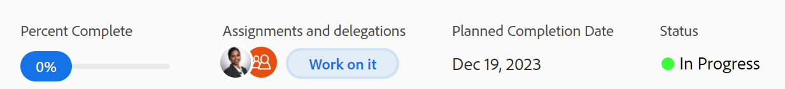

# 查看和更新任务的完成百分比

<!--Audited: 05/2025-->

您可以更新任务的完成百分比，以指明完成任务的进度。

更新问题的完成百分比与更新任务的完成百分比类似。 本文介绍了如何更新任务的完成百分比。

## 访问要求

+++ 展开以查看访问要求。

您必须具有以下权限才能手动更新任务：

<table style="table-layout:auto"> 
 <col> 
 <col> 
 <tbody> 
  <tr> 
   <td role="rowheader">Adobe Workfront计划</td> 
   <td> 
任何
 </td> 
  </tr> 
  <tr> 
   <td role="rowheader">Adobe Workfront许可证*</td> 
   <td> 
新许可证： Standard
 
   或
   
当前许可证：工作或更高

   </td> 
  </tr> 
  <tr> 
   <td role="rowheader">访问级别配置</td> 
   <td> 
编辑任务访问权限
 </td> 
  </tr> 
  <tr> 
   <td role="rowheader">对象权限</td> 
   <td> 
管理任务的权限
  </td> 
  </tr> 
 </tbody> 
</table>

*有关信息，请参阅Workfront文档中的[访问要求](/help/quicksilver/administration-and-setup/add-users/access-levels-and-object-permissions/access-level-requirements-in-documentation.md)。

+++

## 您可以更新任务的完成百分比的区域

您可以在以下任意区域更新任务的完成百分比：

* **在任务列表中**：当显示完成百分比列时，您可以更新任务的完成百分比。

  有关内联编辑的更多信息，请参阅[在Adobe Workfront的列表中内联编辑项目](../../../workfront-basics/navigate-workfront/use-lists/inline-edit-objects.md)。

* **在里程碑视图**&#x200B;中：在项目列表或项目报告中使用里程碑视图时，您可以更新任务的完成百分比。

  >[!TIP]
  >
  >  您不能更新里程碑视图中问题的完成百分比。

  有关详细信息，请参阅[使用里程碑视图](../../../reports-and-dashboards/reports/reporting-elements/use-milestone-view.md)。

* **在任务标题中**：您可以在任务标题中更新任务的完成百分比。

  

* **在任务的“摘要”面板中**：您可以在查看以下区域中的任务时更新摘要面板顶部的任务完成百分比：

   * 任务列表或报告
   * 时间表
   * 工作负载均衡器

  

  有关详细信息，请参阅[摘要概述](/help/quicksilver/workfront-basics/the-new-workfront-experience/summary-overview.md)

* **主页**：您可以从“主页”区域的“摘要”面板或“我的工作”小组件更新任务或问题的完成百分比。

  有关信息，请参阅[家庭入门](/help/quicksilver/workfront-basics/using-home/using-the-home-area/get-started-with-home.md)。

## 有关更新任务完成百分比的注意事项

* 当您将任务标记为100%完成时，任务状态将更新为“完成”。 问题的状态更新为“已关闭”。
* 完成任务也会更新父级和项目的完成百分比。
* 父任务和项目存在以下方案：
   * 当项目的“摘要完成模式”设置为“自动”并且子任务未完成时，不能将父任务的完成百分比更新为100%。
   * 当项目的“摘要完成模式”设置为“手动”并且子任务已完成或不完成时，您可以将父任务或项目的完成百分比更新为100%。

  有关详细信息，请参阅[编辑项目](../manage-projects/edit-projects.md)。

## 更新任务的完成百分比

1. 转到您要更新任务完成百分比的任何区域。

   有关信息，请参阅本文中您可以更新任务](#areas-where-you-can-update-the-percent-complete-of-a-task)的完成百分比的[区域部分。

1. 找到要更新其完成百分比的任务的&#x200B;**完成百分比**&#x200B;字段。

   >[!TIP]
   >
   >完成百分比字段始终显示在摘要面板的顶部。

1. 单击&#x200B;**完成百分比**&#x200B;字段并键入一个介于0和100之间的数字

   或

   单击并拖动&#x200B;**完成百分比**&#x200B;蓝色气泡至所需数字，以指示在任务完成率为多少（如果可用）。

   >[!NOTE]
   >
   >    * 在“完成百分比”气泡内单击时，无法输入小数。
   >    * 在“摘要”面板中拖放蓝色气泡时，“完成百分比”会以一点为单位进行更新。
   >
   >    * 当您将蓝色气泡拖放到任务标题中时，完成百分比将以5点为增量更新。

1. 按键盘上的Enter键保存完成百分比。

   项目或任何父任务的完成百分比也可能自动更新。

   任务或问题的状态也会更新。

