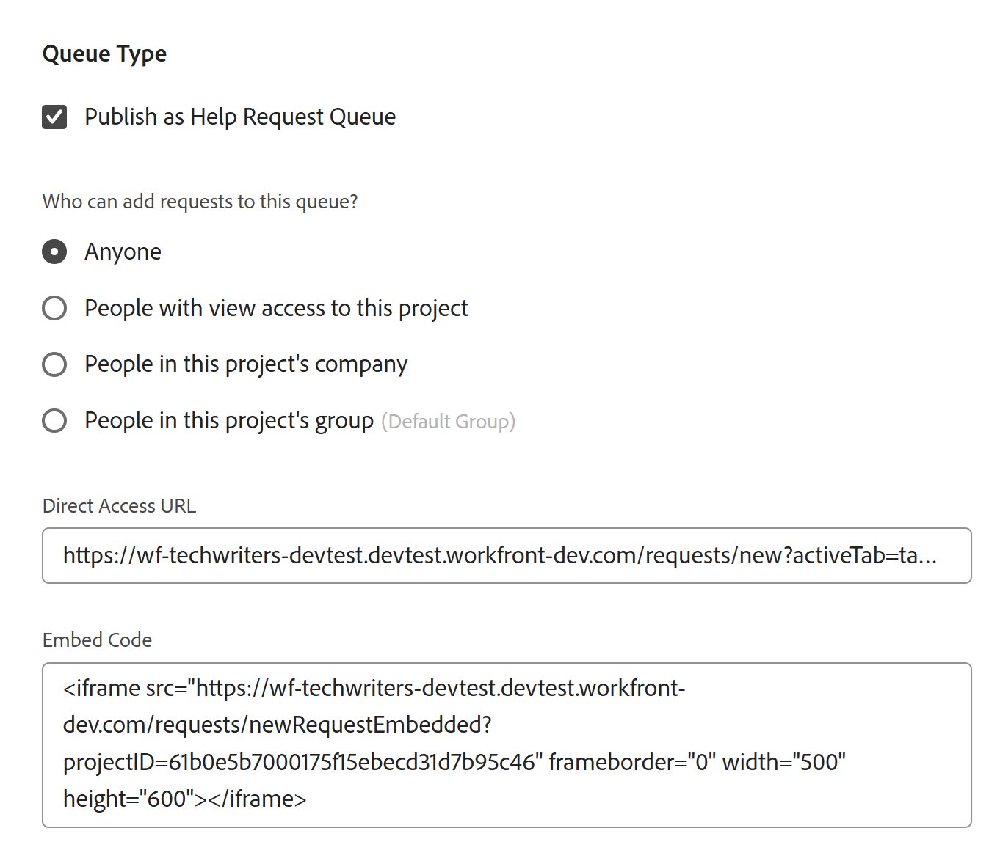

# 创建请求队列

<!--Audited: 12/2023-->

<!--
<THIS IS CONNECTED TO THE PRODUCT IN BLUEPRINTS. DO NOT MOVE/ CHANGE URL>
-->

<!--hide/ comment out the entire "create requests in Production" section and just edit and leave  only the preview section when it releases to Production; also remove the template blurb when the queue details is unshimmed for templates-->

<!--The highlighted information on this page refers to functionality not yet generally available. It is available only in the Preview environment for all customers. After the monthly releases to Production, the same features are also available in the Production environment for customers who enabled fast releases.    

For information about fast releases, see [Enable or disable fast releases for your organization](/help/quicksilver/administration-and-setup/set-up-workfront/configure-system-defaults/enable-fast-release-process.md). -->

您可以设置请求队列，用户可以在其中输入未在项目上计划的临时请求。 例如，可以设置技术支持请求队列来捕获到某个IT部门的所有用户请求。

请求在Adobe Workfront中成为问题，并且会被添加到项目中。

设置请求队列有助于将有关添加到项目中的问题的信息正规化。 提交至项目的所有问题都将以相同方式提交，并遵循相同的完成路径。

您可以在Workfront中将以下对象设置为请求队列：

* 项目
* 模板。 通过设置为请求队列的模板创建的项目将变为请求队列。

要将项目或模板设置为请求队列，必须编辑项目或模板的“队列详细信息”区域。

本文介绍如何将项目配置为请求队列，用户可在其中提交请求。 为模板设置队列详细信息类似于在项目中进行设置。

有关如何向请求队列提交新请求的信息，请参阅[复制并提交请求](../create-requests/copy-and-submit-requests.md)。

## 访问要求

+++ 展开以查看本文中各项功能的访问要求。

您必须具有以下权限才能执行本文中的步骤：

<table style="table-layout:auto"> 
 <col> 
 <col> 
 <tbody> 
  <tr> 
   <td role="rowheader">Adobe Workfront计划</td> 
   <td> 
任何 
 </td> 
  </tr> 
  <tr> 
   <td role="rowheader">Adobe Workfront许可证</td> 
   <td> 
   
新许可证： Standard 

   或
   
当前许可证：计划 
 </td> 
  </tr> 
  <tr> 
   <td role="rowheader">访问级别配置</td> 
   <td> 
编辑对项目的访问权限
 </td> 
  </tr> 
  <tr> 
   <td role="rowheader">对象权限</td> 
   <td> 
 管理项目的权限
 </td> 
  </tr> 
 </tbody> 
</table>

有关此表中信息的更多详细信息，请参阅Workfront文档中的[访问要求](/help/quicksilver/administration-and-setup/add-users/access-levels-and-object-permissions/access-level-requirements-in-documentation.md)。

+++

## 请求队列概述

将请求队列设置为项目。 将项目指定为请求队列时，该队列可从Adobe Workfront的请求区域访问。 在自定义请求队列时，您还可以自定义用户在提交请求时填写的表单。

本文介绍了如何从现有项目创建请求队列。 但是，要为请求接收流程构建一致性或向其中添加多个层以进行报告并更好地管理，您还可以配置请求队列的其他构建块，如下表所述。

<table style="table-layout:auto"> 
 <col> 
 <col> 
 <tbody> 
  <tr> 
   <td role="rowheader">队列详细信息</td> 
   <td> 
您必须在队列详细信息区域将项目设置为请求队列。 此步骤是强制性的。 
 
有关详细信息，请参阅本文中的<a href="#create-a-request-queue" class="MCXref xref">创建请求队列</a>部分。
 </td> 
  </tr> 
  <tr> 
   <td role="rowheader">主题组</td> 
   <td> 
它们是附加菜单，可根据常见功能对请求进行分类。 例如，对于IT请求队列，您可能需要“现场”和“远程”主题组。 
 
有关详细信息，请参阅<a href="../../../manage-work/requests/create-and-manage-request-queues/create-topic-groups.md" class="MCXref xref">创建主题组</a>。 
 
这是可选的。
 </td> 
  </tr> 
  <tr> 
   <td role="rowheader">队列主题</td> 
   <td> 
它们是附加菜单，可根据常见功能对属于同一主题组的请求进行分类。 主题组可以包含多个队列主题。 
 
例如，IT请求队列的“现场”主题组可能包含“硬件”、“软件”和“网络”队列主题。 
 
有关详细信息，请参阅<a href="../../../manage-work/requests/create-and-manage-request-queues/create-queue-topics.md" class="MCXref xref">创建队列主题</a>。 
 
这是可选的。
 </td> 
  </tr> 
  <tr> 
   <td role="rowheader">路由规则</td> 
   <td> 
利用它们，可将每个请求路由到用户、工作角色、团队或项目。 
 
有关详细信息，请参阅<a href="../../../manage-work/requests/create-and-manage-request-queues/create-routing-rules.md" class="MCXref xref">创建路由规则</a>。 
 
这是可选的。
 </td> 
  </tr> 
 </tbody> 
</table>

## 创建请求队列

<!--at production release on April 10, do the following: take the first sentence here out; hide/ comment out the first section (Create a Request Queue in the Production environment); remove the title of the "Create a Request Queue in the Preview environment and leave that section as the only way to create request queues; search for any visible references of production/ preview and remove them from the entire article-->

创建请求队列的方式因您使用的环境而异。

<!--

### Create a Request Queue in the Production environment

This section describes how you can define Queue Details for the following objects:

* A project in the Production environment
* A template in the Production or Preview environment

When you set up a project as a Request Queue, the project status must be Current in order to display in the Requests area of Workfront.

>[!TIP]
>
>Your Workfront or group administrator might assign you to a custom Layout Template that might not include some of the sections described in the following steps.

To create a Request Queue:

1. Go to the project that you want to set up as a Request Queue.
1. (Optional) Click **Project Details** in the left panel and add a **Description** to the project in the **Overview** area. This information displays on all new requests.
1. Click **Queue Details** in the left panel. You might need to click **Show More**, then **Queue Details**.

   This opens the Queue Details section.

      

1. Specify the following information:

   * **Publish as Help Request Queue:** Select this option to identify this project as a request queue. All incoming issues are considered Requests.  
     When this option is not selected, the project behaves like a standard project in Workfront and all incoming issues are issues.
   
   * **Who can add requests to this queue:** Select which users have access to add requests to this queue. You can allow the following groups of people to see the Request Queue in their Requests area of the Global Navigation Bar when they add a new request:

     |Who can enter requests | Description|
     |---|---|
     | Anyone  |Any Workfront user with an active account can view this request queue and add requests to it |
     | People with view access to this project |Users with View permissions to the project can view and add requests to this queue |
     | People in this project's company |Users who belong to the company associated with this project can view and add requests to this queue. If there is a company associated with the project, the name of the company is listed in parentheses after this setting.  |
     | People in this project's group |Users who belong to the group associated with this project can view and add requests to this queue. If there is a group associated with the project, the name of the group is listed in parentheses after this setting, in gray font.  |

   * **Share with these links:** The following options enable you to provide direct access to the Request Queue and the forms associated with it to users outside of Workfront or to Workfront users using an external page. For information about embedding a request queue in a dashboard as an external page, see [Embed a request queue in a dashboard](../../../reports-and-dashboards/dashboards/creating-and-managing-dashboards/embed-request-queue-dashboard.md).

     Users must already have access rights to the Request Queue in order to gain direct access. Using either option described here does not automatically grant access to users.

     >[!TIP]
     >
     >Users must first log in to Workfront before gaining access to the request queue when they access the Request Queue page from another application.

      * **Direct Access URL:** When a user accesses this URL from a browser, the user is taken directly to the New Request  section in the Requests area and this request is selected by default for them.

        

        >[!NOTE]
        >
        >You can display a Request Queue in a dashboard as an external page. In this case, the request queue is preselected, but you can select any other request queue from the Request Type field. users can change the Request Type. Navigation components of the Requests also display.

      * **Embed Code:** Use this HTML code to embed the request queue form as an iframe within any HTML page.  
        If users are not already authenticated to Workfront when they view the page where the code is embedded, the Workfront login dialog box is displayed. After users log in, the Request Queue form is displayed.

        >[!NOTE]
        >
        >When displaying a Request Queue in an iframe, only the request form displays, the request name is preselected and dimmed. User cannot change the Request type. Navigation components of the Requests area do not display.

        In order for the request queue form to be displayed when using this embed code, you must enable the "Allow embedding of Workfront in an iframe" setting in your system setup. For more information about enabling embedding of Workfront in an iframe, see [Configure system security preferences](../../../administration-and-setup/manage-workfront/security/configure-security-preferences.md). If this setting is not enabled, the iframe is displayed as blank.

        You can adjust various aspects of how the embedded form is displayed, as follows:

        <table border="1" cellspacing="15"> 
         <col> 
         <col> 
         <thead> 
          <tr> 
           <th> 
<strong>Functionality</strong> 
 </th> 
           <th> 
<strong>Solution</strong> 
 </th> 
          </tr> 
         </thead> 
         <tbody> 
          <tr> 
           <td> 
Adjust the size of the frame
 </td> 
           <td> 
Modify the "width" and "height" attributes.
 
By default, the width is "500" and the height is "600"
 </td> 
          </tr> 
          <tr> 
           <td> 
Direct users to a specific Queue Topic or Topic Group
 </td> 
           <td> 
Add the "path" parameter to the src URL. You can find the path parameter by navigating to the desired Queue Topic or Topic Group in the non-embedded form and inspecting the URL.
 </td> 
          </tr> 
          <tr> 
           <td> 
Show and allow users to change the pre-configured Topic Group drop-down list
 </td> 
           <td> 
Use the "path" parameter by adding the <code>showPreSelectedOptions=true</code> parameter to the <code>src URL</code>.
 </td> 
          </tr> 
          <tr> 
           <td> 
Detect when the form has been submitted
 </td> 
           <td> 
Add a "message" event listener to your web page's window and checking if <code>event.data.type</code> is <code>requestSubmitted</code>. <code>event.data.newIssueID</code> will be set to the ID of the created issue.
 </td> 
          </tr> 
         </tbody> 
        </table>

   * **Request Types:** Select from the default options below.

     The Workfront administrator can rename the default request types. For more information about renaming the request types, see [Customize default issue types](../../../administration-and-setup/set-up-workfront/configure-system-defaults/customize-default-issue-types.md).

      * Bug Report
      * Change Order
      * Issue
      * Request

        This is a required field and you must select at least one option.

     >[!NOTE]
     >
     >Request Types display as a selection in the Requests area only if the Request Type is selected in both the Queue Details and the Queue Topic pages. For information about setting up the Queue Details area of a project, see [Create Queue Topics](../../../manage-work/requests/create-and-manage-request-queues/create-queue-topics.md).

     Each type selected here will be available on the form (you can select more than one). Selecting more than one type can help organize multiple requests coming in.  
     For example, if you are using the form on a request queue for an IT project, the following request types can come in to the queue: hardware, software, bug fixes, and issues.

   * **Default Duration:** The default duration is the length of time it typically takes to complete an issue. This becomes the default for all incoming issues and can be modified manually. Duration is generally set in hours, days, or weeks. The Default Duration of an issue is the same as the Planned Hours on the issue. The Planned Completion Date of the issue calculates based on this field.  
     The default for the issue Duration is 1 day or 8 hours. If your Workfront administrator set the Typical Hours per Work Day as less than 8 hours, the Default Duration for issues is still 8 hours. For example, if the Typical Hours per Work Day is set to 7 hours, the Default Duration for issues is 1.14 Days or 8 hours. For more information about how to set up the system Typical Hours per Work Day, see the "Timeline Calculations" section in the article [Configure system-wide project preferences](../../../administration-and-setup/set-up-workfront/configure-system-defaults/set-project-preferences.md).
   
   * **People from the same company will inherit the same permissions for all requests.:** When selected, all requests submitted to the queue are visible for users in the same company. Users can view these requests in the All Requests  section , located within the Requests area. At the time that this setting is enabled or disabled, it impacts all future requests; it does not retroactively impact information. 
   * **When someone makes a request, automatically grant:** When a user makes a request to the request queue, the user is automatically granted the level of permission that you choose to that request. Select from the following permissions levels: 

      * **View Access** 
      * **Contribute Access**. This is the default selection.
      * **Manage Access**

     For information about the Workfront permissions model, see [Overview of sharing permissions on objects](../../../workfront-basics/grant-and-request-access-to-objects/sharing-permissions-on-objects-overview.md).   
     Setting permissions here saves time, rather than having to grant permissions for each individual incoming request. Choosing this option impacts all future requests, but does not retroactively impact existing requests. 
   
   * **Default Approval**: Associate an approval process with this request queue. Only Issue Approval Processes are visible in this drop-down menu. All issues submitted to this queue will be associated with this approval process. Your Workfront administrator must define system-level approval processes before you can associate them with request queues. Users with administrative access to Approval processes can also create group-specific approval processes.

     >[!IMPORTANT]
     >
     >If the group of the project changes, the group-specific approval process attached to existing issues becomes a single-use approval process. For more information about how changes to the group of the project or changes in the approval process affect approval settings, see [How group and approval process changes affect assigned approval processes](../../../administration-and-setup/customize-workfront/configure-approval-milestone-processes/how-changes-affect-group-approvals.md).

     If you have multiple queue topics associated with a request queue, we recommend that you associate approval processes with the queue topics instead. For more information about creating queue topics, see [Create Queue Topics](../../../manage-work/requests/create-and-manage-request-queues/create-queue-topics.md). 
   
     Consider the following when adding approval processes to request queues:

      * Only active approval processes display in the list. 
      * System-wide and group-specific approval processes display in the list. An approval process associated with a group other than that of the project does not display in the list.

   * **Default Route**: Associate a Routing Rule with this request queue. Use Routing Rules to automatically assign new issues submitted to a Request Queue to the correct resource (user, job role, or team), and to the correct project. All issues submitted to this queue will be associated with this Routing Rule. You must configure Routing Rules before they display in the Queue Details section and before you can associate them with request queue.  
     If you have multiple queue topics associated with a request queue, we recommend that you associate routing rules with the queue topics instead. For more information about creating routing rules, see [Create Routing Rules](../../../manage-work/requests/create-and-manage-request-queues/create-routing-rules.md).
   
   * **New Issue Fields:** In the **Show the following selected fields to all users** section, select any fields that you want to be visible to all users who submit a request to the project or add an issue to the project or the tasks.

     >[!TIP]
     >
     >New Issue Fields selected in the Queue Details section are also associated with any new issue added to the project <!--this is confusing: or to the tasks in the Issues section-->.

<!--     When you enable any of the Assigned to, Job Role, or the Team fields, they are always renamed to Assignments in the request form, but you can only specify the type of assignment selected here.

      >[!NOTE]
      >
      >If you selected Assigned To in the Queue Details area, you can enter only users in the Assignments field on the request form. In this case, you cannot enter job roles or a team. 
   
   * **Documents**: If you select to display the Documents section in the new request form, select where the document uploading section should be positioned. Select from the following:

     <table style="table-layout:auto"> 
      <col> 
      <col> 
      <tbody> 
       <tr> 
        <td role="rowheader">After custom forms</td> 
        <td>The Documents section displays at the bottom of the request form. </td> 
       </tr> 
       <tr> 
        <td role="rowheader">Before custom forms</td> 
        <td> 
The Documents section displays between the Workfront fields and the custom fields of the request form. 
 </td> 
       </tr> 
      </tbody> 
     </table>   
   
     

   * **Show all selected and unselected fields to:** Select which users you want to see all the fields on the new request form. The following options control the access to the fields on the form.
    
      |Which users can see all fields on the request form | Description|  
      |---|---| 
      | All Users (Plan Licenses) |All users who have a Plan license can see the selected as well as the unselected fields. |
      | People with view access to this project (Plan License) |Those users with a Plan license that also have View rights to this project can see the selected as well as the unselected fields. The rest of the users who can submit requests to this project can see just the selected fields. |
      | No Users |No users can see the unselected fields. All users who can submit requests to this project can only see the fields selected.  |
  
   * **Custom Forms**: Select a custom form to associate with the Request Queue. Only Issue Custom Forms are available to select from this drop-down menu. All issues submitted to the Request Queue will have the selected forms associated with them. You must create issue custom forms before you can see them displayed in the Queue Details section. 
     If you have multiple Queue Topics associated with a Request Queue, we recommend that you associate custom forms with the Queue Topics instead. For more information about creating sub-sections for the Request Queue, see [Create Queue Topics](../../../manage-work/requests/create-and-manage-request-queues/create-queue-topics.md).

     

     If you have multiple custom forms associated with the Request Queue, drag and drop the forms to sort them in the desired order, in the **Reorder Forms** section.

     >[!TIP]
     >
     >Custom forms added to the Queue Details section are also associated with any new issue added to the project <!--this is confusiong: or the tasks in the Issues  section-->.

<!--1. Continue selecting information for the settings in the **Email Queue Settings** area, to allow users to email requests to the request queue project. 

    For more information, see [Enable users to email an issue into a Request Queue project](../../../manage-work/requests/create-requests/enable-email-issues-into-projects.md).

1. Click **Save**.  
   Your project has now been configured to be a Request Queue and users can now add requests to it. 

1. (Optional) To enhance the Request Queue functionality, build additional sub-sections for your queue, as well as rules to route the incoming requests to the correct team, assignee or project.

   * For information about creating sub-sections for the Request Queue, see the articles [Create Queue Topics](../../../manage-work/requests/create-and-manage-request-queues/create-queue-topics.md) and [Create Topic Groups](../../../manage-work/requests/create-and-manage-request-queues/create-topic-groups.md).  
   * For information about routing the requests to the appropriate assignee, team, and appropriate project, see [Create Routing Rules](../../../manage-work/requests/create-and-manage-request-queues/create-routing-rules.md).

   -->

### 创建请求队列

将项目设置为请求队列时，项目状态必须为当前以便显示在Workfront的请求区域中。

>[!TIP]
>
>您的Workfront或组管理员可能会为您分配一个自定义布局模板，该模板可能不包括以下步骤中介绍的某些部分。

创建请求队列：

1. 转到要设置为请求队列的项目。
1. （可选）单击左侧面板中的&#x200B;**项目详细信息**，然后向&#x200B;**概述**&#x200B;区域中的项目添加&#x200B;**描述**。 此信息将显示在所有新请求中。
1. 单击左侧面板中的&#x200B;**队列详细信息**。 您可能需要单击&#x200B;**显示更多**，然后单击&#x200B;**队列详细信息**。

   这将打开队列详细信息部分。

   队列详细信息区域中的

1. 指定以下信息：

   * **作为帮助请求队列发布**：选择此选项可将此项目标识为请求队列。 所有传入问题都被视为请求。\
     如果未选择此选项，则项目的行为与Workfront中的标准项目类似，并且所有传入问题都是问题。

   * **谁可以将请求添加到此队列？**：选择哪些用户有权向此队列添加请求。 您可以允许以下用户组在添加新请求时，在其全局导航栏的请求区域中查看请求队列：

     | 谁可以输入请求 | 描述 |
     |---|---|
     | 任何人 | 任何拥有活动帐户的Workfront用户都可以查看此请求队列并向其中添加请求 |
     | 拥有查看此项目权限的用户 | 对项目具有查看权限的用户可以查看请求并将其添加到此队列 |
     | 此项目公司中的人员 | 属于与此项目关联的公司的用户可以查看请求并将其添加到此队列。 如果存在与项目关联的公司，则该公司的名称将列在此设置后面的括号中。 |
     | 这个项目群组内的人员 | 属于与此项目关联的组的用户可以查看请求并将其添加到此队列。 如果存在与项目关联的组，则该组的名称将以灰色字体列在此设置后面的括号中。 |

     {style="table-layout:auto"}

   * 使用以下选项，可让Workfront外部的用户或使用嵌入外部页面的Workfront用户直接访问请求队列及其关联的表单。

   有关将请求队列作为外部页面嵌入仪表板的信息，请参阅[将请求队列嵌入仪表板](../../../reports-and-dashboards/dashboards/creating-and-managing-dashboards/embed-request-queue-dashboard.md)。

   用户必须首先拥有请求队列的权限才能获得直接访问权限。 使用此处描述的任一选项都不会自动授予用户访问权限。

   >[!TIP]
   >
   >用户从其他应用程序访问“请求队列”页面时，必须先登录到Workfront，然后才能获得对请求队列的访问权限。

   * **直接访问URL：**&#x200B;当用户从浏览器访问此URL时，用户将被直接带到“请求”区域的“新建请求”部分，并且默认情况下会为他们选择此请求。

     

     >[!NOTE]
     >
     >您可以在功能板中将“请求队列”显示为外部页面。 在这种情况下，会预先选择请求队列，但您可以从请求类型字段中选择任何其他请求队列。 提交请求的用户可以选择其他请求类型。 还会显示主题组和队列主题。

   * **嵌入代码：**&#x200B;使用此HTML代码将请求队列表单作为iframe嵌入到任何HTML页面中。\
     如果用户在查看嵌入了代码的页面时尚未通过Workfront的身份验证，则会显示“Workfront登录”对话框。 用户登录后，将显示“请求队列”表单。

     >[!NOTE]
     >
     >在iframe中显示请求队列时，仅显示请求表单，请求名称会预先选定并变暗。 用户无法更改请求类型。 请求区域的导航组件不显示。

     为了在使用此嵌入代码时显示请求队列表单，Workfront管理员必须在系统设置区域中启用“允许在iframe中嵌入Workfront”设置。

     有关在iframe中启用Workfront嵌入的详细信息，请参阅[配置系统安全首选项](../../../administration-and-setup/manage-workfront/security/configure-security-preferences.md)。 如果未启用此设置，则iframe将显示为空白。

     您可以调整嵌入表单的显示方式的各个方面，如下所示：

     <table border="1" cellspacing="15"> 
         <col> 
         <col> 
         <thead> 
          <tr> 
           <th> 
<strong>功能</strong> 
 </th> 
           <th> 
<strong>解决方案</strong> 
 </th> 
          </tr> 
         </thead> 
         <tbody> 
          <tr> 
           <td> 
调整框架的大小
 </td> 
           <td> 
修改“宽度”和“高度”属性。
 
默认情况下，宽度为“500”，高度为“600”
 </td> 
          </tr> 
          <tr> 
           <td> 
将用户定向到特定的队列主题或主题组
 </td> 
           <td> 
将“path”参数添加到src URL。 您可以通过导航到非嵌入表单中所需的队列主题或主题组，并检查URL来查找path参数。
 </td> 
          </tr> 
          <tr> 
           <td> 
显示并允许用户更改预配置的主题组下拉列表
 </td> 
           <td> 
通过将<code>showPreSelectedOptions=true</code>参数添加到<code>src URL</code>来使用“path”参数。
 </td> 
          </tr> 
          <tr> 
           <td> 
检测表单何时提交
 </td> 
           <td> 
将“message”事件侦听器添加到网页窗口，并检查<code>event.data.type</code>是否为<code>requestSubmitted</code>。 <code>event.data.newIssueID</code>将设置为已创建问题的ID。
 </td> 
          </tr> 
         </tbody> 
        </table>

   * **请求类型：**&#x200B;在&#x200B;**队列属性**&#x200B;部分中，从以下选项中选择：

   * 错误报告
   * 更改顺序
   * 问题
   * 请求

   这是必填字段，您必须至少选择一个选项。

   Workfront管理员可以重命名默认请求类型。 有关重命名请求类型的详细信息，请参阅[自定义默认问题类型](../../../administration-and-setup/set-up-workfront/configure-system-defaults/customize-default-issue-types.md)。

   >[!NOTE]
   >
   >当用户从请求区域访问请求队列时，仅当在“队列详细信息”和“队列主题”页面中都选择了请求类型时，“请求类型”才会显示为选择。
   >
   >有关设置项目的队列主题区域的信息，请参阅[创建队列主题](../../../manage-work/requests/create-and-manage-request-queues/create-queue-topics.md)。

   此处选择的每种类型都可在表单上使用（您可以选择多种类型）。 选择多种类型可帮助组织传入的多个请求。\
   例如，如果您在IT项目的请求队列中使用表单，则队列中可能会包含以下请求类型：硬件、软件、错误修复和问题。

   * **默认持续时间：**&#x200B;输入持续时间的数字，然后从下拉菜单中选择以下持续时间单位之一：

      * 天
      * 小时
      * 分钟
      * 周

   默认持续时间是完成提交到此请求队列的问题通常需要的时长。 这会成为所有传入问题的默认值，可以手动修改。
问题的默认持续时间与问题的已计划小时数相同。 问题的计划完成日期根据此字段计算。\
   如果未更改，则问题“持续时间”的默认值为1天或8小时。
如果您的Workfront管理员在“设置”区域将每个工作日的典型小时数设置为小于8小时，则问题的默认持续时间仍为8小时。
例如，如果在Workfront的“设置”区域中将“每个工作日的典型小时数”设置为7小时，则问题的默认持续时间为1.14天或8小时。
有关如何设置系统每个工作日的典型小时数的详细信息，请参阅[配置系统范围项目首选项](../../../administration-and-setup/set-up-workfront/configure-system-defaults/set-project-preferences.md)一文中的“时间线计算”部分。

   * **来自同一公司的人员将为所有请求继承相同的权限。**：在选中时，提交到队列的所有请求对同一公司的用户可见。 用户可以在位于请求区域的所有请求部分中查看这些请求。 启用或禁用此设置时，它会影响所有未来的请求；而不会对信息产生追溯性影响。
   * **当有人发出请求时，自动授予……：**&#x200B;当用户向请求队列发出请求时，将自动授予用户您选择用于该请求的权限级别。 单击访问按钮以从以下权限级别中选择：

      * **查看访问权限**
      * **参与访问**。 这是默认选项和“访问”按钮的名称。
      * **管理访问权限**

     有关Workfront权限模型的信息，请参阅[对象权限共享概述](../../../workfront-basics/grant-and-request-access-to-objects/sharing-permissions-on-objects-overview.md)。\
     在此处设置权限可节省时间，而不必为每个传入请求单独授予权限。 选择此选项将影响所有未来的请求，但不会追溯影响现有请求。

   * **默认批准**：单击下拉菜单为此请求队列选择批准流程。 仅问题批准流程在此下拉菜单中可见。 提交到此队列的所有问题都将与此审批流程相关联。 您的Workfront管理员必须定义系统级别的批准流程，然后才能将它与请求队列相关联。 对批准流程具有管理权限的用户也可以创建特定于组的批准流程。

     >[!IMPORTANT]
     >
     >如果项目组发生更改，则附加到现有问题的组特定审批流程会变成一次性审批流程。 有关对项目组的更改或审批流程中的更改如何影响审批设置的详细信息，请参阅[组和审批流程更改如何影响分配的审批流程](../../../administration-and-setup/customize-workfront/configure-approval-milestone-processes/how-changes-affect-group-approvals.md)。

     如果您有多个与请求队列关联的队列主题，我们建议您将审批流程与队列主题关联。

     有关创建队列主题的详细信息，请参阅[创建队列主题](../../../manage-work/requests/create-and-manage-request-queues/create-queue-topics.md)。

     将审批流程添加到请求队列时，请考虑以下事项：

      * 列表中仅显示有效问题批准流程。
      * 系统范围的问题批准流程和特定于组的问题批准流程会显示在列表中。 与项目组以外的组关联的审批流程不会显示在列表中。

   * **默认路由**：单击下拉菜单为此请求队列选择路由规则。 传送规则会自动将提交至请求队列的新问题分配给正确的资源（用户、工作角色或团队），并分配给正确的项目。 提交到此队列的所有问题都将与此路由规则关联。 必须先配置路由规则，然后路由规则才会显示在“队列详细信息”部分中，然后才能将其与请求队列关联。\
     如果有一个请求队列与多个队列主题相关联，我们建议您改为将路由选择规则与队列主题相关联。 有关创建路由规则的更多信息，请参阅[创建路由规则](../../../manage-work/requests/create-and-manage-request-queues/create-routing-rules.md)。

   * **新问题字段：**&#x200B;在&#x200B;**向所有用户显示以下所选字段**&#x200B;分区中，选择您希望对提交请求到项目或向此项目或项目任务添加问题的所有用户可见的字段。

     >[!NOTE]
     >
     >* 当您启用任何“分配至”、“工作角色”或“团队”字段时，当用户提交请求时，它们始终会在请求表单中重命名为“工作”。 您只能在“队列详细信息”区域指定指定类型。
     >
     >* 如果在“队列详细信息”区域中选择了“指定给”，则只能在“请求”表单的“工作总揽”字段中输入用户。 在这种情况下，您无法输入职位角色或团队。

   * **文档**：选择此选项可在新请求表单中显示“文档”分区，然后选择文档上载分区的放置位置。 从以下项中选择：

     <table style="table-layout:auto"> 
      <col> 
      <col> 
      <tbody> 
       <tr> 
        <td role="rowheader">自定义表单后</td> 
        <td>文档部分显示在请求表单的底部。 </td> 
       </tr> 
       <tr> 
        <td role="rowheader">自定义表单前</td> 
        <td> 
文档部分显示在Workfront字段和请求表单的自定义字段之间。 
 </td> 
       </tr> 
      </tbody> 
     </table>

     

   * **将所有选定和未选定的字段显示给：**&#x200B;选择哪些用户应看到新请求表单上的所有字段。 以下选项控制对表单上字段的访问。

     | 哪些用户可以查看请求表单上的所有字段 | 描述 |
     |---|---| 
     | 所有用户（计划许可证） | 所有拥有计划许可证的用户都可以看到选定和未选定的字段。 |
     | 拥有查看此项目权限的用户（计划许可） | 那些拥有计划许可证并且拥有此项目的查看权限的用户可以查看选定和未选定的字段。 其他可以向此项目提交请求的用户只能看到选定的字段。 |
     | 无用户 | 没有用户可以看到未选择的字段。 所有能够向此项目提交请求的用户只能看到所选的字段。 这是默认选项。 |

   * **自定义Forms**：从下拉菜单中选择要与请求队列关联的自定义表单。 您可以选择多个表单，然后按照您希望它们在请求表单中显示的顺序拖放它们。
只有问题自定义表单可从此下拉菜单中选择。 提交到此请求队列、添加到项目或其任务的所有问题都将具有与其关联的选定表单。
必须先创建问题自定义表单，然后才能看到它们在队列详细信息部分显示。
如果您有多个与请求队列关联的队列主题，我们建议您将自定义表单与队列主题关联。
有关详细信息，请参阅[创建队列主题](../../../manage-work/requests/create-and-manage-request-queues/create-queue-topics.md)。

     队列详细信息上的

1. 继续选择&#x200B;**电子邮件队列设置**&#x200B;区域中的设置信息，以允许用户通过电子邮件将请求发送到请求队列项目。

   有关详细信息，请参阅[允许用户通过电子邮件将问题发送到请求队列项目](../../../manage-work/requests/create-requests/enable-email-issues-into-projects.md)。

1. 单击&#x200B;**保存**。\
   您的项目现在已配置为请求队列，用户现在可以向其中添加请求。

1. （可选）要增强请求队列功能，请为您的队列构建其他子部分，以及用于将传入请求路由到正确团队、被分派人或项目的规则。

   * 有关为请求队列创建子部分的信息，请参阅以下文章
   * [创建队列主题](../../../manage-work/requests/create-and-manage-request-queues/create-queue-topics.md)
   * [创建主题组](../../../manage-work/requests/create-and-manage-request-queues/create-topic-groups.md)。

     有关将请求路由到适当的被分配人、团队和适当项目的信息，请参阅[创建路由规则](../../../manage-work/requests/create-and-manage-request-queues/create-routing-rules.md)。

