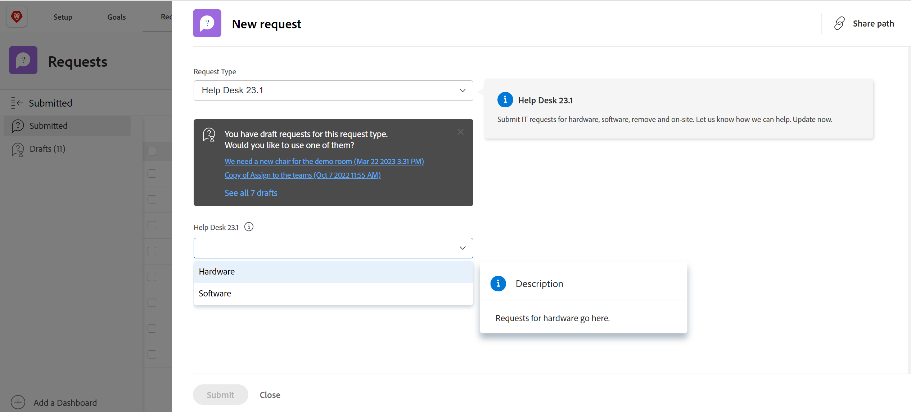

# 创建请求队列

<!--
<THIS IS CONNECTED TO THE PRODUCT IN BLUEPRINTS. DO NOT MOVE/ CHANGE URL>
-->

您可以设置请求队列，用户可以在其中输入不计划处理项目的临时请求。 例如，可以设置帮助台请求队列以捕获进入IT部门的所有用户请求。

## 访问要求

<!--drafted for P&P: replace the table below with this:

<table style="table-layout:auto"> 
 <col> 
 <col> 
 <tbody> 
  <tr> 
   <td role="rowheader">Adobe Workfront plan*</td> 
   <td> 
Any 
 </td> 
  </tr> 
  <tr> 
   <td role="rowheader">Adobe Workfront license*</td> 
   <td> 
   
Current license: Stadard 

   Or
   
Legacy license: Plan 
 </td> 
  </tr> 
  <tr> 
   <td role="rowheader">Access level configurations*</td> 
   <td> 
Edit access to Projects
 
<b>NOTE</b> 
   
   If you still don't have access, ask your Workfront administrator if they set additional restrictions in your access level. For information on how a Workfront administrator can modify your access level, see <a href="../../../administration-and-setup/add-users/configure-and-grant-access/create-modify-access-levels.md" class="MCXref xref">Create or modify custom access levels</a>.
 </td> 
  </tr> 
  <tr> 
   <td role="rowheader">Object permissions</td> 
   <td> 
 Manage permissions to the project
 
For information on requesting additional access, see <a href="../../../workfront-basics/grant-and-request-access-to-objects/request-access.md" class="MCXref xref">Request access to objects </a>.
 </td> 
  </tr> 
 </tbody> 
</table>

&#42;To find out what plan, license type, or access you have, contact your Workfront administrator
-->

您必须具有以下访问权限才能执行本文中的步骤：

<table style="table-layout:auto"> 
 <col> 
 <col> 
 <tbody> 
  <tr> 
   <td role="rowheader">Adobe Workfront计划*</td> 
   <td> 
任意 
 </td> 
  </tr> 
  <tr> 
   <td role="rowheader">Adobe Workfront许可证*</td> 
   <td> 
计划 
 </td> 
  </tr> 
  <tr> 
   <td role="rowheader">访问级别配置*</td> 
   <td> 
编辑对项目的访问权限
 
注意：如果您仍然没有访问权限，请咨询Workfront管理员，他们是否在您的访问级别设置了其他限制。 有关Workfront管理员如何修改访问级别的信息，请参阅 <a href="../../../administration-and-setup/add-users/configure-and-grant-access/create-modify-access-levels.md" class="MCXref xref">创建或修改自定义访问级别</a>.
 </td> 
  </tr> 
  <tr> 
   <td role="rowheader">对象权限</td> 
   <td> 
 管理项目的权限
 
有关请求其他访问权限的信息，请参阅 <a href="../../../workfront-basics/grant-and-request-access-to-objects/request-access.md" class="MCXref xref">请求对对象的访问 </a>.
 </td> 
  </tr> 
 </tbody> 
</table>

&#42;要了解您拥有的计划、许可证类型或访问权限，请联系您的Workfront管理员

## 请求队列概述

将请求队列设置为项目。 将项目指定为请求队列时，该队列将从Adobe Workfront的“请求”区域访问。 自定义请求队列时，您还要自定义用户在提交请求时填写的表单。

本文介绍了如何从现有项目创建请求队列。 但是，为了构建请求接收流程的一致性或为其添加多个层以便进行报告和更好地管理，您还可以配置请求队列的其他构建基块，如下表所述。

<table style="table-layout:auto"> 
 <col> 
 <col> 
 <tbody> 
  <tr> 
   <td role="rowheader">队列详细信息</td> 
   <td> 
必须在“队列详细信息”区域中将项目设置为请求队列。 此步骤是强制性的。 
 
有关更多信息，请参阅 <a href="#create-a-request-queue" class="MCXref xref">创建请求队列</a> 章节。
 </td> 
  </tr> 
  <tr> 
   <td role="rowheader">主题组</td> 
   <td> 
这些菜单还提供了其他菜单，可根据常用功能对请求进行分类。 例如，对于IT请求队列，您可能希望具有“现场”和“远程”主题组。 
 
有关更多信息，请参阅 <a href="../../../manage-work/requests/create-and-manage-request-queues/create-topic-groups.md" class="MCXref xref">创建主题组</a>. 
 
这是可选的。
 </td> 
  </tr> 
  <tr> 
   <td role="rowheader">队列主题</td> 
   <td> 
这些是附加的菜单，可根据常用功能对属于同一主题组的请求进行分类。 一个主题组可以包含多个队列主题。 
 
例如，IT请求队列的“现场”主题组可能包含“硬件”、“软件”和“网络”队列主题。 
 
有关更多信息，请参阅 <a href="../../../manage-work/requests/create-and-manage-request-queues/create-queue-topics.md" class="MCXref xref">创建队列主题</a>. 
 
这是可选的。
 </td> 
  </tr> 
  <tr> 
   <td role="rowheader">路由规则</td> 
   <td> 
利用这些链接，可将每个请求路由到用户、工作角色、团队或项目。 
 
有关更多信息，请参阅 <a href="../../../manage-work/requests/create-and-manage-request-queues/create-routing-rules.md" class="MCXref xref">创建路由规则</a>. 
 
这是可选的。
 </td> 
  </tr> 
 </tbody> 
</table>

## 创建请求队列

将项目设置为“请求队列”时，项目状态必须为“当前”，才能在Workfront的“请求”区域中显示。

要创建请求队列，请执行以下操作：

1. 转到要设置为请求队列的项目。
1. （可选）单击 **项目详细信息** ，然后添加 **描述** 到 **概述** 的上界。 此信息将显示在所有新请求上。
1. 单击 **队列详细信息** 中。 您可能需要单击 **显示更多**，则 **队列详细信息**.

   此时将打开队列详细信息部分。

   

1. 指定以下信息：

   * **作为帮助请求队列发布：** 选择此选项可将此项目标识为请求队列。 所有传入的问题都被视为请求。\
      如果未选择此选项，则项目的行为与Workfront中的标准项目类似，并且所有传入问题都是问题。

   * **谁可以向此队列添加请求：** 选择哪些用户有权向此队列添加请求。 您可以允许以下人员组在全局导航栏的“请求”区域中查看请求队列：

      | 任何人 | 具有有效帐户的任何Workfront用户都可以查看此请求队列并向其添加请求 |
      |---|---|
      | 拥有查看此项目的权限的用户 | 对项目具有查看权限的用户可以查看请求并将其添加到此队列 |
      | 在这个项目公司工作的人 | 属于与此项目关联的公司的用户可以查看请求并将其添加到此队列。 如果存在与项目关联的公司，则公司名称将列在此设置后面的括号中。 |
      | 在这个项目组工作的人 | 属于与此项目关联的组的用户可以查看请求并将其添加到此队列。 如果存在与项目关联的组，则该组的名称将列在此设置后面的括号中。 |

      {style=&quot;table-layout:auto&quot;}

   * **与以下链接共享：** 通过以下选项，您可以使用外部页面直接访问请求队列以及与请求队列关联的表单，以访问Workfront以外的用户或Workfront用户。 有关将请求队列嵌入功能板中作为外部页面的信息，请参阅 [在功能板中嵌入请求队列](../../../reports-and-dashboards/dashboards/creating-and-managing-dashboards/embed-request-queue-dashboard.md).

      用户必须已拥有对请求队列的访问权限才能获得直接访问权限。 使用此处描述的任一选项不会自动授予用户访问权限。

      >[!TIP]
      >
      >用户在从其他应用程序访问“请求队列”页面时，必须先登录Workfront，然后才能访问请求队列。

      * **直接访问URL:** 当用户从浏览器访问此URL时，将直接转到“请求”区域的“新建请求”部分，并且默认情况下会为其选择此请求。

         

         >[!NOTE]
         >
         >您可以在功能板中将请求队列显示为外部页面。 在这种情况下，请求队列会被预选，但您可以从“请求类型”字段中选择任何其他请求队列。 用户可以更改请求类型。 此时还会显示“请求”的导航组件。

      * **嵌入代码：** 使用此HTML代码可将请求队列表单作为iframe嵌入到任何HTML页面中。\
         如果用户在查看嵌入了代码的页面时尚未通过Workfront的身份验证，则会显示Workfront登录对话框。 用户登录后，将显示“请求队列”窗体。

         

         >[!NOTE]
         在iframe中显示请求队列时，只显示请求表单，请求名称会预选并灰显。 用户无法更改请求类型。 “请求”区域的导航组件不显示。

         为使用此嵌入代码时显示请求队列表单，您必须在系统设置中启用“允许在iframe中嵌入Workfront”设置。 有关启用在iframe中嵌入Workfront的更多信息，请参阅 [配置系统安全首选项](../../../administration-and-setup/manage-workfront/security/configure-security-preferences.md). 如果未启用此设置，则iframe将显示为空白。

         您可以调整嵌入式表单显示方式的各个方面，如下所示：

         <table border="1" cellspacing="15"> 
         <col> 
         <col> 
         <thead> 
          <tr> 
           <th> 
<strong>功能</strong> 
 </th> 
           <th> 
<strong>解决方案</strong> 
 </th> 
          </tr> 
         </thead> 
         <tbody> 
          <tr> 
           <td> 
调整框架的大小
 </td> 
           <td> 
修改“宽度”和“高度”属性。
 
默认情况下，宽度为“500”，高度为“600”
 </td> 
          </tr> 
          <tr> 
           <td> 
将用户定向到特定队列主题或主题组
 </td> 
           <td> 
在src URL中添加“path”参数。 您可以通过在非嵌入表单中导航到所需的队列主题或主题组并检查URL来查找路径参数。
 </td> 
          </tr> 
          <tr> 
           <td> 
显示并允许用户更改预配置的主题组下拉列表
 </td> 
           <td> 
通过添加 <code>showPreSelectedOptions=true</code> 参数 <code>src URL</code>.
 </td> 
          </tr> 
          <tr> 
           <td> 
检测表单何时提交
 </td> 
           <td> 
将“消息”事件侦听器添加到网页的窗口中，并检查是否 <code>event.data.type</code> is <code>requestSubmitted</code>. <code>event.data.newIssueID</code> 将设置为已创建问题的ID。
 </td> 
          </tr> 
         </tbody> 
        </table>
   * **请求类型：** 从下面的默认选项中选择。

      Workfront管理员可以重命名默认请求类型。 有关重命名请求类型的更多信息，请参阅 [自定义默认问题类型](../../../administration-and-setup/set-up-workfront/configure-system-defaults/customize-default-issue-types.md).

      * 更改顺序
      * 问题
      * 请求
      * 风险

         这是必填字段，您必须至少选择一个选项。
      >[!NOTE]
      仅当在“队列详细信息”和“队列主题”页中都选择了“请求类型”时，“请求类型”才会在“请求”区域中显示为一个选项。 有关设置项目的“队列详细信息”区域的信息，请参阅 [创建队列主题](../../../manage-work/requests/create-and-manage-request-queues/create-queue-topics.md).

      此处选择的每种类型都将在表单上可用（您可以选择多种类型）。 选择多个类型有助于组织传入的多个请求。\
      例如，如果您在IT项目的请求队列中使用表单，则队列中可能会包含以下请求类型：硬件、软件、错误修复和问题。

   * **默认持续时间：** 默认持续时间是完成问题通常所花费的时长。 这将成为所有传入问题的默认设置，并可手动修改。 持续时间通常以小时、天或周为单位进行设置。 问题的默认持续时间与问题上的计划时间相同。 根据此字段计算的问题的计划完成日期。\
      问题持续时间的默认值为1天或8小时。 如果您的Workfront管理员将“每个工作日的典型小时数”设置为小于8小时，则问题的默认持续时间仍为8小时。 例如，如果将“每个工作日的典型小时数”设置为7小时，则问题的默认持续时间为1.14天或8小时。 有关如何设置系统“每个工作日的典型小时数”的更多信息，请参阅文章中的“时间轴计算”部分 [配置系统范围的项目首选项](../../../administration-and-setup/set-up-workfront/configure-system-defaults/set-project-preferences.md).

   * **同一公司的人将为所有请求继承相同的访问权限。:** 选择后，提交到队列的所有请求对于同一公司中的用户都可见。 用户可以在位于“请求”区域内的所有请求部分中查看这些请求。 启用或禁用此设置时，会影响所有未来请求；它不会追溯影响信息。
   * **当某人提出请求时，会自动授予：** 当用户向请求队列发出请求时，系统会自动向用户授予您选择的对该请求的权限级别。 从以下权限级别中进行选择：\
      **- 查看**

      **- 参与**
      **- 管理**

      有关Workfront权限模型的信息，请参阅 [对象共享权限概述](../../../workfront-basics/grant-and-request-access-to-objects/sharing-permissions-on-objects-overview.md).\
      在此处设置权限可节省时间，而不必为每个传入的请求授予权限。 选择此选项会影响所有将来的请求，但不会对现有请求产生追溯性影响。

   * **默认批准**:将批准流程与此请求队列关联。 此下拉菜单中仅显示“发行批准流程”。 提交到此队列的所有问题都将与此批准过程相关联。 在将Workfront管理员与请求队列关联之前，必须定义系统级别的批准流程。 对审批流程具有管理访问权限的用户也可以创建特定于组的审批流程。

      >[!IMPORTANT]
      如果项目组发生更改，则附加到现有问题的特定于组的审批流程将变成一次性审批流程。 有关项目组更改或审批流程更改如何影响审批设置的详细信息，请参阅 [组和审批流程更改如何影响分配的审批流程](../../../administration-and-setup/customize-workfront/configure-approval-milestone-processes/how-changes-affect-group-approvals.md).

      如果您有多个与请求队列关联的队列主题，我们建议您将审批流程与队列主题关联。 有关创建队列主题的更多信息，请参阅 [创建队列主题](../../../manage-work/requests/create-and-manage-request-queues/create-queue-topics.md).

      在向请求队列添加批准流程时，请考虑以下事项：

      * 列表中仅显示活动的批准流程。
      * 系统范围和特定于组的审批流程将显示在列表中。 与项目组以外的组关联的批准流程不会显示在列表中。
   * **默认路由**:将路由规则与此请求队列关联。 使用“路由规则”将提交到请求队列的新问题自动分配给正确的资源（用户、作业角色或团队）和正确的项目。 提交到此队列的所有问题都将与此路由规则相关联。 必须先配置路由规则，然后才能将它们与请求队列关联。\
      如果您有多个队列主题与请求队列相关联，我们建议您将路由规则与队列主题相关联。 有关创建路由规则的详细信息，请参阅 [创建路由规则](../../../manage-work/requests/create-and-manage-request-queues/create-routing-rules.md).

   * **新问题字段：** 在向所有用户显示以下选定字段部分中，选择您希望对向项目提交请求或向项目或任务添加问题的所有用户都可见的任何字段。

      >[!TIP]
      在“队列详细信息”部分中选择的新问题字段也与添加到项目或“问题”部分中任务的任何新问题相关联。

      在启用“已分配给”(Assigned to)、“作业角色”(Job Role)或“团队”(Team)字段中的任意字段时，它们始终在请求表单中重命名为“工作总揽”(Assignments)，但您只能在此处指定所选分配的类型。

      **示例：** 如果在“队列详细信息”区域中选择了“分配到”，则只能在请求表单的“分配”字段中输入用户。 在这种情况下，不能输入作业角色或团队。

   * **文档**:如果选择在新请求表单中显示“文档”部分，请选择文档上载部分的位置。 从以下选项中进行选择：

      <table style="table-layout:auto"> 
      <col> 
      <col> 
      <tbody> 
       <tr> 
        <td role="rowheader">自定义表单后</td> 
        <td>“文档”部分显示在请求表单的底部。 </td> 
       </tr> 
       <tr> 
        <td role="rowheader">自定义表单前</td> 
        <td> 
“文档”部分显示在请求表单的Workfront字段和自定义字段之间。 
 </td> 
       </tr> 
      </tbody> 
     </table>

      

   * **显示所有选定和未选定的字段，以：** 选择要查看表单上所有字段的用户。 以下选项控制对表单上字段的访问。

      | 所有用户（计划许可证） | 拥有计划许可证的所有用户都可以查看所选字段以及未选定的字段。 |
      |---|---|
      | 拥有查看此项目权限的用户（计划许可） | 具有计划许可证且对此项目也具有查看权限的用户可以查看所选字段以及未选定的字段。 其他可以向此项目提交请求的用户只能看到选定的字段。 |
      | 无用户 | 用户看不到未选择的字段。 所有能够向此项目提交请求的用户只能看到所选字段。 |

      {style=&quot;table-layout:auto&quot;}

   * **自定义Forms**:选择要与请求队列关联的自定义表单。 只有问题自定义Forms可从此下拉菜单中进行选择。 提交到请求队列的所有问题都将与选定的表单相关联。\
      如果您有多个队列主题与请求队列相关联，我们建议您将自定义表单与队列主题相关联。 有关为请求队列创建子部分的详细信息，请参阅 [创建队列主题](../../../manage-work/requests/create-and-manage-request-queues/create-queue-topics.md).

      如果您有多个与请求队列关联的自定义表单，请拖放表单以按所需的顺序(在 **重新排序Forms** 中。

      >[!TIP]
      添加到“队列详细信息”部分的自定义表单也与添加到项目的任何新问题或“问题”部分中的任务相关联。

   * **允许通过电子邮件添加问题：** 选择此选项可允许通过电子邮件提交请求。\
      有关更多信息，请参阅 [允许用户将问题通过电子邮件发送到请求队列项目](../../../manage-work/requests/create-requests/enable-email-issues-into-projects.md).

1. 单击&#x200B;**保存**。\
   您的项目现已配置为请求队列，用户现在可以向其添加请求。

1. （可选）要增强“请求队列”功能，请为队列构建其他子部分，以及将传入请求路由到正确团队、被分派人或项目的规则。

   有关为请求队列创建子部分的信息，请参阅相关文章 [创建队列主题](../../../manage-work/requests/create-and-manage-request-queues/create-queue-topics.md) 和 [创建主题组](../../../manage-work/requests/create-and-manage-request-queues/create-topic-groups.md).\
   有关将请求传送给相应的受分派人、团队和相应项目的信息，请参阅 [创建路由规则](../../../manage-work/requests/create-and-manage-request-queues/create-routing-rules.md).
