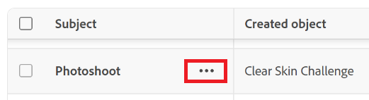

# 复制并提交请求

此页面上高亮显示的信息引用了尚未公开的功能。 它仅在“预览Sandbox”环境中可用。

当您频繁提交类似请求时，可以复制已提交的现有请求。 在这种情况下，您可以复制现有请求，对请求进行最小更改，然后将其作为新请求重新提交。

## 访问权限要求

+++ 展开可查看本文所述功能的访问权限要求。

<table style="table-layout:auto"> 
 <col> 
 <col> 
 <tbody> 
  <tr> 
   <td role="rowheader">Adobe Workfront 包</td> 
   <td> 
任何 
 </td> 
  </tr> 
  <tr> 
   <td role="rowheader">Adobe Workfront许可证</td> 
   <td> 
参与者或更高版本

   
请求或更高版本

    </td> 
  </tr> 
  <tr> 
   <td role="rowheader">访问级别配置</td> 
   <td> 
编辑对问题的访问权限
  </td> 
  </tr> 
  <tr>
   <td role="rowheader">对象权限</td> 
   <td>
将请求添加到请求队列的权限
 
查看现有请求或更高权限
 
有关设置请求队列的信息，请参阅<a href="../../../manage-work/requests/create-and-manage-request-queues/create-request-queue.md" class="MCXref xref">创建请求队列</a>。 
 </td> 
  </tr>
  <tr> 
   <td role="rowheader"> 产品</td> 
   <td> <ul><li>Adobe Workfront</li><li>您必须拥有Adobe Workfront Planning才能查看Planning请求或请求表单</td> 
  </tr> 
 </tbody> 
</table>

有关信息，请参阅Workfront文档中的[访问要求](/help/quicksilver/administration-and-setup/add-users/access-levels-and-object-permissions/access-level-requirements-in-documentation.md)。

+++

## 先决条件

您必须有一个请求，您或您组织中的某人之前已提交该请求，然后才能复制并重新提交。 如果请求属于其他人，则您必须至少具有查看该请求的权限，才能将其复制并作为新请求提交。

## 关于复制请求并将其提交为新请求的注意事项

* 您只能复制并提交已提交的请求。 您不能复制草稿的请求。
* 您可以复制并提交您最初提交的请求，或其他人提交的请求，并且您至少有权查看。
* 您始终有权复制并提交您自己的请求副本，除非有人删除了您对这些请求的权限。
* 当请求队列的创建者启用&#x200B;**来自同一公司的人员将为“队列详细信息”或“编辑项目”区域中的所有请求**&#x200B;继承相同权限时，可能会自动向同一公司中的人员授予对复制和提交最初由其他人提交的请求的访问权限。 禁用此设置将仅允许原始请求者查看自己的请求。

  有关更多信息，请参阅以下文章：

   * [创建请求队列](../../../manage-work/requests/create-and-manage-request-queues/create-request-queue.md)
   * [编辑项目](../../../manage-work/projects/manage-projects/edit-projects.md)

* 您可以更新原始请求的副本，然后再将其作为新请求重新提交。
* 如果在提交原始请求后发生以下更改，您将无法再复制并重新提交原始请求：

   * 已删除请求队列。
   * 已删除队列主题。

     >[!TIP]
     >
     >如果队列主题是请求队列中的唯一主题，您仍然可以复制并提交请求，该主题将保存在请求队列本身下。

   * 请求队列不再作为帮助请求队列发布。 有关信息，请参阅[创建请求队列](../../../manage-work/requests/create-and-manage-request-queues/create-request-queue.md)。
   * 如果请求队列没有队列主题，则原始请求是在2022年1月之前提交的。

   * 与请求队列关联的项目的状态不再是当前。

* 如果在转换过程中保留了已转换请求，则可以复制并提交该请求的副本。 有关详细信息，请参阅[在Adobe Workfront中转换问题的概述](../../../manage-work/issues/convert-issues/convert-issues.md)。

  >[!TIP]
  >
  >复制的请求未链接到解析对象。

## 在旧版请求体验中复制并提交请求

{{step1-to-requests}}

1. （视情况而定）如果“已提交”部分默认不显示，请单击左侧面板中的&#x200B;**已提交**。

   >[!TIP]
   >
   >   您的Workfront或组管理员可以自定义您的布局模板，并从环境的主菜单或左侧面板中删除区域。 在这种情况下，您可能无法使用它们。

1. 找到要复制并作为新请求提交的请求，然后执行以下操作之一：

   * 选择它，然后单击已提交请求列表左上角的&#x200B;**复制** 。

   >[!TIP]
   >
   > 如果未先选择请求，则复制图标将灰显。

   * 单击请求名称右侧的&#x200B;**更多**&#x200B;菜单，然后单击&#x200B;**复制并以新形式提交**

     或

     右键单击所选请求，然后单击&#x200B;**复制并作为新请求提交**。

     

     >[!TIP]
     >
     >当您无权创建问题时，您会收到一则警告，指出管理员限制您创建请求。

1. （可选）如果需要，请更新以下信息：

   * **请求类型**：保存所复制请求的请求队列。 默认情况下，复制的请求将保存到原始请求的请求队列中。
   * **主题组**&#x200B;和&#x200B;**队列主题**（如果已选择）。 为您的环境自定义名称或主题组和队列主题。 默认情况下，复制的请求将保存到原始请求的主题组和队列主题中。

     >[!TIP]
     >
     >如果路径更改自原始请求的路径，则请求队列的创建者会修改该队列。

1. （可选）更新复制请求中的任何信息。 根据请求队列创建者在项目的&#x200B;**队列详细信息**&#x200B;子选项卡的&#x200B;**新问题字段**&#x200B;部分中启用的字段，您可能会找到以下任意字段：

   <table style="table-layout:auto"> 
    <col> 
    <col> 
    <tbody> 
     <tr> 
      <td role="rowheader"><strong>主题</strong> </td> 
      <td>显示原始请求的名称。 如有必要，请更新它。 否则，Workfront会将复制的请求命名为<b>&lt;原始请求的名称&gt;</b>的副本。 这是必填字段。</td> 
     </tr> 
     <tr> 
      <td role="rowheader"><strong>描述</strong> </td> 
      <td>显示原始请求的说明。 如有必要，请更新它。</td> 
     </tr> 
     <tr> 
      <td role="rowheader"><strong>URL</strong> </td> 
      <td> 
显示原始请求的URL。 如有必要，请更新它。
 </td> 
     </tr> 
     <tr> 
      <td role="rowheader"><strong>优先级</strong> </td> 
      <td> 
指定请求的优先级。 优先级应定义您认为解决此请求的速度。 默认选项为：
 
       <ul> 
        <li>无</li> 
        <li>低</li> 
        <li>正常</li> 
        <li>高</li> 
        <li>紧急</li> 
       </ul> 
您的Workfront管理员可以修改优先级的名称。
 </td> 
     </tr> 
     <tr> 
      <td role="rowheader"><strong>严重性</strong> </td> 
      <td> 
指定请求的严重性。 严重性应该定义如果不能及时解决此请求对您工作的影响。 默认选项为：
 
       <ul> 
        <li>轻微</li> 
        <li>导致混淆</li> 
        <li>有变通方案的错误</li> 
        <li>没有变通方案的错误</li> 
        <li>致命错误</li> 
       </ul> 
您的Workfront管理员可以修改严重程度的名称。
 </td> 
     </tr> 
     <tr> 
      <td role="rowheader"><strong>主要联系人</strong> </td> 
      <td>请求的主要联系人默认为您，因为您是处理与请求有关的任何问题的直接联系人。 但是，您可以将其更改为任何其他Workfront用户。</td> 
     </tr> 
     <tr data-mc-conditions=""> 
      <td role="rowheader"><strong>分配</strong> </td> 
      <td> 
指示请求应分配到的活动用户、工作角色或团队的名称。 
 
 您可以指定多个用户、工作角色或团队。 
 
根据请求队列的设置方式，您可能只能将请求分配给一种或两种类型的资源，而不是全部分配给三种资源。 
 
我们建议对请求队列使用路由规则，以便它们可以自动路由到适当的资源。 
 </td> 
     </tr> 
     <tr> 
      <td role="rowheader" colspan="2"> 

根据请求队列的设置方式，您可能只能为请求分配一种类型的资源（例如，用户）。 如果路由规则也关联到请求队列，并且它自动将请求路由到不同类型的资源（例如，小组），则您的请求将分配给在提交请求时手动指定的实体（用户）以及在路由规则中指定的资源（小组）。
 
有关更多信息，请参阅以下文章：
 
        <ul> 
         <li> 
<a href="../../../manage-work/requests/create-and-manage-request-queues/create-request-queue.md" class="MCXref xref">创建请求队列</a> 
 </li> 
         <li> 
<a href="../../../manage-work/requests/create-and-manage-request-queues/create-routing-rules.md" class="MCXref xref">创建路由规则</a>   
 </li> 
        </ul> 
 </td> 
     </tr> 
     <tr> 
      <td role="rowheader"><strong>计划小时数</strong> </td> 
      <td> 
估计完成此请求需要多少小时。
 </td> 
     </tr> 
     <tr> 
      <td role="rowheader"><strong>计划开始日期</strong> </td> 
      <td> 
开始处理此请求的日期。
 </td> 
     </tr> 
     <tr> 
      <td role="rowheader"><strong>计划完成日期</strong> </td> 
      <td>您希望解决此请求的日期。</td> 
     </tr> 
     <tr> 
      <td role="rowheader"><strong>状态</strong> </td> 
      <td>新请求的默认状态为“新建”。 您的Workfront管理员可能已更改此状态的名称。 您还可以从此下拉菜单将状态更改为其他内容。</td> 
     </tr> 
     <tr> 
      <td role="rowheader"><strong>文档</strong> </td> 
      <td> 
将文档添加到请求。 附加到原始请求的文档不会转移到复制的请求。
 
<b>提示</b>

   根据请求队列的设置方式，文档部分可能会在自定义字段之前或之后显示。
 
 
 </td>
   </tr> 
    </tbody> 
   </table>

1. （可选）如果需要，请更新附加的自定义表单中的任何信息。

   >[!TIP]
   >
   >* 附加到原始请求的所有自定义表单以及自定义字段中包含的值都会转移到复制的请求。 这包括包含逻辑的字段。
   >* 您无法从复制的请求中删除自定义表单。

1. 单击&#x200B;**提交**。

   复制的请求将作为新请求提交到您指定的请求队列中。

## 在新的请求体验中复制并提交请求

您可以在Workfront的请求区域或主页的“我的请求”小组件中复制并提交请求。

1. 要访问“请求”列表，请单击Adobe Workfront右上角的&#x200B;**[!UICONTROL 主菜单]**&#x200B;图标，或（如果可用）单击左上角的&#x200B;**[!UICONTROL 主菜单]**&#x200B;图标，然后单击&#x200B;**[!UICONTROL 请求]**。

1. 要在主页访问“我的请求”小组件，请执行以下操作：

   1. 单击Adobe Workfront右上角的&#x200B;**[!UICONTROL 主菜单]**&#x200B;图标，或（如果可用）单击左上角的&#x200B;**[!UICONTROL 主菜单]**&#x200B;图标，然后单击&#x200B;**[!UICONTROL 主页]**。
   1. 找到“我的请求”构件。

      有关“我的请求”小组件的详细信息，请参阅[使用我的请求](/help/quicksilver/workfront-basics/using-home/using-the-home-area/my-requests-widget.md)。

1. 在“请求”列表或“我的请求”小组件中，将鼠标悬停在要复制的请求上。

   出现“More（更多）”三点菜单。
   

1. 单击请求名称右侧的&#x200B;**更多**&#x200B;菜单，然后单击&#x200B;**复制**。

   或

   右键单击所选请求，然后单击&#x200B;**复制**。

   >[!TIP]
   >
   >当您无权创建问题时，您会收到一则警告，指出管理员限制您创建请求。

1. （可选）更新复制请求中的任何信息。 可用字段取决于用于请求的请求队列或请求表单。

   在复制的请求中输入或更改任何字段值时，该请求将另存为草稿。

1. 单击&#x200B;**提交**。

   复制的请求将作为新请求提交。

