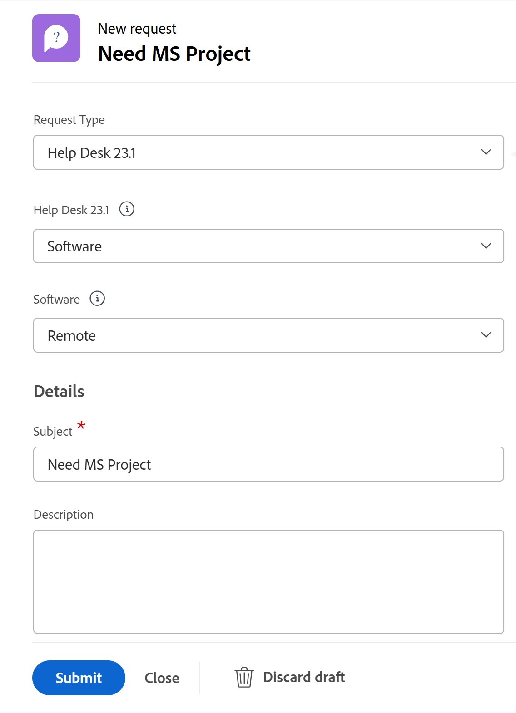

# 从草稿创建请求

此页面上高亮显示的信息引用了尚未公开的功能。 它仅在“预览Sandbox”环境中可用。

除了使用Workfront在输入新请求时向您建议的可用草稿之外，您还可以从“草稿”部分访问草稿请求并从此处完成提交。

## 访问权限要求

+++ 展开可查看本文所述功能的访问权限要求。

<table style="table-layout:auto"> 
 <col> 
 <col> 
 <tbody> 
  <tr> 
   <td role="rowheader">Adobe Workfront 包</td> 
   <td> 
任何 
 </td> 
  </tr> 
  <tr> 
   <td role="rowheader">Adobe Workfront许可证</td> 
   <td> 
参与者或更高版本

   
请求或更高版本

    </td> 
  </tr> 
  <tr> 
   <td role="rowheader">访问级别配置</td> 
   <td> 
编辑对问题的访问权限
  </td> 
  </tr> 
  <tr> 
   <td role="rowheader"> 产品</td> 
   <td> <ul><li>Adobe Workfront</li><li>您必须拥有Adobe Workfront Planning才能查看Planning请求或请求表单</td> 
  </tr> 
 </tbody> 
</table>

有关信息，请参阅Workfront文档中的[访问要求](/help/quicksilver/administration-and-setup/add-users/access-levels-and-object-permissions/access-level-requirements-in-documentation.md)。

+++

## 从草稿创建请求的先决条件

您必须先执行以下操作，然后才能从草稿创建请求：

* 开始创建请求。 这会自动将请求保存为“草稿”部分中的草稿。

  有关创建请求的信息，请参阅[创建和提交Adobe Workfront请求](../../../manage-work/requests/create-requests/create-submit-requests.md)。

## 从草稿创建请求

从草稿创建请求的过程因新请求体验和旧请求体验而异。

* [从新请求体验中的草稿创建请求](#create-requests-from-drafts-in-the-new-requesting-experience)
* [从旧版请求体验中的草稿创建请求](#create-requests-from-drafts-in-the-legacy-requesting-experience)

### 从新请求体验中的草稿创建请求

<!--
   
1. Open the draft.

   Drafts can be found in the following locations:

   * In the requests list in the Requests area
   * In the requests list in the My Requests widget in Home
   * In the New request dialog (includes only drafts of requests created with the selected form)
   
-->
1. 打开草稿。

   草稿可以在“新建请求”对话框中找到（仅包含使用选定表单创建的请求草稿）。
1. 按照[创建和提交Adobe Workfront请求](../../../manage-work/requests/create-requests/create-submit-requests.md)中的说明更新请求的信息。
1. （可选且有条件）在输入请求期间，如果想要删除草稿，可随时单击&#x200B;**放弃**&#x200B;草稿。 这将删除草稿。

   如果错误地丢弃了草稿，可以立即单击屏幕底部消息中的&#x200B;**撤消**。 此选项仅可用几秒钟。

   有关删除草稿的更多信息，请参阅[删除提交的请求或请求草稿](../../../manage-work/requests/create-requests/delete-request-draft.md)。

1. （可选）要保存对草稿的更改而不提交草稿，请离开新请求页面。 更改将自动保存。

1. 完成请求信息后，单击&#x200B;**提交**。

   提交请求时，草稿将被删除并且无法恢复。

### 从旧版请求体验中的草稿创建请求

{{step1-to-requests}}

1. 在左侧面板中选择&#x200B;**草稿**。

   此列表中将显示每个请求队列的每个队列主题的草稿。

   

1. （可选）单击列标题可按该列对列表进行排序。

1. 在“草稿”列表的以下列中复查有关每个草稿的信息：

   | 主题 | 这是您在开始创建请求时为其提供的名称。 |
   |---|---|
   | 路径 | 您最初打算提交请求的请求队列、主题组和队列主题的名称。 |
   | 输入日期 | 启动创建请求的日期。 |
   | 上次更新日期 | 上次更新时间。 如果在首次开始请求后没有更新它，则输入日期和上次更新日期应该相同。 |

   {style="table-layout:auto"}

1. （可选）使用“草稿”列表右上角的快速过滤器，开始键入草稿请求、请求队列、队列主题或主题组的名称，然后单击草稿的名称以将其打开。

   >[!TIP]
   >
   >您不能在请求区域的草稿部分应用永久筛选器。 此外，没有用于修改或更改草稿列表视图的选项。

1. 按照[创建和提交Adobe Workfront请求](../../../manage-work/requests/create-requests/create-submit-requests.md)中的说明更新请求的信息。
1. （可选且有条件）在输入请求期间，如果想要删除草稿，可随时单击&#x200B;**放弃**&#x200B;草稿。 这将删除无法恢复的草稿。 有关删除草稿的详细信息，请参阅[删除请求草稿](../../../manage-work/requests/create-requests/delete-request-draft.md)。

1. （可选）如果要还原操作并保留草稿，请单击页面左下角的&#x200B;**取消**。

1. 完成请求信息后，请执行下列操作之一：

   * 如果您已准备好提交请求，请单击&#x200B;**提交**。 请求将保存在已提交部分中。 根据请求队列的路由规则，此请求可能会路由到指定为“请求队列”的不同项目。 有关路由规则的信息，请参阅[创建路由规则](../../../manage-work/requests/create-and-manage-request-queues/create-routing-rules.md)。

     或

     如果您还没有完全准备好提交，请单击&#x200B;**关闭**，稍后可能会返回并完成提交。 您的请求将保存在草稿部分，下次您提交此请求队列的请求时，将可以使用该草稿。

     

     提交请求时，草稿将被删除并且无法恢复。

   >[!NOTE]
   >
   >在新的请求体验中，草稿与提交的请求位于同一列表中。
   >有关在新版Experience中创建请求的更多信息，请参阅创建并提交请求一文中的[在Workfront Web应用程序中创建请求并生成草稿](/help/quicksilver/manage-work/requests/create-requests/create-submit-requests.md#create-requests-and-generate-drafts-in-the-workfront-web-app)。

