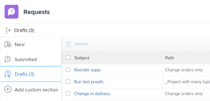

# 从草稿创建请求

除了使用Workfront在您输入新请求时向您建议的可用草稿之外，您还可以从“草稿”部分访问草稿请求，然后从此处完成提交。

## 访问要求

您必须具有以下访问权限才能执行本文中的步骤：

<table style="table-layout:auto"> 
 <col> 
 <col> 
 <tbody> 
  <tr> 
   <td role="rowheader">Adobe Workfront计划*</td> 
   <td> 
任意 
 </td> 
  </tr> 
  <tr> 
   <td role="rowheader">Adobe Workfront许可证*</td> 
   <td> 
请求或更高版本
 </td> 
  </tr> 
  <tr> 
   <td role="rowheader">访问级别配置*</td> 
   <td> 
编辑对问题的访问权限
 
注意：如果您仍然没有访问权限，请咨询Workfront管理员，他们是否在您的访问级别设置了其他限制。 有关Workfront管理员如何更改访问级别的信息，请参阅 <a href="../../../administration-and-setup/add-users/configure-and-grant-access/create-modify-access-levels.md" class="MCXref xref">创建或修改自定义访问级别</a>.
 </td> 
  </tr> 
 </tbody> 
</table>

&#42;要了解您拥有的计划、许可证类型或访问权限，请联系您的Workfront管理员。

## 从草稿创建请求的先决条件

在从草稿创建请求之前，必须执行以下操作： 

* 开始创建请求。 此操作会在“草稿”部分自动将请求另存为草稿。

   有关创建请求的信息，请参阅 [创建和提交Adobe Workfront请求](../../../manage-work/requests/create-requests/create-submit-requests.md).

## 从草稿创建请求

1. 单击 **主菜单** 图标  在Workfront的右上角。
1. 单击 **请求** > **草稿**.

   此列表中将显示每个请求队列的每个队列主题的草稿。

   

1. 在“草稿”列表的以下列中查看有关每个草稿的信息：

   | 主题 | 这是您在开始创建请求时提供的名称。 |
   |---|---|
   | 路径 | 请求队列、主题组以及最初要提交请求的队列主题的名称。 |
   | 输入日期 | 开始创建请求的日期。 |
   | 上次更新日期 | 上次更新的最后一个。 如果您自首次开始请求后没有更新登入日期，则“登入日期”和“上次更新日期”应相同。 |

   {style=&quot;table-layout:auto&quot;}

1. （可选）单击 **按请求类型过滤** 在草稿列表的右上角，选择包含要显示的草稿的请求队列。
1. 单击草稿的名称以将其打开。
1. 按照 [创建和提交Adobe Workfront请求](../../../manage-work/requests/create-requests/create-submit-requests.md).
1. （可选和视情况而定）在输入请求期间的任意时间点，单击 **放弃** 草稿。 这将删除无法恢复的草稿。 有关删除草稿的详细信息，请参阅 [删除请求草稿](../../../manage-work/requests/create-requests/delete-request-draft.md).

1. （可选）单击 **取消** （如果要还原操作并保留草稿）。

1. 完成请求信息后，执行以下操作之一：

   * 单击 **提交** 如果您已准备好提交请求。 请求保存在已提交部分中。 根据请求队列的路由规则，此请求可能会路由到与指定为请求队列的项目不同的项目。 有关路由规则的信息，请参阅 [创建路由规则](../../../manage-work/requests/create-and-manage-request-queues/create-routing-rules.md).

      或

      单击 **关闭** 如果您还未准备好提交它，则可能稍后返回并完成它。 您的请求将保存在“草稿”部分，下次提交此请求队列的请求时，您将可以使用该请求。

      

      提交请求时，草稿将被删除，无法恢复。
