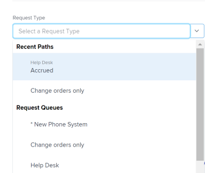

# 创建并提交请求

<!--Audited: 12/2023-->

<!--

(NOTE: Linked to the UI - do not change/ remove; THIS IS NOW SPLIT IN THREE ARTICLES>> MAKE SURE THE TRANSITION TO THE OTHER TWO IS CLEAR SINCE THIS IS LINKED TO UI)

(NOTE: If they come out with templates AND drafts, consider splitting this article to keep Create in one and Working with Drafts and Requests in another??)

(NOTE: this article is linked from Submitting Workfront Requests from Salesforce) 

-->

在Adobe Workfront中，计划工作由项目和任务表示。 但是，您可能是在这样一种环境中工作：随时都可能以请求形式进行非计划工作。 Workfront通过使用请求队列提供了一个工作流来适应这种类型的环境。

在请求队列中创建请求后，您可以将其分配给完成请求，也可以将其转换为任务或项目。\
有关将问题转化为任务或项目的更多信息，请参阅文章[在Adobe Workfront中转化问题的概述](../../../manage-work/issues/convert-issues/convert-issues.md)。

您可以通过以下方式创建Workfront请求：

* 从头开始，如本文所述。
* 来自草稿。 有关信息，请参阅[从草稿创建请求](../../../manage-work/requests/create-requests/create-requests-from-drafts.md)。
* 从现有请求中，通过复制并提交副本。 有关信息，请参阅[复制并提交请求](../../../manage-work/requests/create-requests/copy-and-submit-requests.md)。
* 从Workfront Planning请求表单中，在Workfront Planning中创建记录。 贵组织必须购买Workfront规划包。 有关信息，请参阅[提交Adobe Workfront计划请求以创建记录](/help/quicksilver/planning/requests/submit-requests.md)。

## 访问要求

+++ 展开以查看本文中各项功能的访问要求。

您必须具有以下权限才能执行本文中的步骤：

<table style="table-layout:auto"> 
 <col> 
 <col> 
 <tbody> 
  <tr> 
   <td role="rowheader">Adobe Workfront计划</td> 
   <td> 
任何 
 </td> 
  </tr> 
  <tr> 
   <td role="rowheader">Adobe Workfront许可证</td> 
   <td> 
新文档：参与者或更高版本

   或
   
当前：请求或更高版本

    </td> 
  </tr> 
  <tr> 
   <td role="rowheader">访问级别配置</td> 
   <td> 
编辑对问题的访问权限
  </td> 
  </tr> 
 </tbody> 
</table>

有关此表中信息的更多详细信息，请参阅Workfront文档中的[访问要求](/help/quicksilver/administration-and-setup/add-users/access-levels-and-object-permissions/access-level-requirements-in-documentation.md)。

+++

## 使用请求队列的先决条件

Workfront管理员必须先创建请求队列，并让用户可以使用它们，然后才能使用此功能。 具有Planner许可证以及项目编辑权限和特定项目管理权限的用户也可以创建请求队列。

有关如何创建请求队列的信息，请参阅文章[创建请求队列](../../../manage-work/requests/create-and-manage-request-queues/create-request-queue.md)。

Workfront管理员必须创建请求队列的以下组件：

* 处于当前状态的项目，作为帮助请求队列发布。
* 队列主题。\
  有关详细信息，请参阅文章[创建队列主题](../../../manage-work/requests/create-and-manage-request-queues/create-queue-topics.md)。

* 路由规则。\
  有关详细信息，请参阅文章[创建路由规则](../../../manage-work/requests/create-and-manage-request-queues/create-routing-rules.md)。

* （可选）主题组。\
  有关详细信息，请参阅文章[创建主题组](../../../manage-work/requests/create-and-manage-request-queues/create-topic-groups.md)。

* （可选）请求自定义表单。\
  有关详细信息，请参阅文章[创建自定义表单](/help/quicksilver/administration-and-setup/customize-workfront/create-manage-custom-forms/form-designer/design-a-form/design-a-form.md)。

* （可选）请求审批流程。\
  有关详细信息，请参阅文章[为工作项创建批准流程](../../../administration-and-setup/customize-workfront/configure-approval-milestone-processes/create-approval-processes.md)。

## 在Workfront Web应用程序中创建请求并生成草稿

在Workfront Web应用程序中创建请求时，Workfront会先将请求另存为草稿，然后再提交。 当您选择请求队列并开始输入信息时，Workfront会立即创建草稿。

您可以继续提交请求，也可以填写现有的所有信息，然后离开该请求以稍后完成。 Workfront会保存您在“草稿”文件夹中启动的草稿请求。

>[!IMPORTANT]
>
>处理草稿时请考虑以下事项：
>
>* 当您从第三方应用程序提交草稿请求时，Workfront不会创建草稿请求，例如，通过电子邮件将其发送到Workfront，或使用任何其他应用程序创建它们。 当您从Workfront Web应用程序外部提交请求时，该请求将保存在已提交部分中。
>* 如果请求队列的结构发生更改，您将无法再访问现有草稿。 例如，如果删除了队列主题或添加了主题组，则无法再访问保存的草稿。
>

有关从现有草稿创建请求的信息，请参阅[从草稿创建请求](../../../manage-work/requests/create-requests/create-requests-from-drafts.md)。 有关删除请求草稿的信息，另请参阅[删除请求草稿](../../../manage-work/requests/create-requests/delete-request-draft.md)。

要在Workfront Web应用程序中创建请求，请执行以下操作：

{{step1-to-requests}}

1. 单击页面右上角的&#x200B;**新建请求**。

   >[!TIP]
   >
   >* 您可以从请求区域的任何部分访问新请求选项。
   >* 当您无权创建问题时，新请求选项将灰显。

1. （视情况而定）单击&#x200B;**请求类型**&#x200B;字段并执行以下操作之一：

   * 从&#x200B;**最近使用的路径**&#x200B;部分，选择您最近用来打开请求队列的路径。 路径包括请求队列、主题组和最近提交的队列主题。 默认显示最后三条路径。

     >[!NOTE]
     >
     >仅当您实际向路径提交请求时，Workfront才会保存路径。 它不会为草拟的请求创建路径。

     

   * 从&#x200B;**请求队列**&#x200B;部分，选择一个请求队列。
   * 输入属于先前访问路径的关键字，以搜索请求队列。

     例如，如果您有一个名为“技术支持”的请求队列，其主题组名为“位置”，队列主题名为“远程”，则可以键入“remote”，并在其路径显示的任意元素中包含“remote”的所有请求队列。

     >[!TIP]
     >
     >键入包含特殊字符的名称时，即使省略键入字符，也会显示请求队列、队列主题或主题组。

     

     可用请求队列和最近路径列表会动态更新，以仅包含结果中突出显示的关键字的路径。

     搜索结果显示在以下区域下：

     <table style="table-layout:auto"> 
      <col> 
      <col> 
      <tbody> 
       <tr> 
        <td role="rowheader">请求队列</td> 
        <td>在其名称中包含关键字的请求队列</td> 
       </tr> 
       <tr> 
        <td role="rowheader">请求路径</td> 
        <td> 
在其元素的任何名称中包含关键字的路径（包括请求队列、主题组、队列主题）
 </td> 
       </tr> 
      </tbody> 
     </table>

   >[!TIP]
   >
   >* 默认情况下，将按字母顺序显示前200个请求队列。
   >* 请求队列的名称是已作为帮助请求队列发布的项目的名称。
   >* 配置为选定请求队列的项目的说明显示在请求队列名称的右侧。
   >   
   >有关如何将项目发布为帮助请求队列的更多信息，请参阅文章[创建请求队列](../../../manage-work/requests/create-and-manage-request-queues/create-request-queue.md)。

1. 在&#x200B;**新请求**&#x200B;表单中，执行以下操作之一：

   * （视情况而定）从“请求类型”字段下显示的通知消息中选择可用的草稿。

     仅当之前保存了草稿而未提交时，此区域才会显示。

     默认情况下，将显示三个不同队列主题中的三个最新草稿。

     

   * 开始在所选队列中输入新请求。

     开始为新请求输入信息并在“主题”字段中为请求指定名称后，新草稿将自动保存到“草稿”部分。

1. （可选）如果您的请求队列包含主题组，请在第一个下拉字段中选择主题组的名称。 否则，请选择队列主题。

   >[!TIP]
   >
   >将鼠标悬停在主题组或队列主题上时，“说明”字段将显示在右侧。 其中包含有关主题组或队列主题的附加信息。
   >
   >
   >   >
   >

   您的请求队列中最多可以包含10层主题组。\
   有关如何创建主题组的详细信息，请参阅文章[创建主题组](../../../manage-work/requests/create-and-manage-request-queues/create-topic-groups.md)。 有关创建队列主题的更多信息，请参阅文章[创建队列主题](../../../manage-work/requests/create-and-manage-request-queues/create-queue-topics.md)。

   >[!TIP]
   >
   >如果选择了草稿或前一路径，则已经选择了主题组和队列主题。 如果需要，您可以选择其他选项。

1. 根据项目的&#x200B;**队列详细信息**&#x200B;子选项卡的&#x200B;**新问题字段**&#x200B;部分中启用的Workfront管理员字段，当您提交新请求时，可能会发现以下任何字段：

   <table style="table-layout:auto"> 
    <col> 
    <col> 
    <tbody> 
     <tr> 
      <td role="rowheader"><strong>主题</strong> </td> 
      <td>为您的请求指定一个名称。 这是必填字段。</td> 
     </tr> 
     <tr> 
      <td role="rowheader"><strong>描述</strong> </td> 
      <td>为您的请求指定描述。</td> 
     </tr> 
     <tr> 
      <td role="rowheader"><strong>URL</strong> </td> 
      <td> 
指定可能与您的请求相关的URL。
 </td> 
     </tr> 
     <tr> 
      <td role="rowheader"><strong>优先级</strong> </td> 
      <td> 
指定请求的优先级。 优先级应定义您认为解决此请求的速度。 默认选项为： 
 
       <ul> 
        <li>无</li> 
        <li>低 </li> 
        <li>正常</li> 
        <li>高</li> 
        <li>紧急</li> 
       </ul> 
系统管理员可以修改优先级的名称。
 </td> 
     </tr> 
     <tr> 
      <td role="rowheader"><strong>严重性</strong> </td> 
      <td> 
指定请求的严重程度。 严重性应该定义如果不能及时解决此请求对您工作的影响。 默认选项为：
 
       <ul> 
        <li>轻微</li> 
        <li>导致混淆</li> 
        <li>有变通方案的问题</li> 
        <li>没有变通方案的问题</li> 
        <li>致命错误</li> 
       </ul> 
系统管理员可以修改严重性的名称。
 </td> 
     </tr> 
     <tr> 
      <td role="rowheader"><strong>主要联系人</strong> </td> 
      <td>请求的主要联系人默认为您，因为您是处理与请求有关的任何问题的直接联系人。 但是，您可以将其更改为任何其他Workfront用户。</td> 
     </tr> 
     <tr data-mc-conditions="QuicksilverOrClassic.Quicksilver"> 
      <td role="rowheader"><strong>分配</strong> </td> 
      <td> 
指定请求应分配给的活动用户、工作角色或团队的名称。 
 
您只能指定一个团队。

   
 根据请求队列的设置方式，您可能只能为该请求分配一种或两种类型的资源，而不是全部分配三种（例如，您可能只能将该请求分配给用户）。

   
如果路由规则也关联到请求队列，并且它自动将请求路由到不同类型的资源（例如，小组），则您的请求将分配给在提交请求时手动指定的实体（用户）以及在路由规则中指定的资源（小组）。 

   
 有关更多信息，请参阅以下文章：
 
      <ul> 
      <li> 
<a href="../../../manage-work/requests/create-and-manage-request-queues/create-request-queue.md" class="MCXref xref">创建请求队列</a> 
 </li> 
      <li> 
<a href="../../../manage-work/requests/create-and-manage-request-queues/create-routing-rules.md" class="MCXref xref">创建路由规则</a>   
 </li> 
      </ul> 

   
我们建议对您的请求队列使用路由规则，以便它们可以自动路由到适当的资源。 
 </td> 
     </tr>

   <tr> 
      <td role="rowheader"><strong>计划小时数</strong> </td> 
      <td> 
估计完成此请求需要多少小时。
 </td> 
     </tr> 
     <tr> 
      <td role="rowheader"><strong>计划开始日期</strong> </td> 
      <td> 
指定开始处理此请求的日期。
 </td> 
     </tr> 
     <tr> 
      <td role="rowheader"><strong>计划完成日期</strong> </td> 
      <td>指定您希望解决此请求的日期。</td> 
     </tr> 
     <tr> 
      <td role="rowheader"><strong>状态</strong> </td> 
      <td>新请求的默认状态为“新建”。 您的系统管理员可能已更改此状态的名称。 您还可以从此下拉菜单将状态更改为其他内容。</td> 
     </tr> 
     <tr> 
      <td role="rowheader"><strong>文档</strong> </td> 
      <td> 
将文档添加到请求。 
 
 根据请求队列的设置方式，文档部分可能会在自定义字段之前或之后显示。 
 
您上传到Workfront的文档会在草稿的请求中存储24小时。 之后，当您返回编辑并提交草稿时，必须重新附加它们。 从其他驱动器链接的文档将永久保存在草稿上。 
 </td> 
     </tr> 
    </tbody> 
   </table>

1. （可选）如果您的Workfront管理员将自定义表单与请求队列或队列主题关联，请指定自定义表单中的字段。\
   自定义表单在每个Workfront实例中都不同。
1. （可选且有条件）在输入请求期间，如果要删除自动创建的草稿，可随时单击&#x200B;[!UICONTROL **放弃草稿**]。 这将删除无法恢复的草稿。 此时将显示确认消息，确认您正在删除草稿。

1. （可选）如果要还原操作并保留草稿，请单击确认消息上的&#x200B;[!UICONTROL **撤消**]。

1. 执行下列操作之一：

   * 如果您已准备好提交请求，请单击&#x200B;**提交**。 请求将保存在已提交部分中。 根据请求队列的路由规则，此请求可能会路由到指定为“请求队列”的不同项目。 有关路由规则的信息，请参阅[创建路由规则](../../../manage-work/requests/create-and-manage-request-queues/create-routing-rules.md)。

     或

     如果您还没有完全准备好提交，请单击&#x200B;**关闭**，稍后可能会返回并完成提交。 您的请求将保存在草稿部分，下次您提交此请求队列的请求时，将可以使用该草稿。

     

   提交请求时，草稿将自动删除且无法恢复。

   有关处理传入请求的信息，请参阅文章[管理工作和团队请求](../../../people-teams-and-groups/work-with-team-requests/manage-work-and-team-requests.md)。

   有关查找已提交或草拟的请求的信息，另请参阅[查找已提交的请求](../../../manage-work/requests/create-requests/locate-submitted-requests.md)。

## 从Workfront外部创建请求

提交新请求时，您可以共享请求队列的直接链接，并将其嵌入其他应用程序。 从Web或其他应用程序访问此链接的用户还必须使用活动的Workfront帐户登录，才能访问此队列并向其提交请求。 有关信息，请参阅[共享请求队列的链接](../../../manage-work/requests/create-requests/share-link-to-request-queue.md)。

## 通过电子邮件发送到Workfront以创建请求

如果您的请求队列启用了通过电子邮件接收请求的功能，则可以直接将请求通过电子邮件发送到与请求队列关联的电子邮件地址。

将添加电子邮件的正文作为请求描述。

>[!NOTE]
>
>请求进入Workfront时，HTML格式会被去除，但签名和现有的回复线程内容不会被去除，并会显示在请求描述中。

有关如何启用请求队列以通过电子邮件接收请求的信息，请参阅[启用用户将问题通过电子邮件发送到请求队列项目](../../../manage-work/requests/create-requests/enable-email-issues-into-projects.md)。

## 使用Outlook客户端创建请求

您可以使用Outlook客户端提交请求。 您可以创建新请求，也可以将电子邮件转换为请求。

有关使用Outlook客户端提交请求的信息，请参阅文章[从Outlook电子邮件创建Adobe Workfront请求](../../../workfront-integrations-and-apps/using-workfront-with-outlook/create-a-wf-request-from-an-outlook-email.md)。

## 使用Workfront移动设备应用程序创建请求

您可以使用智能手机上的移动设备应用程序提交请求。 您可以创建新请求，并将其提交到您有权在Web应用程序中查看的请求队列。

有关通过移动设备应用程序提交请求的信息，请参阅文章中的请求部分：

* 适用于Android的[Adobe Workfront](../../../workfront-basics/mobile-apps/using-the-workfront-mobile-app/workfront-for-android.md#requests)
* [适用于iOS的Adobe Workfront](../../../workfront-basics/mobile-apps/using-the-workfront-mobile-app/workfront-for-ios.md#requests)

## 从其他应用程序创建请求

您可以使用与Workfront集成的任何应用程序提交请求：

* 您可以在Workfront与其他应用程序之间构建自定义集成，从而允许您从其他应用程序向Workfront提交请求。\
  有关自定义Workfront集成的更多信息，请参阅文章[Adobe Workfront集成](../../../administration-and-setup/configure-integrations/workfront-integrations-1.md)。

* 如果已安装适用于Salesforce的Workfront应用程序，则可以从Salesforce提交请求。\
  有关使用适用于Salesforce的Workfront应用程序提交来自Salesforce的请求的信息，请参阅文章[从Salesforce对象提交Adobe Workfront请求](../../../workfront-integrations-and-apps/using-workfront-with-salesforce/submit-workfront-requests-from-salesforce-objects.md)。

## 使用Workfront Planning请求表单创建请求

您可以使用Workfront Planning请求表单添加请求。 如果请求表单获得批准或不需要批准，添加Workfront Planning请求可能会创建Planning记录。

贵组织必须购买Workfront Planning程序包才能提交Planning请求。

有关信息，请参阅以下文章：

* [在Adobe Workfront Planning中创建和管理申请表单](/help/quicksilver/planning/requests/create-request-form.md)。
* [提交Adobe Workfront计划请求以创建记录](/help/quicksilver/planning/requests/submit-requests.md)。

## 查找已提交的请求

有关查找已提交或草拟的请求的信息，请参阅[查找已提交的请求](../../../manage-work/requests/create-requests/locate-submitted-requests.md)。
