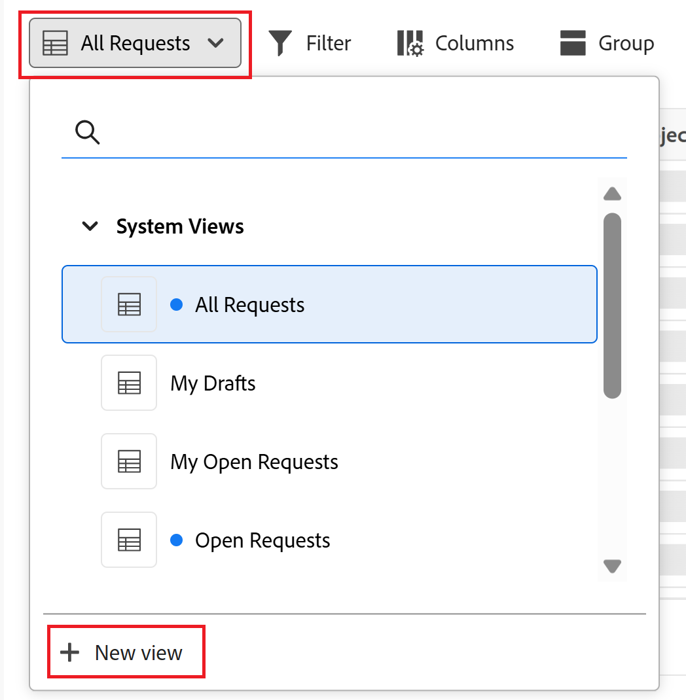

# 在请求区域创建和管理视图

此页面上高亮显示的信息引用了尚未公开的功能。 它仅在“预览Sandbox”环境中可用。

如果您使用的是新的请求体验，则可以创建和保存请求区域的视图。 这些视图包括筛选器和列安排。

可在Workfront的请求区域以及主页中的我的请求小组件中创建和管理视图。 视图设置保留在“请求”区域与构件之间。

>[!IMPORTANT]
>
>此功能仅在新的请求体验中可用。

## 访问权限要求

+++ 展开可查看本文所述功能的访问权限要求。

<table style="table-layout:auto"> 
 <col> 
 <col> 
 <tbody> 
 <tbody> 
  <tr> 
   <td role="rowheader">Adobe Workfront 包</td> 
   <td> 
任何 
 </td> 
  </tr> 
  <tr> 
   <td role="rowheader">Adobe Workfront许可证</td> 
   <td> 
参与者或更高版本

   
请求或更高版本

    </td> 
  </tr> 
  <tr> 
   <td role="rowheader">访问级别配置</td> 
   <td> 
编辑对问题的访问权限
  
您必须是Workfront管理员才能将视图添加到布局模板</td> 
  </tr> 
  <tr> 
   <td role="rowheader"> 产品</td> 
   <td> <ul><li>Adobe Workfront</li><li>您必须拥有Adobe Workfront Planning才能查看Planning请求或请求表单</td> 
  </tr> 
 </tbody> 
</table>

有关此表中信息的更多详细信息，请参阅Workfront文档中的[访问要求](/help/quicksilver/administration-and-setup/add-users/access-levels-and-object-permissions/access-level-requirements-in-documentation.md)。

+++

## 在请求区域创建视图

您可以在Workfront的请求区域或主页中的我的请求小部件中创建视图。

1. 要访问“请求”列表，请单击Adobe Workfront右上角的&#x200B;**[!UICONTROL 主菜单]**&#x200B;图标，或（如果可用）单击左上角的&#x200B;**[!UICONTROL 主菜单]**&#x200B;图标，然后单击&#x200B;**[!UICONTROL 请求]**。

1. 要在主页访问“我的请求”小组件，请执行以下操作：

   1. 单击Adobe Workfront右上角的&#x200B;**[!UICONTROL 主菜单]**&#x200B;图标，或（如果可用）单击左上角的&#x200B;**[!UICONTROL 主菜单]**&#x200B;图标，然后单击&#x200B;**[!UICONTROL 主页]**。
   1. 找到“我的请求”构件。

      有关“我的请求”小组件的详细信息，请参阅[使用我的请求](/help/quicksilver/workfront-basics/using-home/using-the-home-area/my-requests-widget.md)。

1. 在“请求”列表或“我的请求”小部件中，单击&#x200B;**视图**&#x200B;下拉列表，然后选择&#x200B;**新视图**。

   

1. 输入新视图的名称，然后单击&#x200B;**创建**。
1. 继续[在请求区域](#edit-a-view-in-the-requests-area)中编辑视图。

## 在请求区域中编辑视图

您可以编辑现有视图，包括刚刚创建的视图。

1. 要访问“请求”列表，请单击Adobe Workfront右上角的&#x200B;**[!UICONTROL 主菜单]**&#x200B;图标，或（如果可用）单击左上角的&#x200B;**[!UICONTROL 主菜单]**&#x200B;图标，然后单击&#x200B;**[!UICONTROL 请求]**。

1. 要在主页访问“我的请求”小组件，请执行以下操作：

   1. 单击Adobe Workfront右上角的&#x200B;**[!UICONTROL 主菜单]**&#x200B;图标，或（如果可用）单击左上角的&#x200B;**[!UICONTROL 主菜单]**&#x200B;图标，然后单击&#x200B;**[!UICONTROL 主页]**。
   1. 找到“我的请求”构件。

      有关“我的请求”小组件的详细信息，请参阅[使用我的请求](/help/quicksilver/workfront-basics/using-home/using-the-home-area/my-requests-widget.md)。

1. 在请求列表或我的请求小部件中，找到要编辑的视图。

1. （可选）要重命名视图，请单击&#x200B;**视图**&#x200B;下拉列表，然后单击视图旁边的三个点菜单，选择&#x200B;**重命名**，然后键入视图的新名称。
1. 单击&#x200B;**视图**&#x200B;下拉列表，然后选择要编辑的视图。
1. 要将自定义字段添加为列，请单击屏幕右侧附近的&#x200B;**添加列**&#x200B;图标，然后单击要作为列添加到视图的自定义表单字段旁边的加号图标。

   附加到列表中对象的表单上的自定义字段可以添加为列。

   >[!TIP]
   >
   >您当前无法在生产环境中添加列。
1. （可选）单击&#x200B;**列**&#x200B;并隐藏、显示或重新排列请求列表中的列。

   

   >[!TIP]
   >
   >您当前无法在生产环境中添加任何其他列。

1. （可选）单击&#x200B;**筛选器**&#x200B;并开始为要在Planning选项卡中查看的请求添加条件。

   

   您可以按以下字段进行筛选：

   * **Workspace**：与请求表单关联的工作区。
   * **记录类型**：与请求表单关联的记录类型。
   * **输入日期**：提交请求的日期。
   * **请求表单**：用于提交请求的请求表单的名称。
   * **状态**：请求的状态。
   * **输入者**：添加请求的用户的名称。 如果请求是由Workfront之外的人员添加的，则&#x200B;**输入者**&#x200B;字段显示`N/A`。

   在“预览”环境中，您还可以按已添加到视图的任何自定义字段进行筛选。

   您可以有多个&#x200B;**And**&#x200B;或&#x200B;**Or**&#x200B;加入的筛选器。
在添加筛选条件时，将自动筛选请求列表。

>[!IMPORTANT]
>
> * 对视图的更改会自动保存。
> * 对视图的更改对使用该视图的任何人都可见。

## 将视图添加到布局模板。

Workfront管理员可以将新视图添加到布局模板。

有关说明，请参阅[使用布局模板自定义筛选器、视图和分组](/help/quicksilver/administration-and-setup/customize-workfront/use-layout-templates/customize-fvg-list-controls-layout-template.md)。

## 共享视图

您可以与其他用户、团队或组共享您创建的视图。

1. 要访问“请求”列表，请单击Adobe Workfront右上角的&#x200B;**[!UICONTROL 主菜单]**&#x200B;图标，或（如果可用）单击左上角的&#x200B;**[!UICONTROL 主菜单]**&#x200B;图标，然后单击&#x200B;**[!UICONTROL 请求]**。

1. 要在主页访问“我的请求”小组件，请执行以下操作：

   1. 单击Adobe Workfront右上角的&#x200B;**[!UICONTROL 主菜单]**&#x200B;图标，或（如果可用）单击左上角的&#x200B;**[!UICONTROL 主菜单]**&#x200B;图标，然后单击&#x200B;**[!UICONTROL 主页]**。
   1. 找到“我的请求”构件。

      有关“我的请求”小组件的详细信息，请参阅[使用我的请求](/help/quicksilver/workfront-basics/using-home/using-the-home-area/my-requests-widget.md)。

1. 在请求列表或我的请求小部件中，找到要共享的视图。
1. 将鼠标悬停在要共享的视图上，然后在出现时单击三个圆点菜单。
1. 选择&#x200B;**共享**。
1. 在打开的对话框中，输入要与其共享视图的用户、团队或组的名称，然后在它们出现时从列表中选择它们。
1. 单击&#x200B;**保存**。

