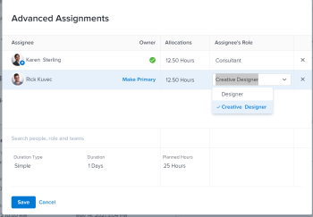

# 创建高级分配

您可以使用“高级分配”来管理任务或问题分配。

在进行高级分配时，您可以调整以下分配信息：

* 将用户分配给任务或问题（这可以在高级分配之外完成）。
* 调整并重新分配每个受让人分配的小时数。
* 确定应该将哪个用户指定为任务或问题的所有者或主要代理人。
* 指定每个用户在处理任务或问题时正在履行的角色。

>[!NOTE]
>
>在将用户分配到工作时，根据其计划确定其可用性会影响任务和问题的计划日期和预计日期。 有关计划的信息，请参阅 [创建计划](../../../administration-and-setup/set-up-workfront/configure-timesheets-schedules/create-schedules.md).

## Adobe Workfront中可进行高级分配的区域

本文介绍了如何在任务或问题题头中访问“提前分配”。

此外，您还可以在Workfront的以下区域执行高级分配：

* 在列表和报表中，“分配”字段显示在视图中。
* 在“任务”部分中编辑任务时。 有关更多信息，请参阅 [编辑任务](../../../manage-work/tasks/manage-tasks/edit-tasks.md).
* 在任务或问题标题的“分配”区域。
* 在工作负载平衡器中。 有关更多信息，请参阅 [使用工作负载平衡器手动分配工作](../../../resource-mgmt/workload-balancer/assign-work-in-workload-balancer-manually.md).

## 访问要求

您必须具有以下访问权限才能执行本文中的步骤：

<table style="table-layout:auto"> 
 <col> 
 <col> 
 <tbody> 
  <tr> 
   <td role="rowheader">Adobe Workfront计划*</td> 
   <td> 
任意
 </td> 
  </tr> 
  <tr> 
   <td role="rowheader">Adobe Workfront许可证*</td> 
   <td> 
工作或更高
 </td> 
  </tr> 
  <tr> 
   <td role="rowheader">访问级别配置*</td> 
   <td> 
编辑对任务和问题的访问权限
 
<b>注释</b>

如果您仍然没有访问权限，请咨询Workfront管理员，他们是否在您的访问级别设置了其他限制。 有关Workfront管理员如何修改访问级别的信息，请参阅 <a href="../../../administration-and-setup/add-users/configure-and-grant-access/create-modify-access-levels.md" class="MCXref xref">创建或修改自定义访问级别</a>.
 </td>
</tr> 
  <tr> 
   <td role="rowheader">对象权限</td> 
   <td> 
对任务或问题拥有或更高权限
 
有关请求其他访问权限的信息，请参阅 <a href="../../../workfront-basics/grant-and-request-access-to-objects/request-access.md" class="MCXref xref">请求对对象的访问 </a>.
 </td> 
  </tr> 
 </tbody> 
</table>

&#42;要了解您拥有的计划、许可证类型或访问权限，请联系您的Workfront管理员。

## 进行高级分配

1. 转到要分配任务或问题的项目。
1. 单击 **任务** 或 **问题** 在左侧面板中，单击列表中任务或问题的名称。

   >[!TIP]
   >
   >如果分配了两个或多个人员，则可以直接在任务或问题列表中进行高级分配。 在 **分配** 字段，然后单击 **“人员”图标** 打开“高级分配”窗口。 跳到步骤5以继续创建高级分配。\
   >   >

1. 单击 **分配给** 在 **分配** 字段

   或

   如果已分配任务或问题，请单击分配的名称。

1. 单击 **高级**.

   

1. 在 **搜索人员、角色和团队** 字段中，开始键入用户、角色或团队的名称，然后在下拉列表中显示该名称时单击该名称。

   >[!NOTE]
   >
   >如果用户名包含特殊字符，则必须在搜索字段中包含特殊字符。

1. （可选）继续在 **搜索人员、角色或团队** 框，向任务或问题添加多个资源。

   >[!TIP]
   >
   >* 您可以分配多个用户、工作角色或团队。 您只能分配活动用户、工作角色和团队。
   >
   >
   >* 添加用户分配时，请注意头像、用户的主要角色或其电子邮件地址，以区分名称相同的用户。 用户必须至少与一个作业角色关联，才能在您添加时查看该角色。
   >
   >
   >* 如果在停用用户、作业角色或团队之前已分配它们，则它们仍会被分配到工作项。 在这种情况下，我们建议执行以下操作：
      >   
      >   * 将工作项重新分配给活动资源。
      >   * 将已停用团队中的用户与活动团队相关联，并将工作项重新分配给活动团队。

1. 对于 **被分派人** 列中，指定以下信息：

   * **所有者**:将鼠标悬停在代理人的名称上，然后单击 **设为主要** 在“责任人”(Owner)字段中。 绿色复选框表示指定的用户是任务或问题的主要联系人。 Adobe Workfront将您分配给任务或问题的第一个用户或作业角色标记为“所有者”或“主要分配”。 不能将团队指定为任务或问题的主要所有者。

      >[!IMPORTANT]
      >
      >根据Workfront管理员或组管理员设置项目首选项的方式，当您为任务分配了多个用户时，Workfront可能会使用任务所有者的计划来计算任务的时间表。 有关多个任务分配者的信息，请参阅文章中的“将多个用户分配给任务”部分 [分配任务](../../../manage-work/tasks/assign-tasks/assign-tasks.md).

   * **分配** :当任务的“持续时间类型”为“简单”时，指定应将每个用户或作业角色分配给该任务的小时数。 每个用户的所有分配小时数之和等于 **计划小时数** 字段。 在所有其他情况下，指定希望被分派人用于解决任务或问题的时间（或分配）百分比。

      <!--   
     
(NOTE: make sure this is right in the new UI for both classic and QS???)
   
     -->

      >[!TIP]
      >
      >
      >   
      >   
      >   * 手动修改任务的分配分配后，任务的“计划小时数”可能会相应地更新。 有关更多信息，请参阅文章中的“管理用户分配时更新任务计划小时数”一节 [计划时数概述](../../../manage-work/tasks/task-information/planned-hours.md).
      >   * 您无法对问题手动修改分配分配。
      >   * 您无法手动修改分配给任务的团队的分配。

   * **被分派人的角色：** 选择用户在执行此分配时应使用的角色。  默认情况下，将显示用户的主要角色。 在“被分派人的角色”(Assignee&#39;s Role)框中单击以选择其他角色。  当您先将任务或问题分配给角色，然后添加一个可以履行该角色的用户作为第二个分配时，系统会为那些能够履行已分配给任务和问题的角色的用户筛选建议的用户列表。

      

   * **持续时间类型**:此设置仅适用于任务。 单击持续时间类型的名称，然后从下拉菜单中选择持续时间类型。 有关持续时间类型的信息，请参阅 [任务持续时间和持续时间类型概述](../../../manage-work/tasks/taskdurtn/task-duration-and-duration-type.md).

   * **持续时间：** 在您具有任务的“管理”权限时，可以为该任务更新此字段。

      有关更多信息，请参阅 [任务持续时间和持续时间类型概述](../../../manage-work/tasks/taskdurtn/task-duration-and-duration-type.md). 在批量编辑分配信息时，会出现一个类似的对话框来分配用户、小时、分配和任务所有者。

   * **计划小时数**:当持续时间类型为“计算分配”或“简单”时，请更新计划小时数。 因此，将平均分配每个资源的分配百分比或小时数。 Workfront在计算持续时间类型为“工作”或“工作驱动”时计算计划小时数。 有关更多信息，请参阅 [任务持续时间和持续时间类型概述](../../../manage-work/tasks/taskdurtn/task-duration-and-duration-type.md).

      

1. 单击&#x200B;**保存**。
