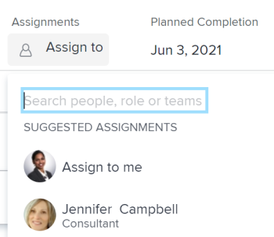

# 智能分配概述

<!--keep the yellow around the Rate card job roles and the Preview intro for those-->

此页面上高亮显示的信息是指尚未普遍可用的功能。 它只能在“预览”环境中用于所有客户，或者在“生产”环境中用于启用快速版本的客户。

有关快速版本的信息，请参阅 [为您的组织启用或禁用快速发布](/help/quicksilver/administration-and-setup/set-up-workfront/configure-system-defaults/enable-fast-release-process.md).

有关当前版本的信息，请参阅 [2024年第三季度发行版概述](/help/quicksilver/product-announcements/product-releases/24-q3-release-activity/24-q3-release-overview.md).

在管理任务和问题分配时，您可以使用智能分配来确定谁是完成工作的最佳资源。 智能分配是在您根据确定最适合作业的资源的算法将工作项分配给资源时，Adobe Workfront向您提供的建议。 智能分配可以是用户、工作角色或团队。

>[!NOTE]
>
>建议用户时，智能分配不会考虑用户的可用性。 但是，当任务和问题被分配时，其根据其计划可用性会影响它们的计划和预计日期。 有关时间安排的信息，请参阅文章 [创建计划](../../../administration-and-setup/set-up-workfront/configure-timesheets-schedules/create-schedules.md).

本文包含有关智能分配的一般信息。 有关使用智能分配向用户分配任务和问题的信息，请参阅 [进行智能分配](../../../manage-work/tasks/assign-tasks/make-smart-assignments.md).

## 智能分配概述

使用智能分配时，请考虑以下事项：

* 算法可独立处理任务和问题。 这意味着，问题的建议用户列表可能与任务的建议用户列表不同，因为Workfront会根据与问题和任务分别相关的标准构建列表。
* 智能分配不推荐工作角色或团队。 相反，它们是最适合完成任务或问题的用户的建议。
* 建议的工作分配始终为活动用户。
* 首先列出的用户应该是该任务的最佳匹配用户。

## 查找智能分配建议

您可以在以下区域查看智能分配，您可以在其中分配任务或问题：

* “工作总揽”列中的问题列表或报告

  

* “工作总揽”列中的任务列表或报告 

  

* “工作总揽”字段中的任务标题

  

* 任务字段中的问题标题

  

* 任务或问题任务区域中的摘要面板

  

* 将任务添加到项目时，新任务框中的工作分配字段

  

* 打开任务或问题时，在“主页”区域中列出的项目的“工作”字段

  

* 分配任务或问题时位于已分配此区域的工作负载均衡器

  

## 智能分配条件

智能分配在任务中的工作方式与问题中的工作方式不同。

### 任务的智能分配条件

任务智能分配计算分两个阶段进行，使用两个不同的算法。

根据查找智能分配的算法，分配在“分配”字段的两个单独部分下列出。 有关信息，请参阅 [进行智能分配](/help/quicksilver/manage-work/tasks/assign-tasks/make-smart-assignments.md).

#### 任务智能分配计算的第一阶段

在计算智能分配的第一阶段，Workfront会计算每个分配的相似性得分。

>[!NOTE]
>
>智能分配计算的第一个阶段不适用于以下任务区域：
>
>* 工作负载均衡器中的批量分配。
>* 主板上的连接卡。

相似度得分的计算以及分配的列出顺序考虑以下因素：

* 如果现有分配的任务、项目和项目组合名称与尝试分配的任务相同，则为其指定100%的分数。 现有分配的任务的项目名称和项目组合名称还必须与您尝试分配的任务的项目名称和项目组合匹配。

* 如果只有其他分配中的某些信息与现有任务匹配，则得分可能低于100%。

  例如，如果您在名为“我的项目组合”的项目组合中分配名为“我的项目”的名为“我的第二个任务”的任务，并在名为“我的项目组合”的项目组合中另一个名为“我的项目”的名为“我的任务”的现有任务，则分配给“我的任务”的用户可能获得95%的分数，因为现有任务的名称与您当前尝试分配的任务名称相似，但并不相同。

  >[!TIP]
  >
  >  Workfront仅在任务、项目和项目组合的“名称”字段中查找匹配项，而不会在任何其他字段中查找。

* 如果将分配任务分配给系统中许多名称相似的任务，则它们可能会获得较高的得分。 例如，如果名为“开发”的团队被分配到名称中包含“AI”的系统中的50%任务，而您现在正在分配名称中包含“AI”的另一个任务，则“开发”团队的得分较高。 在这种情况下，项目和项目组合的名称没有那么重要。

* 考虑到此评分系统，前7个建议按其分数的降序顺序列为智能分配。 分数低于40%的工作不显示。

* 如果多个分配具有相同的得分，则会按照分配日期的顺序显示，从最近的日期开始。

  例如，如果Rick今天早些时候被分派到一个类似的任务，而Jennifer两天前被分派到一个类似的任务，则Rick首先显示。

* 此阶段中确定的分配将列在    **建议的分配**  任务的“工作总揽”字段的部分。

* 如果没有匹配项使用此计算，则智能分配的第二阶段将开始（使用不同的算法计算）。

#### 任务智能分配计算的第二阶段

如果任务智能分配的第一步未找到匹配项，则Workfront会按照与计算问题智能分配相同的方式计算任务的智能分配。

有关更多信息，请参阅部分 [任务和问题的智能分配标准](#smart-assignments-criteria-for-tasks-and-issues) 本文章中。

此阶段中确定的分配将列在 **用户和团队**， **工作角色分配**、和 **对信息卡角色进行评级**  区段。 有关费率卡的详细信息，请参阅 [管理费率卡](/help/quicksilver/administration-and-setup/set-up-workfront/configure-system-defaults/manage-rate-cards.md). <!--keep the rate cards roles in yellow after the release of assignments to Prod-->

### 任务和问题的智能分配标准

>[!NOTE]
>
>仅当任务智能分配计算的第一阶段未找到任何匹配项时，以下标准才适用于任务。 有关信息，请参阅部分 [任务智能分配计算的第一阶段](#first-phase-of-smart-assignment-calculation-for-tasks) 本文章中。 默认情况下，以下标准始终适用于问题。 

根据以下条件的组合，在智能分配下拉列表中推荐用户（按照从高到低的顺序列出）：

1. 过去30天内由进行分配的用户分配给其他工作项的用户。 将显示符合此条件的前50个用户。 最常分配的用户首先显示。

2. 如果将工作项分配给团队或角色，则会进一步过滤建议用户列表，以考虑以下现有分配。 在这种情况下，建议列表中只显示以下用户：

   * 其主团队是分配给工作项的团队的用户。
   * 主要角色是分配给工作项的角色的用户。

>[!TIP]
>
>* 如果任务或问题未分配角色或团队，则Workfront显示过去30天分配的所有用户，最多为50个用户。
>
>* 如果您在过去30天内未进行任何分配，则智能分配列表中仅显示属于已分配团队或已分配至工作项的角色的用户。

<!--the commented out piece in the tip above was live before but I am not totally sure that smart assignments look at your team. I think they look JUST at the team/ role assigned to the work item; see this help site request for more info: https://experience.adobe.com/#/@adobeinternalworkfront/so:hub-Hub/workfront/issue/62fd222200037eb87572c5b6ad6bf53e/overview -->
<!--

<h3>Smart assignments criteria for the Production environment</h3>

(NOTE: drafted,this was the case BEFORE we updated the logic in the WB - with the 21.4 release)

Smart assignments display on tasks and issues when the following conditions are met:

<ul>
<li>The task or issue is subordinate to a parent task or issue that has a user, team, or job role currently assigned. </li>
</ul>

Smart assignments display the top twenty recommendations based on a proprietary algorithm that uses your own team information.

Users are recommended in the smart assignments drop-down list based on a combination of the following criteria (listed in order from most important to least important):

<ul>
<li>The user has the team assigned to the task or issue designated as their Home Team</li>
<li>The user is also assigned to the parent task</li>
<li>The user has the same primary job role as is currently assigned to the task or issue</li>
<li>The user has the team assigned to the parent task or issue designated as their Home Team</li>
<li>The user is associated with the same primary job role currently assigned to the parent task</li>
<li>The user is a member of the same team as the user who assigned the task or issue and the team is designated as their Home Team</li>
<li>The user is a member of the same Home Group as the user who is assigning the task or issue</li>
<li>The user has the same primary job role as the user who is assigning the task or issue.</li>
</ul>

-->

<!--

<h2>Make smart assignments</h2>

(NOTE:&nbsp;this was moved to its own article: make-smart-assignments.) 

Smart assignments are available in most locations where you can make assignments in Workfront.

You can use smart assignments on tasks and issues that have previously been assigned to a job role or a team.
 <note type="note">
You must have a Plan or a Work license and have at least Contribute permissions to a task or an issue to be able to make assignments to the task or the issue. You must have the Make Assignments option enabled in your permission level to make assignments.
</note>

To use smart assignments:

<ol>
<li value="1">Navigate to an issue or a task and click one of the following fields to edit them:  
<ul>
<li>
The <strong>Assignments</strong> field in the task or issue header
</li>
<li>The <strong>Assignments</strong> field of a task or issue list using in-line editing in a task or issue list. </li>
<li>The <strong>Assignee</strong> field after you have clicked <strong>Advanced</strong> from a task or an issue. </li>
</ul></li>
<li value="2"> 
Place your cursor in the assignment field, and wait for two seconds, then the <strong>Suggestions</strong> list is displayed.
 
Users displayed in this list are the smart assignment suggestions for the task or the issue. 
 
  
 </li>
<li value="3"> 
Select the user in the recommendations list by clicking their name. 
 
If there are no suggestions, the suggestion list does not open.
 </li>
<li value="4">(Optional) If you do not want to use one of the recommended users from the smart assignments list, start typing the name of the desired user and select the name when it appears in the list.</li>
<li value="5">Click <strong>Enter</strong> to make the assignment. </li>
</ol>

-->
