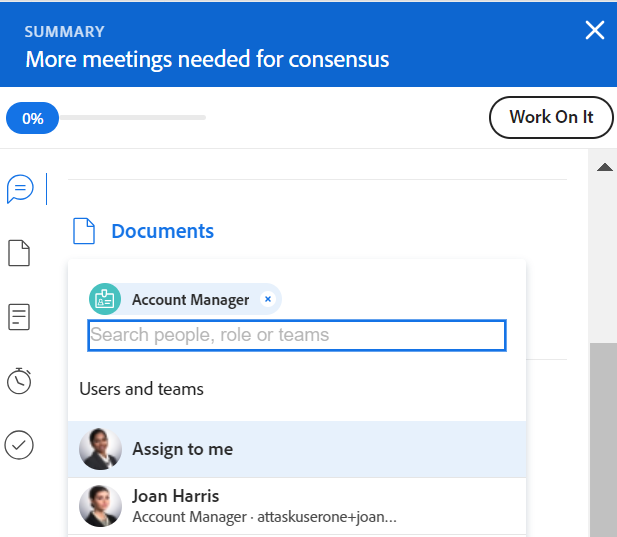

# 智能分配概述

<!--Audited: 07/2024-->

<!--keep the yellow around the Rate card job roles and the Preview intro for those-->

此页面上高亮显示的信息引用了仅在“预览”环境中可用的功能。

<!--For information about fast releases, see [Enable or disable fast releases for your organization](/help/quicksilver/administration-and-setup/set-up-workfront/configure-system-defaults/enable-fast-release-process.md).

 This functionality will be removed from the Production environment for customers who enabled fast release with the 25.1 release in January 2025. For information about the 25.1 release, see [First Quarter 2025 release overview](/help/quicksilver/product-announcements/product-releases/25-q1-release-activity/25-q1-release-overview.md). -->

在管理任务和问题分配时，您可以使用智能分配来确定谁是完成工作的最佳资源。

智能分配是在您根据确定最适合作业的资源的算法将工作项分配给资源时，Adobe Workfront向您提供的建议。 智能分配可以是用户、工作角色或团队。

>[!NOTE]
>
>建议用户时，智能分配不会考虑用户的可用性。 但是，当任务和问题被分配时，其根据其计划可用性会影响它们的计划和预计日期。 有关计划的信息，请参阅文章[创建计划](../../../administration-and-setup/set-up-workfront/configure-timesheets-schedules/create-schedules.md)。

本文包含有关智能分配的一般信息。 有关使用智能分配向用户分配任务和问题的信息，请参阅[进行智能分配](../../../manage-work/tasks/assign-tasks/make-smart-assignments.md)。

## 智能分配概述

使用智能分配时，请考虑以下事项：

<!--* The algorithm works independently for tasks and issues. This means that the list of suggested users for issues might differ from the list of suggested users for a task because Workfront builds the lists according to criteria pertaining to issues and tasks separately. -->
<!--not sure this is accurate: * Smart assignments do not recommend job roles or teams. Instead, they are suggestions of users who are best fit to complete a task or an issue. -->
* 建议分配始终为活动用户、工作角色或团队。
* 首先列出的资源应该是该任务的最佳匹配项。

## 查找智能分配建议

您可以在以下区域查看智能分配，您可以在其中分配任务或问题：

* “工作总揽”列中的问题列表或报告

  

* “工作总揽”列中的任务列表或报告

  

* “工作总揽”字段中的任务标题

  

* 任务字段中的问题标题

  

* 任务或问题任务区域中的摘要面板

  

<!--* The Assignments field in the New Task box, when adding a task to a project

  -->

<!--this is not possible in the new home  - we have Summary there: 
* The Assignments field for an item listed in the Home area, when you open a task or issue

  
-->

* 分配任务或问题时位于已分配此区域的工作负载均衡器

  

## 智能分配条件

<!--Smart assignments work differently for tasks than for issues.  -->

<!--### Smart assignments criteria for tasks

The task smart assignments calculation works in two phases which use two different algorithms.

Depending on which algorithm finds the smart assignment, the assignments are listed under two separate sections in the Assignments field. For information, see [Make smart assignments](/help/quicksilver/manage-work/tasks/assign-tasks/make-smart-assignments.md). 

#### First phase of smart assignment calculation for tasks 

In the first phase of calculating smart assignments, Workfront calculates a similarity score for every assignment. 

>[!NOTE]
>
>The first phase of the smart assignments calculation does not apply to the following task areas:
>
>* Bulk Assignments in the Workload Balancer.
>* Connected cards on boards.

The calculation for the similarity score and the order in which the assignments are listed take into account the following:  

* A score of 100% is given to an existing assignment where the task, project, and portfolio names are identical to the task you're trying to assign. The project and portfolio names of the task of an existing assignment must also match the project and portfolio of the task you are trying to assign.   

* If only some of this information from other assignments matches on the existing tasks, the score might be lower than 100%.  

  For example, if you are assigning a task called "My second task" on a project called "My project" in a portfolio called "My portfolio" and you have an existing task called "My task" in another project called "My project" in a portfolio called "My portfolio", the user assigned to "My task" might get a score of 95% because the name of the existing task and the task you're trying to assign now are similar, but not identical.  
 
    >[!TIP]
    >
    >  Workfront looks for matches only in the Name fields of tasks, projects, and portfolios and not in any other fields. 

* An assignment could get a higher score when they are assigned to a lot of tasks in the system that have similar names. For example, if a team called "Development" is assigned to 50% of the tasks in the system containing "AI" in the name and you are now assigning another task with "AI" in the name, the score of the "Development" team is higher. In this case, the names of  projects and portfolios are not as important.  

* Taking into account this scoring system, the first 7 suggestions are listed as smart assignments, in the descending order of their scores. Assignments with scores lower than 40% do not display.  

* If several assignments have identical scores, they display in order of the date on which the assignments were made, starting from the most recent date.  

  For example, if Rick was assigned to a similar task earlier today and Jennifer was assigned to a similar task two days ago, Rick displays first.  

* Assignments identified in this phase are listed in the    **Suggested assignments**  section of the Assignments field for tasks. 

* If there are no matches using this calculation, the second phase of smart assignments starts which is calculated using a different algorithm.  

#### Second phase of smart assignment calculation for tasks-->

<!--If the first step of task smart assignments has found no matches,-->

Workfront计算任务的智能分配的方式与计算问题的方式相同。

<!--For more information, see the section [Smart assignments criteria for tasks and issues](#smart-assignments-criteria-for-tasks-and-issues) in this article. -->

已识别的工作分配列在分配字段的&#x200B;**用户和团队**、**工作角色分配**&#x200B;和&#x200B;**评级卡角色**&#x200B;部分中。 有关费率卡的详细信息，请参阅[管理费率卡](/help/quicksilver/administration-and-setup/set-up-workfront/configure-system-defaults/manage-rate-cards.md)。<!--keep the rate cards roles in yellow after the release of assignments to Prod-->

<!--
### Smart assignments criteria for tasks and issues 

>[!NOTE]
>
>The following criteria applies for tasks only when the first phase of the task smart assignment calculation did not find any matches. For information, see the section [First phase of smart assignment calculation for tasks](#first-phase-of-smart-assignment-calculation-for-tasks) in this article. The following criteria always applies for issues, by default. -->

根据以下条件的组合，在智能分配下拉列表中推荐用户（按照从高到低的顺序列出）：

1. 过去30天内由进行分配的用户分配给其他工作项的用户。 将显示符合此条件的前50个用户。 最常分配的用户首先显示。

2. 如果将工作项分配给团队或角色，则会进一步过滤建议用户列表，以考虑以下现有分配。 在这种情况下，建议列表中只显示以下用户：

   * 其主团队是分配给工作项的团队的用户。
   * 主要角色是分配给工作项的角色的用户。

>[!TIP]
>
>* 如果任务或问题未分配角色或团队，则Workfront显示过去30天分配的所有用户，最多为50个用户。
>
>* 如果您在过去30天内未进行任何分配，则智能分配列表中仅显示属于已分配团队或已分配至工作项的角色的用户。

<!--the commented out piece in the tip above was live before but I am not totally sure that smart assignments look at your team. I think they look JUST at the team/ role assigned to the work item; see this help site request for more info: https://experience.adobe.com/#/@adobeinternalworkfront/so:hub-Hub/workfront/issue/62fd222200037eb87572c5b6ad6bf53e/overview -->
<!--

<h3>Smart assignments criteria for the Production environment</h3>

(NOTE: drafted,this was the case BEFORE we updated the logic in the WB - with the 21.4 release)

Smart assignments display on tasks and issues when the following conditions are met:

<ul>
<li>The task or issue is subordinate to a parent task or issue that has a user, team, or job role currently assigned. </li>
</ul>

Smart assignments display the top twenty recommendations based on a proprietary algorithm that uses your own team information.

Users are recommended in the smart assignments drop-down list based on a combination of the following criteria (listed in order from most important to least important):

<ul>
<li>The user has the team assigned to the task or issue designated as their Home Team</li>
<li>The user is also assigned to the parent task</li>
<li>The user has the same primary job role as is currently assigned to the task or issue</li>
<li>The user has the team assigned to the parent task or issue designated as their Home Team</li>
<li>The user is associated with the same primary job role currently assigned to the parent task</li>
<li>The user is a member of the same team as the user who assigned the task or issue and the team is designated as their Home Team</li>
<li>The user is a member of the same Home Group as the user who is assigning the task or issue</li>
<li>The user has the same primary job role as the user who is assigning the task or issue.</li>
</ul>

-->

<!--

<h2>Make smart assignments</h2>

(NOTE:&nbsp;this was moved to its own article: make-smart-assignments.) 

Smart assignments are available in most locations where you can make assignments in Workfront.

You can use smart assignments on tasks and issues that have previously been assigned to a job role or a team.
 <note type="note">
You must have a Plan or a Work license and have at least Contribute permissions to a task or an issue to be able to make assignments to the task or the issue. You must have the Make Assignments option enabled in your permission level to make assignments.
</note>

To use smart assignments:

<ol>
<li value="1">Navigate to an issue or a task and click one of the following fields to edit them:  
<ul>
<li>
The <strong>Assignments</strong> field in the task or issue header
</li>
<li>The <strong>Assignments</strong> field of a task or issue list using in-line editing in a task or issue list. </li>
<li>The <strong>Assignee</strong> field after you have clicked <strong>Advanced</strong> from a task or an issue. </li>
</ul></li>
<li value="2"> 
Place your cursor in the assignment field, and wait for two seconds, then the <strong>Suggestions</strong> list is displayed.
 
Users displayed in this list are the smart assignment suggestions for the task or the issue. 
 
  
 </li>
<li value="3"> 
Select the user in the recommendations list by clicking their name. 
 
If there are no suggestions, the suggestion list does not open.
 </li>
<li value="4">(Optional) If you do not want to use one of the recommended users from the smart assignments list, start typing the name of the desired user and select the name when it appears in the list.</li>
<li value="5">Click <strong>Enter</strong> to make the assignment. </li>
</ol>

-->
