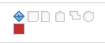

# 将里程碑与任务关联

<!--Audited: 01/2024-->

您可以将里程碑与任务关联，以指示在项目生命周期中何时达到重要步骤。

## 访问要求

+++ 展开以查看本文中各项功能的访问要求。

<table style="table-layout:auto"> 
 <col> 
 <col> 
 <tbody> 
  <tr> 
   <td role="rowheader">Adobe Workfront包</td> 
   <td> 
任何
 </td> 
  </tr> 
  <tr> 
   <td role="rowheader">Adobe Workfront许可证</td> 
   <td> 
标准
 
   
工作或更高
 
   </td> 
  </tr> 
  <tr> 
   <td role="rowheader">访问级别配置</td> 
   <td> 
编辑任务访问权限
</td> 
  </tr> 
  <tr> 
   <td role="rowheader">对象权限</td> 
   <td> 
管理任务的权限
</td> 
  </tr> 
 </tbody> 
</table>

有关详细信息，请参阅Workfront文档中的[访问要求](/help/quicksilver/administration-and-setup/add-users/access-levels-and-object-permissions/access-level-requirements-in-documentation.md)。

+++

<!--Old:

<table style="table-layout:auto"> 
 <col> 
 <col> 
 <tbody> 
  <tr> 
   <td role="rowheader">Adobe Workfront plan*</td> 
   <td> 
Any
 </td> 
  </tr> 
  <tr> 
   <td role="rowheader">Adobe Workfront license*</td> 
   <td> 
New license: Standard
 
   
Current license: Work or higher
 
   </td> 
  </tr> 
  <tr> 
   <td role="rowheader">Access level configurations*</td> 
   <td> 
Edit access to Tasks
 
<b>NOTE</b>
   
   If you don't have access, ask your Workfront administrator if they set additional restrictions in your access level. For information on how a Workfront administrator can modify your access level, see <a href="../../../administration-and-setup/add-users/configure-and-grant-access/create-modify-access-levels.md" class="MCXref xref">Create or modify custom access levels</a>.
 </td> 
  </tr> 
  <tr> 
   <td role="rowheader">Object permissions</td> 
   <td> 
Manage permissions to the task
 
For information on requesting additional access, see <a href="../../../workfront-basics/grant-and-request-access-to-objects/request-access.md" class="MCXref xref">Request access to objects </a>.
 </td> 
  </tr> 
 </tbody> 
</table>-->

## 先决条件

在将里程碑与任务关联之前，必须存在以下各项：

* Workfront管理员必须创建里程碑路径，如[创建里程碑路径](../../../administration-and-setup/customize-workfront/configure-approval-milestone-processes/create-milestone-path.md)中所述。

* 您必须将里程碑路径关联到项目。

  有关信息，请参阅[编辑项目](/help/quicksilver/manage-work/projects/manage-projects/edit-projects.md)。

* 要将里程碑路径与项目关联，项目必须处于“计划”或“当前”状态。

  >[!TIP]
  >
  >要使用里程碑视图最好地了解项目中里程碑的进度，您应该创建父任务并将它们与项目的每个主要阶段关联。 然后，将这些父任务与里程碑路径的每个里程碑相关联。

## 将里程碑与任务关联

将里程碑路径与项目关联后，可以为任务分配里程碑。

1. 转到任务，然后单击任务名称右侧的&#x200B;**更多**&#x200B;图标，然后单击&#x200B;**编辑**。

   任务和里程碑具有1:1关系。 您不能将同一里程碑附加到多个任务。 每个任务都可以链接到单个里程碑，或者每个里程碑都可以映射到一项任务。

1. 单击&#x200B;**设置**，然后在&#x200B;**里程碑**&#x200B;字段中选择任务的里程碑。
1. 单击&#x200B;**保存**。
1. （可选）在任务列表中添加&#x200B;**状态图标**&#x200B;列，以标识哪些任务具有里程碑。 里程碑菱形指示符显示在状态图标列中。

   有关信息，请参阅[在Adobe Workfront中创建或编辑视图](/help/quicksilver/reports-and-dashboards/reports/reporting-elements/create-edit-views.md)。

   

1. （可选）转到项目列表，选择&#x200B;**里程碑**&#x200B;视图以确定里程碑任务的进度。

   
