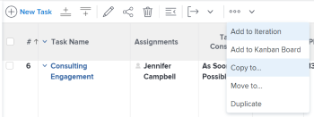

# 复制和复制任务

您可以将任务从项目复制到另一个项目，也可以复制同一项目中的任务。

您可以一次复制或复制一个或多个任务或父任务。

## 访问要求

<!-- drafted for P&P:

<table style="table-layout:auto"> 
 <col> 
 <col> 
 <tbody> 
  <tr> 
   <td role="rowheader">Adobe Workfront plan*</td> 
   <td> 
Any 
 </td> 
  </tr> 
  <tr> 
   <td role="rowheader">Adobe Workfront license*</td> 
   <td> 
Current license: Standard
 
   Or
   
Legacy license: Work or higher 
 </td> 
  </tr> 
  <tr> 
   <td role="rowheader">Access level configurations*</td> 
   <td> 
Edit access to Tasks and Projects
 
<b>NOTE</b>
   
   If you still don't have access, ask your Workfront administrator if they set additional restrictions in your access level. For information on how a Workfront administrator can modify your access level, see <a href="../../../administration-and-setup/add-users/configure-and-grant-access/create-modify-access-levels.md" class="MCXref xref">Create or modify custom access levels</a>.
 </td> 
  </tr> 
  <tr> 
   <td role="rowheader">Object permissions</td> 
   <td> 
Manage permissions to a task
 
Contribute or higher permissions to the project
 
   
For information on requesting additional access, see <a href="../../../workfront-basics/grant-and-request-access-to-objects/request-access.md" class="MCXref xref">Request access to objects </a>.
 </td> 
  </tr> 
 </tbody> 
</table>
-->

您必须具有以下权限才能执行本文中的步骤：

<table style="table-layout:auto"> 
 <col> 
 <col> 
 <tbody> 
  <tr> 
   <td role="rowheader">Adobe Workfront计划*</td> 
   <td> 
任何
 </td> 
  </tr> 
  <tr> 
   <td role="rowheader">Adobe Workfront许可证*</td> 
   <td> 
工作或更高 
 </td> 
  </tr> 
  <tr> 
   <td role="rowheader">访问级别配置*</td> 
   <td> 
编辑对任务和项目的访问权限
 
<b>注释</b>

如果您仍然没有访问权限，请咨询Workfront管理员是否对您的访问级别设置了其他限制。 有关Workfront管理员如何修改您的访问级别的信息，请参阅<a href="../../../administration-and-setup/add-users/configure-and-grant-access/create-modify-access-levels.md" class="MCXref xref">创建或修改自定义访问级别</a>。
 </td>
</tr> 
  <tr> 
   <td role="rowheader">对象权限</td> 
   <td> 
管理任务的权限 
 
Contribute或项目的更高权限
 
有关请求其他访问权限的信息，请参阅<a href="../../../workfront-basics/grant-and-request-access-to-objects/request-access.md" class="MCXref xref">请求访问对象</a>。
 </td> 
  </tr> 
 </tbody> 
</table>

&#42;要了解您拥有什么计划、许可证类型或访问权限，请与Workfront管理员联系。

## 复制任务的注意事项

复制任务时，请考虑以下事项：

* 将任务从一个项目复制到另一个项目时，可能会重新计算任务日期。 重新计算将考虑新项目使用的时间表和项目的时间表来源信息。
* 自定义表单将随任务一起复制。 仅当您在复制任务时选择复制自定义数据时，自定义字段中的信息才会传输到复制的任务。
* 在复制过程中，您可以选择将某些与任务关联的项复制到复制的任务。 但是，默认情况下，以下对象不会传输到复制的任务：
   * 问题
   * 记录的小时数
   * 用户评论<!--not sure about this, enable only if requested by users and verified by Product: System activity comments transfer to the new task if they relate to information that you specifically select to be copied. For example, if you select to copy Expenses to the new task, system comments that identify adding expenses to the task will transfer to the copied task. -->
* 默认情况下，以下项目将移至复制的任务：

   * 里程碑将转移到复制的任务并从原始任务中删除。
   * 子任务转移到新任务。

* 您可以一次复制一个任务，也可以在编辑列表中的任务时一次复制多个任务。

## 复制列表中的任务 {#copy-tasks-in-a-list}

1. 转到包含要复制的一个或多个任务的项目。

   或

   转到任务报告。

1. （视情况而定）如果您打开了包含任务的项目，请单击左侧面板中的&#x200B;**任务**。
1. 单击&#x200B;**计划模式**&#x200B;图标，并确保已启用&#x200B;**自动保存**&#x200B;选项。

   

   >[!IMPORTANT]
   >
   >仅当自动保存更改时，才能复制列表中的任务。 有关编辑任务时保存选项的信息，请参阅[在列表中编辑任务](../../../manage-work/tasks/manage-tasks/edit-tasks-in-a-list.md)。

1. 选择要复制的一个或多个任务，然后执行以下操作之一：

   * 单击任务列表顶部的&#x200B;**更多菜单**，然后单击&#x200B;**复制到**。
   * 右键单击选定的任务，然后单击&#x200B;**复制到**。
   * 选择一项任务时，单击列表中任务名称旁边的&#x200B;**更多**&#x200B;菜单，然后单击&#x200B;**复制到**。

   

1. 继续复制任务，如从步骤4开始的[复制任务级别](#copy-a-task-at-the-task-level)的任务一节中所述。

   <!--
      (NOTE: is this still accurate?!)
   -->

## 在任务级别复制任务 {#copy-a-task-at-the-task-level}

除了复制任务列表中的任务外，您还可以在打开任务后复制任务。

1. 通过搜索在Workfront系统中查找任务。
1. 单击任务的名称以将其打开。
1. 单击任务名称旁边的&#x200B;**更多**&#x200B;下拉菜单，然后单击&#x200B;**复制到**。

   

   此时将显示“复制任务”框。

1. （可选）更新&#x200B;**任务名称**。

   >[!TIP]
   >
   >选择复制列表中的多个任务时，此字段将灰显且不可编辑。 您可以将鼠标悬停在“任务名称”字段上，此时将显示所有选定任务的列表。
   >
   >

1. 在&#x200B;**选择目标项目**&#x200B;字段中键入要复制任务的&#x200B;**目标项目**&#x200B;的名称。

   >[!TIP]
   >
   >* 项目名称区分大小写。
   >* 您还可以开始键入参考号或输入项目的ID。 这可以帮助您区分具有相同名称的项目。
   >* 列表中仅显示100个项目。

   默认显示当前项目名称。 如果要复制同一项目中的任务，请保留此字段不变。

1. （视情况而定）如果您没有所选项目的访问权限，请单击&#x200B;**请求访问权限**&#x200B;以请求对该项目的访问权限。
1. （视情况而定）如果您有权将任务添加到目标项目上的任务之一，请继续将任务复制到选定的目标项目，而不请求访问权限。

   

   >[!TIP]
   >
   >如果所选项目处于未决批准、已完成或终止状态，且Workfront管理员阻止将任务添加到这些项目，则会显示类似消息。 有关详细信息，请参阅[配置系统范围的项目首选项](../../../administration-and-setup/set-up-workfront/configure-system-defaults/set-project-preferences.md)。

1. 单击左侧面板中的&#x200B;**选项**，然后取消选择您不想要与任务一起复制的任务属性。 默认情况下，将选择所有选项。

   >[!TIP]
   >
   >选择，然后取消选择&#x200B;**全选**&#x200B;将取消选择所有选项。

   取消选择下列选项，不将它们转移到复制的任务。 下表描述了取消选择这些选项时会发生的情况：

   <table style="table-layout:auto"> 
    <col> 
    <col> 
    <tbody> 
     <tr> 
      <td role="rowheader">约束</td> 
      <td> 
任务限制被设置为“尽可能早”或“尽可能晚”，基于项目计划模式设置。
 
 选中后，任务的当前限制将转移到复制的任务。 
 
注：在将具有日期特定约束的任务移动或复制到另一个项目时，如果任务的约束日期在新项目的日期之外，则任务约束会更改为尽可能早或尽可能晚或者调整项目的计划起始日期或计划完成日期。 日期特定约束的一些示例必须开始于、必须结束于、开始时间不早于、开始时间不晚于等。 有关任务限制以及任务限制或项目日期如何受到影响的信息，请参阅<a href="../../../manage-work/tasks/task-constraints/task-constraint-overview.md" class="MCXref xref">任务限制概述</a>并查找特定限制。
 </td> 
     </tr> 
     <tr> 
      <td role="rowheader">分配</td> 
      <td> 
将从任务中删除所有分配。 
 </td> 
     </tr> 
     <tr> 
      <td role="rowheader">审批流程</td> 
      <td>所有审批流程都将从任务中删除。</td> 
     </tr> 
     <tr> 
      <td role="rowheader">进度</td> 
      <td>任务状态为“新建”。 否则，复制的任务将保留现有任务的状态。</td> 
     </tr> 
     <tr> 
      <td role="rowheader">财务信息</td> 
      <td>删除任务的财务信息。</td> 
     </tr> 
     <tr> 
      <td role="rowheader">所有前置任务</td> 
      <td> 
这意味着依赖关系将不会延续到复制的任务。 
 
选中后，将保留复制任务组中的前置任务，并删除其他前置任务。
 </td> 
     </tr> 
     <tr> 
      <td role="rowheader">文档</td> 
      <td> 
附加到任务的文档不会转移到复制的任务。 这包括版本、验证和链接文档。
 
这不包括文档审批。 在复制任务时，绝不能复制文档审批。
 </td> 
     </tr> 
     <tr> 
      <td role="rowheader">提醒通知</td> 
      <td>任务提醒不会转移到复制的任务。 </td> 
     </tr> 
     <tr> 
      <td role="rowheader">费用</td> 
      <td>登录任务的费用不会转移到复制的任务。 </td> 
     </tr> 
     <tr> 
      <td role="rowheader">权限</td> 
      <td>Workfront会删除任务的“共享”列表中显示的所有实体的名称。 </td> 
     </tr> 
     <tr> 
      <td role="rowheader">自定义数据</td> 
      <td> 
清除自定义字段的值，并将自定义表单传输到复制的任务。 
 
选中后，自定义字段的表单和值都会转移到复制的任务。 
 </td> 
     </tr> 
    </tbody> 
   </table>

1. （可选）单击左侧面板中的&#x200B;**选择父项**，然后在目标项目中选择要成为所复制任务的父项的任务。

   >[!TIP]
   >
   >当选择在一个列表中复制多个任务时，所有选定任务都会成为选定父级的子级。

   通过执行以下操作之一选择父级：

   * 在任务列表中，选择项目计划中的父项之一。
   * 单击搜索图标并按名称搜索父任务。

   任务将显示在列表中。

   

1. 找到父项后，选择该父项的单选按钮。

   如果不选择父任务，则任务将作为主任务而不是子任务复制，并放置在目标项目的任务列表的末尾。

1. 单击&#x200B;**复制任务**

   或

   在列表中选择多个任务时，单击&#x200B;**复制任务**。
复制的任务现在位于指定的项目中，并且是选定父任务的子任务，或者是项目中的最后一个任务。

## 复制任务

如果您在同一项目上需要相同的任务，则可以快速复制任务列表中的任务。

* [复制任务的注意事项](#considerations-for-duplicating-tasks)
* [复制任务](#duplicate-tasks)

### 复制任务的注意事项 {#considerations-for-duplicating-tasks}

* 仅当任务列表按任务编号排序时，才能复制任务列表中的任务。
* 新任务将与原始任务具有相同的名称。
* 您无法选择将哪些信息复制到新任务。 默认情况下，原始任务中的几乎所有信息都将转移到复制任务，包括父关系。
* 以下项目未转移到新任务：

   * 记录的小时数
   * 注释
   * 问题
   * 只有位于同一组复制任务中的前置任务才会与其后续任务一起复制。

     **示例**

     例如，如果同时复制任务2及其前置任务任务1，则您有任务2的副本和任务1的副本。 任务1的副本将是任务2的副本的前身。 但是，如果您只复制任务2而没有复制其前置任务，则其副本将没有前置任务。

* 复制父任务时，即使未选择子任务，也会复制所有子任务。
* 您可以同时复制一个或多个任务。

  但是，不能同时复制多个非连续的任务。

* 里程碑将移动到新任务并从原始任务中删除。

### 复制任务

1. 转到包含要复制的一个或多个任务的项目。
1. 单击左侧面板中的&#x200B;**任务**。
1. 执行下列操作之一：

   * （视情况而定）单击&#x200B;**计划模式**&#x200B;图标并确保启用了&#x200B;**自动保存**&#x200B;选项，选择要复制的任务，然后单击&#x200B;**更多菜单**  > **复制**。

     

   * （视情况而定）单击&#x200B;**计划模式**&#x200B;图标 > **手动保存** > **标准**&#x200B;或&#x200B;**时间线计划**，然后执行以下操作：

      1. 选择要复制的一个或多个任务，然后单击&#x200B;**复制**。
      1. （可选）单击&#x200B;**撤消**&#x200B;以撤消您的更改并且不复制任务。
      1. （可选且有条件）如果您之前已单击&#x200B;**撤消**，请单击&#x200B;**重做**&#x200B;以保留更改并复制任务。

      1. 单击&#x200B;**保存**&#x200B;以保存更改。

         这些任务将复制并添加到与原始任务相同的项目中。
