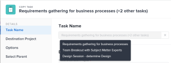

# 复制和复制任务

您可以将任务从项目复制到另一个项目，也可以在同一项目中复制任务。

您可以一次复制或复制一个或多个任务或父任务。

## 访问要求

您必须具有以下访问权限才能执行本文中的步骤：

<table style="table-layout:auto"> 
 <col> 
 <col> 
 <tbody> 
  <tr> 
   <td role="rowheader">Adobe Workfront计划*</td> 
   <td> 
任意
 </td> 
  </tr> 
  <tr> 
   <td role="rowheader">Adobe Workfront许可证*</td> 
   <td> 
工作或更高 
 </td> 
  </tr> 
  <tr> 
   <td role="rowheader">访问级别配置*</td> 
   <td> 
编辑对任务和项目的访问权限
 
注意：如果您仍然没有访问权限，请咨询Workfront管理员，他们是否在您的访问级别设置了其他限制。 有关Workfront管理员如何修改访问级别的信息，请参阅 <a href="../../../administration-and-setup/add-users/configure-and-grant-access/create-modify-access-levels.md" class="MCXref xref">创建或修改自定义访问级别</a>.
 </td> 
  </tr> 
  <tr> 
   <td role="rowheader">对象权限</td> 
   <td> 
管理任务的权限 
 
对项目拥有或更高权限
 
有关请求其他访问权限的信息，请参阅 <a href="../../../workfront-basics/grant-and-request-access-to-objects/request-access.md" class="MCXref xref">请求对对象的访问 </a>.
 </td> 
  </tr> 
 </tbody> 
</table>

&#42;要了解您拥有的计划、许可证类型或访问权限，请联系您的Workfront管理员。

## 复制任务的注意事项

复制任务时请考虑以下事项：

* 问题不会与任务一起复制。
* 里程碑将传输到复制的任务，并从原始任务中删除。

您可以复制Adobe Workfront Web应用程序的以下区域中的任务：

* 在任务级别，从 **“更多”图标**  任务名称的右侧。

   有关信息，请参阅 [在任务级别复制任务](#copy-a-task-at-the-task-level) 章节。

* 在任务列表中，通过执行以下操作之一：

   * 右键单击任务的名称。
   * 选择任务（或任务）并展开 **更多** 图标  任务列表顶部。
   * 选择任务并展开 **更多** 图标  任务名称旁边。

      选择多个任务时，此选项不可用。
   有关信息，请参阅 [在列表中复制任务](#copy-tasks-in-a-list) 章节。

## 在列表中复制任务 {#copy-tasks-in-a-list}

1. 转到包含要复制的任务或任务的项目。

   或

   转到任务报告。

1. 单击 **任务** 中。
1. 单击 **计划模式菜单**  ，则 **自动保存**.

   >[!IMPORTANT]
   >
   >仅当自动保存更改时，才能在列表中复制任务。 有关编辑任务时保存选项的信息，请参阅 [在列表中编辑任务](../../../manage-work/tasks/manage-tasks/edit-tasks-in-a-list.md).

1. 选择要复制的任务或任务，然后执行下列操作之一：

   * 单击 **“更多”菜单** 在任务列表顶部，单击 **复制到**.
   * 右键单击选定的任务，然后单击 **复制到**.
   * 选择一项任务时，单击 **更多** 菜单  在列表中任务名称旁边，单击 **复制到**.
   

1. 继续复制任务，如一节中所述 [在任务级别复制任务](#copy-a-task-at-the-task-level) 从步骤4开始。

   <!--
   <MadCap:conditionalText data-mc-conditions="QuicksilverOrClassic.Draft mode">
   (NOTE: is this still accurate?!)
   </MadCap:conditionalText>
   -->

## 在任务级别复制任务 {#copy-a-task-at-the-task-level}

除了在任务列表中复制任务外，您还可以在打开任务后复制任务。 

1. 通过搜索在Workfront系统中查找任务。
1. 单击任务的名称以将其打开。 
1. 单击 **更多** 下拉菜单  在任务名称旁边，单击 **复制** **to**.

   

   此时将显示复制任务框。

1. （可选）更新 **任务名称**.

   >[!TIP]
   >
   >选择在列表中复制多个任务时，此字段会变暗且不可编辑。 您可以将鼠标悬停在“任务名称”字段上，并显示所有选定任务的列表。
   >
   >

1. 键入 **目标项目** 要在 **选择目标项目** 字段。 

   >[!TIP]
   >
   >* 项目名称区分大小写。
   >* 您还可以开始键入参考编号或输入项目的ID。 这可能有助于您区分名称相同的项目。
   >* 列表中仅显示100个项目。

   默认情况下，将显示当前项目名称。 如果要在同一项目中复制任务，请保持此字段不变。

1. （视情况而定）单击 **请求访问** 如果您无权访问所选项目，请求获得对该项目的访问权限。
1. （视情况而定）如果您有权向目标项目上的任务之一添加任务，则继续将任务复制到选定的目标项目，而无需请求访问权限。

   

   >[!TIP]
   >
   >如果选定的项目处于待批准、已完成或已停止状态，则当Workfront管理员阻止向这些项目添加任务时，会显示类似的消息。 有关更多信息，请参阅 [配置系统范围的项目首选项](../../../administration-and-setup/set-up-workfront/configure-system-defaults/set-project-preferences.md).

1. 单击 **选项** 在左侧面板中，取消选择您不希望随任务一起复制的任务属性。 默认情况下，将选择所有选项。

   >[!TIP]
   选择，然后取消选择 **全选** 取消选中所有选项。

   从以下选项中取消选择，不会将它们转移到复制的任务。 下表描述了取消选择这些选项时会发生什么情况：

   <table style="table-layout:auto"> 
    <col> 
    <col> 
    <tbody> 
     <tr> 
      <td role="rowheader">约束</td> 
      <td> 
根据项目计划模式设置，任务约束将设置为“尽快”或“尽快”。
 
 选择后，任务的当前约束将转移到复制的任务。 
 
注意：在将具有特定日期限制的任务移动或复制到另一个项目，并且任务的约束日期在新项目的日期之外时，任务约束会变为“尽快”或“尽可能晚”，或调整项目的“计划起始日期”或“计划完成日期”。 某些特定于日期的限制示例必须开始、必须结束、不早于开始、不迟于开始等。 有关任务约束以及任务约束或项目日期如何受到影响的信息，请参阅 <a href="../../../manage-work/tasks/task-constraints/task-constraint-overview.md" class="MCXref xref">任务约束概述</a> 并寻找一个特定的约束。
 </td> 
     </tr> 
     <tr> 
      <td role="rowheader">分配</td> 
      <td> 
所有分配都将从任务中删除。 
 </td> 
     </tr> 
     <tr> 
      <td role="rowheader">批准流程</td> 
      <td>所有审批流程都将从任务中删除。</td> 
     </tr> 
     <tr> 
      <td role="rowheader">进度</td> 
      <td>任务状态为“新建”。 否则，复制的任务会保留现有任务的状态。</td> 
     </tr> 
     <tr> 
      <td role="rowheader">财务信息</td> 
      <td>任务的财务信息将被删除。</td> 
     </tr> 
     <tr> 
      <td role="rowheader">所有前置任务</td> 
      <td> 
这意味着依赖项不会传递到复制的任务。 
 
选中后，复制任务组中的前置任务将保留，其他任务将删除。
 </td> 
     </tr> 
     <tr> 
      <td role="rowheader">文档</td> 
      <td> 
附加到任务的文档不会转移到复制的任务。 这包括版本、校样和链接的文档。
 
这不包括文档批准。 在复制任务时，永远不会复制文档批准。
 </td> 
     </tr> 
     <tr> 
      <td role="rowheader">提醒通知</td> 
      <td>任务提醒不会转移到复制的任务。 </td> 
     </tr> 
     <tr> 
      <td role="rowheader">费用</td> 
      <td>记录在任务上的费用不会转移到复制的任务。 </td> 
     </tr> 
     <tr> 
      <td role="rowheader">权限</td> 
      <td>Workfront会删除任务“共享”列表中显示的所有实体的名称。 </td> 
     </tr> 
     <tr> 
      <td role="rowheader">自定义数据</td> 
      <td> 
将清除自定义字段的值，并将自定义表单传输到复制的任务。 
 
选中后，自定义字段的表单和值都会传输到复制的任务。 
 </td> 
     </tr> 
    </tbody> 
   </table>

1.  （可选）单击 **选择父项** 在左侧面板中，然后选择目标项目中要成为已复制任务父项的任务。

   >[!TIP]
   选择在列表中复制多个任务时，所有选定任务都将成为选定父项的子项。

   通过执行以下操作之一来选择父项：

   * 在任务列表中，选择项目计划中的父项之一。
   * 单击搜索图标  和按名称搜索父任务。
   任务应显示在列表中。

   

1. 找到父项后，为其选择单选按钮。 

   如果未选择父任务，则这些任务将作为主任务而不是子任务进行复制，并且它们将放在目标项目上任务列表的末尾。 

1. 单击 **复制任务**

   或

   单击 **复制任务** 在列表中选择多个任务时。
复制的任务现在位于指定的项目上，并且是选定父任务的子任务，或是项目上的最后一项任务。

## 复制任务

如果在同一项目上需要相同的任务，则可以在任务列表中快速复制任务。

* [复制任务的注意事项](#considerations-for-duplicating-tasks)
* [复制任务](#duplicate-tasks)

### 复制任务的注意事项 {#considerations-for-duplicating-tasks}

* 只有当列表按任务编号排序时，才能在任务列表中复制任务。

* 新任务将具有与原始任务相同的名称。
* 您不能选择要复制到新任务的信息。 默认情况下，来自原始任务的几乎所有信息都将传输到复制的任务，包括父关系。
* 以下项目不会转移到新任务：

   * 记录的小时数
   * 注释
   * 问题
   * 只有位于同一组复制任务中的前置任务，也会与其后续任务一起复制。

      **示例：** 例如，如果同时复制任务2及其前身任务1，则您将拥有任务2的副本和任务1的副本。 任务1的副本将是任务2副本的前身。 但是，如果您只复制任务2而不复制其前身，则其副本将没有前身。

* 复制父任务时，所有子任务也会复制，即使未选择子任务也是如此。
* 您可以同时复制多个任务。

   但是，您不能同时复制多个不是按顺序排列的任务。

* 里程碑将移至新任务并从原始任务中删除。

### 复制任务

1. 转到包含要复制的任务或任务的项目。
1. 单击 **任务** 中。
1. 执行下列操作之一：

   * （视情况而定）单击 **计划模式菜单**  > **自动保存**，选择要复制的任务，然后单击 **“更多”菜单**  > **复制**.

      

   * （视情况而定）单击 **计划模式菜单**  > **手动保存** > **标准** 或 **时间轴规划**，然后执行以下操作：

      1. 选择要复制的任务，然后单击 **复制**.
      1. （可选）单击 **撤消** ，以撤消更改而不会复制任务。
      1. （可选和视情况而定）单击 **重做** 如果您之前点击 **撤消**，以保留更改并复制任务。

      1. 单击 **保存** 以保存更改。
   1. 在列表中编辑任务
