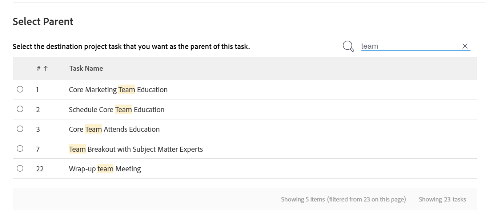

# 移动任务

<!--Audited: 5/2025-->

<!--The highlighted information on this page refers to functionality not yet generally available. It is available only in the Preview environment for all customers. After the monthly releases to Production, the same features are also available in the Production environment for customers who enabled fast releases.    

For information about fast releases, see [Enable or disable fast releases for your organization](/help/quicksilver/administration-and-setup/set-up-workfront/configure-system-defaults/enable-fast-release-process.md). -->

您可以在Adobe Workfront中的以下对象之间移动任务：

* 项目的临时任务。
* 从项目到另一个项目的任务。
* 另一个项目中不同父级下的项目任务。
* 同一项目内不同父级下的任务。

您可以在任务级别移动任务，也可以从任务列表中移动任务。

您可以移动单个任务，也可以从任务列表中一次移动多个任务。

## 访问要求

+++ 展开以查看本文中各项功能的访问要求。

<table style="table-layout:auto"> 
 <col> 
 <col> 
 <tbody> 
  <tr> 
   <td role="rowheader">Adobe Workfront计划</td> 
   <td> 
任何
 </td> 
  </tr> 
  <tr> 
   <td role="rowheader">Adobe Workfront许可证</td> 
   <td> 
新增：标准 
 
 
或
  

当前：工作或更高 
 </td> 
  </tr> 
  <tr> 
   <td role="rowheader">访问级别配置</td> 
   <td> 
编辑对任务和项目的访问权限
 </td> 
  </tr> 
  <tr> 
   <td role="rowheader">对象权限</td> 
   <td> 
管理任务的权限
 
为项目分配或更高权限，并能够添加任务
  </td> 
  </tr> 
 </tbody> 
</table>

有关此表中信息的更多详细信息，请参阅Workfront文档中的[访问要求](/help/quicksilver/administration-and-setup/add-users/access-levels-and-object-permissions/access-level-requirements-in-documentation.md)。

+++

## 移动任务的注意事项

移动任务时，请考虑以下事项：

* 您的系统或组管理员可能会阻止您移动具有记录小时数的任务，具体取决于他们如何在“设置”区域中配置“允许用户移动具有记录小时数的任务和问题”首选项。 有关信息，请参阅[配置系统范围的任务和问题首选项](/help/quicksilver/administration-and-setup/set-up-workfront/configure-system-defaults/set-task-issue-preferences.md)。

* 当您将任务从一个项目移动到另一个项目时，可能会重新计算任务日期。 重新计算将考虑新项目使用的时间表和项目的时间表来源信息。

* 您可以在移动过程中将与任务关联的一些项目移动到移动的任务。 但是，默认情况下，以下对象会传输到移动的任务：

   * 问题
   * 记录的小时数
   * 用户评论
   * 自定义表单和自定义字段信息
   * 子任务

* 默认情况下，以下项目不会随任务一起移动：

   * 里程碑

## 在列表中移动任务

{{step1-to-projects}}

1. 在&#x200B;**项目**&#x200B;页面上，选择包含要移动的一个或多个任务的项目。
1. 单击左侧面板中的&#x200B;**任务**&#x200B;以显示任务列表。
1. 单击&#x200B;**计划模式**&#x200B;图标并确保启用&#x200B;**自动保存**&#x200B;切换功能，然后选择要移动的一个或多个任务。

   

   >[!IMPORTANT]
   >
   >禁用&#x200B;**自动保存**&#x200B;切换后，您无法移动任务。

1. （可选，视情况而定）如果要在同一项目中移动选定任务，请单击选定任务，然后将它们拖放到项目中要移动到的位置。 任务层次结构更改会立即保存，并且与每个任务关联的信息会随任务一起移动。

1. （视情况而定）选择要移动的一个或多个任务，然后执行以下操作之一：

   * 单击任务列表顶部的&#x200B;**更多**&#x200B;菜单，然后单击&#x200B;**移至**。
   * 右键单击选定的任务，然后单击&#x200B;**移至**。
   * 选择一个任务时，单击列表中任务名称旁边的&#x200B;**更多**&#x200B;菜单，然后单击&#x200B;**移至**。

   显示&#x200B;**移动任务**&#x200B;框。

1. 继续移动任务，如本文中[在任务级别](#move-a-task-at-the-task-level)移动任务一节所述。

   <!--
   is this still accurate?!
   -->

## 在任务级别移动任务 {#move-a-task-at-the-task-level}

除了从任务列表中移动任务外，您还可以在打开任务后在任务级别移动任务。

1. 通过搜索在Workfront系统中查找任务。
1. 单击任务的名称以将其打开。
1. 单击任务名称旁边的&#x200B;**更多**&#x200B;下拉菜单，然后单击&#x200B;**移至**。 此时会显示&#x200B;**移动任务**&#x200B;侧面板。

1. （可选）更新&#x200B;**任务名称**。 该任务会以新名称移动到新位置。

   >[!TIP]
   >
   >选择在列表中移动多个任务时，**任务名称**&#x200B;字段灰显且不可编辑。 您可以将鼠标悬停在&#x200B;**任务名称**&#x200B;字段上，此时将显示所有选定任务的列表。
   >
   >
   >

1. 在&#x200B;**选择目标项目**&#x200B;字段中，键入要将该任务移动到的项目名称。 如果要在同一项目中移动任务，请键入当前项目的名称。

   >[!TIP]
   >
   >* 项目名称区分大小写。
   >* 您可以通过键入参考号或输入项目的ID来搜索项目。 这可以帮助您区分具有相同名称的项目。
   >* 列表中仅显示100个项目。

1. （视情况而定）如果您无权访问该项目，请单击&#x200B;**请求访问权限**。
1. （视情况而定）如果您有权将任务添加到目标项目上的任务之一，请继续将任务移动到目标项目，而不请求访问权限。

   

   >[!TIP]
   >
   >如果Workfront管理员阻止将任务添加到这些项目，而所选项目处于未决批准、已完成或终止状态，则会显示类似消息。 有关详细信息，请参阅[配置系统范围的项目首选项](../../../administration-and-setup/set-up-workfront/configure-system-defaults/set-project-preferences.md)。

1. （可选）在&#x200B;**选项**&#x200B;部分中，取消选择下表中列出的任何项，以将其从移动的任务中删除。 默认情况下，将选择所有选项。

   >[!IMPORTANT]
   >
   >取消选择&#x200B;**选项**&#x200B;列表中的项目会导致数据丢失。 现有任务中的信息将被删除并且无法恢复。

   <table style="table-layout:auto"> 
    <col> 
    <col> 
    <tbody> 
     <tr> 
      <td role="rowheader">全部选择</td> 
      <td>取消选择此选项可在将任务移动到其新位置时从任务中删除所有信息。 </td> 
     </tr> 
     <tr> 
      <td role="rowheader">约束</td> 
      <td> 
任务限制被设置为“尽可能早”或“尽可能晚”，基于项目计划模式设置。
 
 选中后，任务的当前限制将随任务转移。 
 
      
注：在将具有日期特定约束的任务移动或复制到另一个项目时，如果任务的约束日期在新项目日期之外，则任务约束会更改为尽可能早或尽可能迟，或者调整项目的计划起始日期或计划完成日期。

   以下是特定于日期的约束示例：
   <ul>
      <li> 开始于</li>
      <li> 必须完成时间</li>
      <li> 开始时间不早于</li>
      <li> 开始时间不晚于</li>
      </ul>

   有关详细信息，请参阅<a href="../../../manage-work/tasks/task-constraints/task-constraint-overview.md" class="MCXref xref">任务约束概述</a>。
 </td>
   </tr> 
     <tr> 
      <td role="rowheader">任务</td> 
      <td> 
将从任务中删除所有分配。 
 </td> 
     </tr> 
     <tr> 
      <td role="rowheader">审批流程</td> 
      <td>所有审批流程都将从任务中删除。</td> 
     </tr> 
     <tr> 
      <td role="rowheader">进度</td> 
      <td>任务状态被设置为“新建”。 否则，将保留现有任务状态。 </td> 
     </tr> 
     <tr> 
      <td role="rowheader">财务信息</td> 
      <td>删除任务的财务信息，Workfront将任务成本类型更新为无成本，任务收入类型更新为不可记帐。 </td> 
     </tr> 
     <tr> 
      <td role="rowheader">所有前置任务</td> 
      <td> 
选中后，当您将任务移动到另一个项目时，依赖关系会变为跨项目前置任务。 
 </td> 
     </tr> 
     <tr> 
      <td role="rowheader">文档</td> 
      <td> 
附加到任务的文档不会转移到已移动的任务。 这包括版本、验证和链接文档。
 
这不包括文档审批。 移动任务时绝不能移动文档审批。
 
      
注意：如果您选择不随任务移动文档，则文档将被删除并放入回收站30天。 管理员可以恢复它们，它们将在移动的任务上恢复。 

   
如果任务在移动后被删除，则恢复文档将放置在恢复它们的管理员用户页面的“文档”区域中。

   </td> 
     </tr> 
     <tr> 
      <td role="rowheader">提醒通知</td> 
      <td>任务提醒未传输到已移动的任务。 </td> 
     </tr> 
     <tr> 
      <td role="rowheader">费用</td> 
      <td>任务记录的费用未转移到已移动的任务。 </td> 
     </tr> 
     <tr> 
      <td role="rowheader">权限</td> 
      <td> 
Workfront会删除任务的“共享”列表中显示的所有实体的名称。 
 </td> 
     </tr> 
    </tbody> 
   </table>

1. （可选）在&#x200B;**选择父项**&#x200B;部分中，选择将成为移动任务的父项的目标项目中的任务。

   >[!TIP]
   >
   >当选择在列表中移动多个任务时，所有选定任务都会成为选定父级的子级。

   通过执行以下操作之一选择父级：

   * 在任务列表中，选择项目计划中的父项之一。
   * 单击搜索图标并按名称搜索父任务。

   任务将显示在列表中。

   

   >[!NOTE]
   >
   >如果不选择父任务，则任务将作为主任务而不是子任务移动，并放置在目标项目的任务列表的末尾。

1. 单击&#x200B;**移动任务**。 任务将作为子任务移至父任务或项目的最后一个任务移至指定项目。
