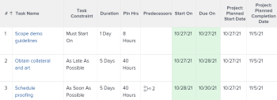

# 任务约束概览：最早可用时间

最早可用时间是一个任务限制，它计划在考虑任何前置任务关系后最早可用时间开始的任务。

有关如何更新任务的任务限制的信息，请参阅[更新任务的任务限制](../../../manage-work/tasks/task-constraints/update-task-constraint-of-task.md)。

<!--

(NOTE: replaced with new article linked above) 

-->

<!--

To update the Task Constraint to Earliest Available Time:

-->

<!--
   <li value="1" data-mc-conditions="QuicksilverOrClassic.Draft mode">Go to a task whose constraint you want to modify. </li>
   -->

<!--
   
Click <strong>Edit Task</strong>.

   -->

<!--
   
Click the <strong>More</strong> icon  next to the task name, then click <strong>Edit</strong>.

   -->

<!--
   
In the <strong>Overview</strong> section, expand the <strong>Task Constraint</strong> drop-down menu.

   -->

<!--
   
Select <strong>Earliest Available Time</strong>.

   -->

<!--
   <li value="5" data-mc-conditions="QuicksilverOrClassic.Draft mode">Click <strong>Save Changes</strong>.</li>
   -->

## 最早可用时间与尽快之间的差异

<!--

(NOTE: [! This section is duplicated in "Earliest Available Time"])

-->

当存在以下所有条件时，“最早可用时间”约束条件与“尽可能早”约束条件不同：

* 项目计划自完成日开始
* 项目中的任务具有前置任务关系
* 前置任务具有灵活的任务限制

在这种情况下：

* **最早可用时间：**&#x200B;对后续任务使用最早可用时间约束会优先处理前置任务的弹性约束。

  **示例**

  任务A是任务B的前置任务。任务B具有最早可用时间限制，而任务A具有尽可能晚的时间限制。 在这种情况下，任务B被安排在尽可能接近项目完成的时间。

  当任务的日期接近项目的完成日期时，

* **尽快：**&#x200B;在此方案中，对后续任务使用“尽快”限制可授予后续任务的优先级。

  **示例**

  任务A是任务B的前置任务。任务B具有尽可能早的限制，而任务A具有尽可能晚的限制。 在这种情况下，任务B的计划时间应尽可能接近项目的开始时间。

  
