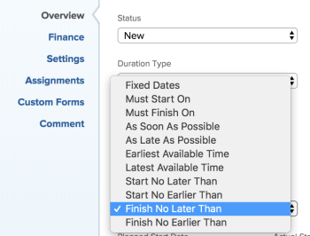

# 任务约束概述：不迟于完成

“不晚于完成”(FNLT)是一项任务约束，它将任务安排在指定日期之前完成。

## 不迟于约束的完成概述

使用任务的“不晚于完成”(FNLT)约束时，请考虑以下事项：

* 当项目计划从开始日期开始时，您应使用此约束。 在这种情况下，您可以在强制其他从属任务显示为“处于风险”之前，对任务提供软约束。
* 当您将FNLT约束与“从完成日期开始计划”项目一起使用时，此约束将计划任务，就像它计划为“尽可能晚”任务一样。
* 在将具有FNET约束的任务移动或复制到另一个项目时，任务的约束或项目日期可能会根据约束日期和项目的开始和完成日期而改变。 存在以下情形：

   * 当目标项目计划从开始时：

      * 当任务的约束日期早于项目计划起始日期时，任务约束将变为“尽快”。
      * 当任务的约束日期晚于项目计划完成日期时，项目计划完成日期将更改以匹配任务的完成约束日期。

      * 当目标项目计划完成时：

         * 当任务的约束日期晚于项目完成日期时，任务约束将变为“尽可能晚”。
         * 当任务的约束日期早于项目的计划起始日期时，项目计划起始日期会更改以匹配任务的起始约束日期。
      * 无论项目的计划如何，当任务的约束日期在项目的“开始”和“完成”日期之内时，“任务约束”或项目日期都不会发生更改。

   有关移动任务的信息，请参阅 [移动任务](../../../manage-work/tasks/manage-tasks/move-tasks.md). 有关复制任务的信息，请参阅 [复制和复制任务](../../../manage-work/tasks/manage-tasks/copy-and-duplicate-tasks.md).

有关如何更新任务上的任务约束的信息，请参阅 [更新任务的任务约束](../../../manage-work/tasks/task-constraints/update-task-constraint-of-task.md).

<!--

<h2>Use the Finish No Later Than constraint</h2>

To update the Task Constraint to Finish No Later Than:

<ol>
<li value="1">Go to a task whose Task Constraint you want to update.</li>
<li value="2"> 
Click the <strong>More</strong> icon  next to the task name, then click <strong>Edit</strong>.
 </li>
<li value="3">In the <strong>Overview</strong> section, expand the <strong>Task Constraint</strong> drop-down menu.</li>
<li value="4"> 
Select <strong>Finish No Later Than</strong>.
 
  
 </li>
<li value="5"> 
Specify a <strong>Planned Completion Date</strong>.
 
You must complete the task on and not later than this date. 
 </li>
<li value="6">Click <strong>Save Changes</strong>.</li>
</ol>

-->
