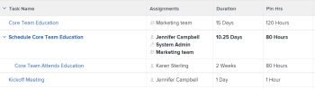

# 计划时数概述

与任务、问题或项目关联的计划时间表示分配的用户完成任务、问题或项目所需的时间。

## 关于Adobe Workfront计划时间的思考

* 计划小时数主要与Adobe Workfront中的工作项（任务和问题）相关联。 工作项的计划小时数累计到其项目的计划小时数。
* 默认情况下，Workfront会将任务和计划小时数平均分配给任务或问题持续时间中的所有日期。
* 当将用户和角色分配给任务和问题时，任务和问题中的计划小时数将与用户或角色分配相关联。
* 如果要使用Workfront中的“资源管理”工具，则必须为任务和问题定义“计划小时数”值。
* 您只能为某些持续时间类型修改任务的计划小时数值。

   有关修改与任务的持续时间类型有关的任务的计划小时数的详细信息，请参阅一节 [根据持续时间类型更新任务计划小时数](#update-task-planned-hours-based-on-duration-type) 在本文中。

* 您可以随时修改问题的计划时数值。
* 您无法修改项目或父任务的“计划小时数”值，因为它们是其所有任务和子任务的所有计划小时数的计算总数。
* 使用资源管理工具管理用户分配可能会更改任务、问题、项目的计划小时数以及与工作项关联的分配的计划小时数。

## 任务的计划小时数与项目的计划小时数 {#planned-hours-on-tasks-vs-planned-hours-on-projects}

任务的计划小时数累计到项目的计划小时数。 从问题开始的计划时间并不总是会累计到项目的计划时间。

本节介绍任务与项目计划时数之间的差异。 它还描述了您可以在何处查看累计到项目的计划时数问题。

* [任务的计划小时数](#planned-hours-on-tasks)
* [项目的计划时数](#planned-hours-on-projects)

### 任务的计划小时数 {#planned-hours-on-tasks}

任务的“计划小时数”指明预计任务实际工作可能需要的时间。 默认情况下，Workfront会在每个任务的持续时间内平均分配每天的计划小时总数。 计划小时的每日金额将成为任务的每日分配。 如果任务被分配给多个资源，则每个资源会默认分配相等的每日小时数。

使用工作负载平衡器，您可以修改分配给任务的用户的每日分配。 当任务持续时间类型为“简单”时，这也可以更新任务的计划时间。 有关更多信息，请参阅文章中的“管理用户分配时更新任务计划小时数”部分 [在工作负载平衡器中管理用户分配](../../../resource-mgmt/workload-balancer/manage-user-allocations-workload-balancer.md).

当任务包含子任务时，父任务的“计划小时数”是任何子任务上所有计划小时数的总和。 您无法更新父任务的计划小时数。

>[!NOTE]
>
>与“计划小时数”不同，父任务上的实际小时数直接记录在父任务上。 它们不代表子任务的实际小时数之和。\
>有关实际小时数的详细信息，请参阅 [查看实际小时数](../../../manage-work/tasks/task-information/actual-hours.md).

### 项目的计划时数 {#planned-hours-on-projects}

您无法编辑项目的计划小时数。 项目的计划小时数是项目所有任务中所有计划小时数的计算总和。

计划小时数的计算中是否包含问题，取决于您查看计划小时数的项目位置。 您可以在项目的以下位置查看项目计划时数：

* **项目详细信息** **部分** ****和&#x200B;**编辑项目**框&#x200B;**:**只考虑项目中任务的计划时数。 在“项目详细信息”部分或“编辑项目”框中查看项目的计划小时总数时，不会考虑项目问题的计划小时数。

* **工作负**平衡器：只有与工作负载平衡器中显示的任务关联的计划小时数才会显示在项目的工作负载平衡器中。 用户每日分配可以在负载平衡器中更改项目每日计划小时数。
* **利用率部分：** 在“利用率”部分中查看项目的计划小时总数时，会考虑与分配给任务的用户关联的计划小时数和项目中的问题。
* **“角色分配”面板** 在任务列表中：任务的计划小时数以及分配给作业角色或与作业角色关联的用户的项目问题将显示在此区域中。 与未分配或分配给团队的任务和问题关联的计划小时数不会显示在此区域中。 有关更多信息，请参阅 [在“角色分配”面板中查看项目计划时数](../../../manage-work/projects/planning-a-project/view-planed-hours-in-role-allocation-panel.md).

## 在任务持续时间内计划小时数的分配

默认情况下，Workfront会在任务的持续时间内平均分配计划小时数，并根据项目计划的可用性为任务的每一天分配等数的计划小时数。

例如，如果将任务设置为下午4点开始，并且计划在任务的第一天还剩下一小时，则Workfront在任务持续时间的第一天放置一个计划小时，然后在任务持续时间的其余天之间平均分配计划小时的剩余时间。

>[!NOTE]
>
>“每日计划小时数”或每日分配是任务持续时间内每天计划小时数的分配。 如果任务有一个分配，则此数字表示每个分配每天的计划小时数。 如果任务具有多个分配，则每日计划小时数分配与任务的每日计划小时数不同。 对于具有多个分配的任务，Workfront中没有每个分配的每日计划时数的可视表示形式。

## 查找并了解计划小时数值

您可以在Workfront的各个区域中找到“计划小时数”值。 

显示的计划小时数要么源于项目上的工作项目，要么根据您在中查看这些项目的区域和对象的不同而计算。

您可以在Workfront的以下区域找到计划时数：

* [项目、任务或问题的“详细信息”部分](#the-details-section-of-a-project-task-or-issue)
* [“编辑任务”或“编辑问题”框](#the-edit-task-or-edit-issue-box)
* [报告](#reports)
* [工作负载平衡器](#the-workload-balancer)
* [资源计划员](#the-resource-planner)
* [“ Utilization ”报告](#the-utilization-report)
* [“角色分配”面板](#The%C2%A0Role)

### 项目、任务或问题的“详细信息”部分 {#the-details-section-of-a-project-task-or-issue}

任务、问题或项目的“详细信息”部分中的“计划小时数”是与相应项目关联的总计划小时数。

有关项目计划时数的详细信息，请参阅 [任务的计划小时数与项目的计划小时数](#planned-hours-on-tasks-vs-planned-hours-on-projects) 章节。

### “编辑任务”或“编辑问题”框 {#the-edit-task-or-edit-issue-box}

任务或问题的“编辑”框中的“计划小时数”是相应项目的总计划小时数。

有关项目计划时数的详细信息，请参阅 [任务的计划小时数与项目的计划小时数](#planned-hours-on-tasks-vs-planned-hours-on-projects) 章节。

对于任务，您只能编辑特定持续时间类型的计划小时数。 有关信息，请参阅 [根据持续时间类型更新任务计划小时数](#update-task-planned-hours-based-on-duration-type) 章节。

您可以在“分配”区域中查看分配给任务或问题的每个用户或职务角色的计划小时数的单个分配。

### 报告 {#reports}

您可以在项目、任务和发布报表中添加计划小时数字段。

默认情况下，“计划时数”列包含在任务列表的“标准”视图中。

任务、问题或项目报表中的计划小时数是相应项目在项目的“详细信息”部分或“编辑”框中显示的总计划小时数。

有关创建报表的信息，请参阅 [创建自定义报表](../../../reports-and-dashboards/reports/creating-and-managing-reports/create-custom-report.md).

>[!NOTE]
>
>如果您创建项目（财务数据）报表并按日期对其进行分组，则计划小时数可能会根据项目任务的时间表显示项目的一部分计划小时数。 默认情况下，Workfront会为任务持续时间的每一天平均分配计划时数任务。 特定时间范围内的计划小时数与Workfront在项目（财务数据）报表中为该时间范围设置的相等分配相匹配。

<!--
### The Scheduling areas  {#the-scheduling-areas}

The Planned Hours for tasks and issues display in the Scheduling areas in the Planned Hours field.

You can view the daily allocation of Planned Hours for each user assigned to a task or an issue in the Scheduling areas.

The daily hour amount represents one of the following:

* the default amount equally distributed by Workfront for each day of the Duration of the tasks or issues
* the adjusted daily allocation managed by resource managers.

  For information about adjusting daily allocations in the Scheduling tools, see [Manage user allocations in the Scheduling areas](../../../resource-mgmt/resource-scheduling/manage-allocations-scheduling-areas.md).
-->

### 工作负载平衡器 {#the-workload-balancer}

任务、问题和项目的以下计划小时数显示在任务、问题或项目名称右侧的工作负载平衡器中：

* 对于任务和问题，将显示与它们关联的计划时数。
* 对于项目，屏幕上会显示任务和问题之后的计划小时总数。

   >[!TIP]
   >
   >工作负载平衡器不会显示项目的所有计划小时数，如项目详细信息区域所示。

您可以查看分配给任务或负载平衡器中问题的每个用户的每日计划小时分配。

计划小时数的每日小时数表示以下任一值： 

* Workfront在任务、问题或项目持续时间的每一天平均分配的默认金额
* 由资源管理员管理的调整后每日分配。

   有关在工作负载平衡器中调整每日分配的信息，请参阅 [在工作负载平衡器中管理用户分配](../../../resource-mgmt/workload-balancer/manage-user-allocations-workload-balancer.md).

### 资源计划员 {#the-resource-planner}

资源计划员显示项目、任务和问题的计划小时数。

您可以在“资源计划员”的“PLN”列中查看与工作物料关联的用户和职务职责的每周计划小时数分配。

>[!TIP]
>
>负载平衡器中的每日分配调整会影响资源计划器中任务和问题的每周分配。

每个对象的计划小时数因您应用到资源计划员的视图而异。 有关更多信息，请参阅 [资源计划员的“项目”和“职责”视图中的工时、FTE和成本信息概览](../../../resource-mgmt/resource-planning/overview-of-planner-hour-fte-cost-information-in-role-project-views.md).

任务和问题的计划小时数的每周小时数表示以下任一值： 

* Workfront为任务或问题持续时间的每一天平均分配的默认每周金额
* 由负载平衡器中的资源管理器管理的已调整的每周分配。

   有关在工作负载平衡器中调整每日分配的信息，请参阅 [在工作负载平衡器中管理用户分配](../../../resource-mgmt/workload-balancer/manage-user-allocations-workload-balancer.md).

项目、用户和角色的每周金额受与其相关的任务和问题每周计划小时数的影响。

### “ Utilization ”报告 {#the-utilization-report}

项目计划小时数是与每项任务和问题的分配关联的小时数。

>[!IMPORTANT]
>
>请注意，“利用率”报表中的“计划时数”与分配关联，而与任务和问题本身无关。 “利用率”报表中的“计划小时数”在项目的任务和问题上并不总是与“计划小时数”匹配。 但是，计划小时数与与任务和问题分配关联的小时数匹配。

您可以在“利用率”报表中查看以下类型的计划时数：

* 项目在所包括项目的整个生命周期内的所有任务的总计划小时数
* 仅在指定日期范围内所有分配的总计划小时数（您可以指定单个周或月）。

   当使用工作负载平衡器调整了用户对小时的每日分配时，如果在“利用率”报表中选择的日期只包含部分任务或问题的持续时间，则特定日期范围的计划小时数可能会受到影响。 有关调整用户每日分配的信息，请参阅 [在工作负载平衡器中管理用户分配](../../../resource-mgmt/workload-balancer/manage-user-allocations-workload-balancer.md).

有关更多信息，请参阅 [查看资源利用信息](../../../resource-mgmt/resource-utilization/view-utilization-information.md).

### “角色分配”面板

“角色分配”面板中的“计划小时数”表示在项目总持续时间内与分配给项目任务或问题的每个任务职责关联的计划小时数。 编号与资源计划员中的“计划小时数”职责匹配。

>[!TIP]
请注意，与用户关联的计划小时数不会显示在“角色分配”面板中。

有关更多信息，请参阅 [在负载平衡器中显示项目和方案的角色分配](../../../scenario-planner/show-role-allocation-workload-balancer.md).

## 根据持续时间类型更新任务计划小时数 {#update-task-planned-hours-based-on-duration-type}

只有在任务具有特定的持续时间类型时，才能在编辑任务时更新任务的总计划小时数。

存在以下情形：

* 只有在编辑任务时使用计算分配或简单持续时间类型时，才可修改任务的计划小时数。

   有关计算的分配持续时间类型的详细信息，请参阅 [持续时间类型概述：计算分配](../../../manage-work/tasks/taskdurtn/calculated-assignment.md).

   有关简单持续时间类型的详细信息，请参阅 [持续时间类型概述：简单](../../../manage-work/tasks/taskdurtn/simple-duration-type.md).

* 在管理用户对任务的分配时，您只能为简单持续时间类型任务更新工作负载平衡器中的任务计划时间。 有关在工作负载平衡器中管理用户分配的信息，请参阅 [在工作负载平衡器中管理用户分配](../../../resource-mgmt/workload-balancer/manage-user-allocations-workload-balancer.md).
* 对于持续时间类型为“工作驱动”或“计算工作”的任务，您不能修改“计划小时数”。 在这些情况下，Workfront会根据任务的持续时间确定计划小时数；但是，在这种情况下，计划小时数始终等于持续时间（以小时为单位），并且它们不受已分配资源的百分比分配的影响。

   有关“工作驱动的持续时间类型”的详细信息，请参阅 [持续时间类型概述：努力驱动](../../../manage-work/tasks/taskdurtn/effort-driven.md).

   有关计算的工作持续时间类型的详细信息，请参阅 [持续时间类型概述：计算量度](../../../manage-work/tasks/taskdurtn/calculated-work.md).

## 管理用户分配时更新任务计划小时数

在手动更新任务的用户或作业角色分配时，您可以为任务更新计划小时数。 仅当任务的“持续时间类型”为“简单”时，才能执行此操作。

有关更多信息，请参阅 [持续时间类型概述：简单](../../../manage-work/tasks/taskdurtn/simple-duration-type.md).

您可以更新分配给任务的用户和角色的整体分配，或者在使用负载平衡器时更新用户的每日分配。

有关管理任务的整体用户和作业角色分配的信息，请参阅 [管理任务的用户和角色分配小时数](../../../manage-work/tasks/assign-tasks/manage-allocation-hours-on-tasks.md).

有关管理任务的每日分配的信息，请参阅 [在工作负载平衡器中管理用户分配](../../../resource-mgmt/workload-balancer/manage-user-allocations-workload-balancer.md).

手动更新任务的用户或作业角色分配时，存在以下情况：

* 如果您没有人工更新单个用户或角色分配以触发对任务计划时间的更改，则在添加、删除或替换任务中的分配时，计划时间将保持不变。 在向任务添加新分配时，将在所有分配者之间重新分配单个分配。
* 如果人工更新分配以触发对任务“计划小时数”的更改，则当您从任务中删除分配时，“计划小时数”会减少。 在您替换分配时，它们保持不变。
* 当您人工更新分配以触发对“计划小时数”任务的更改并且向任务添加分配时，新分配将默认分配0小时。 您必须人工更新其对任务的分配，这可能会影响计划时间。
* 如果您尚未人工更新分配以触发对任务“计划小时数”的更改，并且您删除了任务的所有分配，则“计划小时数”将保持不变。
* 当您人工更新分配以触发对任务“计划小时数”的更改并删除任务的所有分配时，也会删除“计划小时数”，并且任务的“计划小时数”将变为0。

>[!NOTE]
例如，如果任务有10个计划小时，而您有两个受分配者，则默认情况下，每个受分配者将分配5个小时。
* 如果您没有使用负载平衡器更新单个用户分配或每日分配，并且从任务中删除了任何或所有任务分配，则“计划时数”任务将保持10小时。
* 如果您分别将分配的分配人工更改为4小时和6小时，并删除分配给6小时的用户及其职务角色，则“计划小时”任务将更新为4小时。 如果您还删除了分配给4小时的用户，但将作业角色与已删除的用户关联，则任务的“计划时间”仍保留4小时。 如果删除分配给4小时的最后一个用户及其作业角色，并且任务仍未分配，则任务的“计划小时数”任务将变为0。

## 使用工作量自动更新任务计划小时数

使用“工作量”估计任务完成所需的工作量时，任务的“计划小时数”会自动更新。 仅对于具有简单持续时间类型的任务可执行此操作。

有关使用工作量来估计任务工作量的信息，请参阅 [工作概述](../../../manage-work/tasks/task-information/work-effort.md).

<!--

(NOTE: this issue has the explanation of how Planned Hours should work - from Vazgen and Anna: https://hub.workfront.com/issue/6217dced00730b7034c4b808339a35ce/

-->

<!--

Details of their comments: 

-->

<!--

Anna Asatryan

3/22/2022 At 3:16 PM

&nbsp;

to Mark Paul, Corrie Butler, Arman Simonyan, Gagik Khalatyan, Alina Wilson, Artur Sargsyan, Vazgen Babayan, Anna Asatryan

I have done some rough calculations on what the planned hours/revenues should look like Book.xlsx . And if we look, for example at the 2 users highlighted in one of the screenshots their planned hours look way off from what the calculation looks like in the spreadsheet (i.e. equally distributed allocation). When looking at the Workload balancer (the second screenshot), as an example for the user Yashas Mitta, I can see that the allocation has been modified. Obviously the utilization report calculates the allocations based on the modified contouring using the new work per day calculation. The project financial report uses the old, equal distribution of allocation along the full duration of the task. Hence. there is a difference when grouping per periods.

Vazgen Babayan

I believe we will need to prioritise syncing the project financial data report with the new work per day.

Alina Wilson

@Anna Asatryan , do you have a definition of what we should say in documentation (glossary, for example) for how the Planned Hours (or Planned Revenue) is calculated, keeping in mind that we don't document the concept of "workPerDay". We call them "daily allocations", for example, but let me know if that's accurate, too.

Vazgen Babayan

Last Thursday at 3:13 PM

I think an important note here is that regardless the calculation, even if the both views used the same formula, they will not display the same data, because the underlying data sources are different. The Financial Data report does not respect user-entered allocations in Workload Balancer at this moment. So there will be a clear discrepancy, as Anna showed in her message. My recommendation for communication will be to explain that the data sources are different so there can be a mismatch in data and that we will look into addressing that on our roadmap.

Alina Wilson

So far, I hear you guys say this (with my questions for confirmation/ comments in bold):

- the utilization report calculates the allocations based on the modified contouring using the new work per day calculation (so this is what we see in the Workload Balancer, right?)

- the project financial report uses the old, equal distribution of allocation along the full duration of the task (this is before the daily allocations for example were modified in the WB, right?)

I have these additional questions:

- what does the Project Details show? Which Planned Hours, for instance - because earlier, we had a question about this also. - which numbers?

- what does any Planned Hours/ Planned Revenue field that can be pulled in any other report (outside of Financial Data and Utilization reports) show? - which numbers?

- are there any other areas I am not thinking of that we need to document, @Corrie Butler

I will try to document all the possible areas where these display but please help. Thanks!

Vazgen Babayan

Last Saturday at 3:41 PM

<ul>
<li> 
Confirming the first two points 
 </li>
</ul>

For the following questions

<ul>
<li> 
Project details show an aggregated sum of task planned hours. It doesn't have anything to do with the work per day because it always deals with total numbers for the whole duration of the Project/Task.
 </li>
<li> 
Same thing applies to the Planned Hours and Planned Revenue fields in reports - they show totals for the whole Project/Task duration and thus have no use of work per day.
 </li>
<li> 
Can't think of any other fields related to this right now.
 </li>
<li> 
In general, if I were to summarize the system behavior, it's as follows:
 </li>
<li> 
Every area that only deals with total numbers of Planned Hours / Planned Revenue, uses the numbers entered on the tasks. Those are Task / Project Details, reports exposing those fields.
 </li>
<li> 
Areas that deal with time-sensitive portions of Planned Hours / Planned Revenue, use work per day. Those are all Resource Management tools - Workload Balancer, Resource Planner, Utilization Report, importing projects via Scenario Planner.
 </li>
<li> 
All the areas in the second point support user-edited allocations made in Workload Balancer.
 </li>
<li> 
Scheduling area and Project Financial Data reports use the old version of the work per day, which doesn't respect user-edited allocations from Workload Balancer.
 </li>
<li> 
Scheduling will be removed this year, and we need to do work to move the Project Financial Data reports to the new work per day sometime after Q3.
 </li>
</ul>

Alina Wilson

@Vazgen Babayan , one clarifying question: when you say "Scheduling and Project Financial Data reports use the old version of the work per day, which doesn't respect user-edited allocations from WB" - you mean that those use the system default which spreads the allocations evenly, correct? Because you can edit (daily) allocations in Scheduling tools, but it doesn't use that, correct? It uses the default of the daily allocation that the system figures out when dividing the Planned Hours by the number of days in the Duration. Please let me know. And thanks!

Anna Asatryan

Yesterday at 11:42 AM

@Alina Wilson , that's correct, when saying "Scheduling and Project Financial Data reports use the old version of the work per day, which doesn't respect user-edited allocations from WB" Vazgen meant that it spreads the allocation evenly.

As for the scheduling, the allocation modification that's being done there isn't reflected anywhere else in the application other than in the Scheduling itself. That's probably one of the reasons it's being deprecated.

-->

<!--

   

-->

<!--

(NOTE: everything below is drafted because I replaced it with the table above)

-->

<!--

You can find the Planned Hours information on tasks, issues, or projects in the following locations:

-->

<!--

The Planned Hours in the Details  section  of a task, issue, or project are the total Planned Hours of the respective item. 

Finding the Planned Hours in the Details  section  is identical for tasks, issues, and projects. 
 <note type="tip">
You cannot edit the Planned Hours of projects manually, as they are a calculation of all Planned Hours of all the tasks on the project.
</note>

To locate the Planned Hours value on the Details  section  of a task: 

<ol>
<li value="1">Go to a task for which you want to review the Planned Hours.</li>
<li value="2"> 
Click <strong>Task Details</strong> in the left panel. 
 </li>
<li value="3"> 
Click the <strong>Overview</strong> area and notice the Planned Hours value.
 
This value represents the time it would take the user assigned to the task to complete it. 
 </li>
</ol>

-->

<!--

<h3> </h3>

The Planned Hours in the Edit box of a task, issue, or project are the total Planned Hours of the respective item. 

Finding the Planned Hours while editing a task or an issue is identical. 
 <note type="tip">
You cannot edit the Planned Hours of projects manually, as they are a calculation of all Planned Hours of all the tasks on the project.
</note>

To locate the value of Planned Hours while editing a task:

<ol>
<li value="1">Go to the task or issue you want to view Planned Hours for.</li>
<li value="2"> 
Click the <strong>More</strong> icon  next to the task name, then click <strong>Edit</strong>.
 
The Planned Hours are located in the <strong>Overview</strong> section. 
 </li>
</ol>

-->

<!--

The Planned Hours column is included in the Standard view of a task list, by default. For issues and projects, you can add it to the view, when you are editing the view or when you build a report. 

The Planned Hours in a task, issue, or project report are the total Planned Hours of the respective item as they display in the Details  section  or the Edit box of the items. 

Adding the Planned Hours column to a project view is similar to building a view in a project report. 

To show Planned Hours in a project report:

<ol>
<li value="1"> 
Click the <strong>Main Menu</strong> icon  in the upper-right corner of Workfront, then click <strong>Reports</strong>. 
 </li>
<li value="2">Click <strong>New Report</strong>, then choose <strong>Project</strong> as your object.</li>
<li value="3">Click <strong>Add Column</strong>, and start typing <strong>Planned Hours</strong> when the <strong>Show in this column</strong> drop-down field is displayed. Select the field when it appears in the list.</li>
<li value="4"> 
Click <strong>Save + Close</strong> to save the report. 
 
The Planned Hours column shows the total number of Planned Hours on each project. 
 </li>
</ol>

-->

<!--

Planned Hours in Resource Management tools
 <note type="important">
When viewing Planned Hours in the Resource Management tools by a specific time frame, the daily allocations for each work item and the daily allocations for the resources assigned to the work items during that time frame can influence the daily Planned Hours of projects or work items.
</note>

You can see the value of Planned Hours for your tasks, issues, or projects when using the following Resource Management tools:

<ul>
<li> 
Resource Planner
 
For information about using the Resource Planner, see <a href="../../../resource-mgmt/resource-planning/get-started-resource-planner.md" class="MCXref xref">Resource Planner overview</a>.
 </li>
<li> 
Utilization Report.
 
For information about the utilization report, see <a href="../../../reports-and-dashboards/reports/using-built-in-reports/resource-utilization-report.md" class="MCXref xref">Overview of the Resource Utilization report</a>.
 </li>
<li>

Workload Balancer or Scheduling areas in the following sections:

<ul>
<li>Scheduling or Workload Balancer sections in the Resourcing area</li>
<li>Scheduling or Workload Balancer section at the project level</li>
<li>Schedule or Workload Balancer section at the team level</li>
</ul>

 
For information about scheduling resources, see <a href="../../../resource-mgmt/resource-scheduling/get-started-resource-scheduling.md" class="MCXref xref">Get started with Resource Scheduling</a>.
 
For information about the Workload Balancer, see <a href="../../../resource-mgmt/workload-balancer/overview-workload-balancer.md" class="MCXref xref">Overview of the Workload Balancer</a>. 
 </li>
<li> 
<b>Role Allocation panel</b> in the project  task list or  Workload Balancer: The Planned Hours for the tasks and the issues on the project that are assigned to a job role or a user associated with a job role are taken into account in this area. For more information, see <a href="../../../manage-work/projects/planning-a-project/view-planed-hours-in-role-allocation-panel.md" class="MCXref xref">View project Planned Hours in the Role Allocation panel</a>. 
 </li>
</ul>

-->
