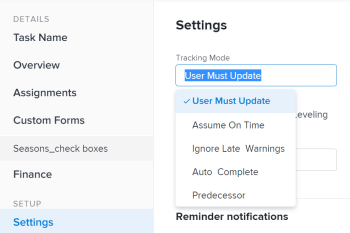

# 为任务设置跟踪模式

<!--Audited: 01/2025-->

任务的跟踪模式决定任务进度状态在Adobe Workfront中的更新方式。

有关任务跟踪模式的信息，请参阅[任务跟踪模式概述](../../../manage-work/tasks/task-information/task-tracking-mode.md)。

## 访问要求

+++ 展开以查看本文中各项功能的访问要求。 

<table style="table-layout:auto"> 
 <col> 
 <col> 
 <tbody> 
  <tr> 
   <td role="rowheader">Adobe Workfront包</td> 
   <td> 
任何
 </td> 
  </tr> 
  <tr> 
   <td role="rowheader">Adobe Workfront许可证</td> 
   <td> 
标准

工作或更高
 
   </td> 
  </tr> 
  <tr> 
   <td role="rowheader">访问级别配置</td> 
   <td> 
编辑任务访问权限 
 </td> 
  </tr> 
  <tr> 
   <td role="rowheader">对象权限</td> 
   <td> 
管理任务的权限
 </td> 
  </tr> 
 </tbody> 
</table>

*有关信息，请参阅Workfront文档中的[访问要求](/help/quicksilver/administration-and-setup/add-users/access-levels-and-object-permissions/access-level-requirements-in-documentation.md)。

+++

<!--old: 
<table style="table-layout:auto"> 
 <col> 
 <col> 
 <tbody> 
  <tr> 
   <td role="rowheader">Adobe Workfront plan</td> 
   <td> 
Any
 </td> 
  </tr> 
  <tr> 
   <td role="rowheader">Adobe Workfront license*</td> 
   <td> 
New: Standard
 
   Or
   
Current: Work or higher
 
   </td> 
  </tr> 
  <tr> 
   <td role="rowheader">Access level configurations</td> 
   <td> 
Edit access to Tasks 
 </td> 
  </tr> 
  <tr> 
   <td role="rowheader">Object permissions</td> 
   <td> 
Manage permissions on a task
 </td> 
  </tr> 
 </tbody> 
</table>

-->

## 为任务设置跟踪模式

要设置跟踪模式，请执行以下操作：

1. 转到要为其设置跟踪模式的任务。
1. 单击任务名称旁边的&#x200B;**更多**&#x200B;图标，然后单击&#x200B;**编辑**。

   将打开“编辑任务”对话框。

1. 在&#x200B;**设置**&#x200B;部分中，使用&#x200B;**跟踪模式**&#x200B;下拉菜单选择任务的跟踪模式。

   

1. 从以下选项中选择：

   * 用户必须更新（这是默认选项）
   * 假设准时
   * 忽略迟到警告
   * 自动完成
   * 前置任务

   有关跟踪模式选项的更多信息，请参阅[任务跟踪模式概述](../../../manage-work/tasks/task-information/task-tracking-mode.md)

1. 单击&#x200B;**保存**。
