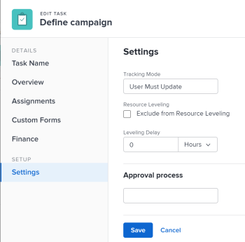

# 更新任务调平延迟

有时，项目的任务计划之间可能会发生冲突。 您可以通过重新计划资源和任务来对资源进行分级或解决资源冲突，以便所有任务都可以在实际的计划内完成。 有关调平任务的信息，请参阅 [甘特图中的级别资源](../../../manage-work/gantt-chart/use-the-gantt-chart/level-resources-in-gantt.md).

作为项目经理或任务代理人，您还可以在单个任务上添加“调平延迟”，以考虑任何资源或计划冲突。 换句话说，任务可能会以延迟的时间进行计划，以确保当Adobe Workfront对任务进行分级时，更现实的时间表能够克服资源冲突。

向任务添加调平延迟会调整任务的预计完成日期。 有关预计完成日期的信息，请参阅 [项目、任务和问题的预计完成日期概览](../../../manage-work/projects/planning-a-project/project-projected-completion-date.md).

## 访问要求

您必须具有以下访问权限才能执行本文中的步骤：

<table style="table-layout:auto"> 
 <col> 
 <col> 
 <tbody> 
  <tr> 
   <td role="rowheader">Adobe Workfront计划*</td> 
   <td> 
任意
 </td> 
  </tr> 
  <tr> 
   <td role="rowheader">Adobe Workfront许可证*</td> 
   <td> 
工作或更高
 </td> 
  </tr> 
  <tr> 
   <td role="rowheader">访问级别配置*</td> 
   <td> 
编辑对任务和项目的访问权限
 
注意：如果您仍然没有访问权限，请咨询Workfront管理员，他们是否在您的访问级别设置了其他限制。 有关Workfront管理员如何修改访问级别的信息，请参阅 <a href="../../../administration-and-setup/add-users/configure-and-grant-access/create-modify-access-levels.md" class="MCXref xref">创建或修改自定义访问级别</a>.
 </td> 
  </tr> 
  <tr> 
   <td role="rowheader">对象权限</td> 
   <td> 
管理任务权限 
 
对项目拥有或更高权限
 
有关请求其他访问权限的信息，请参阅 <a href="../../../workfront-basics/grant-and-request-access-to-objects/request-access.md" class="MCXref xref">请求对对象的访问 </a>.
 </td> 
  </tr> 
 </tbody> 
</table>

&#42;要了解您拥有的计划、许可证类型或访问权限，请联系您的Workfront管理员。

## 向任务添加调平延迟

1. 转到要添加调平延迟的任务。
1. 单击 **“更多”图标** 在任务名称的右侧，单击 **编辑**.

   

1. 单击 **设置**.

   

1. 指定 **调平延迟**，以小时为单位，然后选择一个时间单位。\
   此时资源将因资源冲突而延迟启动任务。

   从以下选项中选择时间单位：

   * 分钟
   * 小时. 这是默认设置。
   * 天数
   * 周
   * 月
   * 占用分钟数
   * 占用小时数
   * 占用天数
   * 占用周数
   * 占用月数

   >[!TIP]
   >
   >已用时间是任务持续时间的单位。 任务的“计划起始日期”和“计划完成日期”之间的时间（包括假日、周末和休假时间）。 换言之，已用时间即为日历日的过去。

1. 单击 **保存**. 

 
