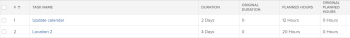
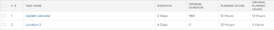

# 任务原始持续时间和原始计划时数概览

在计划项目时，您应确定项目中每项任务的计划小时数和持续时间（或计划持续时间）的值。

有关任务的计划小时数的详细信息，请参阅 [计划时数概述](../../../manage-work/tasks/task-information/planned-hours.md).

有关任务持续时间的详细信息，请参阅 [任务持续时间和持续时间类型概述](../../../manage-work/tasks/taskdurtn/task-duration-and-duration-type.md).

您可以在“任务详细信息”选项卡中或在编辑任务时看到这些值。

如果为任务列表或任务报表构建视图，则还可以查看任务的“原始计划小时数”和“原始持续时间”字段。

## 原计划小时数

任务的“原始计划小时数”表示任务在成为父任务之前最初具有的计划小时数。 当任务成为父任务时，子任务的“计划小时数”将累计到父任务，以指明父任务的“计划小时数”。

在任务报表或列表中显示“原始计划小时数”字段，您可以看到在任务继承其子任务的计划小时数之前的原始计划小时数。

>[!NOTE]
>
>创建任务时，原始计划小时数为零。 如果任务成为父任务，则此字段的值会填充该任务在更改为父任务之前的计划小时数。 即使任务还原为独立任务，此值仍保留在此字段中。

## 初始持续时间

任务的“原始持续时间”是任务在成为父任务之前最初具有的持续时间，以分钟为单位。 当任务成为父任务时，最早子任务的计划起始日期与最后一个子任务的计划完成日期之间的持续时间将累计到父任务，并成为父任务的持续时间。 这将替换原始任务的持续时间。

在任务报表或列表中显示“原始持续时间”字段，您可以在继承其子项的“持续时间”之前，查看任务持续时间的原始天数。

>[!NOTE]
>
>创建任务时，“原始持续时间”为零。 如果任务成为父任务，则在将其更改为父任务之前，此字段的值会填充该任务的持续时间。 即使任务还原为独立任务，此值仍保留在此字段中。 此值以分钟为单位显示。

## 示例

例如，当两个任务是独立任务时，其原始持续时间和原始计划小时数为零。

当第一个任务成为第二个任务的父任务时，“原始持续时间”和“原始计划小时数”字段会在成为父任务之前填充任务的“持续时间”和“计划小时数”的值。 原始持续时间以分钟为单位显示。 子项的持续时间和计划小时数成为父项的持续时间和计划小时数。

当父项再次成为独立任务时，“持续时间”和“计划小时数”将还原为原始值，同时“原始持续时间”和“原始计划小时数”仍会被填充。 它们不会还原为零。

