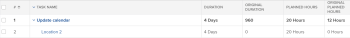

# 任务原始持续时间和原始计划小时数概览

作为计划项目的一部分，您应该确定项目中每个任务的计划小时数和持续时间（或计划持续时间）的值。

有关任务的计划小时数的详细信息，请参阅[计划小时数概述](../../../manage-work/tasks/task-information/planned-hours.md)。

有关任务持续时间的详细信息，请参阅[任务持续时间和持续时间类型概述](../../../manage-work/tasks/taskdurtn/task-duration-and-duration-type.md)。

您可以在“任务详细信息”选项卡中或在编辑任务时查看这些值。

如果您为任务列表或任务报告构建视图，则还可以查看任务的原始计划小时数和原始持续时间字段。

## 原规划小时数

任务的原始计划小时数表示任务最初成为父任务之前的计划小时数。 当任务成为父任务时，子任务的计划小时数将汇总到父任务以指示父任务的计划小时数。

在任务报告或列表中显示“原始计划小时数”字段，您可以看到在任务继承其子级计划小时数之前的原始计划小时数。

>[!NOTE]
>
>创建任务时，原始计划小时数为零。 如果任务成为父级任务，则此字段的值将填入任务在更改为父级之前的计划小时数。 即使任务恢复为独立任务，该值仍会保留在此字段中。

## 初始持续时间

任务的原始持续时间是指任务在成为父任务之前的原始持续时间（以分钟为单位）。 当任务成为父任务时，最早子任务的计划开始日期与最后一个子任务的计划完成日期之间的持续时间将累计到父任务，并成为父任务的持续时间。 这将替换原始任务的持续时间。

在任务报告或列表中显示“原始工期”字段，您可以看到任务在继承其子项工期之前的原始工期天数。

>[!NOTE]
>
>创建任务时，“原始持续时间”为零。 如果任务成为父级任务，则此字段的值在更改为父级任务之前使用任务的持续时间进行填充。 即使任务恢复为独立任务，该值仍会保留在此字段中。 此值以分钟为单位显示。

## 示例

例如，当两个任务为独立任务时，其原始持续时间和原始计划小时数为零。

当第一个任务成为第二个任务的父级时，原始持续时间字段和原始计划小时数字段中会填充该任务在成为父级之前的持续时间和计划小时数的值。 原始持续时间以分钟为单位显示。 子项的持续时间和计划小时数将成为父项的持续时间和计划小时数。

当父级任务再次变为独立任务时，持续时间与计划小时数恢复为原始值，而原始持续时间与原始计划小时数保持填充。 它们不会恢复为零。

