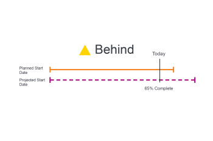

# 任务进度状态概述

<!-- Audited: 1/2024 -->

Adobe Workfront通过查看任务在时间线中的进度来确定任务的进度状态。 您可以配置Workfront以根据任务的进度状态的值确定项目的条件。 有关配置项目条件的更多信息，请参阅文章[项目条件和条件类型概述](../../../manage-work/projects/manage-projects/project-condition-and-condition-type.md)。

## 确定任务进度状态的标准

有关项目进度状态的信息，请参阅[项目进度状态概述](../../../manage-work/projects/planning-a-project/project-progress-status.md)。

有关跟踪任务进度的信息，请参阅[任务跟踪模式概述](../../../manage-work/tasks/task-information/task-tracking-mode.md)。

以下条件决定了任务的进度状态：

<table> 
 <col> 
 <col> 
 <thead> 
  <tr> 
   <th> 
<strong>进度状态</strong> 
 </th> 
   <th> 
<strong>正在确定标准</strong> 
 </th> 
  </tr> 
 </thead> 
 <tbody> 
  <tr valign="top"> 
   <td scope="col"> 
 
 
<strong>开启时间</strong> 
 </td> 
   <td scope="col"> 
当所有计划日期与预计日期匹配时，任务被视为<strong>时间</strong>。 此进度状态还意味着项目提前于计划，并且预计日期可能早于计划日期。
 
有关预计日期的详细信息，请参阅<a href="../../../manage-work/projects/planning-a-project/project-projected-completion-date.md" class="MCXref xref">项目、任务和问题的预计完成日期概述</a>。
 
有关任务计划完成日期的详情，请参阅以下文章：
 
    <ul> 
     <li> 
<a href="../../../manage-work/tasks/task-information/task-planned-start-date.md" class="MCXref xref">任务计划开始日期概述</a> 
 </li> 
     <li> 
<a href="../../../manage-work/tasks/task-information/task-planned-completion-date.md" class="MCXref xref">任务计划完成日期概述</a> 
 </li> 
    </ul> </td> 
  </tr> 
  <tr> 
   <td>

 
<strong>处于风险中</strong> 
 </td> 
   <td>
当预计完成日期晚于计划完成日期且晚于预计完成日期时，任务被视为<strong>处于风险中</strong>。 当任务的限制为<strong>必须完成于</strong>或<strong>必须开始于</strong>，但任务的完成百分比或前置任务关系显示它无法在指定的日期完成或开始时，就会发生这种情况。 

 将任务限制设置为<strong>必须在</strong>完成手动将计划完成日期设置为特定日期。 在这种情况下，预计完成日期与计划完成日期匹配。 在此限制的情况下，Workfront会分析任务以根据完成百分比计算何时完成任务。 此计算将存储为“预计到期日期”。 如果预计到期日晚于预计完成日期，则任务将被视为存在延迟的风险。 
 
 将任务限制设置为<strong>必须于</strong>开始手动将计划开始日期设置为特定日期。 在这种情况下，预计开始日期与计划开始日期匹配。 对于此限制，Workfront会分析任务以根据其前置任务关系计算何时开始。 此计算将存储为“预计开始日期”。 如果某个强制的前置任务不允许任务在指定的开始日期开始，则预计开始日期可以在预计完成日期之后。 该任务被认为有迟到风险。 
 
注意：通常，预计日期与预计日期匹配，但使用<strong>必须在</strong>开始或<strong>必须在</strong>完成的情况除外。 在这些情况下，预计日期会继续根据完成百分比和其他因素（前置任务关系）进行计算，而预计日期会强制匹配已手动设置的计划日期。
 </td> 
  </tr> 
  <tr> 
   <td> 
<strong>滞后</strong> 
 </td> 
   <td> 
当预计完成日期晚于或等于计划完成日期且早于预计完成日期时，任务被视为<strong>晚于</strong>。
 
预计完成日期是基于先前进度何时完成任务的实时视图。 虽然任务开始较晚，但由于计划和预计完成日期仍在未来，并且任务可能仍在按时完成，因此现在不认为任务会延迟。
 
注意： <strong>落后</strong>和<strong>风险</strong>进度状态几乎相同。 但是，<strong>处于风险</strong>表示计划日期中的一个或两个计划日期上存在某些强制任务限制（必须完成日期、必须开始日期、固定日期）。 如果任务没有强制约束，则预计日期与预计日期相同，并反映系统根据任务的当前进度计算完成日期。 任务尚未考虑延迟，因为计划和预计完成日期仍在未来，任务可能仍在按时完成。 有关预计日期和预计日期的更多信息，请参阅<a href="../../../manage-work/tasks/task-information/differentiate-projected-estimated-dates.md" class="MCXref xref">区分预计日期和预计日期</a>。
 </td> 
  </tr> 
  <tr valign="top"> 
   <td> 
<strong>延迟</strong> 
 </td> 
   <td> 
当计划完成日期早于今天日期时，任务为<strong>晚于</strong>。 
 </td> 
  </tr> 
 </tbody> 
</table>

<!--hiding this because some users find the images confusing, as they don't really show the dates mentioned in the descriptions above. Keep the pictures though, in case some users will complain that we hid them. 

## How task Progress Status updates over time

The different date types in our projects tell us how tasks are progressing over time:

* On Time

  

* At Risk

  

* Behind

  

* Late

  

-->