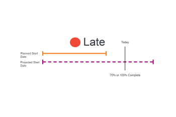

# 任务进度状态概述

Adobe Workfront通过查看任务在时间线中的进度来确定任务的进度状态。 您可以配置Workfront以根据任务的进度状态的值确定项目的完成情况。 有关配置项目条件的更多信息，请参阅文章 [项目完成情况和完成情况类型概览](../../../manage-work/projects/manage-projects/project-condition-and-condition-type.md).

## 确定任务进度状态的标准

有关项目进度状态的信息，请参阅 [项目进度状态概述](../../../manage-work/projects/planning-a-project/project-progress-status.md).

有关跟踪任务进度的信息，请参见 [任务跟踪模式概述](../../../manage-work/tasks/task-information/task-tracking-mode.md).

以下标准决定了任务的进度状态：

<table> 
 <col> 
 <col> 
 <thead> 
  <tr> 
   <th> 
<strong>进度状态</strong> 
 </th> 
   <th> 
<strong>确定标准</strong> 
 </th> 
  </tr> 
 </thead> 
 <tbody> 
  <tr valign="top"> 
   <td scope="col"> 
 
 
<strong>准时</strong> 
 </td> 
   <td scope="col"> 
任务被考虑 <strong>准时</strong> 当所有计划日期与预计日期匹配时。 此进度状态还意味着项目提前，并且预计日期可能早于计划日期。
 
有关预计日期的详细信息，请参阅 <a href="../../../manage-work/projects/planning-a-project/project-projected-completion-date.md" class="MCXref xref">项目、任务和问题的预计完成日期概览</a>.
 
有关任务计划完成日期的详情，请参阅以下文章：
 
    <ul> 
     <li> 
<a href="../../../manage-work/tasks/task-information/task-planned-start-date.md" class="MCXref xref">任务计划开始日期概览</a> 
 </li> 
     <li> 
<a href="../../../manage-work/tasks/task-information/task-planned-completion-date.md" class="MCXref xref">任务计划完成日期概览</a> 
 </li> 
    </ul> </td> 
  </tr> 
  <tr> 
   <td>

 
<strong>处于风险中</strong> 
 </td> 
   <td>
任务被考虑 <strong>处于风险中</strong> 当估计完成日期晚于计划完成日期且晚于预计完成日期时。 当任务具有以下限制时，可能会发生这种情况 <strong>必须完成日期</strong> 或 <strong>必须开始于</strong> 但是，任务的完成百分比或前置任务关系显示它无法在指定的日期完成或开始。 

 将任务限制设置为 <strong>必须完成日期</strong> 人工将计划完成日期设置为特定日期。 在这种情况下，预计完成日期与计划完成日期匹配。 对于此限制，Workfront会分析任务，以根据完成的百分比计算任务的完成时间。 此计算将存储为“预计到期日期”。 如果“估计到期日”晚于“预计完成日期”，则任务会被视为存在延迟的风险。 
 
 将任务限制设置为 <strong>必须开始于</strong> 人工将计划起始日期设置为特定日期。 在这种情况下，预计开始日期与计划开始日期匹配。 对于此限制，Workfront会分析任务以根据其前置任务关系计算开始时间。 此计算将存储为“预计开始日期”。 如果强制执行的前置任务不允许任务在指定的开始日期开始，则预计开始日期可以在预计完成日期之后。 该任务被认为有迟到的风险。 
 
注：通常，预计日期与预计日期匹配，但以下情况除外 <strong>必须开始于</strong> 或 <strong>必须完成日期</strong> 已使用。 在这些情况下，预计日期会继续根据完成百分比和其他因素（前置任务关系）进行计算，而预计日期会强制匹配已手动设置的计划日期。
 </td> 
  </tr> 
  <tr> 
   <td> 
<strong>滞后</strong> 
 </td> 
   <td> 
任务被视为 <strong>滞后</strong> 当估计完成日期晚于或等于计划完成日期，且早于预计完成日期时。
 
预计完成日期是根据先前进度确定任务完成时间的实时视图。 虽然任务开始较晚，但由于计划和预计完成日期仍在未来，并且任务可能仍在按时完成，因此尚未考虑该任务开始较晚。
 
注意： <strong>滞后</strong> 和 <strong>处于风险中</strong> 进度状态几乎完全相同。 但是， <strong>处于风险中</strong> 表示在一个或两个计划日期上有一些强制的任务限制（必须完成日期、必须开始日期、固定日期）。 如果任务没有强制限制，则预计日期与预计日期相同，并反映系统基于任务当前进度计算完成日期。 任务尚未被视为延迟，因为计划和预计完成日期仍在未来，任务可能仍在按时完成。 有关预计日期和预计日期的详细信息，请参阅 <a href="../../../manage-work/tasks/task-information/differentiate-projected-estimated-dates.md" class="MCXref xref">区分预计日期和预计日期 </a>.
 </td> 
  </tr> 
  <tr valign="top"> 
   <td> 
<strong>延迟</strong> 
 </td> 
   <td> 
任务是 <strong>晚的</strong> 当计划完成日期早于今天日期时。 
 </td> 
  </tr> 
 </tbody> 
</table>

<!--hiding this because some users find the images confusing, as they don't really show the dates mentioned in the descriptions above. Keep the pictures though, in case some users will complain that we hid them. 

## How task Progress Status updates over time

The different date types in our projects tell us how tasks are progressing over time:

* On Time

  

* At Risk

  

* Behind

  

* Late

  

-->