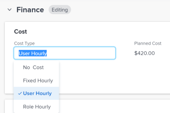

# 更新任务成本类型

任务的计划和实际成本及其人工成本由每个任务的成本类型确定。

您可以为项目中的各个任务配置成本类型。 每种成本类型都会影响计划成本和实际成本值。

有关在Adobe Workfront中跟踪成本的信息，请参阅[跟踪成本](../../../manage-work/projects/project-finances/track-costs.md)。

## 访问要求

您必须具有以下权限才能执行本文中的步骤：

<table style="table-layout:auto"> 
 <col> 
 <col> 
 <tbody> 
  <tr> 
   <td role="rowheader">Adobe Workfront计划*</td> 
   <td> 
任何
 </td> 
  </tr> 
  <tr> 
   <td role="rowheader">Adobe Workfront许可证*</td> 
   <td> 
计划 
 </td> 
  </tr> 
  <tr> 
   <td role="rowheader">访问级别配置*</td> 
   <td> 
编辑对项目、任务和财务数据的访问权限
 
注意：如果您仍然没有访问权限，请咨询Workfront管理员是否对您的访问级别设置了其他限制。 有关Workfront管理员如何修改您的访问级别的信息，请参阅<a href="../../../administration-and-setup/add-users/configure-and-grant-access/create-modify-access-levels.md" class="MCXref xref">创建或修改自定义访问级别</a>。
 </td> 
  </tr> 
  <tr> 
   <td role="rowheader">对象权限</td> 
   <td> 
Contribute或项目的更高权限
 
管理任务的权限
 
有关请求其他访问权限的信息，请参阅<a href="../../../workfront-basics/grant-and-request-access-to-objects/request-access.md" class="MCXref xref">请求访问对象</a>。
 </td> 
  </tr> 
 </tbody> 
</table>

&#42;要了解您拥有什么计划、许可证类型或访问权限，请与Workfront管理员联系。

## 配置单个任务的成本类型

1. 转到要配置成本类型的任务。
1. 单击左侧面板中的&#x200B;**任务详细信息**，然后展开&#x200B;**财务**&#x200B;区域。
1. 双击&#x200B;**成本类型**&#x200B;并选择要应用于任务的成本类型。

   

   从以下选项中选择：

   * 无成本
   * 固定每小时
   * 用户每小时
   * 角色每小时

   有关每种任务成本类型的详细信息，请参阅[跟踪成本](../../../manage-work/projects/project-finances/track-costs.md)。

1. 单击&#x200B;**保存** **更改** **。**
