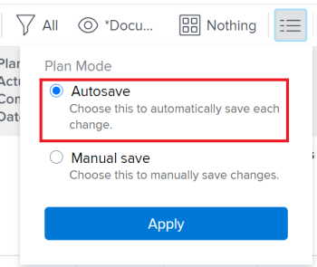

# 通过链接任务创建前置任务关系

在Adobe Workfront中，您可以通过多种方式创建前置任务关系。 一种方法是链接任务。

有关前置任务的信息，请参阅[前置任务概述](../../../manage-work/tasks/use-prdcssrs/predecessors-overview.md)。

通过链接任务，您可以允许系统在选定任务上自动创建前置任务关系，而不是在每项任务上自己手动创建关系。 任务之间仍可以使用不同的前置任务关系类型。

## 访问权限要求

+++ 展开可查看本文所述功能的访问权限要求。

<table style="table-layout:auto"> 
 <col> 
 <col> 
 <tbody> 
  <tr> 
   <td role="rowheader">Adobe Workfront 包</td> 
   <td> 
“任一”
 </td> 
  </tr> 
  <tr> 
   <td role="rowheader">Adobe Workfront许可证</td> 
   <td>
标准
 
   
规划
 </td> 
  </tr> 
  <tr> 
   <td role="rowheader">访问级别配置</td> 
   <td> 
编辑对任务和项目的访问权限
 </td> 
  </tr> 
  <tr> 
   <td role="rowheader">对象权限</td> 
   <td> 
管理任务和项目的权限
</td> 
  </tr> 
 </tbody> 
</table>

有关详细信息，请参阅Workfront文档中的[访问要求](/help/quicksilver/administration-and-setup/add-users/access-levels-and-object-permissions/access-level-requirements-in-documentation.md)。

+++

<!--
Old:
<table style="table-layout:auto"> 
 <col> 
 <col> 
 <tbody> 
  <tr> 
   <td role="rowheader">Adobe Workfront plan</td> 
   <td> 
Any
 </td> 
  </tr> 
  <tr> 
   <td role="rowheader">Adobe Workfront license</td> 
   <td> 
   
Standard 

    
Plan 
 </td> 
  </tr> 
  <tr> 
   <td role="rowheader">Access level configurations</td> 
   <td> 
Edit access to Tasks and Projects
 
Note: If you still don't have access, ask your Workfront administrator if they set additional restrictions in your access level. For information on how a Workfront administrator can modify your access level, see <a href="../../../administration-and-setup/add-users/configure-and-grant-access/create-modify-access-levels.md" class="MCXref xref">Create or modify custom access levels</a>.
 </td> 
  </tr> 
  <tr> 
   <td role="rowheader">Object permissions</td> 
   <td> 
Manage permissions to the tasks and the project
 
For information on requesting additional access, see <a href="../../../workfront-basics/grant-and-request-access-to-objects/request-access.md" class="MCXref xref">Request access to objects</a>.
 </td> 
  </tr> 
 </tbody> 
</table>
-->

## 链接任务以创建前置任务关系

1. 转到包含要链接的任务的项目。
1. 单击左侧面板中的&#x200B;**任务**。
1. （视情况而定）选择任务列表右上角的&#x200B;**自动保存**，然后选择要链接的任务。

   

   >[!IMPORTANT]
   >
   >当您手动保存对任务的更改或使用“时间线计划”模式保存任务时，无法链接任务列表中的任务。

1. 右键单击选定的任务，然后单击&#x200B;**链**。
1. 从以下依赖关系类型中选择：

   * **完成 — 开始**
   * **完成 — 完成**
   * **开始 — 开始**
   * **开始 — 完成**

   有关前置任务依赖关系类型的详细信息，请参阅[任务依赖关系类型概述](../../../manage-work/tasks/use-prdcssrs/task-dependency-types.md)。

1. （可选）如果某些任务之前已链接，请单击&#x200B;**取消链接**。

   >[!CAUTION]
   >
   >批量编辑任务时，使用取消链选项仅会删除连续的前置任务。

   您选择的任务现在由前置任务关系链接。
