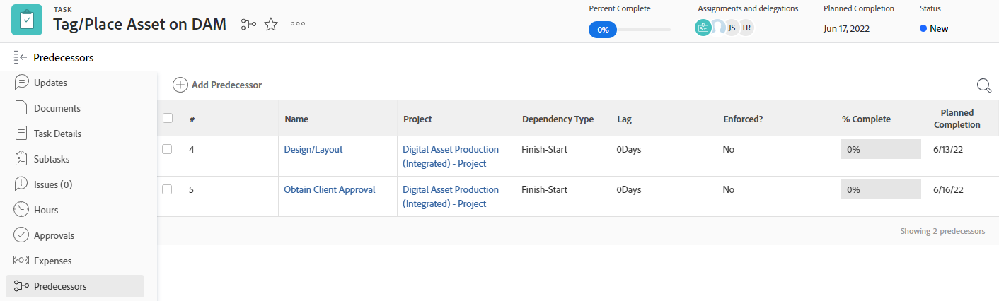

# 任务前置任务概述

<!-- 

CONTEXT SENSITIVE HELP article. DO NOT CHANGE THE NAME OF THE ARTICLE/ DO NOT MOVE OR DELETE! -->

前任是另一个任务（称为后继任务或从属任务）所依赖的任务。 Adobe Workfront支持五种类型的前置依赖关系。 要了解前置任务依赖关系，请参阅 [任务依赖关系类型概述](../../../manage-work/tasks/use-prdcssrs/task-dependency-types.md).

## 前置任务概述

了解前置功能对于了解项目的时间轴非常重要。

任务之间的前置任务关系既存在于单个项目中，也存在于多个项目中。

对于多项目依赖关系，可以建立跨项目前置项。

无论前任任务和后继任务属于同一项目还是属于两个不同的项目，依赖项和时间表都以相同方式计算。

对于前置项，项目时间线会受以下因素影响：

* 前置依赖项
* 滞后值和类型\
   有关依赖关系和滞后的详细信息，请参阅 [任务列表中的前置值示例](#examples-of-predecessor-values-in-a-task-list).

例如，如果任务A是任务B在完成开始关系中的前置任务，并且任务B的任务约束为“尽快”，则Workfront会在任务A的计划完成日期之后立即为任务B分配计划起始日期，而不管是否强制前置任务。

要了解前身关系，您必须了解：

* **依赖关系类型：** 前置任务由各种依赖关系类型链接。 有关依赖关系类型的更多信息，请参阅 [任务依赖关系类型概述](../../../manage-work/tasks/use-prdcssrs/task-dependency-types.md).

* **实施前身：** 在强制执行前置任务时，在前置任务完成之前，将无法启动后续任务。 后续任务在前置任务完成后显示为立即开始。

   Workfront不允许在上一代产品完成之前将其标记为正在进行或完成。 但是，Workfront允许就该任务报告数小时。\
   有关强制使用前置代码的详细信息，请参阅 [强制前置任务](../../../manage-work/tasks/use-prdcssrs/enforced-predecessors.md).

* **滞后：** 您可以在依赖关系中生成延迟，这会造成延迟，该延迟必须在前任任务完成之后以及后续任务开始之前发生。 滞后会影响项目的时间表。

   要了解滞后类型，请参阅 [滞后类型概述](../../../manage-work/tasks/use-prdcssrs/lag-types.md).

## 创建前置关系

要创建前置文件，请参阅以下任一文章：

* 要使用任务的“前置任务”选项卡建立前置任务，请参阅 [使用“前置任务”(Precessivers)区域创建前置任务关系](../../../manage-work/tasks/use-prdcssrs/create-predecessors-in-predecessors-area.md).
* 要在任务列表中建立前置任务，请参阅 [在任务列表上创建前置任务关系](../../../manage-work/tasks/use-prdcssrs/create-predecessors-on-task-list.md).
* 要通过链接任务建立前置关系，请参阅 [通过链接任务创建前置关系](../../../manage-work/tasks/use-prdcssrs/create-predecessors-by-chaining-tasks.md).
* 要建立跨项目的前置任务，请参阅 [创建跨项目前置项](../../../manage-work/tasks/use-prdcssrs/cross-project-predecessors.md).

## 查找任务的前置任务 {#locate-the-predecessors-of-a-task}

要查找任务的前置任务，请执行以下操作之一：

* 转到您正在处理的项目，然后执行以下操作：

   1. 查找要查找前置任务的任务，然后单击该任务。
   1. 单击 **前置任务** 中。 您可能需要单击 **显示更多**，则 **前置任务**.
   1. 前身所在项目的名称显示在 **项目** 列。

      中的数字 **#** 列显示前置任务编号。 例如，“6”表示项目中的第六项任务。

      

* 转到您正在处理的项目，然后执行以下操作：

   1. 单击 **任务** 选项卡。
   1. 选择 **标准视图** 任务列表顶部。
   1. 的 **前置任务** 列显示前置任务编号。

      对于跨项目前置项，“前置项”列显示前置项所属项目的参考编号和任务编号，并用冒号分隔。

      当前任务标记为完成时，前置任务图标将变为绿色。 这表示相关任务已准备就绪。

      将鼠标悬停在此值上，可获取有关上一代产品、项目和日期的更多信息。

      

## 任务列表中的前置值示例 {#examples-of-predecessor-values-in-a-task-list}

在任务列表中查看前置任务时，您可能会看到以下任何类型的前置任务及其各自的“依赖类型”和“滞后”金额：

* **1fs -** 前置任务编号为1。 依赖关系类型为“完成 — 开始”。 在项目时间轴中，此任务计划在任务1完成后立即启动。 尽管如此，仍可将其标记为“正在进行”或“已完成”。
* **1 -** 前置任务编号为1。 这与 **1fs**，因为 **fs** 是Workfront中的默认前置关系。

* **1fse -** 前置任务编号为1。 依赖关系类型为“完成 — 开始”。 在项目时间轴中，此任务在任务1完成后显示为立即开始。 Workfront不允许在任务1完成之前将其标记为正在进行或完成。 但是，Workfront允许就该任务报告数小时。
* **1fs+3d -** 前置任务编号为1。 依赖关系类型为“完成 — 开始”，滞后时间为3天。 在项目时间轴中，此任务在任务1完成后的3个工作日内显示为开始。
* **1fs-3d -** 前置任务编号为1。 依赖关系类型为“完成 — 开始”，滞后时间为3天。 在项目时间轴中，此任务显示为在前置任务完成前3个工作日开始。
* **1fs+3de**  — 前置任务编号为1。 依赖关系类型为“完成 — 开始”，滞后时间为3天。 在项目时间轴中，此任务在任务1完成后的3个工作日内显示为开始。 Workfront不允许在任务1完成之前将其标记为正在进行或完成。 但是，Workfront允许就该任务报告数小时。

   >[!NOTE]
   >
   >强制使用的值(**e**)，而不是前身。

* **4515:2** 前置任务编号为2。  — 这是与项目中具有参考编号的前一项之间的“完成至开始”(Finish to Start)非强制依赖项 **4515**;前置任务编号为 **2**.

## 查看前置信息

您可以在Workfront的以下区域查看前身信息。 这包括有关跨项目前置任务的信息：

* 在任务级别的“前置任务”部分。

   有关在“前置任务”部分中查看前置任务信息的信息，请参阅部分 [查找任务的前置任务](#locate-the-predecessors-of-a-task) 在本文中。

* 在甘特图中。

   有关在甘特图中显示前置项的信息，请参阅 [配置信息在甘特图中的显示方式](../../../manage-work/gantt-chart/use-the-gantt-chart/configure-info-on-gantt-chart.md).

* 在任务列表中。

   要在任务列表中查看有关任务前置任务的信息，可以执行下列操作之一：

   * 在任务列表中应用内置的标准视图。

      有关在“标准”视图中查看前置项信息的信息，请参阅部分 [查找任务的前置任务](#locate-the-predecessors-of-a-task) 在本文中。

   * 构建任务视图或报表，并将“前置”列添加到该视图。

      有关使用前置信息为任务构建自定义视图的详细信息，请参阅 [查看：前置详细信息](../../../reports-and-dashboards/reports/custom-view-filter-grouping-samples/view-predecessor-details.md).

* 访问任务时在任务标题中。

   
