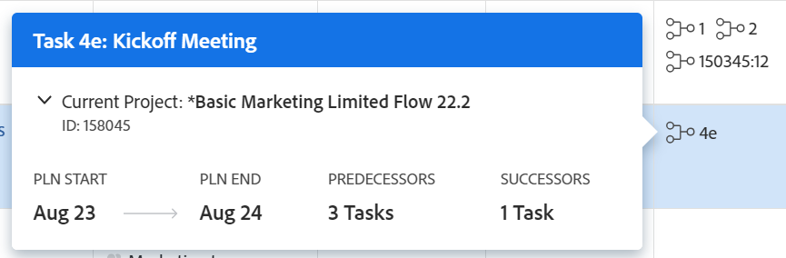

# 前置任务概述

<!--Audited: 12/2023-->

<!-- 

CONTEXT SENSITIVE HELP article. DO NOT CHANGE THE NAME OF THE ARTICLE/ DO NOT MOVE OR DELETE! -->

前置任务是另一个任务（称为后置任务或从属任务）所依赖的任务。 Adobe Workfront支持五种类型的前置任务依赖项。 要了解前置任务依赖关系，请参阅[任务依赖关系类型概述](../../../manage-work/tasks/use-prdcssrs/task-dependency-types.md)。

## 前置任务概述

了解前置任务功能对于了解项目中的时间表很重要。

任务前置任务关系存在于单个项目中的任务之间以及不同项目中的任务之间。

在多项目依赖关系的情况下，您可以在来自两个不同项目的任务之间建立跨项目前置任务。

无论前置任务和后续任务属于同一项目还是属于两个不同的项目，每个项目的依赖项和时间线的计算均采用相同方式。

对于前置任务，项目时间线受以下影响：

* 前置任务依赖项
* 滞后值和类型\
  有关依赖项和延迟的详细信息，请参阅[任务列表中的前置任务值示例](#examples-of-predecessor-values-in-a-task-list)。

  例如，如果任务A是结束 — 开始关系中任务B的前置任务，并且任务B的任务限制为“尽快”，则Workfront会将任务B的规划开始日期分配在任务A的规划完成日期之后，而不管是否强制实施该前置任务。

要了解前置任务关系，您必须了解：

* **依赖关系类型：**&#x200B;前置任务由各种依赖关系类型链接。 有关依赖关系类型的详细信息，请参阅[任务依赖关系类型概述](../../../manage-work/tasks/use-prdcssrs/task-dependency-types.md)。

* **强制实施前置任务：**&#x200B;强制实施前置任务时，前置任务完成后才能开始后续任务。 后续任务将在前置任务完成后立即开始执行。

  当前置任务未完成（或已开始）并且未强制执行时，前置任务可以开始，但项目时间线仍受前置任务和后续任务的日期影响。

  对于强制实施的前置任务，在前置任务完成之前，Workfront不允许将后续任务标记为“进行中”或“完成”。

  但是，Workfront允许在该任务中报告小时数。\
  有关强制前置任务的详细信息，请参阅[强制前置任务](../../../manage-work/tasks/use-prdcssrs/enforced-predecessors.md)。

* **延迟：**&#x200B;您可以在依赖项中生成延迟，这会造成前置任务完成后以及后续任务开始之前必须发生的延迟。 滞后会影响项目的时间表。

  要了解滞后类型，请参阅[滞后类型概述](../../../manage-work/tasks/use-prdcssrs/lag-types.md)。

## 创建前置任务关系

要创建前置任务，请参阅以下任意文章：

* 若要使用任务的“前置任务”选项卡建立前置任务，请参阅[使用前置任务区域创建前置任务关系](../../../manage-work/tasks/use-prdcssrs/create-predecessors-in-predecessors-area.md)。
* 要在任务列表中建立前置任务，请参阅[在任务列表中创建前置任务关系](../../../manage-work/tasks/use-prdcssrs/create-predecessors-on-task-list.md)。
* 要通过链接任务来建立前置任务关系，请参阅[通过链接任务创建前置任务关系](../../../manage-work/tasks/use-prdcssrs/create-predecessors-by-chaining-tasks.md)。
* 要建立跨项目前置任务，请参阅[创建跨项目前置任务](../../../manage-work/tasks/use-prdcssrs/cross-project-predecessors.md)。

## 查找任务的前置任务 {#locate-the-predecessors-of-a-task}

要查找任务的前置任务，请执行下列操作之一：

* 转到您正在处理的项目并执行以下操作：

   1. 查找要为其查找前置任务的任务，然后单击该任务。
   1. 单击左侧面板中的&#x200B;**前置任务**。 您可能需要单击&#x200B;**显示更多**，然后单击&#x200B;**前置任务**。
   1. 前置任务所在项目的名称显示在&#x200B;**项目**&#x200B;列中。

      **#**&#x200B;列中的数字显示前置任务编号。 例如，“6”表示项目中的第六个任务。

      任务](assets/predecessors-area-with-task-header.png)的![前置任务部分

* 转到您正在处理的项目并执行以下操作：

   1. 单击&#x200B;**任务**&#x200B;选项卡。
   1. 选择任务列表顶部的&#x200B;**标准视图**。
   1. **前置任务**&#x200B;列显示前置任务编号。

      对于跨项目前置任务，“前置任务”列显示前置任务所属项目的参考编号和任务的编号（以冒号分隔）。

      将前置任务标记为完成时，前置任务图标会变为绿色。 这表示依赖任务已准备好工作。

      将鼠标悬停在此值上可获取有关前置任务、项目和日期的更多信息。

      

## 任务列表中的前置任务值示例 {#examples-of-predecessor-values-in-a-task-list}

在任务列表中查看前置任务时，您可能会看到以下任何类型的前置任务及其各自的依赖项类型和滞后时间量：

* **1fs -**&#x200B;前置任务编号为1。 依赖关系类型为Finish-Start。 在项目时间线中，此任务计划在任务1完成后立即开始。 尽管如此，仍可将其标记为“进行中”或“完成”。
* **1 -**&#x200B;前置任务编号为1。 这与&#x200B;**1fs**&#x200B;相同，因为&#x200B;**fs**&#x200B;是Workfront中的默认前置任务关系。

* **1fse -**&#x200B;前置任务编号为1。 依赖关系类型为Finish-Start-Enforced。 在项目时间线中，此任务显示为任务1完成后立即开始。 在任务1完成之前，Workfront不允许将其标记为正在进行或完成。 但是，Workfront允许在该任务中报告小时数。
* **1fs+3d -**&#x200B;前置任务编号为1。 依赖项类型为“完成 — 开始”，延迟时间为3天。 在项目时间线中，此任务显示为任务1完成后开始3个工作日。
* **1fs-3d -**&#x200B;前置任务编号为1。 依赖项类型为“完成 — 开始”，延迟时间为3天。 在项目时间线中，此任务显示为前置任务完成前3个工作日的开始。
* **1fs+3de** — 前置任务编号为1。 依赖项类型是Finish-Start-Enforced，延迟时间为3天。 在项目时间线中，此任务显示为任务1完成后开始3个工作日。 在任务1完成之前，Workfront不允许将其标记为正在进行或完成。 但是，Workfront允许在该任务中报告小时数。

  >[!NOTE]
  >
  >必须将强制值(**e**)添加到Lag，而不是添加到前置任务。

* **4515:2**&#x200B;前置任务编号为2。  — 这是从完成到开始，与项目中引用编号为&#x200B;**4515**&#x200B;的前置任务之间的非强制依赖关系。

## 查看前置任务信息

您可以在Workfront的以下区域中查看前置任务信息。 其中包括有关跨项目前置任务的信息：

* 在任务级别的“前置任务”部分。

  有关查看“前置任务”部分中的前置任务信息的信息，请参阅本文中的[查找任务的前置任务](#locate-the-predecessors-of-a-task)部分。

* 在甘特图中。

  有关在甘特图中显示前置任务的信息，请参阅[配置信息在甘特图上的显示方式](../../../manage-work/gantt-chart/use-the-gantt-chart/configure-info-on-gantt-chart.md)。

* 在任务列表中。

  要在任务列表中查看有关任务的前置任务的信息，可以执行以下操作之一：

   * 在任务列表中应用内置标准视图。

     有关在标准视图中查看前置任务的信息，请参阅本文中的[查找任务的前置任务](#locate-the-predecessors-of-a-task)部分。

   * 构建任务视图或报告，并将“前置任务”列添加到该视图。

     有关为包含前置任务信息的任务生成自定义视图的详细信息，请参阅[视图：前置任务详细信息](../../../reports-and-dashboards/reports/custom-view-filter-grouping-samples/view-predecessor-details.md)。

* 在任务标题中。

  
