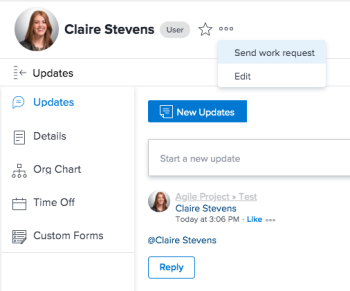

# 配置[!UICONTROL 完成]按钮以解决问题

[!UICONTROL 完成]按钮可以自动设置任务或问题的状态。 默认情况下，当被分派人在其工作项上单击[!DNL Adobe Workfront]完成[!UICONTROL 时，]会将问题标记为[!UICONTROL 已解决]。

>[!NOTE]
>
>在Workfront的所有区域中，“完成”按钮显示为“标记为完成”。

## 概述

具有特定权限的用户可以配置[!UICONTROL Done]按钮以反映系统中的特定状态。 [!UICONTROL Done]按钮处理[!DNL Workfront]中的问题有3种不同的方式：

* 如果用户已分配[!UICONTROL 主团队]、[!DNL Workfront]管理员或具有[!UICONTROL 计划]许可证的用户可以配置[!UICONTROL 完成]按钮以反映团队成员的特定状态。 请参阅本文中的[为团队[!UICONTROL 配置]完成](#configure-the-uicontrol-done-button-for-a-team)按钮。
* 如果用户没有[!UICONTROL 主页团队]，但其个人资料中包含[!UICONTROL 其他团队]，则Workfront将在任何与该用户关联的团队上搜索[!UICONTROL 完成]按钮的设置。 该选择是随机的，并且与任何团队关联的状态用于该问题。
* 如果用户未分配[!UICONTROL 家庭团队]，则用于问题的[!UICONTROL 完成]按钮与系统生成的[!UICONTROL 已解决]状态关联，该状态具有三个字母的代码[!UICONTROL RLV]。 此方案中没有可用的配置选项。 [!UICONTROL 完成]按钮自动默认为此状态。
* 如果删除了[!UICONTROL 已解决] ([!UICONTROL RLV])状态，并且将此问题标记为[!UICONTROL 完成]的用户没有[!UICONTROL 主团队]，则默认问题状态将与分配给该问题所属项目的组的[!UICONTROL 已关闭]的默认设置值相关联。 Workfront管理员可以为组配置系统范围的默认设置。 请参阅本文中的[已解决[!UICONTROL 状态被删除时]配置[!UICONTROL 完成]按钮](#configure-the-uicontrol-done-button-when-the-uicontrol-resolved-status-has-been-deleted)。

## 访问权限要求

+++ 展开可查看本文所述功能的访问权限要求。

<table style="table-layout:auto"> 
 <col> 
 <col> 
 <tbody> 
  <tr data-mc-conditions=""> 
   <td role="rowheader"> 
Adobe Workfront 包
 </td> 
   <td>“任一”</td> 
  </tr> 
  <tr> 
   <td role="rowheader">Adobe Workfront许可证</td> 
   <td>
   
标准

   
规划
</td>
  </tr> 
  <tr data-mc-conditions=""> 
   <td role="rowheader">访问级别配置</td> 
   <td> 
当删除已解决状态时，需要系统管理员访问权限才能配置完成按钮
 </td> 
  </tr> 
 </tbody> 
</table>

有关此表中信息的详细信息，请参阅[Workfront文档中的访问要求](/help/quicksilver/administration-and-setup/add-users/access-levels-and-object-permissions/access-level-requirements-in-documentation.md)。

+++

## 为团队配置[!UICONTROL 完成]按钮

您可以使用[!UICONTROL 完成]按钮更改应用于工作项的状态。 您还可以设置多个状态，并允许用户选择合适的状态。

{{step1-to-team}}

1. 单击&#x200B;**[!UICONTROL 切换团队]**&#x200B;图标，然后从下拉菜单中选择新团队或在搜索栏中搜索团队。
1. 单击&#x200B;**[!UICONTROL 更多]**&#x200B;菜单，然后单击&#x200B;**[!UICONTROL 编辑]**。
1. 在&#x200B;**[!UICONTROL 团队设置]**&#x200B;页面的底部找到&#x200B;**[!UICONTROL 完成按钮]**&#x200B;部分。

1. 为每个工作项类型选择一个状态或多个状态。

   >[!NOTE]
   >
   >为任务或问题选择状态时，请考虑以下事项：
   >
   >* 如果为每种类型的工作项选择一个状态，则当用户单击其项的[!UICONTROL 完成]时，任务或问题状态将设置为该状态。 如果为每种类型的工作项设置了多个状态，则会在[!UICONTROL 完成]按钮中添加一个下拉菜单，用户必须选择一种状态来更改该工作项的状态。
   >* 您只能将系统级别状态与[!UICONTROL 完成]按钮相关联。 不能将组特定状态与工作项状态相关联。
   >* 当分配给该项的用户将该项置于与[!UICONTROL 完成]按钮关联的状态时，无论您选择的状态是[!UICONTROL 已完成]还是[!UICONTROL 已关闭]状态或工作状态，该项对该用户显示为[!UICONTROL 完成]。
   >   
   >   
   >  例如，将[!UICONTROL Done]按钮与In Progress关联将使状态从“新建”更改为“进行中”的用户的工作项显示为[!UICONTROL Done]。
   >   
   >* 问题类型是可自定义的，它们的名称可能与您的环境中下面列出的名称不同。\
   >  以下是默认的任务和问题类型：
   >     
   >   * [!UICONTROL 任务]
   >   * [!UICONTROL 问题]
   >   * [!UICONTROL 请求]
   >   * [!UICONTROL 更改顺序]
   >   * [!UICONTROL 错误报告]

   如果将任务或问题分配给多个用户，除了为您的团队选择的多个状态之外，您还在下拉菜单中看到“[!UICONTROL 完成我的部件]”选项。

1. 单击&#x200B;**[!UICONTROL 保存更改]**。

## 将用户与主团队关联

若要使用户能够看到对[!UICONTROL 完成]按钮功能的更改，您可以使更改了其设置的团队成为这些用户的主团队。

要将用户与主页团队关联，请执行以下操作：

1. 单击&#x200B;**[!UICONTROL 右上角的]**&#x200B;主菜单图标[!DNL Adobe Workfront]。

1. 单击&#x200B;**[!UICONTROL “用户”]**，然后选择要与主页团队关联的一个或多个用户。
1. 单击&#x200B;**[!UICONTROL 更多]**&#x200B;菜单，然后选择&#x200B;**[!UICONTROL 编辑]**。\
   

1. 在&#x200B;**[!UICONTROL 组织]**&#x200B;部分中，选择&#x200B;**[!UICONTROL 主页团队]**&#x200B;字段。 开始键入您想要将其设置与用户相关联的团队的名称。 当在列表中看到团队名称时，单击该名称。

1. 单击&#x200B;**[!UICONTROL 保存更改]**。\
   现在，您选择的用户已与“主团队”相关联。
任何团队设置（包括与“[!UICONTROL 完成]”按钮关联的状态）现在对这些用户均可见。

## 在删除[!UICONTROL 已解决]状态时配置[!UICONTROL 完成]按钮

如果用户没有家庭团队，并且已删除[!UICONTROL 已解决]&#x200B;([!UICONTROL RLV])的系统范围的默认值，则[!DNL Workfront]管理员可以在项目上为组配置[!UICONTROL 已关闭]状态。 当用户单击[!DNL Workfront]按钮时，[!DNL Done]为已关闭的问题选择此状态。

### 查找与项目关联的组

当用户创建项目时，其主组会自动分配给该项目。 对项目具有[!UICONTROL 管理]访问权限的用户可以随时在[!UICONTROL 项目详细信息]部分中更改此组。 要了解在此情况下已完成问题[!DNL Workfront]使用什么状态，您必须了解问题所在的项目与哪个组相关联，以及该组对问题具有[!UICONTROL 已关闭]的默认状态。

要查找与项目关联的组，请执行以下操作：

1. 转到项目。
1. 在页面的左侧，单击&#x200B;**[!UICONTROL 项目详细信息]**。
1. 找到&#x200B;**[!UICONTROL 项目关联]**&#x200B;部分，然后找到&#x200B;**[!UICONTROL 组]**。\
   您需要使用此组名称来检查“设置”区域中的状态。 有关如何更新特定组的默认状态的说明，请参阅以下部分。

### 更新特定组的默认状态

作为[!UICONTROL Workfront]管理员，您可以更新特定组的状态：

1. 单击Adobe Workfront右上角的&#x200B;**[!UICONTROL “主菜单”]**&#x200B;图标，然后单击&#x200B;**[!UICONTROL “设置”]**。
1. 在左侧面板中，单击&#x200B;**[!UICONTROL 项目首选项]**，然后单击&#x200B;**[!UICONTROL 状态]**。

1. 单击&#x200B;**[!UICONTROL 问题]**，然后在右侧的&#x200B;**[!UICONTROL 系统状态]**&#x200B;搜索框中键入组的名称。

1. 选择组。
1. 单击&#x200B;**[!UICONTROL 设置默认状态]**&#x200B;下拉菜单，然后为[!UICONTROL 已关闭]选择默认状态。 当用户单击[!DNL Workfront]完成[!UICONTROL 按钮时，]对已关闭的问题使用此状态。

   >[!IMPORTANT]
   >
   >仅当用户没有分配家庭团队并且已删除[!UICONTROL RLV]状态时，才使用此状态。

1. 单击&#x200B;**[!UICONTROL 保存]**。
