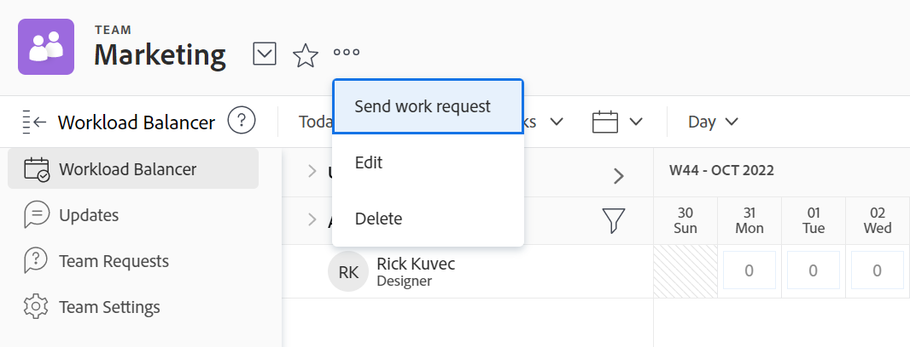

# 编辑团队设置

作为 [!DNL Adobe Workfront] 管理员或具有 [!UICONTROL 计划] 或 [!UICONTROL 工作] 许可证，您可以编辑 [!UICONTROL 团队设置].

您可以向团队添加用户、设置团队布局模板，以及设置团队完成工作项目时状态的记录方式。

## 访问要求

您必须具有以下访问权限才能执行本文中的步骤：

<table style="table-layout:auto"> 
 <col> 
 </col> 
 <col> 
 </col> 
 <tbody> 
  <tr> 
   <td role="rowheader"><strong>[!DNL Adobe Workfront] 计划*</strong></td> 
   <td> 
任意
 </td> 
  </tr> 
  <tr> 
   <td role="rowheader"><strong>[!DNL Adobe Workfront] 许可证*</strong></td> 
   <td> 
工作或更高
 </td> 
  </tr> 
 </tbody> 
</table>

&#42;要了解您拥有的计划或许可证类型，请联系 [!DNL Workfront] 管理员。

## 编辑团队设置

1. 单击 **[!UICONTROL 主菜单]** 图标  在Adobe Workfront的右上角，单击 **[!UICONTROL 团队]**.

1. 单击 **[!UICONTROL 切换组]** 图标 ，然后从下拉菜单中选择新团队，或在搜索栏中搜索团队。

1. 单击 **[!UICONTROL 更多]** 菜单 ，然后选择 **[!UICONTROL 编辑]**.

   仅具有 [!UICONTROL 计划] 或 [!UICONTROL 工作] 许可证请参阅此选项。

   如果您应该 [!UICONTROL 编辑] 选项，但您未看到它，请咨询Workfront管理员以验证 [!UICONTROL 团队设置] 在的布局模板中可见 [!UICONTROL Scrum团队], [!UICONTROL 看板组]或 [!UICONTROL 瀑布团队].

   

1. 在团队设置中，您可以进行以下类型的更改：

   * 修改团队名称
   * 停用团队
   * 将团队与组关联

      >[!NOTE]
      >
      >将团队分配到组或子组后，该组或子组的任何组管理员都可以管理团队，而不是其成员。 群组管理员可以从主菜单转到“团队”区域，然后单击 [!UICONTROL 切换团队] 箭头  列出分配给其管理的组的所有团队。

      您可以通过将鼠标悬停在相应的组上并单击信息图标，确保将相应的组与团队关联  显示在其旁边的。 此时会显示工具提示，其中列出了有关群组的信息，例如群组上的群组层次结构及其管理员。

   * 指定团队所有者
   * 添加和删除团队成员
   * 添加团队的描述
   * 将布局模板应用于团队

      有关将自定义布局模板应用于团队的更多信息，请参阅更改 [!UICONTROL 我的工作] 和 [!UICONTROL 工作请求] 区域。

   * 通过选择 **[!UICONTROL 这是一个敏捷的团队]** 选项。

      有关敏捷团队以及如何在敏捷团队中管理工作的更多信息，请参阅 [创建敏捷的团队](../../agile/get-started-with-agile-in-workfront/create-an-agile-team.md).

   * 更改 [!UICONTROL It工作] 按钮 [!UICONTROL 开始] 按钮。 有关如何配置 [!UICONTROL 开始] 按钮，请参阅 [将“Work On It”按钮替换为 [!UICONTROL 开始] 按钮](../../people-teams-and-groups/create-and-manage-teams/work-on-it-button-to-start-button.md).
   * 自定义 **[!UICONTROL 完成]** 按钮。 有关如何自定义 [!UICONTROL 完成] 按钮，请参阅：

      * [配置 [!UICONTROL 完成] “任务”按钮](../../people-teams-and-groups/create-and-manage-teams/configure-the-done-button-for-tasks.md)
      * [配置 [!UICONTROL 完成] 问题按钮](../../people-teams-and-groups/create-and-manage-teams/configure-the-done-button-for-issues.md)

1. 单击 **[!UICONTROL 保存更改]**.
