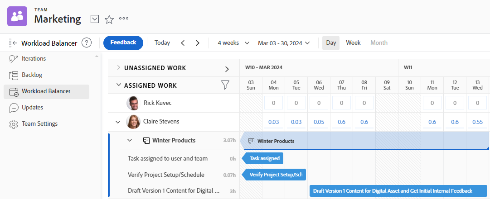

# 管理您的团队正在处理的工作

您可以在团队的[!UICONTROL 团队请求]部分中看到您的团队正在处理的项目列表。

您可以在团队的[!UICONTROL 工作负载均衡器]部分中分配未分配项目、调整当前分配、调整当前分配等。

有关如何管理分配给您团队的工作的详细信息，请参阅[[!UICONTROL 工作负载均衡器]](../../resource-mgmt/workload-balancer/assign-work-in-workload-balancer.md)。

显示工作负载均衡器的
