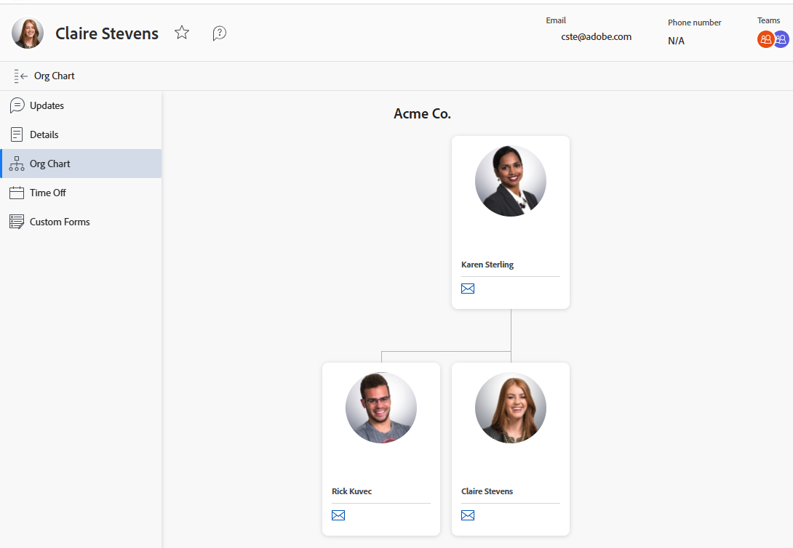

# 查看组织图

组织图功能允许您查看与特定[!DNL Adobe Workfront]用户关联的组织图。 组织图是可视化特定部门结构的好方法。

## 访问权限要求

+++ 展开可查看本文所述功能的访问权限要求。

<table style="table-layout:auto">
 <col> 
 <col> 
 <tbody> 
  <tr> 
   <td>Adobe Workfront 包</td> 
   <td>
“任一”
</td> 
  </tr> 
  <tr> 
   <td>Adobe Workfront许可证</td> 
   <td>
   
浅色或更高

   
审核或更高
</td>
  </tr> 
 </tbody> 
</table>

有关信息，请参阅Workfront文档中的[访问要求](/help/quicksilver/administration-and-setup/add-users/access-levels-and-object-permissions/access-level-requirements-in-documentation.md)。

+++

## 查找用户的组织结构图

{{step1-click-profile-pic}}

1. 在左侧面板中，单击&#x200B;**[!UICONTROL 组织结构图]**。
   

   此时会显示组织图。
