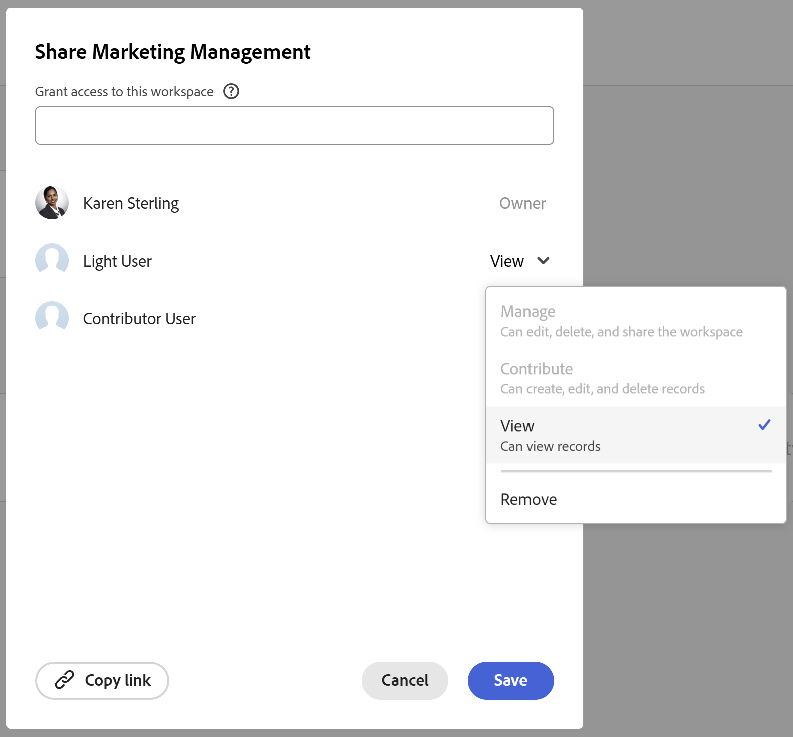

# 使用Adobe Workfront Planning时的许可证类型概述

<!--
The highlighted information on this page refers to functionality not yet generally available. It is available only in the Preview environment for all customers. After the release to Preview, the same features are also available monthly in the Production environment for customers who enabled fast releases.    

For information about fast releases, see [Enable or disable fast releases for your organization](/help/quicksilver/administration-and-setup/set-up-workfront/configure-system-defaults/enable-fast-release-process.md). 
-->

<!--{{planning-important-intro}}-->

>[!IMPORTANT]
>
>本文中的信息介绍了Adobe Workfront Planning。 Workfront Planning是独立的产品，或者是Adobe Workfront另外购买的功能。
>
>
>本文包含有关客户同时购买Workfront或Workflow包时Workfront Planning的一般信息。
>
>有关包含Workfront Planning文档的文章的完整列表，请参阅[Adobe Workfront Planning的一般信息和文章索引](/help/quicksilver/planning/planning-information.md)。
>
>有关Workfront Planning作为独立产品的信息，请参阅[Adobe Workfront Planning作为独立产品入门](/help/quicksilver/planning/planning-sta/planning-sta-overview.md)。

您的Adobe Workfront Workflow许可证类型与Adobe Workfront Planning许可证类型配合使用并具有Planning权限，可提供以下访问权限：

* 查看、提供或管理工作区、记录类型和记录。
* 查看或管理视图。

有关Workfront Planning中对象权限的信息，请参阅[Adobe Workfront Planning中的权限共享概述](/help/quicksilver/planning/access/sharing-permissions-overview.md)。

有关访问Workfront Planning的信息，请参阅[Adobe Planning访问概述](/help/quicksilver/planning/access/access-overview.md)。

## 工作流与Planning许可证类型之间的关系

用户的访问级别可以与以下许可证类型相关联：

* 工作流许可证类型
* 规划许可证类型

有关信息，请参阅[创建和修改自定义访问级别](/help/quicksilver/administration-and-setup/add-users/configure-and-grant-access/create-modify-access-levels.md)。

可用于分配用户的Planning许可证类型因贵组织购买的Workfront包而异。

<!--

This list also exists here: \help\quicksilver\planning\planning-sta\planning-sta-overview.md
-->

您的组织可以通过多种方式购买Workfront Planning：

* 与Workfront Workflow包一起，为工作流和规划提供相同数量的许可证。 用户将同时获得对Adobe Workfront Workflow和Planning完整功能的访问权限。
* 与Workfront Workflow包一起，为工作流和规划提供不同数量的许可证。 用户将获得对Adobe Workfront工作流的完整功能的访问权限以及对Workfront Planning的有限访问权限。
* Workfront Planning本身，作为独立产品。 用户无权访问Workfront工作流功能，并有权完全访问Workfront Planning的功能。 有关信息，请参阅[Adobe Workfront Planning独立产品入门](/help/quicksilver/planning/planning-sta/planning-sta-overview.md)。

下表描述了工作流与Planning许可证类型之间的关系，以及基于这些许可证的用户功能：

| Workfront包 | Planning许可证类型 | 工作流许可证类型 | 许可功能 |
|---|---|---|---|
| 计划和工作流 — 相同数量的许可证 | 标准、参与者、无权访问 | 标准、轻量、参与者 | - Planning和Workflow许可证类型在访问级别上是单独的设置 - Planning许可证类型允许Standard、Contributor和空白选项 - Planning许可证类型在任何访问级别上都可以留空 — 具有此访问级别的用户无权访问Planning  — 工作流许可证类型不能留空  — 不允许具有Workflow Contributor许可证组合的Planning Standard - Planning Standard只能通过工作流轻量级和标准许可证进行选择 |
| 计划和工作流 — 许可证数量不均衡 | 标准，无访问权限 | 标准、轻量、参与者 | - Planning和Workflow许可证类型在访问级别上是单独的设置 - Planning许可证类型仅允许“标准”或“无访问”选项  — 可选择Planning Standard和任何Workflow许可证类型  - Planning许可证类型可为“无” — 具有此访问级别的用户完全无法访问Planning数据  — 工作流许可证类型在任何访问级别上不能留空  — 具有Planning Contributor许可证的用户可以在Planning中查看已连接的工作流对象，但不能连接或断开连接 |

有关Workfront Planning中授权的详细信息，请参阅[Adobe Workfront Planning访问概述](/help/quicksilver/planning/access/access-overview.md)。

<!--
not sure if we need this anymore, this is before STA launched:

| Adobe Workfront license type                                   | Highest permissions allowed in Adobe Workfront Planning                                                                                                                                             |
|------------------------------------------------|-------------------------------------------------------------------------------------------------------------------------------------------------------------------------------|
|Standard                     | 
Users can manage workspaces, record types, records, and views. They can create, edit, or delete workspaces, record types, records, fields, and views.
 
System administrators have Manage permissions to all workspaces, including the ones they did not create.
                                                                                                                     |
| Light or Contributor  | 
Users can view the workspaces shared with them, as well as the record types, records, and fields of those workspaces.
   
Users can view the views shared with them, but they cannot create their own. 
  
Users cannot create, edit, or delete workspaces, record types, records, or fields.
|
-->

<!--
Old: 
*Workfront Planning is not available for legacy Workfront licenses. 
For more information, see [Access requirements in Workfront documentation](/help/quicksilver/administration-and-setup/add-users/access-levels-and-object-permissions/access-level-requirements-in-documentation.md).
-->

## 许可证类型以及工作区和记录类型的权限

向用户授予对工作区的权限也会授予他们记录类型、记录和字段的权限。

除了用户拥有的工作区权限之外，还必须向用户授予单独的视图权限，以便用户能够访问和管理视图。

使用记录类型权限时，请考虑以下事项：

* 用户自动从工作区继承记录类型权限。
* 当用户具有工作区的管理权限时，他们对记录类型的访问权限不能减少到仅此而已。
* 用户对于记录类型的权限不能超过其对于该记录类型所属的工作区的权限。
* 删除用户对记录类型的权限不会删除他们对工作区中所有记录类型的查看访问权限，因为这不会删除他们对工作区的权限。

只有拥有Planning Standard许可证的用户才能对工作区和记录类型具有Contribute或Manage权限。 默认情况下，对工作区和记录类型的Contribute和Manage权限也会传输到记录和字段。

管理员可以查看系统中的所有工作区，包括他们未创建的工作区。

<!--
Lilit asked for this to be removed as there is no Planning Admin license/ access for combos: 
>[!TIP]
>
>Planning Administrator access is automatically assigned to users that you create as Administrators in the Adobe Admin Console. 
>
>For information, see [Manage users in the Adobe Admin Console](/help/quicksilver/administration-and-setup/add-users/create-and-manage-users/admin-console.md).

Users with all other license types can have View permissions to workspaces and record types  shared with them, as well as to their records and fields. 
-->

>[!INFO]
>
>**示例：**
>
>规划参与者或工作流轻量级用户无法参与或管理工作区及其对象。
>
>共享框中有一个指示，当用户拥有较低级别的许可证时，无法向其授予参与工作区或管理工作区的权限，因为这些权限级别灰显。
>
>

## 许可证类型和视图权限

只有具有Planning Standard许可证的用户才能拥有视图的管理权限。

管理员无法访问他们未创建的视图。 必须与他们共享。

具有所有其他许可证类型的用户均可以拥有查看与其共享的视图的权限。

>[!INFO]
>
>**示例：**
>
>Planning参与者或工作流轻量级许可证用户无法管理视图。 他们可以应用临时过滤器、排序或分组到他们可以访问的视图。
>
>共享框中有一个指示，当用户拥有较低级别的许可证时，无法授予用户管理视图的权限，因为这些权限级别灰显。
>
>
