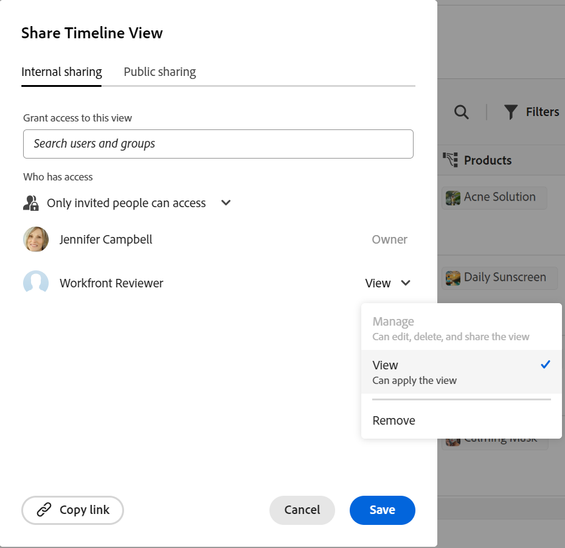

<!--update the metadata with real things when making this public; also update the description with something like this: Not all users in the organization have the same access and permissions to use Adobe Workfront plannint. This article describes the levels of access that users could have to Adobe Workfront Planning. -->
<!--update the title and the metadata title if Workfront Planning is NOT its own product - because the title is too generic for it being a Workfront capability-->

# 使用Adobe Workfront Planning时的许可证类型概述

{{planning-important-intro}}

您的Adobe Workfront许可证类型可与Adobe Workfront Planning权限配合使用，以提供以下访问权限：

* 查看、提供或管理工作区
* 查看或管理视图。

有关Workfront Planning中对象权限的信息，请参阅[Adobe Workfront Planning中的权限共享概述](/help/quicksilver/planning/access/sharing-permissions-overview.md)。

## Workfront许可证类型与Workfront Planning权限之间的关系

下表描述了Adobe Workfront中用户的许可证类型与您可以根据该许可证向他们授予Adobe Workfront Planning对象的权限级别之间的关系。

向用户授予对工作区的权限也会授予他们记录类型、记录和字段的权限。

| Adobe Workfront许可证类型* | Adobe Workfront Planning中允许的最高权限 |
|------------------------------------------------|-------------------------------------------------------------------------------------------------------------------------------------------------------------------------------|
| 新：标准 或 当前：计划 | 用户可以管理工作区。 他们可以创建、编辑或删除工作区、记录类型、记录和字段。  系统管理员对所有工作区具有管理权限，包括他们未创建的工作区。 |
| 新：轻量级，参与者 或 当前：工作，请求者，查看者 | 用户可以查看与其共享的工作区，以及这些工作区的记录类型、记录和字段。  用户无法创建、编辑或删除工作区、记录类型、记录或字段。 |

*有关详细信息，请参阅Workfront文档中的[访问要求](/help/quicksilver/administration-and-setup/add-users/access-levels-and-object-permissions/access-level-requirements-in-documentation.md)。

<!--Replace the table above with the following at GA:

| Adobe Workfront license type*                                   | Highest permissions allowed in Adobe Workfront Planning                                                                                                                                             |
|------------------------------------------------|-------------------------------------------------------------------------------------------------------------------------------------------------------------------------------|
|Standard                     | Users can manage workspaces. They can create, edit, or delete workspaces, record types, records, and fields.   System administrators have Manage permissions to all workspaces, including the ones they did not create.                                                                                                                     |
| Light or Contributor  | Users can view the workspaces shared with them, as well as the record types, records, and fields of those workspaces.   Users cannot create, edit, or delete workspaces, record types, records, or fields.|

*Workfront Planning is not available for legacy Workfront licenses. 
For more information, see [Access requirements in Workfront documentation](/help/quicksilver/administration-and-setup/add-users/access-levels-and-object-permissions/access-level-requirements-in-documentation.md).-->

### 许可证类型和工作区权限

只有具有Standard（或Plan）许可证的用户才能拥有对工作区的Contribute或管理权限。 具有所有其他许可证类型的用户都可以拥有查看与其共享的工作区的权限。

系统管理员可以查看系统中的所有工作区，甚至包括他们未创建的工作区。

>[!INFO]
>
>**示例：**
>
>请求者（或协作者，根据新的许可证模型）无法参与或管理工作区及其对象。
>
>共享框中有一个指示，当用户拥有较低级别的许可证时，无法向其授予参与工作区或管理工作区的权限，因为这些权限级别灰显。
>
>

<!--Replace all the content in the section above with the following at Planning GA

Only users with a Standard license can have Contribute or Manage permissions to workspaces. Users with all other license types can have View permissions to workspaces shared with them. 

System administrators can view all workspaces in the system, even the ones they did not create. 

>[!INFO]
>
>**EXAMPLE:** 
>
>Contributors or Light-license users cannot contribute to or manage workspaces and their objects. 
>
>There is an indication in the sharing box that users cannot be granted permissions to contribute to or manage a workspace when they hold a lower-level license, as these permissions levels are dimmed. 
>
>
-->

### 许可证类型和查看权限

只有拥有标准（或计划）许可证的用户才能拥有视图的管理权限。 具有所有其他许可证类型的用户均可以拥有查看与其共享的视图的权限。

>[!INFO]
>
>**示例：**
>
>参与者（或请求者和查看者）无法管理视图。 他们可以应用临时过滤器、排序或分组到他们可以访问的视图。
>
>共享框中有一个指示，当用户拥有较低级别的许可证时，无法授予用户管理视图的权限，因为这些权限级别灰显。
>
>

<!--Replace all of the above in this section with the following at GA:

Only users with a Standard license can have Manage permissions to views. Users with all other license types can have View permissions to views shared with them. 

>[!INFO]
>
>**EXAMPLE:** 
>
>Contributors or Light-license users cannot manage views. They can apply temporary filters, sorts, or groupings to views they can access. 
>
>There is an indication in the sharing box that users cannot be granted permissions to manage a view when they hold a lower-level license, as these permissions levels are dimmed. 
>
>-->

<!--Replace all of the above with this:

The table below describes the relationship between the license type of a user in Adobe Workfront and the level of permissions you can grant to them to Adobe Workfront Planning objects based on that license. 

Granting a user permissions to a workspace also grants them permissions to record types, records, and fields. 

You must grant view permissions separately from workspace permissions. 

| Adobe Workfront license type*                                   | Highest permissions allowed in Adobe Workfront Planning                                                                                                                                             |
|------------------------------------------------|-------------------------------------------------------------------------------------------------------------------------------------------------------------------------------|
|New: Standard   or  Current: Plan                    | <ul><li>Users can contribute to or manage workspaces and they can manage views. They can create, edit, or delete workspaces, record types, records, fields, and views.</li> <li> System administrators have Manage permissions to all workspaces, including the ones they did not create.</li> <li> System administrators can only access views they created.</li></ul>                                                                                                                     |
|New: Light, Contributor   or  Current: Work, Requestor, Reviewer                      | <ul><li>Users can view the workspaces shared with them, as well as the record types, records, and fields of those workspaces.</li> <li>Users can access views shared with them and apply temporary filters, sorts, or groupings, but they cannot modify the views. </li><li> Users cannot create, edit, or delete workspaces, record types, records, fields, or views.</li></ul>|

*For more information, see [Access requirements in Workfront documentation](/help/quicksilver/administration-and-setup/add-users/access-levels-and-object-permissions/access-level-requirements-in-documentation.md). 

-->