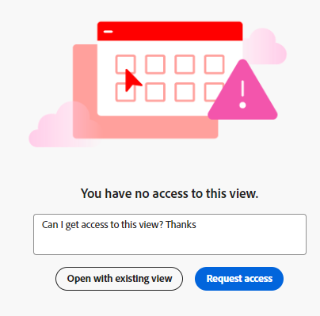

<!-- update metadata when released: 

---
title: Request Permissions to a View or a Workspace
description: You can request permissions to a view or a workspace that others sent you a link to which has not been previously shared with you. 
author: Alina
feature: Workfront Planning
role: User, Admin
---
-->

<!--add this to miniTOC and TOC-->

# 请求对视图或工作区的权限

您可以请求对其他人向您发送了先前未与您共享的链接的视图或工作区的权限。

向视图请求权限与向工作区请求权限类似。

## 访问要求

+++ 展开以查看Workfront Planning的访问要求。

<!--at GA, check that the Workfront plans article linked below has Planning info-->

您必须具备以下条件才能访问Workfront Planning：

<table style="table-layout:auto"> 
<col> 
</col> 
<col> 
</col> 
<tbody> 
    <tr> 
<tr> 
<td> 
   
 产品
 </td> 
   <td> 
   <ul><li>
 Adobe Workfront
</li> 
   <li>
 Adobe Workfront规划
</li></ul></td> 
  </tr>   
<tr> 
   <td role="rowheader">
Adobe Workfront计划*
</td> 
   <td> 

以下任意Workfront计划：
 
<ul><li>选择</li> 
<li>Prime</li> 
<li>Ultimate</li></ul> 

Workfront Planning不适用于旧版Workfront计划
 
   </td> 
<tr> 
   <td role="rowheader">
Adobe Workfront规划计划*
</td> 
   <td> 

任何 
 

有关每个Workfront计划中包含的内容的更多信息，请参阅<a href="https://business.adobe.com/products/workfront/pricing.html">Adobe Workfront定价和打包</a>。 
 
   </td> 
 <tr> 
   <td role="rowheader">
Adobe Workfront平台
</td> 
   <td> 

贵组织的Workfront实例必须载入AdobeUnified Experience，才能访问Workfront Planning的所有功能。
 

有关详细信息，请参阅<a href="/help/quicksilver/workfront-basics/navigate-workfront/workfront-navigation/adobe-unified-experience.md">AdobeWorkfront的Unified Experience</a>。 
 
   </td> 
   </tr> 
  </tr> 
  <tr> 
   <td role="rowheader">
Adobe Workfront许可证*
</td> 
   <td>
 标准、浅色或贡献者

   
Workfront计划不适用于旧版Workfront许可证
 
  </td> 
  </tr> 
  <tr> 
   <td role="rowheader">
访问级别配置
</td> 
   <td> 
Adobe Workfront Planning没有访问级别控制
   
</td> 
  </tr> 
<tr> 
   <td role="rowheader">
对象权限
</td> 
   <td>  
在授予您的权限请求后，您将获得以下权限：

   <ul><li>
查看或管理视图
</li>
   <li>
“查看”、“Contribute”或“管理”工作区
</li></ul>  
   
只有对工作区和视图具有管理权限的用户才能公开共享视图。
</td> 
  </tr> 
<tr> 
   <td role="rowheader">
布局模板
</td> 
   <td> 
必须为所有用户(包括Workfront管理员)分配一个布局模板，该模板应包括主菜单中的Planning区域。 
 </td> 
  </tr> 
</tbody> 
</table>

*有关Workfront访问要求的详细信息，请参阅Workfront文档中的[访问要求](/help/quicksilver/administration-and-setup/add-users/access-levels-and-object-permissions/access-level-requirements-in-documentation.md)。

+++

## 请求对视图或工作区的权限

向视图请求权限与向工作区请求权限类似。

当有人与您共享指向您无权访问的工作区或视图的链接时：

1. 单击与您共享的视图或工作区的链接。

   显示&#x200B;**您没有访问权限**&#x200B;页面，通知您无权访问视图或工作区。

   

1. （视情况而定）如果共享的链接用于您有权访问的工作区的视图，请单击&#x200B;**用现有视图打开**。 如果您有权访问工作区，则记录类型页面将在默认视图中打开。

1. （可选且有条件）如果您无权查看工作区，请在可用框中添加个性化消息，然后单击&#x200B;**请求访问**。

   所有具有查看或工作区管理权限的用户都会收到以下访问请求通知：
   * 应用程序内通知
     
   * 电子邮件通知
     

   有关向视图和工作区授予权限的信息，请参阅以下文章：

   * [共享视图](/help/quicksilver/planning/access/share-views.md)
   * [共享工作区](/help/quicksilver/planning/access/share-workspaces.md)
1. （视情况而定）当视图或工作区经理授予您查看或工作区的权限时，您会收到电子邮件通知和应用程序内通知，其中包含已授予权限的确认。<!--check this - I was not able to test this-->

