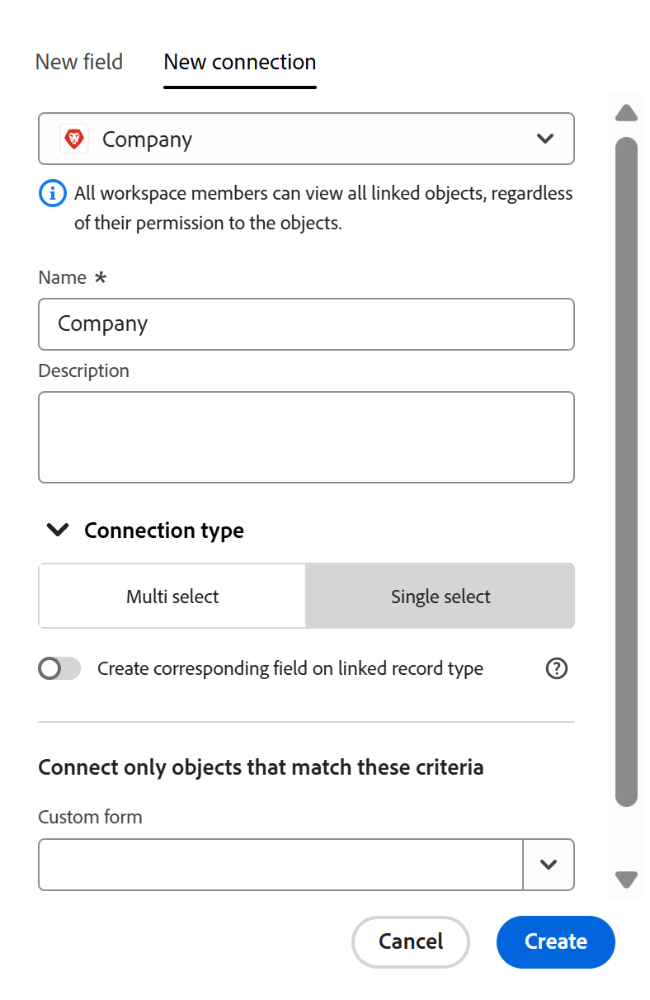
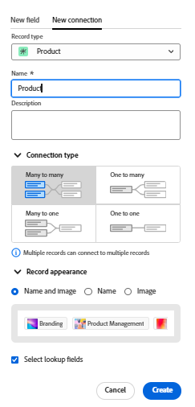

<!--keep the 30 limit verbiage in yellow til Jan 2026-->

# 连接的记录类型概述

<!--
The highlighted information on this page refers to functionality not yet generally available. It is available only in the Preview environment for all customers. After the monthly releases to Production, the same features are also available in the Production environment for customers who enabled fast releases.    

For information about fast releases, see [Enable or disable fast releases for your organization](/help/quicksilver/administration-and-setup/set-up-workfront/configure-system-defaults/enable-fast-release-process.md).
-->

You can indicate that individual record types relate to one another or to objects from other applications by connecting them.

This article is an overview of record type connections and describes the types of connections you can establish between record and object types.

For information about you connect record types, see [Connect record types](/help/quicksilver/planning/architecture/connect-record-types.md).

## Considerations about connecting record types

* For individual records or objects to be connected to one another, the record types must first be connected to object types.

  You can connect record types and object types to each other in the following ways:

   * 手动
   * 自动

  >[!NOTE]
  >
  >You can have up to 30 connected fields for one record type in Workfront Planning.

* Consider the following about connecting record and object types:

   * You can manually add a New Connection field from a record type to connect the following entities in Workfront Planning:

      * 两种记录类型

        默认情况下，您可以从同一工作区连接两种记录类型。 如果您的组织购买了更高的Workfront或Planning包，您还可以设置记录类型以与其他工作区的记录类型连接。 有关详细信息，请参阅[编辑记录类型](/help/quicksilver/planning/architecture/edit-record-types.md)。
      * 来自另一个应用程序的记录类型和对象类型。

     For information about how you can connect record and object types, see [Connect record types](/help/quicksilver/planning/architecture/connect-record-types.md).

     After you manually connect record types with other record or object types you can connect individual records and objects.

     有关信息，请参阅[连接记录](/help/quicksilver/planning/records/connect-records.md)。

   * 在以下情况下，实体之间会自动建立连接：

      * 当您使用自动化从记录类型的页面创建记录时。

        当自动化创建连接的记录或对象时，记录类型或记录类型与来自另一个应用程序的对象类型之间的连接会自动创建。

        有关信息，请参阅[配置Adobe Workfront计划自动化](/help/quicksilver/planning/records/configure-automations-to-create-records.md)。

      * 在为记录类型配置请求表单以创建记录或对象时。

        当您提交和批准创建记录的Planning请求时，记录类型和请求对象类型之间的连接会自动创建。

        有关信息，请参阅[提交Adobe Workfront计划请求以创建记录](/help/quicksilver/planning/requests/submit-requests.md)。

        您可以在Workfront的“请求”区域的&#x200B;**主题**&#x200B;字段中或Workfront Planning的“原始请求连接”字段中查看原始请求。

   * 您可以将Workfront Planning记录类型与以下应用程序中的以下对象类型连接起来：

      * Adobe Workfront：

         * 项目
         * 项目组合
         * 项目群
         * 公司
         * 组
         * 原始请求

           “原始请求连接”字段显示为Workfront Planning提交请求表单后创建记录的原始请求的名称。 在Workfront中，请求的“主题”字段中会显示该请求的名称。

      * Adobe Experience Manager：

         * 资源

           您可以从Adobe Experience Manager Assets连接以下对象：

            * 图像
            * 文件夹

         * 内容片段

      * Adobe GenStudio for Performance Marketing

         * 品牌

        >[!IMPORTANT]
        >
        >要连接到Adobe Experience Manager对象和GenStudio Brands，您必须具备以下条件：
        >* Adobe Experience Manager许可证
        >* Adobe GenStudio for Performance Marketing许可证

* 当连接两个记录类型或一个记录类型与另一个应用程序的对象类型时，存在以下情况：

   * **When you connect two Planning record types**: A linked record field is created on the record type you&#39;re connecting from. A similar linked record field is created on the record type you are connecting to, only when you enable the Create corresponding field on linked record type setting on the New connection tab.

     For example, if you connect the &quot;Campaign&quot; record type with the &quot;Product&quot; record type, a linked record field (connection field) that you name &quot;Linked Product&quot; is created on the Campaign record type. 在产品记录类型上创建一个自动命名为“Campaign”的链接记录类型。

     例如，存在以下情况：

      * 当您启用“在链接的记录类型上创建对应的字段”设置并将“Campaign”记录类型与“Product”记录类型连接时，会在“Campaign”记录类型上创建您命名为“链接的产品”的链接记录字段（连接字段）。 在产品记录类型上创建一个自动命名为“Campaign”的链接记录类型。
      * 当您禁用“在链接的记录类型上创建对应的字段”设置并将“Campaign”记录类型与“Product”记录类型连接时，将在“Campaign”记录类型上创建您命名为“链接的产品”的链接记录字段（连接字段）。 产品记录类型上不会创建自动命名为“Campaign”的链接记录类型。

     有关详细信息，请参阅[连接记录类型](/help/quicksilver/planning/architecture/connect-record-types.md)。

   * **When you connect a record type with an object type from another application**:

      * A linked record field is created on the record type you&#39;re connecting from. 不会在其他应用程序的对象类型上自动创建链接记录字段。
      * 无法从Workfront对象访问Planning记录字段。
      * 规划记录在Workfront对象的Planning部分中可见。 有关信息，请参阅[管理来自Workfront对象的记录连接](/help/quicksilver/planning/records/manage-records-in-planning-section.md)。
      * You can create a Planning connection custom field and attach it to a Workfront object&#39;s custom form. For information, see [Create a custom form](/help/quicksilver/administration-and-setup/customize-workfront/create-manage-custom-forms/form-designer/design-a-form/design-a-form.md).
      * Planning record fields are accessible from Experience Manager assets when your Workfront administrator configures the metadata mapping through the integration between Workfront and Adobe Experience Manager Assets. For more information, see [Configure asset metadata mapping between Adobe Workfront and Experience Manager Assets](https://experienceleague.adobe.com/zh-hans/docs/experience-manager-cloud-service/content/assets/integrations/configure-asset-metadata-mapping). <!--not sure if this is also possible for content fragments-->
      * Planning record fields are not accessible from the Brands in GenStudio for Performance Marketing.

   * **When you add lookup fields from the record or object you connect to**: In addition to creating a linked record field, you can also connect to fields from the connected record or object type which are called lookup fields. A linked (or lookup field) with information from the record you&#39;re connecting to displays on the record that you&#39;re connecting from. <!--not sure if this is also possible for content fragments-->

     You can connect fields from other record types or another application&#39;s objects to the Workfront Planning record type.

     Linked fields are read-only and they automatically display information from connected records.

     You can refer to lookup fields from other record or object types in formulas, filters, or groupings.

     For example, if you connect the &quot;Campaign&quot; record type with a Workfront project and you select to bring the Planned Completion Date field of the project to the Workfront Planning record, a linked field called Planned Completion Date (from Project) is automatically created for the campaign. You cannot manually edit this linked field. The Planned Completion Date (from Project) field displays the Planned Completion Date of the linked projects.

     >[!IMPORTANT]
     >
     >Everyone with View or higher permissions to the workspace can view the information in the lookup fields, regardless of their permissions or access level in the application of the linked object types or their permissions in other workspaces.

     链接的记录字段前面有关系图标。

     链接的字段前面有标识该字段类型的图标。 例如，链接（或查找）字段前面有图标，指示字段是数字、段落或日期。

     >[!TIP]
     >
     >Workfront对象的日期字段信息在Workfront Planning中以24小时制显示，无论它在Workfront中如何显示。
     >
     >例如，如果项目的计划开始日期在Workfront中显示为3:00 PM，它在Workfront Planning的导入查找字段中将显示为15:00。

   * You must connect record types to be able to create hierarchies in Workfront Planning. 如果记录类型连接不存在，则会在创建层次结构时自动创建这些连接。 有关信息，请参阅[创建工作区层次结构](/help/quicksilver/planning/architecture/create-workspace-hierarchies.md)。

## 连接类型

在两个记录类型之间或在记录与来自另一个应用程序的对象类型之间建立连接后，可以在连接的记录字段中添加记录。

>[!WARNING]
>
>在连接以下内容时，本节中介绍的选项不可用：
>
>* 来自不同工作区的两个记录
>
>* 记录类型和Experience Manager对象
>
>* 记录类型和Adobe GenStudio品牌

您可以选择一次将一个记录连接到多个记录，还是一次将一个记录连接到其他记录。

以下是在连接记录类型时可以选择的连接类型：

* 禁用&#x200B;**在链接的记录类型**&#x200B;上创建对应的字段设置后，您可以从以下各项中选择：

   * [多选](#multi-select-connection-type)
   * [单选](#single-select-connection-type)

* When the **Create corresponding field on linked record type** setting is enabled, you can choose from:

   * [多对多](#many-to-many-connection-type)
   * [一对多](#one-to-many-connection-type)
   * [多对一](#many-to-one-connection-type)
   * [一对一](#many-to-one-connection-type)

### 多选连接类型

在记录类型之间创建多选连接时，您可以从原始记录类型在连接字段中选择多个连接的记录。

例如，如果在营销活动和项目之间创建多选连接，则可以为一个营销活动选择多个项目。 没有为Project对象类型创建Campaign连接的记录类型。

选择此连接类型后，在将连接类型保存到以下任何类型后，就无法更改连接类型：

* 单选
* 一对多
* 多对一
* 一对一

### 单选连接类型

在记录类型之间创建单选连接时，您可以从原始记录类型中选择连接字段中的一个记录。

For example, if you create a single-select connection between campaigns and companies, you can select one company for one campaign. A Campaign connected record type is not created for the Company object type.

After you select this connection type, you cannot change the connection type after you save it to any of the following:

* 一对多
* 一对一

<!--
* [Many to many](#many-to-many-connection-type)
* [One to many](#one-to-many-connection-type)
* [Many to one](#many-to-one-connection-type)
* [One to one](#many-to-one-connection-type)
-->

### 多对多连接类型

在记录类型之间创建多对多连接时，可在连接字段从两种记录类型中选择多个记录。

例如，如果在营销活动和项目之间创建多对多连接，则可以为每个营销活动选择多个项目，并为每个项目选择多个营销活动。

A real-life example of a many-to-many relationship type is the relationship between movies and actors. Each movie can have multiple actors, and each actor can play in multiple movies.

When you select this connection type, you cannot change the connection type after you save it.

### One-to-many connection type

在记录类型之间创建一对多连接时，您可以在当前记录类型的连接字段中选择多个记录，但您连接到的记录类型中对应的连接字段将只允许选择一个记录。 在第二个记录类型上自动创建的已连接记录字段自动设置为多对一关系类型。

For example, if you create a one-to-many connection between campaigns and projects, you can select multiple projects for each campaign, but each project can be connected to only one campaign.

A real-life example of a one-to-many relationship type is the relationship between libraries and books: a library has many books in its inventory; but one particular book can only be in one library at a given point in time.

When you select this connection type, you can later change it only to a many-to-many connection type.

### Many-to-one connection type

When you create a many-to-one connection between record types, you can then connect each record in the current record type with only one record from the connected record type. The connected record field that is automatically created on the second record type is automatically set to a one-to-many relationship type.

For example, if you connect campaigns with projects and you choose this type of connection, you can add only one project to a campaign. But you can add multiple campaigns to one project.

A real-life example of a many-to-one relationship type is the relationship between many movies and one actor: one actor can be in many movies, but each movie can only have a specific actor once in its cast.

When you select this connection type, you can later change it only to a many-to-many connection type.

### One-to-one connection type

在记录类型之间创建一对一连接时，在这两种记录类型中，您只能将每条记录与另一记录类型中的一个记录连接。

例如，如果将营销活动与项目连接起来，并选择此类型的连接，则可以将一个营销活动与一个项目连接。 一个项目只能连接到一个营销策划。

A real-life example of a one-to-one relationship is the one existing between a person and their country&#39;s unique identifier (like a Social Security Number, Passport ID, local identification ID): each person has only one unique identifier for a country and each unique identifier can be linked to only one person.

When you select this connection type, you can later change it to any other connection type.
