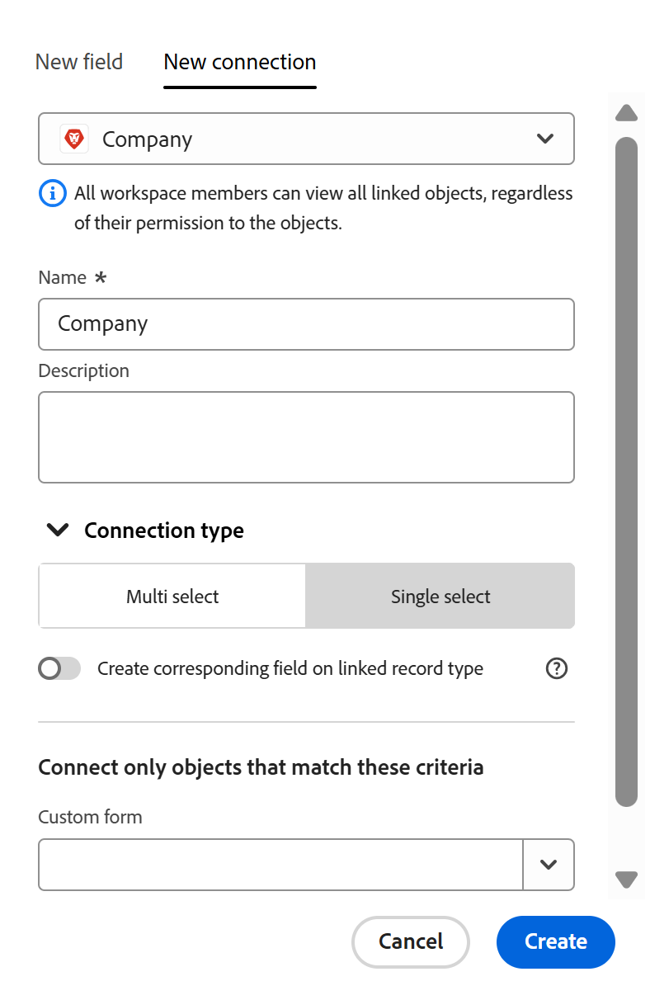

<!--keep the 30 limit verbiage in yellow til Jan 2026-->

# 连接的记录类型概述

此页面上高亮显示的信息引用了尚未公开的功能。 它仅在“预览”环境中对所有客户可用。 在每月发布到生产环境后，生产环境中为启用快速发布的客户提供了相同的功能。

有关快速发布的信息，请参阅[为您的组织启用或禁用快速发布](/help/quicksilver/administration-and-setup/set-up-workfront/configure-system-defaults/enable-fast-release-process.md)。

通过连接各个记录类型可以指出它们彼此相关，或与来自其他应用程序的对象相关。

本文概述了记录类型连接，并介绍了您可以在记录类型和对象类型之间建立连接的类型。

有关您连接记录类型的信息，请参阅[连接记录类型](/help/quicksilver/planning/architecture/connect-record-types.md)。

## 有关连接记录类型的注意事项

在Workfront Planning中连接需执行以下两个步骤：

1. 在两个记录类型或记录类型与来自另一个应用程序的对象类型之间建立连接。

   有关如何连接记录类型的信息，请参阅[连接记录类型](/help/quicksilver/planning/architecture/connect-record-types.md)。

1. 在连接一种类型的单个记录与另一种类型的记录后，将这两种记录类型连接起来。 有关连接记录的信息，请参阅[连接记录](/help/quicksilver/planning/records/connect-records.md)。

有关连接记录类型，请考虑以下事项：

* 在Workfront Planning中，一个记录类型最多可以有30个连接的字段。

* 您可以在Adobe Workfront Planning中连接以下实体：

   * 两种记录类型。

     默认情况下，您可以从同一工作区连接两种记录类型。 您还可以设置记录类型以与其他工作区的记录类型连接。 有关信息，请参阅[编辑记录类型](/help/quicksilver/planning/architecture/edit-record-types.md)。
   * 来自另一个应用程序的记录类型和对象类型。

* 您可以将Workfront Planning记录类型与以下应用程序中的以下对象类型连接起来：

   * Adobe Workfront：

      * 项目
      * 项目组合
      * 项目群
      * 公司
      * 组

   * Adobe Experience Manager Assets：

      * 图像
      * 文件夹

     >[!IMPORTANT]
     >
     >您必须拥有Adobe Experience Manager Assets许可证，并且贵组织的Workfront实例必须载入Adobe业务平台或Adobe Admin Console，才能将Workfront Planning记录连接到Adobe Experience Manager Assets。
     >
     >如果您对加入Adobe Admin Console有任何疑问，请参阅[Adobe Unified Experience常见问题解答](/help/quicksilver/workfront-basics/navigate-workfront/workfront-navigation/unified-experience-faq.md)。

* 为记录类型创建记录后，可以通过连接的记录字段将它们链接在一起。

  有关信息，请参阅[连接记录](/help/quicksilver/planning/records/connect-records.md)。

* 将记录类型与另一个记录类型或另一个应用程序中的对象类型连接后，将出现以下情况：

   * **当您连接两个Planning记录类型时**：在您要连接的记录类型上创建一个链接记录字段。 只有在启用“新建连接”选项卡上的“在链接的记录类型上创建相应的字段”设置时，才会在您连接的记录类型上创建类似的链接记录字段。

     例如，如果将“Campaign”记录类型与“Product”记录类型连接，则会在Campaign记录类型上创建名为“链接的产品”的链接记录字段（连接字段）。 在产品记录类型上创建一个自动命名为“Campaign”的链接记录类型。

     例如，存在以下情况：

      * 当您启用“在链接的记录类型上创建对应的字段”设置并将“Campaign”记录类型与“Product”记录类型连接时，会在“Campaign”记录类型上创建您命名为“链接的产品”的链接记录字段（连接字段）。 在产品记录类型上创建一个自动命名为“Campaign”的链接记录类型。
      * 当您禁用“在链接的记录类型上创建对应的字段”设置并将“Campaign”记录类型与“Product”记录类型连接时，将在“Campaign”记录类型上创建您命名为“链接的产品”的链接记录字段（连接字段）。 产品记录类型上不会创建自动命名为“Campaign”的链接记录类型。

     有关详细信息，请参阅[连接记录类型](/help/quicksilver/planning/architecture/connect-record-types.md)。

   * **当您将记录类型与另一个应用程序的对象类型连接时**：

      * 链接记录字段是在您连接的记录类型上创建的。 不会在其他应用程序的对象类型上自动创建链接记录字段。
      * 无法从Workfront对象访问Planning记录字段。
      * Planning记录在Workfront对象的Planning选项卡中可见。 有关信息，请参阅[管理来自Workfront对象的记录连接](/help/quicksilver/planning/records/manage-records-in-planning-section.md)。
      * 您可以创建Planning连接自定义字段，并将其附加到Workfront对象的自定义表单。 有关信息，请参阅[创建自定义表单](/help/quicksilver/administration-and-setup/customize-workfront/create-manage-custom-forms/form-designer/design-a-form/design-a-form.md)。
      * 当Workfront管理员通过Experience Manager与Adobe Experience Manager Assets之间的集成配置元数据映射时，可以从Workfront Assets访问规划记录字段。 有关详细信息，请参阅[配置Adobe Workfront和Experience Manager Assets之间的资源元数据映射](https://experienceleague.adobe.com/en/docs/experience-manager-cloud-service/content/assets/integrations/configure-asset-metadata-mapping)。

   * **从您连接的记录或对象添加查找字段时**：除了创建链接记录字段外，您还可以从连接的记录或对象类型连接到称为查找字段的字段。 链接（或查找字段）包含所连接记录中的信息，该信息显示在您连接的记录中。

     您可以将其他记录类型或其他应用程序对象中的字段连接到Workfront Planning记录类型。

     链接字段为只读，它们自动显示已连接记录的信息。

     您可以在公式、筛选器或分组中引用来自其他记录或对象类型的查找字段。

     例如，如果您将“促销活动”记录类型与Workfront项目连接并选择将该项目的“计划完成日期”字段引入Workfront计划记录，则将自动为促销活动创建一个名为“计划完成日期”（来自项目）的链接字段。 您无法手动编辑此链接的字段。 计划完成日期（来自项目）字段显示链接项目的计划完成日期。

     >[!IMPORTANT]
     >
     >对工作区具有“查看”权限或更高权限的每个人都可以查看查找字段中的信息，无论他们在链接对象类型应用程序中的权限或访问级别，或者他们在其他工作区中的权限如何。

     链接的记录字段前面有关系图标。

     链接的字段前面有标识该字段类型的图标。 例如，链接（或查找）字段前面有图标，指示字段是数字、段落或日期。

     >[!TIP]
     >
     >Workfront对象的日期字段信息在Workfront Planning中以24小时制显示，无论它在Workfront中如何显示。
     >
     >例如，如果项目的计划开始日期在Workfront中显示为3:00 PM，它在Workfront Planning的导入查找字段中将显示为15:00。

## 连接类型

在两个记录类型之间或在记录与来自另一个应用程序的对象类型之间建立连接后，可以在连接的记录字段中添加记录。

>[!WARNING]
>
>在连接以下内容时，这些选项不可用：
>
>* 来自不同工作区的两个记录
>
>* 记录类型和Experience Manager资源

您可以选择一次将一个记录连接到多个记录，还是一次将一个记录连接到其他记录。

以下是在连接记录类型时可以选择的连接类型：

* 禁用&#x200B;**在链接的记录类型**&#x200B;上创建对应的字段设置后，您可以从以下各项中选择：

   * [多选](#multi-select-connection-type)
   * [单选](#single-select-connection-type)

* 启用&#x200B;**在链接的记录类型**&#x200B;上创建对应的字段设置后，您可以从以下各项中进行选择：

   * [多对多](#many-to-many-connection-type)
   * [一对多](#one-to-many-connection-type)
   * [多对一](#many-to-one-connection-type)
   * [一对一](#many-to-one-connection-type)

### 多选连接类型

在记录类型之间创建多选连接时，您可以从原始记录类型在连接字段中选择多个连接的记录。

例如，如果在营销活动和项目之间创建多选连接，则可以为一个营销活动选择多个项目。 没有为Project对象类型创建Campaign连接的记录类型。

选择此连接类型后，在将连接类型保存到以下任何类型后，就无法更改连接类型：

* 单选
* 一对多
* 多对一
* 一对一

### 单选连接类型

在记录类型之间创建单选连接时，您可以从原始记录类型中选择连接字段中的一个记录。

例如，如果在营销活动与公司之间创建单选连接，则可以为一个营销活动选择一个公司。 没有为Company对象类型创建Campaign连接的记录类型。

选择此连接类型后，在将连接类型保存到以下任意类型后，将无法更改连接类型：

* 一对多
* 一对一

<!--
* [Many to many](#many-to-many-connection-type)
* [One to many](#one-to-many-connection-type)
* [Many to one](#many-to-one-connection-type)
* [One to one](#many-to-one-connection-type)
-->

### 多对多连接类型

在记录类型之间创建多对多连接时，可在连接字段从两种记录类型中选择多个记录。

例如，如果在营销活动和项目之间创建多对多连接，则可以为每个营销活动选择多个项目，并为每个项目选择多个营销活动。

电影和演员之间的关系是现实生活中多对多关系的一个例子。 每部电影可以有多个演员，每个演员可以在多部电影中播放。

如果选择此连接类型，则在保存后无法更改连接类型。

### 一对多连接类型

在记录类型之间创建一对多连接时，您可以在当前记录类型的连接字段中选择多个记录，但您连接到的记录类型中对应的连接字段将只允许选择一个记录。 在第二个记录类型上自动创建的已连接记录字段自动设置为多对一关系类型。

例如，如果在营销活动和项目之间创建一对多连接，则可以为每个营销活动选择多个项目，但每个项目只能连接到一个营销活动。

现实生活中图书馆与书籍之间的关系就是一对多关系的例子：图书馆的库存中有许多书籍；但特定书籍在某一时刻只能位于一个图书馆中。

选择此连接类型后，可以将其更改为多对多连接类型。

### 多对一连接类型

在记录类型之间创建多对一连接时，您随后可以将当前记录类型中的每条记录与所连接记录类型中的一条记录连接。 在第二个记录类型上自动创建的已连接记录字段自动设置为一对多关系类型。

例如，如果将营销活动与项目连接起来，并选择此类型的连接，则只能将一个项目添加到营销活动。 但是，您可以将多个营销活动添加到一个项目。

现实生活中多对一的关系类型的一个例子是许多电影和一个演员之间的关系：一个演员可以出现在许多电影中，但每部电影只能有一个特定的演员出现在演员阵容中。

选择此连接类型后，可以将其更改为多对多连接类型。

### 一对一连接类型

在记录类型之间创建一对一连接时，在这两种记录类型中，您只能将每条记录与另一记录类型中的一个记录连接。

例如，如果将营销活动与项目连接起来，并选择此类型的连接，则可以将一个营销活动与一个项目连接。 一个项目只能连接到一个营销策划。

现实生活中，一个人与其所在国家/地区的唯一标识符（如社会保险号、护照ID、本地标识符ID）之间存在一对一的关系：每个人只有一个国家/地区的唯一标识符，并且每个唯一标识符只能链接到一个人。

选择此连接类型后，可将其更改为任何其他连接类型。
