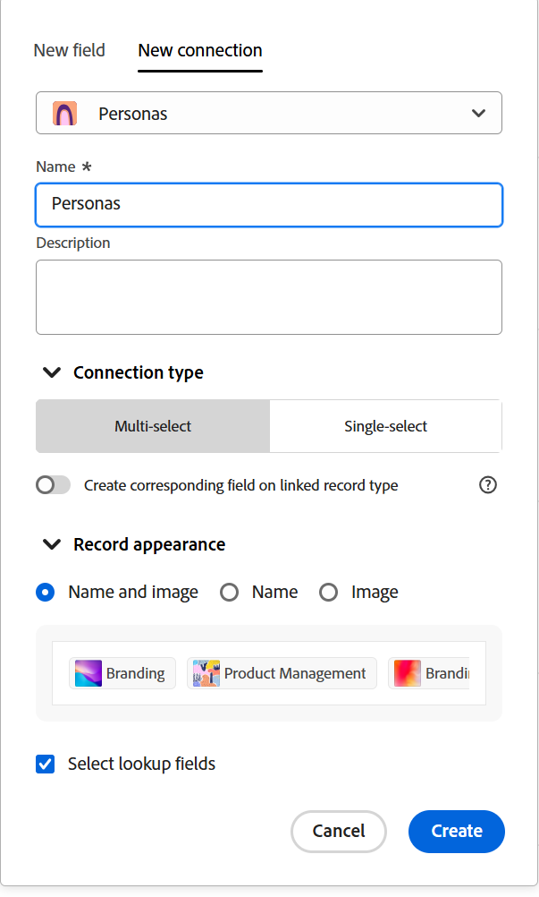

<!--keep the 30 fields limit in yellow till Jan 2026; also the global record type cross-workspace capability information-->

# 连接记录类型

此页面上高亮显示的信息引用了尚未公开的功能。 它仅在“预览”环境中对所有客户可用。 在每月发布到生产环境后，生产环境中为启用快速发布的客户提供了相同的功能。

有关快速发布的信息，请参阅[为您的组织启用或禁用快速发布](/help/quicksilver/administration-and-setup/set-up-workfront/configure-system-defaults/enable-fast-release-process.md)。

{{planning-important-intro}}

<!--
You can use Adobe Workfront Planning to design fully-customizable workspaces that contain record types needed in your organization. A way to indicate how individual record types relate to one another is to connect them. Also, you can connect Workfront Planning record types with object types from other applications to enhance your users' experience and keep their focus in one application. -->

可以将记录类型相互连接或可以将记录类型与其他应用程序中的对象类型连接。

当有多种类型的工作对象相互影响时，连接记录类型会很有用。 例如，您可以与营销活动配合使用，每个营销活动可能适合多个品牌。 要指示这种关系，您可以将营销活动关联到品牌。 这会为营销活动记录中的品牌创建一个连接字段。

此外，每个营销活动的工作可能会在Workfront的多个项目中规划。 要指示这一点，您可以将营销策划关联到相关项目。 这将为营销活动记录中的项目创建一个连接字段。

创建连接字段后，您可以在两个记录或对象类型之间连接单个记录。

>[!NOTE]
>
>一个记录类型最多可以有30个连接字段。

本文介绍了如何将两个Workfront Planning记录类型或Workfront Planning记录类型与另一个应用程序中的对象连接。

在记录或对象类型之间建立连接后，连接字段将添加到Planning记录类型中。 在连接字段中，可以将各个记录相互连接，并在Workfront Planning记录上显示链接记录或对象类型中的字段。

有关连接类型的一般信息，请参阅[连接的记录类型概述](/help/quicksilver/planning/architecture/connect-record-types-overview.md)。

有关将记录或记录与其他应用程序中的对象连接的信息，请参阅[连接记录](/help/quicksilver/planning/records/connect-records.md)。

有关连接记录类型和记录的示例，请参阅[连接记录类型和记录的示例](/help/quicksilver/planning/architecture/example-connect-record-types-and-records.md)。

<!--ensure this last linked article is right; the title and the link should have changed-->

## 访问要求

+++ 展开以查看本文中各项功能的访问要求。

<table style="table-layout:auto"> 
<col> 
</col> 
<col> 
</col> 
<tbody> 
    <tr> 
<tr> 
</tr> 
<tr> 
   <td role="rowheader">
Adobe Workfront包
</td> 
   <td> 

要从同一工作区连接记录类型，请执行以下操作： 

<ul> 
<li>
任何Workfront和任何Planning包
</li>
<li>
任何工作流和任何计划包</li></ul>

从不同的工作区连接记录类型：

<ul> 
<li>
任何Workfront和任何Planning包
</li>
<li>
任何工作流和计划Prime或Ultimate包
</li></ul>

有关每个Workfront Planning包中所包含内容的更多信息，请联系您的Workfront客户代表。 
 
   </td> 
<tr> 
<td> 
   
 其他产品
 </td> 
   <td> 
   
 除了Adobe Workfront之外，您必须拥有Adobe Experience Manager Assets许可证以及AEM Assets与Workfront之间的集成，才能将AEM资源与Planning记录类型连接。

    有关信息，请参阅适用于Experience Manager Assets和Assets Essentials的<a href="/help/quicksilver/documents/adobe-workfront-for-experience-manager-assets-essentials/workfront-for-aem-asset-essentials.md">Adobe Workfront：文章索引</a>。 

   </td> 
  </tr> 
  <tr> 
   <td role="rowheader">
Adobe Workfront许可证
</td> 
   <td>
标准

   </td> 
  </tr> 
  <tr> 
   <td role="rowheader">
对象权限
</td> 
   <td>   
管理工作区的权限
  
   
系统管理员对所有工作区具有权限，包括他们未创建的工作区
  </td> 
  </tr>  
</tbody> 
</table>

有关Workfront访问要求的详细信息，请参阅Workfront文档中的[访问要求](/help/quicksilver/administration-and-setup/add-users/access-levels-and-object-permissions/access-level-requirements-in-documentation.md)。

+++

<!--Old:
<table style="table-layout:auto"> 
<col> 
</col> 
<col> 
</col> 
<tbody> 
    <tr> 
<tr> 
<td> 
   
 Products
 </td> 
   <td> 
   <ul><li>
 Adobe Workfront
</li> 
   <li>
 Adobe Workfront Planning
</li>
   <li>
 Adobe Experience Manager Assets, if you want to connect AEM assets with Planning record types

   
You must have an Adobe Experience Manager Assets license and an integration between AEM Assets and Workfront.
    For information, see <a href="/help/quicksilver/documents/adobe-workfront-for-experience-manager-assets-essentials/workfront-for-aem-asset-essentials.md">Adobe Workfront for Experience Manager Assets and Assets Essentials: article index</a>. 

   </li>
   </ul></td> 
  </tr>   
<tr> 
   <td role="rowheader">
Adobe Workfront plan*
</td> 
   <td> 

Any of the following Workfront plans:
 
<ul><li>Select</li> 
<li>Prime</li> 
<li>Ultimate</li></ul> 

Workfront Planning is not available for legacy Workfront plans
 
   </td> 
<tr> 
   <td role="rowheader">
Adobe Workfront Planning package*
</td> 
   <td> 

Any 
 

For more information about what is included in each Workfront Planning plan, contact your Workfront account manager. 
 
   </td> 
 <tr> 
   <td role="rowheader">
Adobe Workfront platform
</td> 
   <td> 

Your organization's instance of Workfront must be onboarded to the Adobe Unified Experience to be able to access Workfront Planning.
 

For more information, see <a href="/help/quicksilver/workfront-basics/navigate-workfront/workfront-navigation/adobe-unified-experience.md">Adobe Unified Experience for Workfront</a>. 
 
   </td> 
   </tr> 
  </tr> 
  <tr> 
   <td role="rowheader">
Adobe Workfront license*
</td> 
   <td> 
Standard
 
   
Workfront Planning is not available for legacy Workfront licenses
 
  </td> 
  </tr> 
  <tr> 
   <td role="rowheader">
Access level configuration
</td> 
   <td> 
There are no access level controls for Adobe Workfront Planning
   
</td> 
  </tr> 
<tr> 
   <td role="rowheader">
Object permissions
</td> 
   <td>   
Manage permissions to a workspace
  
   
System Administrators have permissions to all workspaces, including the ones they did not create.
</td> 
  </tr> 
 
</tbody> 
</table> -->

## 连接记录类型

<!--when changes here, also update the article for "Connect records"-->

{{step1-to-planning}}

1. 单击要连接其记录类型的工作区，

   或

   从工作区中，展开现有工作区名称右侧的向下箭头，搜索工作区，然后在工作区显示在列表中时将其选定。
1. 单击记录类型的卡以打开记录类型页面。
1. 单击表格视图右上角的&#x200B;**+**&#x200B;图标，然后单击“**新建连接**”选项卡。

   

1. 搜索记录类型，或选择以下选项之一：

   * 当前工作区的记录类型

     

     >[!TIP]
     >
     > 
     >如果所选工作区中没有其他记录类型，则不会显示工作区部分。

   * 另一个工作区中配置为从其他工作区连接的记录类型。

     >[!TIP]
     >
     >必须在&#x200B;**高级设置**&#x200B;**或**&#x200B;编辑记录类型框的&#x200B;**跨工作区设置**&#x200B;选项卡中为记录类型启用&#x200B;**允许连接到其他工作区中的此记录类型**&#x200B;设置，才能从其他工作区访问记录类型。 如果没有配置为从其他工作区连接的记录类型，则不会显示工作区部分。
     >
     >有关信息，请参阅[为记录类型配置跨工作区功能](/help/quicksilver/planning/architecture/configure-record-type-cross-workspace-capabilities.md)。<!--update screen shot at production-->
     >
     >

     <!--Old:
        [!TIP]
        The **Allow connecting to this record type in other workspaces** setting must be enabled for a record type in the **Advanced settings** tab of the **Edit record type** box, for a record type to be accessible from other workspaces. If there are no record types that are configured to connect from other workspaces, the workspace section does not display.
        
        -->

   有关信息，请参阅[编辑记录类型](/help/quicksilver/planning/architecture/edit-record-types.md)。

   * 来自&#x200B;**Workfront对象类型**&#x200B;部分的&#x200B;**项目、Portfolio、项目群、公司**&#x200B;或&#x200B;**组**。

     

   * 来自&#x200B;**Experience Manager Assets应用程序**&#x200B;部分的&#x200B;**Adobe**。

     

     将为您选择的记录或对象类型打开“新建连接”选项卡。

1. 使用新连接的字段的名称更新&#x200B;**Name**&#x200B;字段，因为该字段将显示在原始记录类型的表视图或记录页中。 这将在原始记录类型的表视图中创建连接的记录列（或字段）。 默认情况下，字段的名称是您连接到的记录或对象的名称。

   >[!TIP]
   >
   >您可以有多个与同一记录或对象类型的连接。 如果不编辑已连接的字段名称，Workfront会在已连接记录的名称后添加一个数字，以指示使用相同名称连接的记录类型的数量。

1. 通过添加有关连接的记录字段的信息来更新&#x200B;**描述**&#x200B;字段。 当您将鼠标悬停在表中的字段列上时，将显示字段的描述。
1. （视情况而定）当您从两个不同的工作区或一个记录和Adobe Experience Manager资源对象连接记录类型时，请选择&#x200B;**允许多个记录**。 如果选择该字段，即表示当原始记录中显示“连接的记录类型”字段时，允许用户添加多个记录。 默认情况下，该选项处于选中状态。

   

1. （视情况而定）从同一工作区连接记录类型或具有Workfront对象类型的Planning记录类型时，请选择以下选项之一：

   * **多选**：选择此项以允许来自当前记录类型的一个记录与来自连接记录类型的多个记录连接。
   * **单选**：选择此项以允许来自当前记录类型的一个记录与来自连接记录类型的一个记录连接。

1. 选择&#x200B;**在链接的记录类型**&#x200B;上创建对应的字段。 选中后，除了添加到当前记录类型的连接字段外，还会为您连接的记录类型创建连接字段。 默认情况下禁用此功能。

   >[!TIP]
   >
   >除了一个记录类型的30个连接字段限制外，一个记录类型还有500个字段的限制。 我们建议将此设置保持关闭（特别是对于分类记录类型），以避免达到此限制。
   >

1. （视情况而定）如果启用&#x200B;**在链接的记录类型**&#x200B;上创建对应的字段，则从以下选项中进行选择，以指示用户可以连接到多少条记录，也可以从多少条记录进行连接：

   * 多对多
   * 一对多
   * 多对一
   * 一对一

   有关连接类型的详细信息，请参阅[连接的记录类型概述](/help/quicksilver/planning/architecture/connect-record-types-overview.md)。

   >[!NOTE]
   >
   >如果为“连接”类型选择“一对多”或“一对一”，并且以后要连接某个记录或已在其他地方连接的对象，您将收到一则警告，指出再次连接该记录或对象会将其从原始连接中删除。 您可以允许删除或选择其他记录。

1. （有条件，可选）当您选择连接Workfront对象时，请从&#x200B;**仅链接符合这些条件的对象**&#x200B;部分中选择&#x200B;**自定义表单**。 只有附加了所选自定义表单的对象才能链接到所选记录类型。 您可以选择多个表单。

   >[!NOTE]
   >
   > 您必须先在Workfront中为选定对象创建自定义表单，然后它们才会显示在此列表中。

1. （视情况而定）当您选择连接到Experience Manager Assets时，请从&#x200B;**链接以下存储库中的资源**&#x200B;部分的&#x200B;**Experience Manager存储库**&#x200B;下拉菜单中选择一个存储库。 这是必填字段。 只有您在Experience Manager Assets中有权访问的存储库才会显示在此字段中。

   >[!NOTE]
   >
   >Workfront管理员可以通过Workfront中的元数据映射，将Workfront Planning字段映射到Experience Manager Assets字段。 有关详细信息，请参阅[配置Adobe Workfront和Experience Manager Assets之间的资源元数据映射](https://experienceleague.adobe.com/zh-hans/docs/experience-manager-cloud-service/content/assets/integrations/configure-asset-metadata-mapping)。

1. （视情况而定）当您选择连接到Experience Manager Assets或Workfront Planning记录类型时，请在&#x200B;**记录外观**&#x200B;区域中选择以下选项之一：

   * **名称和图像**：连接的记录的名称和缩略图或图标都会显示在连接的记录字段中。 这是默认选项。
   * **名称**：只有已连接记录的名称将显示在已连接记录字段中。
   * **图像**：连接的记录字段中只会显示连接的记录的缩略图或图标。

   没有缩略图图像的记录改为显示记录类型图标。 在&#x200B;**记录外观**&#x200B;区域中显示已连接记录的显示方式示例。

   >[!NOTE]
   >
   >* 当允许链接多个记录时，仅显示缩略图可能会节省较小区域（如记录视图）的空间。
   >
   >* 记录的名称是记录的主要字段。 有关详细信息，请参阅[主字段概述](/help/quicksilver/planning/fields/primary-field-overview.md)。
   >
   >* 选择Workfront对象类型时，无法选择记录外观。
   >
   >* 在“记录”外观区域中选择的内容将决定记录在系统所有位置（包括所有视图和详细信息页面）的连接中的显示方式。

1. 选择&#x200B;**选择查找字段**&#x200B;以添加您连接到的记录类型中的字段。 查找字段是与要链接到的记录或对象类型关联的字段。 链接它们将显示您链接到的记录或对象中的信息，以及您链接到的记录中的信息。 默认情况下，该选项处于选中状态。

   >[!TIP]
   >
   >* 您无法添加Workfront预输入字段（包括项目所有者或项目发起人等字段）作为查找字段。
   >
   >* Workfront对象的日期字段信息在Workfront Planning中以24小时制显示，无论它在Workfront中如何显示。
   >
   >   例如，如果项目的计划开始日期在Workfront中显示为3:00 PM，它在Workfront Planning的导入查找字段中将显示为15:00。

1. 单击&#x200B;**创建**。

1. （视情况而定）如果您选择了&#x200B;**选择查找字段**&#x200B;设置，则会打开&#x200B;**添加查找字段**&#x200B;框。

   单击&#x200B;**+**&#x200B;图标可从&#x200B;**未选择的字段**&#x200B;区域添加字段。

   或

   单击&#x200B;**-**&#x200B;图标可从&#x200B;**选定字段**&#x200B;区域移除字段

   

   链接记录或对象后，连接的字段的值会自动填充。

   >[!IMPORTANT]
   >
   >    对工作区具有“查看”或更高权限的每个人都可以查看链接字段中的信息，无论其在链接对象类型应用程序中的权限或访问级别如何。

1. （可选）单击&#x200B;**跳过**&#x200B;以跳过添加链接记录或对象类型的字段。 链接记录的名称或主字段是您连接到的记录类型的表视图中唯一可见的字段。

1. 为添加的查找字段选择一个聚合器。

   >[!NOTE]
   >
   >无法为以下字段类型添加聚合：
   >
   >    * 段落
   >    * 复选框

   当用户在链接的记录字段中选择多个链接记录时，链接字段的值会根据您选择的聚合器显示为逗号分隔的或汇总值。

   如果查找字段包含多个未汇总的值，则在视图中对字段进行排序或分组时，请考虑以下事项：

   * 排序由第一个值完成

   * 记录按字段值的每个唯一组合进行分组

   * 时间线视图基于所连接记录类型的第一个日期值（当它显示在视图中时）构建

   >[!IMPORTANT]
   >
   > 如果希望字段可用作时间轴和日历视图的开始日期和结束日期，则在添加查找日期字段时必须选择一个聚合器值。 例如，您可以为查找日期字段选择MAX或MIN汇总。

   链接的数字字段聚合器下拉列表

   >[!NOTE]
   >
   > 将记录类型连接到Experience Manager Assets时，聚合不可用。

   从以下项中选择：

   * **无**：显示来自多个记录的值，这些记录用逗号分隔。 这是默认选项。
   * **MAX**：显示在链接记录字段中选择的多个记录的所有值中的最大值。
   * **MIN**：显示在链接记录字段中选择的多个记录的所有值中的最小值。
   * **SUM**：显示在链接记录字段中选择的多个记录的所有值的总数。
   * **AVG**：显示在链接记录字段中选择的多个记录的所有值的平均值。
   * **UNIQUE**：从查找字段值中删除重复项，并仅显示唯一值。 这对于以下字段类型不可用：
      * 段落
      * 复选框
      * 人员

   >[!NOTE]
   >
   >例如，您可以从Campaign记录（原始记录）中链接产品记录（链接记录），并将其命名为“产品字段”。 您还可以选择从营销活动记录中链接产品记录的Budget字段，并将其称为“Product Budget”。 如果您允许在“产品字段”中选择多个记录，则可以选择预算为$100,000的产品1和预算为$110,000的产品2，以及预算为$100,000的产品3。 您可以在链接字段中查看原始记录的以下预算信息，具体取决于您选择的汇总：
   >
   >* **无**：$100,000，$110,000，$100,000
   >* **MAX**： $110,000
   >* **分钟**： $100,000
   >* **总和**：$310,000
   >* **平均**： $103,000.33
   >* **唯一**： $100,000
   >

1. （可选）使用&#x200B;**搜索**&#x200B;图标搜索字段。

1. 单击&#x200B;**添加字段**&#x200B;以保存更改。

   添加了以下项目：

   * 要链接的记录类型上的链接记录字段。 手动添加链接记录后，链接记录字段将显示来自链接记录类型的单个记录。 有关添加记录的信息，请参阅[连接记录](/help/quicksilver/planning/records/connect-records.md)。 链接记录字段的名称是您在步骤6中选择的名称。<!--accurate-->

   * 链接（或查找）字段（或字段），在您手动添加链接记录字段中的记录或对象后，显示有关链接记录或对象类型的信息。 仅在创建连接时选择了&#x200B;**Select lookup fields**&#x200B;设置时才创建查找字段。 查找字段会根据以下模式自动命名：

     `<Name of the original field on the linked record> (from <Name of your linked field>)`

     例如，如果您链接了促销活动记录类型与项目群记录类型，并将项目群链接记录字段命名为“项目群信息”，然后选择还在Campaign表格视图中显示项目群预算字段，则链接字段在促销活动表格视图中自动命名为`Budget (from Program information)`。

   * 当您将记录类型链接到彼此时，仅在您启用&#x200B;**在链接的记录类型**&#x200B;设置上创建对应的字段时，链接记录字段也会添加到要链接的记录类型中。 链接记录类型中链接的记录字段的名称是您链接来源的记录类型的名称。

     例如，如果您从“Campaign”记录类型中链接“Product”记录类型，并命名了Campaign“链接的产品”的已连接字段，则会为“Product”记录类型创建“Campaign”链接记录字段。

     >[!TIP]
     >
     > 不会为来自各自应用程序中的其他应用程序的对象创建链接记录字段。
     >我们建议不要创建指向分类记录类型的链接，因为每个记录类型具有500个字段的限制，以及连接的30个字段的限制。

   <!--see the span preview text in the TIP above; it might not show up in green-->

1. （可选，视情况而定）在原始记录类型或链接记录类型表格视图中，单击链接记录字段标题中的向下箭头，然后单击以下任一项：

   * **编辑字段**：更新该字段的&#x200B;**名称**&#x200B;和&#x200B;**描述**&#x200B;信息。
   * **编辑查找字段**：添加或删除链接记录的任何字段。

   中的字段和查找字段下拉菜单

   要添加或移除查找字段，请按照上述步骤16-17中的说明操作。<!--ensure these step numbers stay accurate-->

   >[!NOTE]
   >
   > 不能添加属于从另一应用程序链接到对象类型的记录类型的查找字段。
   >
   > 例如，无法将“Campaign Status”的查找字段添加到要从营销活动链接到的Workfront项目。

1. （可选）单击链接记录字段标题中的向下箭头，或者单击链接记录类型中的查找字段标题，然后单击&#x200B;**删除**。

   删除记录字段或查找字段。 如果删除记录字段，则与链接记录关联的任何查找字段也会被删除。
