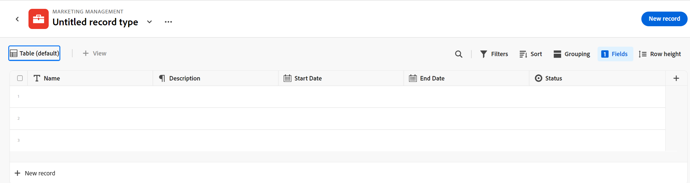

<!--this is linked to the UI in an empty workspace screen-->

# 创建记录类型

{{planning-important-intro}}

记录类型是Adobe Workfront Planning的对象类型。 在Workfront Planning中，您可以创建自定义记录类型，这些记录类型说明在组织的生命周期中所需的工作相关项。

有关记录类型的详细信息，请参阅[记录类型概述](/help/quicksilver/planning/architecture/overview-of-record-types.md)。

## 访问要求

+++ 展开以查看Workfront Planning的访问要求。

您必须具备以下条件才能访问Workfront Planning：

<table style="table-layout:auto"> 
<col> 
</col> 
<col> 
</col> 
<tbody> 
    <tr> 
<tr> 
<td> 
   
 产品
 </td> 
   <td> 
   <ul><li>
 Adobe Workfront
</li> 
   <li>
 Adobe Workfront规划
</li></ul></td> 
  </tr>   
<tr> 
   <td role="rowheader">
Adobe Workfront计划*
</td> 
   <td> 

以下任意Workfront计划：
 
<ul><li>选择</li> 
<li>Prime</li> 
<li>Ultimate</li></ul> 

Workfront Planning不适用于旧版Workfront计划
 
   </td> 
<tr> 
   <td role="rowheader">
Adobe Workfront规划计划*
</td> 
   <td> 

任何 
 

有关每个Workfront计划中包含的内容的更多信息，请参阅<a href="https://business.adobe.com/products/workfront/pricing.html">Adobe Workfront定价和打包</a>。 
 
   </td> 
 <tr> 
   <td role="rowheader">
Adobe Workfront平台
</td> 
   <td> 

贵组织的Workfront实例必须载入AdobeUnified Experience，才能访问Workfront Planning的所有功能。
 

有关详细信息，请参阅<a href="/help/quicksilver/workfront-basics/navigate-workfront/workfront-navigation/adobe-unified-experience.md">AdobeWorkfront的Unified Experience</a>。 
 
   </td> 
   </tr> 
  </tr> 
  <tr> 
   <td role="rowheader">
Adobe Workfront许可证*
</td> 
   <td>
 标准

   
Workfront计划不适用于旧版Workfront许可证
 
  </td> 
  </tr> 
  <tr> 
   <td role="rowheader">
访问级别配置
</td> 
   <td> 
Adobe Workfront Planning没有访问级别控制
   
</td> 
  </tr> 
<tr> 
   <td role="rowheader">
对象权限
</td> 
   <td>   
管理工作区</a>的权限 
  
   
系统管理员对所有工作区具有权限，包括他们未创建的工作区
  </td> 
  </tr> 
<tr> 
   <td role="rowheader">
布局模板
</td> 
   <td> 
必须为所有用户(包括Workfront管理员)分配一个布局模板，该模板应包括主菜单中的Planning区域。 
 </td> 
  </tr> 
</tbody> 
</table>

*有关Workfront访问要求的详细信息，请参阅Workfront文档中的[访问要求](/help/quicksilver/administration-and-setup/add-users/access-levels-and-object-permissions/access-level-requirements-in-documentation.md)。

+++

<!--
OLD: 

<table style="table-layout:auto">
 <col>
 </col>
 <col>
 </col>
 <tbody>
    <tr>
<tr>
<td>
   
 Product
 </td>
   <td> Adobe Workfront
   </td>
  </tr>  
 <td role="rowheader">
Adobe Workfront agreement
</td>
   <td>

Your organization must be enrolled in the early access stage for Workfront Planning 

   </td>
  </tr>
  <tr>
   <td role="rowheader">
Adobe Workfront plan
</td>
   <td>

Any

   </td>
  </tr>
  <tr>
   <td role="rowheader">
Adobe Workfront license*
</td>
   <td>
   
Current: Plan

   Or
   
New: Standard 
 
  </td>
  </tr>
  
  <tr>
   <td role="rowheader">
Access level configurations
</td>
   <td> 
There are no access level controls for Workfront Planning
  
</td>
  </tr>
<tr>
   <td role="rowheader">
Layout template
</td>
   <td> 
Your Workfront or group administrator must add the Planning area in your layout template. For information, see <a href="/help/quicksilver/planning/access/access-overview.md">Access overview</a>. 
  
</td>
  </tr>
<tr>
   <td role="rowheader">
Permissions
</td>
   <td> 
Manage permissions to a workspace</a> 
  
   
System Administrators have permissions to all workspaces, including the ones they did not create

</td>
  </tr>
 </tbody>
</table>

*For information, see [Access requirements in Workfront documentation](/help/quicksilver/administration-and-setup/add-users/access-levels-and-object-permissions/access-level-requirements-in-documentation.md). 
-->

## 有关创建记录类型的注意事项

* 您可以通过以下方式在工作区中创建记录类型：

   * 自动：
      * 使用模板创建工作区时。

        有关信息，请参阅[创建工作区](/help/quicksilver/planning/architecture/create-workspaces.md)。

     <!--* When you import them using an Excel or CSV file. 

            >[!IMPORTANT]
            >
            >This functionality has been temporarily removed since March 21, 2024. It will be enabled at a later date.-->

     <!--this should not ne known anymore: * When you add objects from another application to a linked record field of a record. This creates a read-only record type in Workfront Planning which is connected to object types from the original application. 
        For information about connecting record types with object types from another application, see [Connect record types](/help/quicksilver/planning/architecture/connect-record-types.md).
        For information about connecting objects with records, see [Connect records](/help/quicksilver/planning/records/connect-records.md). -->
   * 手动：

      * 从头开始。

        本文介绍了如何从头开始创建记录类型。

* 您可以在分区内移动记录类型，也可以在工作区的一个分区之间移动记录类型。 不能将记录类型从一个工作区移动到另一个工作区。

## 使用工作区模板创建记录类型

在使用Workfront Planning模板创建工作区时，您可以自动创建记录类型。 每个模板都包含示例记录类型。

从模板创建工作区时，记录类型将分组到以下部分：

* 操作记录类型
* 分类标准

您可以在“操作记录类型”和“分类”部分中手动添加记录类型。

有关创建工作区的信息，请参阅[创建工作区](/help/quicksilver/planning/architecture/create-workspaces.md)。

有关每个模板包含哪些记录类型的信息，请参阅[工作区模板列表](/help/quicksilver/planning/architecture/workspace-templates.md)。

## 从头开始创建记录类型

{{step1-to-planning}}

1. 单击要在其中创建记录类型的工作区，

   或

   从工作区中，展开现有工作区名称右侧的向下箭头，搜索工作区，然后在工作区显示在列表中时将其选定。
1. （可选）单击&#x200B;**添加节**&#x200B;以向工作区添加新节。
1. 单击&#x200B;**添加记录类型**。

   将打开“添加记录类型”框。
   <!--1. (Conditional) When creating record types by importing an Excel or CSV file is enabled, click **From scratch**. Otherwise, the **Add record type** box opens. -->

   

1. 更新以下信息：

   * 将“无标题记录类型”替换为您未来记录类型的名称。<!--did they bring back the field label here and did they rename it to "Name"-->
   * **描述**：添加有关记录类型的详细信息。
   * 为与记录类型关联的图标选择颜色和形状。 执行以下操作：
      * 选择用于标识新记录类型的颜色。 这是记录类型图标的颜色。 默认情况下选中“灰色”。
      * 从列表中选择一个图标，或开始键入图标的名称以描述其表示的内容，然后在显示时选择它。 这是记录类型的图标。 默认情况下，会选择一个文件图标。

1. 单击&#x200B;**创建**。

   记录类型信息卡会添加到部分和您选择的工作区。
记录类型的描述将显示在信息卡上。

   

1. （可选）将鼠标悬停在记录类型卡片上，单击右上角的&#x200B;**更多**&#x200B;图标，然后单击&#x200B;**编辑**&#x200B;以修改有关记录类型的信息。
1. （可选）单击记录类型卡以打开记录类型页面。

   

   默认情况下，记录类型页面显示在表视图中。 表的列是与新记录类型关联的字段。 每一行都是您必须添加的唯一记录。

   <!--TIP: If you import a record type from an Excel or CSV file, records are also imported.-->

   默认情况下，以下字段显示在操作记录类型的表视图列中：

   * 名称
   * 描述
   * 开始日期
   * 结束日期
   * 状态

1. （可选）在页面的标题中更新记录类型名称

   或

   单击记录类型名称右侧的&#x200B;**更多**&#x200B;图标，然后单击&#x200B;**编辑**&#x200B;以重命名它或更改有关它的信息。 有关详细信息，请参阅[编辑记录类型](/help/quicksilver/planning/architecture/edit-record-types.md)。

1. （可选）单击&#x200B;**+新记录**&#x200B;以添加所选记录类型的记录。 有关详细信息，请参阅[创建记录](/help/quicksilver/planning/records/create-records.md)。
1. （可选）单击表右上角的&#x200B;**+**&#x200B;图标以向记录类型添加更多字段。

   有关创建字段的详细信息，请参阅[创建字段](/help/quicksilver/planning/fields/create-fields.md)。

1. （可选）单击标题中记录类型名称左侧的左箭头，以返回选定的工作区。

1. （可选）在工作区中，单击并按住记录类型卡片，以将记录类型拖放到所需位置，或将其移动到其他部分。

   更改将自动保存。

   有关在记录类型页面中添加记录、删除或编辑记录类型或更新视图的其他信息，请参阅以下文章：

   * [创建记录](/help/quicksilver/planning/records/create-records.md)
   * [删除记录类型](/help/quicksilver/planning/architecture/delete-record-types.md)
   * [编辑记录类型](/help/quicksilver/planning/architecture/edit-record-types.md)
   * [管理记录视图](/help/quicksilver/planning/views/manage-record-views.md)

<!--
## Create record types by importing an Excel or CSV file

>[!IMPORTANT]
>
>This functionality has been temporarily removed since March 21, 2024. It will be enabled at a later date.

Consider the following when importing record types using an Excel or CSV file: 

* Each sheet of the Excel file becomes a record type. 
* The columns of each sheet become the fields associated with each record type. 
* Fields are unique for their respective record types. 
* Each row in each sheet becomes a unique record associated with its respective record type. 
* Each sheet of the Excel file should not exceed the following: 
    * 50,000 rows
    * 500 columns
* The Excel file should not be larger than 5MB.
* Empty sheets are not supported. 

To import record types using an Excel file: 

{{step1-to-planning}}

1. Click the workspace where you want to create record types, 

    Or

    From a workspace, expand the downward-pointing arrow to the right of an existing workspace name, search for a workspace, then select it when it displays in the list.
1. Click **Add record type**. 
1. Click **Excel/CSV**.
1. Drag and drop an Excel or CSV file previously saved on your computer, or click **Select a CSV or Excel file** to browse for one. 
1. Click **Review your data**.
    
    The Preview and edit box displays with the following information: 

    * The names of the sheets or of the future record types display in the left panel. Workfront Planning selects an icon and a color for each new record type by default.
    * The first sheet or record type is selected and the names of the fields associated with it display as the column headers. The type of each field is selected by default. 
    * Each row represents a new record. Only the first 10 records display in the Preview and edit box. 

    

1. (Optional) Click the name of each sheet in the left panel to review the information it contains. 

    >[!NOTE]
    >
    >    Sheets that are empty are not supported and are dimmed. 

1. (Optional) Click the **Select sheets to import** drop-down menu and deselect the sheets that you don't want to import. 

    

    Sheets you deselected display with a gray background. 

1. Click **Import** when you are ready to import your file. 

    The following information imports in to Workfront Planning:

    * New record types
    * New fields associated with each record type
    * New records associated with each record type

    You can start managing fields and records on the record types pages. 
    
    Everyone with access to Workfront Planning can now view and edit the imported record types and their information.-->

