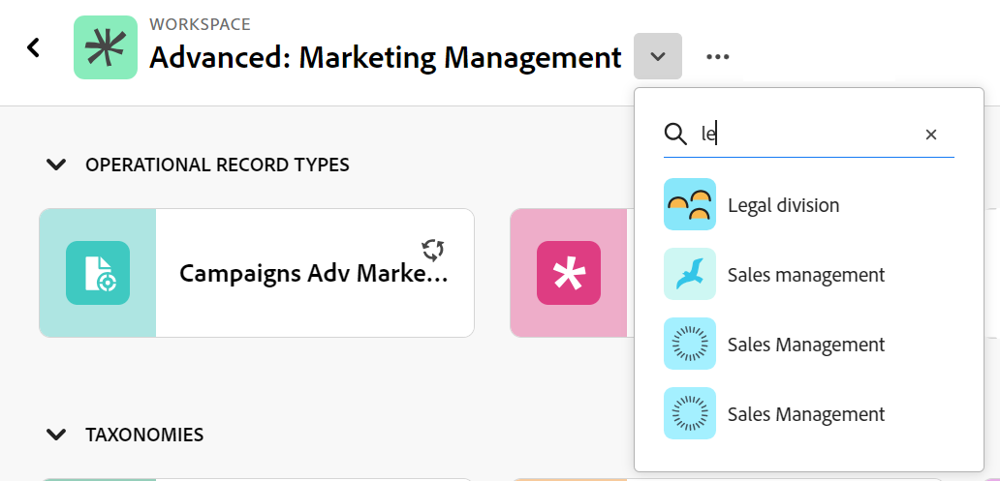

# 编辑记录类型

此页面上的信息引用了尚未公开的功能。 它仅在“预览”环境中对所有客户可用。 在每月发布到生产环境后，生产环境中为启用快速发布的客户提供了相同的功能。

有关快速发布的信息，请参阅[为您的组织启用或禁用快速发布](/help/quicksilver/administration-and-setup/set-up-workfront/configure-system-defaults/enable-fast-release-process.md)。

{{planning-important-intro}}

记录类型是Adobe Workfront Planning的对象类型。 您可以编辑您或其他人创建的记录类型的外观。 有关创建Workfront Planning记录类型的信息，请参阅[创建记录类型](/help/quicksilver/planning/architecture/create-record-types.md)。

## 访问要求

+++ 展开以查看访问要求。 

<table style="table-layout:auto"> 
<col> 
</col> 
<col> 
</col> 
<tbody> 
    <tr> 
<tr> 
<td> 
   
 产品
 </td> 
   <td> 
   <ul><li>
 Adobe Workfront
</li> 
   <li>
 Adobe Workfront规划
</li></ul></td> 
  </tr>   
<tr> 
   <td role="rowheader">
Adobe Workfront计划*
</td> 
   <td> 

以下任意Workfront计划：
 
<ul><li>选择</li> 
<li>Prime</li> 
<li>Ultimate</li></ul> 

Workfront Planning不适用于旧版Workfront计划
 
   </td> 
<tr> 
   <td role="rowheader">
Adobe Workfront规划包*
</td> 
   <td> 

任何 
 

有关每个Workfront计划中包括的内容的更多信息，请联系您的Workfront客户经理。 
 
   </td> 
 <tr> 
   <td role="rowheader">
Adobe Workfront平台
</td> 
   <td> 

贵组织的Workfront实例必须载入Adobe Unified Experience才能访问Workfront Planning。
 

有关详细信息，请参阅<a href="/help/quicksilver/workfront-basics/navigate-workfront/workfront-navigation/adobe-unified-experience.md">适用于Workfront的Adobe Unified Experience</a>。 
 
   </td> 
   </tr> 
  </tr> 
  <tr> 
   <td role="rowheader">
Adobe Workfront许可证*
</td> 
   <td>
 标准 

   
Workfront计划不适用于旧版Workfront许可证
 
  </td> 
  </tr> 
  <tr> 
   <td role="rowheader">
访问级别配置
</td> 
   <td> 
Adobe Workfront Planning没有访问级别控制
   
</td> 
  </tr> 
<tr> 
   <td role="rowheader">
对象权限
</td> 
   <td>   
管理对工作区和记录类型的权限 
  
   
系统管理员对所有工作区具有权限，包括他们未创建的工作区

   
只有系统管理员才能启用记录类型以从其他工作区连接
 </td> 
  </tr>

</tbody> 
</table>

*有关Workfront访问要求的详细信息，请参阅Workfront文档中的[访问要求](/help/quicksilver/administration-and-setup/add-users/access-levels-and-object-permissions/access-level-requirements-in-documentation.md)。

+++   

## 编辑记录类型

{{step1-to-planning}}

1. 单击要编辑其记录类型的工作区。

   此时会打开工作区页面，并显示记录类型。
1. 执行下列操作之一：

   * 将鼠标悬停在记录类型的卡片上，然后单击记录类型卡片右上角的&#x200B;**更多**&#x200B;菜单，然后单击&#x200B;**编辑**
或
   * 单击记录类型卡以打开记录类型页面，单击记录类型名称右侧的&#x200B;**更多**&#x200B;菜单，然后单击&#x200B;**编辑**。

   

1. 在&#x200B;**编辑记录类型**&#x200B;框中，**外观**&#x200B;选项卡默认打开。

   

   在&#x200B;**外观**&#x200B;选项卡中更新以下信息：

   * 根据需要编辑记录类型名称。<!--did they add a field label for this?-->
   * **描述**：编辑或添加记录类型的描述，其中包含有关该记录类型的详细信息。
   * 编辑与记录类型关联的图标的颜色和形状。 执行以下操作：
      * 选择用于标识记录类型的颜色。 这是记录类型图标的颜色。
      * 从列表中选择一个图标，或开始键入图标的名称以描述其表示的内容，然后在显示时选择它。 这是记录类型的图标。 默认情况下，会选择一个文件图标。

   <!--old info: 
   1. (Conditional) If you are a system administrator, click the **Advanced settings** tab in the **Edit record type** box. 
      
   1. (Conditional) Update the following information in the **Advanced settings** tab: 
      * Enable the **Connect from other workspace** setting. When enabled, the record type is accessible and can be connected from other workspaces. 
      * Choose from which workspaces the record type can be accessed. Choose from the following options:
         * **System wide**: Users can connect to this record type from all workspaces where they have manage permissions. 
         * **Specific workspaces**: Add the names of the workspaces where workspace managers can connect to this record type.-->

1. （可选且有条件）如果您是系统管理员，请单击&#x200B;**高级设置**&#x200B;并在&#x200B;**跨工作区功能**&#x200B;部分中更新以下信息： <!--take this info out and replace it with a link to this article: help/quicksilver/planning/architecture/configure-record-type-cross-workspace-capabilities.md-->
   * 启用&#x200B;**允许在其他工作区中连接到此记录类型**&#x200B;设置：这允许工作区管理员从其他工作区连接到此记录类型。\
     您可以指定此记录类型可以连接的工作区。 可使其可用于所有工作区，或指定可在其中导入它的特定工作区。
有关详细信息，请参阅[为记录类型配置跨工作区功能](/help/quicksilver/planning/architecture/configure-record-type-cross-workspace-capabilities.md)。

   

   <!--replace last point with this when we release dynamic record types:
      1. (Optional and conditional) If you are a system administrator, click **Advanced settings** and update the following information in the **Cross-workspace capability** section: **** the info here is duplicated in the Edit record types article ***
         * Enable the **Allow adding this record type to other workspaces** setting: This allows workspace managers to add this record type to other workspaces. 
               You can designate specific users who can add this record type to other workspaces. 
         * Enable the **Allow connecting to this record type in other workspaces** setting: This allows workspace managers to connect to this record type from other workspaces.  
               You can designate which workspaces this record type can be connected from. You can make it available for all workspaces or designate specific ones where you can import it.
         For more information, see [Configure cross-workspace capabilities for record types](/help/quicksilver/planning/architecture/configure-record-type-cross-workspace-capabilities.md).  
         ******** replace screen shot below **********
          
      -->

1. 单击&#x200B;**保存**。

   工作区上的记录类型卡片在右上角显示一个连接图标，表示现在可以从其他工作区访问该记录。

1. （可选）单击工作区区域中的记录类型卡以打开记录类型的页面，然后重命名标题中的记录类型。

1. （可选）要编辑其他记录类型，请从记录类型页面中，展开记录类型名称右侧的向下箭头，搜索记录类型，然后在记录类型显示在列表中时将其选定。

   带有搜索框的记录类型页面上的
