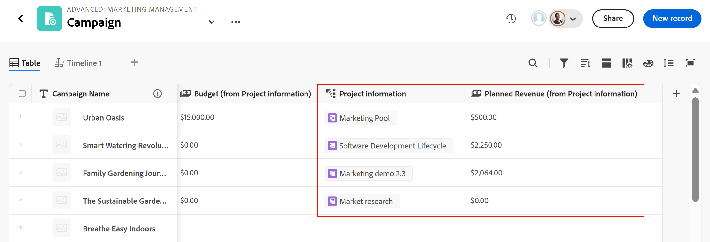

# 连接记录类型和记录的示例

{{planning-important-intro}}

本文描述了以下示例：

* 如何在两个Workfront Planning记录类型和两个记录之间创建连接。

* 如何在Workfront Planning记录类型与Workfront项目对象类型之间创建连接，以及在记录与项目之间创建连接。

有关更多信息，另请参阅以下文章：

* [连接记录类型](/help/quicksilver/planning/architecture/connect-record-types.md)
* [连接记录](/help/quicksilver/planning/records/connect-records.md)

## 连接两个Workfront Planning记录类型和记录（示例）

例如，您有一个名为Campaign的记录类型作为原始记录类型。

您还有另一种记录类型，称为Product，它有一个货币字段，称为Budget。

您要创建记录类型“促销活动”的字段，以便显示记录类型“产品”的“预算”字段的值。

操作步骤：

1. 在工作区中打开Campaign记录类型的表视图。
1. 单击表格视图右上角的&#x200B;**+**&#x200B;图标以添加新字段，然后单击“**新建连接**”，然后单击所选工作区部分中的“**产品**”。
1. 添加以下信息，例如：

   * **记录类型**：产品<!--did they change the casing here?-->
   * **名称**：为新字段提供一个名称。 例如，“产品信息”。 这是链接的记录字段的名称。
   * **描述**：为新字段添加描述。 例如，“这些是我希望与促销活动关联的产品。” 将鼠标悬停在列标题中的字段上时，将显示字段的描述。
   * **连接类型**：从以下选项中选择：
      * **多对多**：用户可以将一个营销活动连接到多个产品，将一个产品连接到多个营销活动。
      * **一对多**：用户可以将一个营销活动连接到多个产品，将一个产品连接到一个营销活动。
      * **多个对一个**：用户可以将一个营销活动连接到一个产品，将一个产品连接到多个营销活动。
      * **一对一**：用户可以将一个营销活动连接到一个产品，将一个产品连接到一个营销活动。

     >[!NOTE]
     >
     >在连接来自不同工作区的记录或连接Experience Manager资源或GenStudio Brands时，**连接类型**&#x200B;选项不可用。 有关详细信息，请参阅[连接的记录类型概述](/help/quicksilver/planning/architecture/connect-record-types-overview.md)。

   * **记录外观**：从以下选项中选择：
      * **名称和图像**：显示已连接记录的名称和缩略图或图标。 默认情况下，该选项处于选中状态。
      * **名称**：仅显示已连接记录的名称。
      * **图像**：仅显示已连接记录的缩略图或图标。
   * **选择查找字段**：如果您保留选中此选项，则下一步将打开&#x200B;**添加查找字段**&#x200B;框，允许您链接产品字段和促销活动记录类型。 您可以单击&#x200B;**跳过**&#x200B;跳过此步骤并稍后添加产品字段。

     

1. （视情况而定）如果您在上一步中选择了&#x200B;**选择查找字段选项**，请从与&#x200B;**产品**&#x200B;记录类型关联的字段列表中单击&#x200B;**预算**&#x200B;字段的&#x200B;**+**&#x200B;图标，然后单击&#x200B;**添加字段**。 这将创建一个名为&#x200B;**Budget（来自产品信息）**&#x200B;的字段，该字段是链接字段的名称。 此字段中将显示促销活动记录的“产品预算”相关信息。

   

   >[!TIP]
   >
   >    如果要将所有选定产品的预算作为一个总数查看，请在字段名称右侧的下拉菜单中选择&#x200B;**SUM**。 当用户在&#x200B;**产品信息**&#x200B;链接记录字段中选择多个产品时，**预算（来自产品信息）**&#x200B;字段会将其所有预算值相加并显示总计。<!-- check the shot below - added a bug with a couple of UI changes here-->
   >
   > 如果选择&#x200B;**None**，而不是&#x200B;**SUM**，则所选产品的各个预算将以逗号分隔。

   这将生成以下字段：

   * 在营销活动的营销活动记录表格视图和营销活动记录页面中：

      * **产品信息**（链接的记录字段）：在您添加产品时显示一个或多个产品名称。
      * **预算（来自产品信息）** （链接字段）：这将显示在产品信息字段中选择的产品预算。

   * 在产品记录表格视图和产品的产品记录页面中：

      * **促销活动**：这表示产品记录类型已从促销活动记录类型链接。

     

   >[!TIP]
   >
   >    链接的记录字段前面有关系图标。

1. 从&#x200B;**Campaign**&#x200B;记录类型表格视图中，通过在Campaign记录类型页面的表格中添加新行来创建营销活动。

1. 在新营销活动的&#x200B;**产品信息**&#x200B;列中双击。

   

1. 执行下列操作之一：

   * 在列表中单击已连接产品的名称，以将其添加到所选记录。 产品会自动添加。
   * 开始键入产品的名称，并在该名称显示在列表中时单击它。 产品会自动添加。
   * 单击&#x200B;**查看全部**&#x200B;以显示所有产品。

1. （视情况而定）如果您在上一步中单击了&#x200B;**查看所有**，则会显示&#x200B;**连接对象**&#x200B;框。

   

1. 在搜索框中开始键入产品名称，然后当它显示在列表中时将其选定

   或

   选择要与Campaign记录连接的产品记录，然后单击&#x200B;**连接对象**。

   >[!TIP]
   >
   >    您可以打开营销活动的记录页面，找到链接的记录字段，然后单击字段中的&#x200B;**+**&#x200B;图标以添加来自连接产品记录类型的产品。

   以下列在Campaign记录类型表中填充：
   * 使用所选产品填充促销活动记录的&#x200B;**产品信息**&#x200B;字段。
   * **预算（来自产品信息）**&#x200B;字段将使用每个所选产品的预算值填充，或使用所选产品的所有预算的总和（如果您为聚合器选择了SUM）填充。

   

   >[!TIP]
   >
   >如果不为多个值选择聚合器，则选定产品中的所有值将以逗号分隔。

1. 要从&#x200B;**Product**&#x200B;表视图中填充&#x200B;**Campaign**&#x200B;字段，请从“产品记录类型”表视图开始重复步骤5-7并选择促销活动信息。 这还将更新Campaign记录类型页面表格中的Product information字段。<!--ensure the step numbers remain correct-->

## 将Workfront Planning记录类型与Workfront项目对象类型连接并将记录与单个项目连接

>[!IMPORTANT]
>
>    对工作区具有“查看”权限或更高权限的每个人可以查看链接字段中的信息，无论他们在Workfront中的权限或访问级别如何。

例如，您有一个名为Campaign的记录类型作为原始记录类型。

您在Workfront中还有名为“计划收入”的项目。

您想在Campaign的记录类型上创建一个连接字段，以便在Workfront中显示与Workfront Planning中的营销活动相关的项目的“计划收入”字段值。

操作步骤：

1. 转到要将Campaign记录类型与Workfront项目连接的Workspace。
1. 在所选工作区中打开Campaign记录类型的表视图。
1. 单击表格视图右上角的&#x200B;**+**&#x200B;图标以添加新字段，然后单击&#x200B;**新建连接**，然后单击&#x200B;**Workfront对象类型**&#x200B;部分中的&#x200B;**项目**。
1. 添加以下信息，例如：

   * **记录类型**：项目(来自Workfront子部分)
   * **名称**：为新字段提供一个名称，例如“项目信息”。
   * **描述**：为新字段添加描述。 例如，“这些是我希望与我的营销活动关联的项目。” 当您将鼠标悬停在列标题中的字段名称上时，说明将显示在表视图中。
   * **连接类型**：从以下选项中选择：
      * **多对多**：用户可以将一个营销活动连接到多个产品，将一个产品连接到多个营销活动。
      * **一对多**：用户可以将一个营销活动连接到多个产品，将一个产品连接到一个营销活动。
      * **多个对一个**：用户可以将一个营销活动连接到一个产品，将一个产品连接到多个营销活动。
      * **一对一**：用户可以将一个营销活动连接到一个产品，将一个产品连接到一个营销活动。
   * **仅链接符合此条件的对象**：从&#x200B;**自定义表单**&#x200B;下拉菜单中选择自定义表单。 只有与指定表单关联的项目才可连接到营销策划。 您可以选择多个表单。
   * **选择查找字段**：如果您保留选中此选项，则下一步将打开&#x200B;**添加查找字段**&#x200B;框，允许您链接具有Campaign记录类型的Project字段。 您可以单击&#x200B;**跳过**&#x200B;跳过此步骤并稍后添加项目字段。

   

1. （视情况而定）如果您在上一步中选择了&#x200B;**选择查找字段选项**，请从与&#x200B;**项目**&#x200B;对象类型关联的字段列表中单击&#x200B;**计划收入**&#x200B;字段的&#x200B;**+**&#x200B;图标，然后单击&#x200B;**添加字段**。 这将创建一个名为&#x200B;**计划收入（来自项目信息）**&#x200B;的字段，该字段是链接字段的名称。 项目计划收入字段中的任何信息将自动显示在此字段中的促销活动记录。

   >[!TIP]
   >
   >    如果要将所有选定项目的计划收入作为一个总数查看，请在字段名称右侧的下拉菜单中选择&#x200B;**SUM**。 当用户在&#x200B;**项目信息**&#x200B;链接对象字段中选择多个项目时，**计划收入（来自产品信息）**&#x200B;字段会将其所有值相加并显示总计。<!-- check the shot below - added a bug with a couple of UI changes here-->
   >
   > 如果选择&#x200B;**None**，而不是&#x200B;**SUM**，则会显示各个计划收入，并以逗号分隔。

   

   这将生成以下字段：

   * 在Campaign记录表视图和Campaign记录页面中：

      * **项目信息**（链接对象字段）：显示项目的名称或名称。
      * **计划收入（来自项目信息）**（链接的字段）：这将显示在项目信息字段中选择的项目计划收入。

   >[!TIP]
   >
   >    链接对象字段前面有关系图标。

1. 从&#x200B;**Campaign**&#x200B;记录类型表视图中，通过在表中添加新行来创建营销活动。

1. 在新营销活动的“项目信息**”列内双击。

   中较小的框

1. 执行下列操作之一：

   * 单击列表中的项目名称以将其添加到所选记录。 项目将自动添加。
   * 开始键入项目的名称，并在项目显示在列表中时单击该名称。 项目将自动添加。
   * 单击&#x200B;**查看全部**&#x200B;以显示所有项目。

1. （视情况而定）如果您在上一步中单击了&#x200B;**查看所有**，则会显示&#x200B;**连接对象**&#x200B;框。

   

1. 在搜索框中开始键入项目的名称，然后当该项目显示在列表中时将其选定

   或

   选择要与Campaign记录连接的项目记录，然后单击&#x200B;**连接对象**。

   >[!TIP]
   >
   >    您可以打开营销策划的页面，找到链接的项目字段，然后单击字段中的&#x200B;**+**&#x200B;图标以从连接的产品记录类型添加项目。

   这会将以下内容添加到所选工作区：

   * 在Campaign记录类型表中：
      * **项目信息**&#x200B;字段将使用所选项目填充Campaign记录。
      * **计划收入（来自产品信息）**&#x200B;字段将使用每个所选产品的预算值填充。 这是只读字段。

   突出显示

   >[!TIP]
   >
   >如果不为多个值选择聚合器，并在对象链接字段中选择多个对象，则所有值将以逗号分隔。

1. 在连接的记录字段中单击项目的名称。

   如果您至少具有项目的“查看”权限，此操作将在Workfront中打开项目。
1. （可选）如果您有权限可以在Workfront中更新有关项目的信息。

1. （可选）在Campaign表格视图中，将鼠标悬停在&#x200B;**项目信息**&#x200B;字段标题上，单击向下箭头，然后单击&#x200B;**编辑查找字段。**
1. 在&#x200B;**未选择字段**&#x200B;部分中单击要添加到项目的Workfront计划记录的任何项目字段的&#x200B;**+**&#x200B;图标。
1. 在&#x200B;**选定字段**&#x200B;部分中单击要从Workfront项目计划记录中删除的任何项目字段的&#x200B;**-**&#x200B;图标。
1. 单击&#x200B;**保存**。

   其他链接字段已添加到营销活动记录类型。
