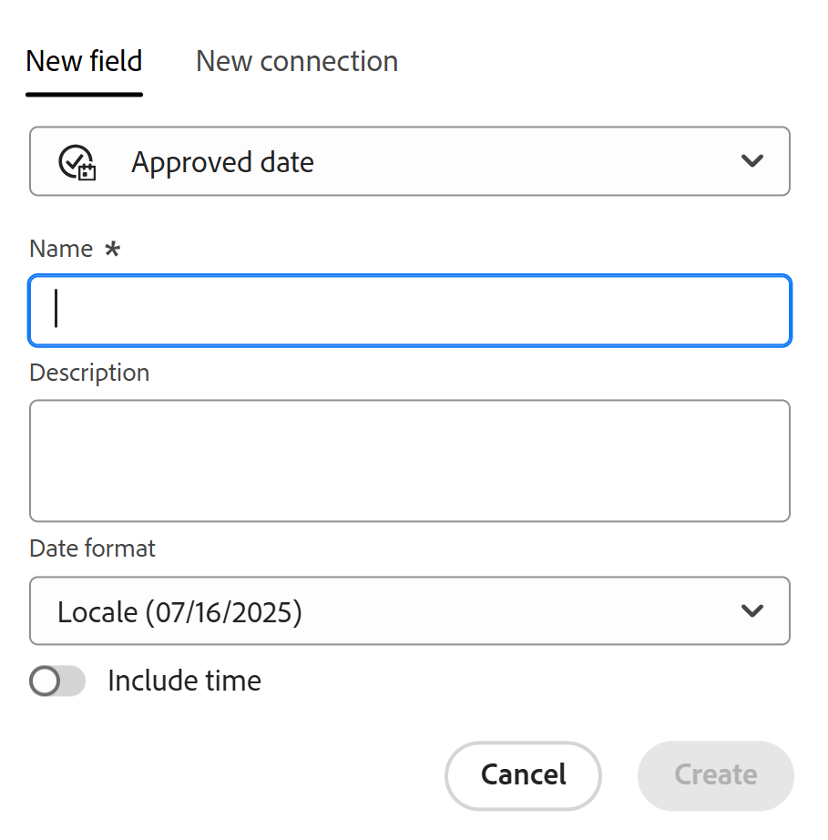

<!--Should the structure of this article be like this other one: https://experienceleague.adobe.com/docs/workfront/using/administration-and-setup/customize/custom-forms/custom-form-builder/use-the-custom-form-builder/add-a-custom-field-to-a-custom-form.html?lang=en ??-->

<!--will they add a way to create fields elsewhere than in a table?! - how will that change the structure of this article? -->

<!--Do we need this for FORMULAS: when we release permissions to RECORDS and we release referring lookup fields in a formula field, update considerations to say that lookup fields from linked records depends on the permissions to the record; if they have no permissions to view a linked record, they won't be able to use that records's lookup fields in a formula - not sure is needed??-->

# 创建字段

<!--information about choice values must stay in yellow till Jan 2026-->

<span class="preview">此页面上高亮显示的信息引用了尚未公开的功能。 它仅在“预览”环境中对所有客户可用。 在每月发布到生产环境后，生产环境中为启用快速发布的客户提供了相同的功能。</span>

<span class="preview">有关快速发布的信息，请参阅[为您的组织启用或禁用快速发布](/help/quicksilver/administration-and-setup/set-up-workfront/configure-system-defaults/enable-fast-release-process.md)。</span>


{{planning-important-intro}}

在Adobe Workfront Planning中，您可以为记录类型创建自定义字段。 然后，您可以将这些字段与Workfront Planning记录关联以增强记录信息。

在创建要与记录类型关联的字段之前，您必须先创建记录类型。 有关信息，请参阅[创建记录类型](/help/quicksilver/planning/architecture/create-record-types.md)。

在Workfront Planning中，您可以通过以下方式创建字段：

* [从头开始](#create-fields-from-scratch)
* [通过连接记录类型](#create-fields-by-connecting-record-types)
* [通过创建记录类型](#create-fields-by-creating-a-record-type)
* [通过从模板创建工作区](#create-fields-by-creating-a-workspace-from-a-template)
* [通过使用Excel或CSV文件导入记录类型](#create-fields-when-importing-record-types-from-a-csv-or-excel-file)
* [通过导入现有Workfront字段的副本](#create-fields-by-importing-them-from-workfront)

有关Workfront Planning字段的更多信息，请参阅[字段概述](/help/quicksilver/planning/fields/fields-overview.md)。

## 访问要求

+++ 展开以查看本文中各项功能的访问要求。 

<table style="table-layout:auto"> 
<col> 
</col> 
<col> 
</col> 
<tbody> 
    <tr> 
<tr> 
</tr>   
<tr> 
   <td role="rowheader"><p>Adobe Workfront包</p></td> 
   <td> 
<ul> 
<li><p>任何Workfront和任何Planning包</p></li>
<p>或</p>
<li><p>任何工作流和任何计划包</p></li></ul>
<p>有关每个Workfront Planning包中所包含内容的更多信息，请联系您的Workfront客户代表。 </p> 
   </td> 
  <tr> 
   <td role="rowheader"><p>Adobe Workfront许可证</p></td> 
   <td><p>标准</p>
   </td> 
  </tr> 
  <tr> 
   <td role="rowheader"><p>对象权限</p></td> 
   <td>   <p>管理工作区的权限</p>  
   <p>系统管理员对所有工作区具有权限，包括他们未创建的工作区</p>  </td> 
  </tr>  
</tbody> 
</table>

有关Workfront访问要求的详细信息，请参阅Workfront文档中的[访问要求](/help/quicksilver/administration-and-setup/add-users/access-levels-and-object-permissions/access-level-requirements-in-documentation.md)。

+++   

<!--Old:

 <table style="table-layout:auto"> 
<col> 
</col> 
<col> 
</col> 
<tbody> 
    <tr> 
<tr> 
<td> 
   <p> Products</p> </td> 
   <td> 
   <ul><li><p> Adobe Workfront</p></li> 
   <li><p> Adobe Workfront Planning<p></li></ul></td> 
  </tr>   
<tr> 
   <td role="rowheader"><p>Adobe Workfront plan*</p></td> 
   <td> 
<p>Any of the following Workfront plans:</p> 
<ul><li>Select</li> 
<li>Prime</li> 
<li>Ultimate</li></ul> 
<p>Workfront Planning is not available for legacy Workfront plans</p> 
   </td> 
<tr> 
   <td role="rowheader"><p>Adobe Workfront Planning package*</p></td> 
   <td> 
<p>Any </p> 
<p>For more information about what is included in each Workfront Planning plan, contact your Workfront account manager. </p> 
   </td> 
 <tr> 
   <td role="rowheader"><p>Adobe Workfront platform</p></td> 
   <td> 
<p>Your organization's instance of Workfront must be onboarded to the Adobe Unified Experience to be able to access Workfront Planning.</p> 
<p>For more information, see <a href="/help/quicksilver/workfront-basics/navigate-workfront/workfront-navigation/adobe-unified-experience.md">Adobe Unified Experience for Workfront</a>. </p> 
   </td> 
   </tr> 
  </tr> 
  <tr> 
   <td role="rowheader"><p>Adobe Workfront license*</p></td> 
   <td><p> Standard </p>
   <p>Workfront Planning is not available for legacy Workfront licenses</p> 
  </td> 
  </tr> 
  <tr> 
   <td role="rowheader"><p>Access level configuration</p></td> 
   <td> <p>There are no access level controls for Adobe Workfront Planning</p>   
</td> 
  </tr> 
<tr> 
   <td role="rowheader"><p>Object permissions</p></td> 
   <td>   <p>Manage permissions to a workspace and record type</a> </p>  
   <p>System Administrators have permissions to all workspaces, including the ones they did not create.</p> </td> 
  </tr> 
</tbody> 
</table> -->

## 通过连接记录类型创建字段

在两种记录类型之间添加新连接，或者从其它应用程序添加记录类型和对象类型时，可以创建链接记录字段。

有关连接Workfront Planning记录类型的信息，请参阅[连接记录类型](/help/quicksilver/planning/architecture/connect-record-types.md)。

<!--## Create fields by importing record types using an Excel or CSV file

For more information, see [Create record types](/help/quicksilver/planning/architecture/create-record-types.md).-->

## 通过创建记录类型创建字段

创建记录类型时，默认情况下还会创建与新记录类型关联的多个字段。 有关详细信息，请参阅[创建记录类型](/help/quicksilver/planning/architecture/create-record-types.md)。

## 通过从模板创建工作区来创建字段

从模板创建工作区时，Adobe Workfront Planning会为记录类型创建字段。

有关信息，请参阅[创建工作区](/help/quicksilver/planning/architecture/create-workspaces.md)。


## 从CSV或Excel文件导入记录类型时创建字段

使用CSV或Excel文件导入记录类型时，可以导入字段。

有关信息，请参阅[创建记录类型](/help/quicksilver/planning/architecture/create-record-types.md)。

## 通过从Workfront导入字段来创建字段

您可以导入现有Workfront字段的副本。

从Workfront导入字段会为Workfront Planning记录类型创建每个字段的副本。

复制字段后，这些字段彼此独立，不会交换信息。

有关信息，请参阅[从Workfront导入字段](/help/quicksilver/planning/fields/import-fields-from-workfront.md)。


## 从头开始创建字段 {#create-fields-from-scratch}

<!--in a table (not sure if this can be done elsewhere?!-->

<!--the first 3 steps are the same as in Import fields from Workfront-->

{{step1-to-planning}}

1. 单击要为其创建字段的记录的工作区。

   此时会打开工作区，并显示记录类型。

1. 单击记录类型的卡。

   与记录类型关联的所有现有记录都会显示在表格视图的行中。

   >[!TIP]
   >
   >    如果没有显示记录，则表示您可能还没有任何记录，或者您可能应用了过滤器来限制您在屏幕上看到的内容。

   与记录类型关联的所有现有字段都会显示在表格视图的列中。

   >[!TIP]
   >
   >    某些字段可能已隐藏。 单击字段，然后启用在表格视图中作为列查看的字段的切换。

1. 单击表格视图右上角的&#x200B;**+**&#x200B;图标

   或

   将鼠标悬停在任何列的标题上，单击字段名称后面的向下箭头，然后单击&#x200B;**向左插入**&#x200B;或&#x200B;**向右插入**&#x200B;以添加新字段。
1. 在&#x200B;**新字段**&#x200B;选项卡中，搜索&#x200B;**字段类型**&#x200B;框中的字段类型，或从以下字段类型中选择：

   在&#x200B;**新建字段**&#x200B;选项卡中，使用任何相关关键词搜索&#x200B;**字段类型**&#x200B;框中的字段类型，或从下面列出的字段类型中进行选择。

   >[!TIP]
   >
   >    您可以键入“Budget”，并且字段类型“Number”和“Currency”显示在简短列表中。


   * [单行文本](#single-line-text)
   * [段落](#paragraph)
   * [多选](#multi-select)
   * [单选](#single-select)
   * [日期](#date)
   * [数字](#number)
   * [百分比](#percentage)
   * [货币](#currency)
   * [复选框](#checkbox)
   * [公式](#formula)
   * [人员](#people)
   * [创建者](#created-by)
   * [创建日期](#created-date)
   * [上次修改者](#last-modified-by)
   * [上次修改日期](#last-modified-date)
   * <span class="preview">[批准日期](#approved-date)</span>
   * <span class="preview">[审批者](#approved-by)</span>
     <!--* [Object](#object-field-type)-->

   >[!IMPORTANT]
   >
   >保存字段后，无法更改该字段的字段类型。

   <!--Add this to the IMPORTANT above and make it a NOTE - should do directly to Prod:
    * You can use any keyword that might be related to any of the field type names. For example, a search for "Budget" will display the Number or Currency field type.-->

1. 继续添加每个字段，如下节所述。

### 单行文本 {#single-line-text}

单行文本字段捕获有限的字母数字信息。 例如，您可以在一行文本字段中捕获“所有者”、“利益相关者”、“团队”或“组织”单位信息。 单行文本字段的内容最多可包含1,000个字符。<!-- used to be 250 but just tested with 1000 and it allowed this as a maximum. -->

1. 按照本文中[从头开始创建字段](#create-fields-from-scratch)部分中的说明开始创建字段，然后选择&#x200B;**单行文本**&#x200B;字段类型。

   

1. 在&#x200B;**新建字段**&#x200B;选项卡中添加以下信息：
   * **名称**：字段的名称，它将显示在表或记录的详细信息页面中。<!--ensure they updated this; and update the screen shot: it used to be "Label"-->
   * **描述**：有关该字段的其他信息。 当您将鼠标悬停在表中的字段列标题上，或者单击记录详细信息页面中字段名称旁边的信息图标时，将显示字段说明。
1. 单击&#x200B;**创建**。

   新的单行字段作为列添加到记录类型，其值可以与记录相关联。


### 段落 {#paragraph}

段落字段捕获有关记录的其他字母数字信息，与描述字段类似。

>[!TIP]
>
>* 一个记录类型最多可以有20个段落字段。
>
>* 段落字段的内容最多可包含10,000个字符。
>* 当段落字段显示在记录的表视图或详细信息页面中时，您可以使用富文本格式来增强段落字段的内容。 有关信息，请参阅[编辑记录](/help/quicksilver/planning/records/edit-records.md)。
>


1. 按照本文中[从头开始创建字段](#create-fields-from-scratch)部分中的说明开始创建字段，然后选择&#x200B;**段落**&#x200B;字段类型。

   


1. 在&#x200B;**新建字段**&#x200B;选项卡中添加以下信息：
   * **名称**：字段的名称，它将显示在表或记录的详细信息页面中。<!--ensure they updated this; and update the screen shot: it used to be "Label"-->
   * **描述**：有关该字段的其他信息。 当您将鼠标悬停在表中的字段列上时，或者在记录的详细信息页面中单击字段名称旁边的信息图标时，将显示字段的描述。
1. 单击&#x200B;**创建**。

   新的段落字段作为列添加到记录类型，其值可以与记录相关联。


### 多选 {#multi-select}

您可以从下拉菜单中选择多个选项，使用多选字段捕获任何格式的其他信息。

>[!NOTE]
>
><span class="preview">除了本节中介绍的功能外，您还可以在表视图中内联编辑记录的多选字段值时添加新选项。 有关详细信息，请参阅文章[编辑记录](/help/quicksilver/planning/records/edit-records.md).</span>中的“编辑有关单选或多选字段的信息”部分
>

1. 按照本文中[从头开始创建字段](#create-fields-from-scratch)部分中的说明开始创建字段，然后选择&#x200B;**多选**&#x200B;字段类型。

   


1. 在&#x200B;**新建字段**&#x200B;选项卡中添加以下信息：
   * **名称**：字段的名称，它将显示在表或记录的详细信息页面中。<!--ensure they updated this; and update the screen shot: it used to be "Label"-->
   * **描述**：有关该字段的其他信息。 当您将鼠标悬停在表中的字段列上时，或者在记录的详细信息页面中单击字段名称旁边的信息图标时，将显示字段的描述。
   * **选项**：用户在更新此字段时可以选择的选项。 每个选择的名称可以同时使用数字和字母。
1. 单击&#x200B;**添加选项**&#x200B;以添加更多选项。 您可以向多选字段添加的选项数量没有限制。
1. （可选）按所需顺序手动拖放每个选项，或选择
   如果要按字母顺序自动列出选项，请&#x200B;**对选项A-Z**&#x200B;进行排序。<!--Add this if they added this functionality: You cannot edit this option after you save the field.-->
1. （可选）要删除某个选择，请单击其右侧的&#x200B;**x**&#x200B;图标。
1. 单击某个选项左侧的颜色样本可展开颜色选择器并自定义每个选项的颜色。

1. 单击&#x200B;**色板**&#x200B;以选择预定义的颜色

   或

   单击&#x200B;**自定义**&#x200B;以使用拾色器或十六进制代码选择自定义颜色。
1. 单击颜色框外部以将其关闭。
1. 单击&#x200B;**创建**。

   新的多选字段作为列添加到记录类型，其值可以与记录相关联。

<!--
1. <span class="preview">(Optional) Hover over the field name in the table view, click the drop-down menu to the right of the field name, then click **Edit field**.</span>
1. <span class="preview">Turn on the **Show values** setting to display the values for each choice. The values are the names of each choice, as they appear in the Workfront database. </span>

    >[!NOTE]
    >
    >* <span class="preview">Workfront assigns unique values for each choice. </span>
    >
    >* <span class="preview">Values match the choice name in lowercase format. Multiple words are separated by an underscore. </span>
    >
    >* <span class="preview">Values can be repeated between multiple fields, but they must be unique for one field.</span>
    >
    ><span class="preview"> </span>

1. <span class="preview">(Optional) Use the choice values in your API calls and other integrations. </span> 

-->

### 单选 {#single-select}

通过从下拉菜单中选择一个选项，单选字段可以捕获任何格式的附加信息。

>[!NOTE]
>
><span class="preview">除了本节中介绍的功能外，您还可以在表视图中内联编辑记录的单选字段值时添加新选项。 有关详细信息，请参阅文章[编辑记录](/help/quicksilver/planning/records/edit-records.md).</span>中的“编辑有关单选或多选字段的信息”部分
>

1. 按照本文中[从头开始创建字段](#create-fields-from-scratch)部分中的说明开始创建字段，然后选择&#x200B;**单选**&#x200B;字段类型。

   


1. 在&#x200B;**新建字段**&#x200B;选项卡中添加以下信息：
   * **名称**：字段的名称，它将显示在表或记录的详细信息页面中。<!--ensure they updated this; and update the screen shot: it used to be "Label"-->
   * **描述**：有关该字段的其他信息。 当您将鼠标悬停在表中的字段列上时，或者在记录的详细信息页面中单击字段名称旁边的信息图标时，将显示字段的描述。
   * **选项**：保存字段后可从下拉菜单中选择的选项。 每个选择的名称可以同时包含数字和字母。

1. 单击&#x200B;**添加选项**&#x200B;以添加更多选项。 您可以向单选字段添加的选项数量没有限制。
1. （可选）按所需顺序手动拖放每个选项，或者如果要按字母顺序自动列出选项，请选择&#x200B;**将选项按A到Z排序**&#x200B;选项。<!--Add this if they added this functionality: You cannot edit this option after you save the field.-->
1. （可选）要删除某个选择，请单击其右侧的&#x200B;**x**&#x200B;图标。
1. 单击某个选项左侧的颜色样本可展开颜色选择器并自定义每个选项的颜色。
1. 单击&#x200B;**色板**&#x200B;以选择预定义的颜色

   或

   单击&#x200B;**自定义**&#x200B;以使用拾色器或十六进制代码选择自定义颜色。

1. 单击颜色框外部以将其关闭。
1. 单击&#x200B;**创建**。

   新的单选字段作为列添加到记录类型，其值可以与记录相关联。

<!--

1. <span class="preview">(Optional) Hover over the field name in the table view, click the drop-down menu to the right of the field name, then click **Edit field**.</span>
1. <span class="preview">Turn on the **Show values** setting to display the values for each choice. The values are the names of each choice, as they appear in the Workfront database. </span>

    >[!NOTE]
    >
    >* <span class="preview">Workfront assigns unique values for each choice. </span>
    >
    >* <span class="preview">Values match the choice name in lowercase format. Multiple words are separated by an underscore. </span>
    >
    >* <span class="preview">Values can be repeated between multiple fields, but they must be unique for one field.</span>
    >
    ><span class="preview"> </span>

1. <span class="preview">(Optional) Use the choice values in your API calls and other integrations. </span>

-->

### 日期 {#date}

您可以使用日期字段以日期和时间格式捕获其他信息。

1. 按照本文中[从头开始创建字段](#create-fields-from-scratch)部分中的说明开始创建字段，然后选择&#x200B;**日期**&#x200B;字段类型。

   


1. 在&#x200B;**新建字段**&#x200B;选项卡中添加以下信息：
   * **名称**：字段的名称，它将显示在表或记录页中。<!--ensure they updated this; and update the screen shot: it used to be "Label"-->
   * **描述**：有关该字段的其他信息。 当您将鼠标悬停在表中的字段列上时，或者在记录的详细信息页面中单击字段名称旁边的信息图标时，将显示字段的描述。
   * **日期格式**：要在此字段中显示的日期格式类型。<!--update this casing - submitted bug for it-->

     从以下格式中选择：
      * **区域设置**：与浏览器的区域设置匹配。
      * **标准**： 05/16/2023
      * **长**：2023年5月16日
      * **欧洲**： 16/05/2023
      * **ISO**： 2023-05-16
      * **包含时间**：如果要包含时间戳，请选择此选项。 默认情况下，该选项处于未选中状态。 您不能在字段安全后添加时间。

     从以下选项中选择：

      * **24hr**：例如： 18:00
      * **12hr**：例如：下午6:00

1. 单击&#x200B;**创建**。

   新的日期字段作为列添加到记录类型，其值可以与记录相关联。

### 数值 {#number}

数字字段类型以数字格式捕获信息。

>[!TIP]
>
>数字字段在请求表单生成器中显示为单行文本字段类型。
>
>但是，字段格式将保留，并且这些字段的值将在提交请求后、记录类型和请求详细信息页面中显示为数字。
>&#x200B;>有关信息，请参阅[在Adobe Workfront Planning中创建和管理申请表单](/help/quicksilver/planning/requests/create-request-form.md)。


1. 按照本文中[从头开始创建字段](#create-fields-from-scratch)部分中的说明开始创建字段，然后选择&#x200B;**数字**&#x200B;字段类型。

   
1. 在&#x200B;**新建字段**&#x200B;选项卡中添加以下信息：

   * **名称**：字段的名称，它将显示在表或记录页中。
   * **描述**：有关该字段的其他信息。 当您将鼠标悬停在表中的字段列上时，或者在记录的详细信息页面中单击字段名称旁边的信息图标时，将显示字段的描述。
   * **精度**：要为该字段记录的小数位数。 最多可显示6位小数。
   * **允许负数**：如果要允许该字段中存在负数，请选择此选项。 默认情况下，此选项处于未选中状态。

   >[!NOTE]
   >
   >    如果选择“允许负数”，并且负值存储在附加字段的记录中，则以后不能再取消选择该设置。

1. 单击&#x200B;**创建**。

   新的数字字段作为列添加到记录类型，其值可以与记录相关联。

### 百分比 {#percentage}

百分比字段类型以数字格式捕获信息，后跟百分比符号。

>[!TIP]
>
>百分比字段在请求表单生成器中显示为单行文本字段类型。
>
>但是，字段格式将保留，并且这些字段的值将在提交请求后、记录类型和请求详细信息页面中显示为百分比。
>&#x200B;>有关信息，请参阅[在Adobe Workfront Planning中创建和管理申请表单](/help/quicksilver/planning/requests/create-request-form.md)。


1. 按照本文中[从头开始创建字段](#create-fields-from-scratch)部分中的说明开始创建字段，然后选择&#x200B;**百分比**&#x200B;字段类型。

   

1. 在&#x200B;**新建字段**&#x200B;选项卡中添加以下信息：
   * **名称**：字段的名称，它将显示在表或记录页中。
   * **描述**：有关该字段的其他信息。 当您将鼠标悬停在表中的字段列上时，或者在记录的详细信息页面中单击字段名称旁边的信息图标时，将显示字段的描述。
   * **精度**：要为该字段记录的小数位数。 最多可显示6位小数。
   * **允许负数**：如果要允许此字段中的负百分比值，请选择此选项。 默认情况下，此选项处于未选中状态。

     >[!NOTE]
     >
     >如果选择“允许负数”，并且负值存储在附加字段的记录中，则以后不能再取消选择该设置。

   * **显示为**：从下拉菜单中，选择您希望百分比值在表视图中的显示方式。 从以下选项中选择：
      * **数字**：百分比值显示为一个数字，后跟百分比符号。
      * **栏**：百分比值在百分比数字旁边显示为栏。 栏的填充颜色表示百分比值。 这是默认选项。
      * **Circle**：百分比值在百分比数字旁边显示为圆形的轮廓。 圆轮廓的填充颜色指示百分比值。

   >[!NOTE]
   >
   >* 您在“显示为”字段中所做的选择仅适用于表格视图中可见的百分比值。 该字段的百分比值显示为一个数字，后跟Workfront Planning中其他位置的百分比符号。 当百分比类型字段在其他记录的表视图中显示为查找字段时，这也适用于百分比类型字段。
   >* 以后编辑字段时，可以更改“显示为选定内容”。

1. 单击&#x200B;**创建**。

   新的百分比字段作为列添加到记录类型，其值可以与记录相关联。

### 货币 {#currency}

货币字段类型以数字格式捕获信息，该格式前面带有货币符号。

>[!TIP]
>
>货币字段在请求表单生成器中显示为单行文本字段类型。
>
>但是，字段格式将保留，并且这些字段的值将在提交请求后、记录类型和请求详细信息页面中显示为货币。
>&#x200B;>有关信息，请参阅[在Adobe Workfront Planning中创建和管理申请表单](/help/quicksilver/planning/requests/create-request-form.md)。

1. 按照本文中[从头开始创建字段](#create-fields-from-scratch)部分中的说明开始创建字段，然后选择&#x200B;**货币**&#x200B;字段类型。

   

1. 在&#x200B;**新建字段**&#x200B;选项卡中添加以下信息：
   * **名称**：字段的名称，它将显示在表或记录页中。<!--ensure they updated this; and update the screen shot: it used to be "Label"-->
   * **描述**：有关该字段的其他信息。 当您将鼠标悬停在表中的字段列上时，或者在记录的详细信息页面中单击字段名称旁边的信息图标时，将显示字段的描述。
   * **货币**：要在此字段中显示的货币类型。 这是国际标准化组织(ISO)的货币列表。
   * **精度**：要为该字段记录的小数位数。 您最多可以显示6个小数。
   * **允许负数**：如果要允许在此字段中出现负货币值，请选择此选项。 默认情况下，此选项处于未选中状态。

   >[!NOTE]
   >
   >    如果选择“允许负数”，并且负值存储在附加字段的记录中，则以后不能再取消选择该设置。

1. 单击&#x200B;**创建**。

   新货币字段作为列添加到记录类型，其值可以与记录相关联。

### 复选框

您可以使用Checkbox字段类型将单个复选框选项添加到记录。 您可以使用此字段指明特定记录的特定属性或状态。 例如，您可以将其用作跟踪每个记录的完成、批准或任何其他二进制属性的标志。

1. 按照本文中[从头开始创建字段](#create-fields-from-scratch)部分中的说明开始创建字段，然后选择&#x200B;**复选框**&#x200B;字段类型。

   

1. 在&#x200B;**新建字段**&#x200B;选项卡中添加以下信息：
   * **名称**：字段的名称，它将显示在表或记录页中。<!--ensure they updated this; and update the screen shot: it used to be "Label"-->
   * **描述**：有关该字段的其他信息。 当您将鼠标悬停在表中的字段列上时，或者在记录的详细信息页面中单击字段名称旁边的信息图标时，将显示字段的描述。
1. 单击&#x200B;**创建**。

   新的复选框字段作为列添加到记录类型，其值可以与记录相关联。

### 公式

公式字段使用记录类型中其他字段的现有值以及指示应如何计算现有值的函数来生成新值。

有关详细信息，请参阅[公式字段概述](/help/quicksilver/planning/fields/formula-fields.md)。

1. 按照本文中[从头开始创建字段](#create-fields-from-scratch)部分中的说明开始创建字段，然后选择&#x200B;**公式**&#x200B;字段类型。

   

1. 在&#x200B;**新建字段**&#x200B;选项卡中添加以下信息：

   * **名称**：输入新字段的名称。
   * **描述**：添加有关新字段的信息。 当您将鼠标悬停在表中的字段列上时，或者在记录的详细信息页面中单击字段名称旁边的信息图标时，将显示字段的描述。
   * **公式**：开始键入至少一个字符以访问表达式，然后在表达式显示在列表中时将其选定。

1. 单击所选表达式以显示定义并查看其格式。

   

   有关支持的表达式的详细信息，请参阅[公式字段概述](/help/quicksilver/planning/fields/formula-fields.md)。


   >[!TIP]
   >
   >编辑或创建公式字段时，您会收到一条警告消息，该消息可能会导致对自身或共享字段的循环引用。 不能保存引用自身或引用计算中所引用项的公式字段。


1. 添加在Workfront Planning中显示的字段名称，以在公式中引用它们。

   >[!NOTE]
   >
   >* 不能在公式中添加多选类型字段。
   >
   >
   >* 在Workfront Planning中，必须拼写公式中包含的字段名称。 Workfront Planning公式不支持Workfront文本模式语法和通配符。
   >
   >* 您可以引用与当前记录类型相距最多4个字段（和对象）的字段。 例如，如果要为活动记录类型(1)创建公式字段，且活动连接到与Workfront项目(3)连接的活动记录类型(2)，则可以在为活动记录类型创建的公式中引用项目的预算字段(4)。
   >
   >
   >

1. （可选）单击&#x200B;**最大化**&#x200B;以打开较大区域中的“公式”框。

   “公式”框在一个较大的窗口中打开。
1. （可选且有条件）如果您在较大的区域中打开了“公式”框，请单击&#x200B;**最小化**&#x200B;以返回到原始的“公式”字段框。

1. 在&#x200B;**格式**&#x200B;字段中，从以下选项中进行选择，以标识公式类型字段中显示的结果的格式：

   * **文本**：公式字段的结果显示为纯文本。
   * **数字**：公式字段的结果显示为数字。
   * **百分比**：公式字段的结果显示为后跟百分比符号的数字。
   * **货币**：公式字段的结果显示为前面或后面带有货币符号的数字。
   * **标记**：公式字段的结果显示为带有对象名称的标记。

     >[!TIP]
     >
     >我们建议为显示数组的字段使用标记。 在这种情况下，每个数组成员都显示为单独的标记。

     

   * **日期**：公式字段的结果显示为日期。

     在&#x200B;**格式**&#x200B;字段下将显示结果预览。

     >[!WARNING]
     >
     >如果公式的结果与所选格式不匹配，则字段将显示错误消息。

1. 单击&#x200B;**创建**。

   新的公式字段作为列添加到记录类型，其值可以与记录相关联。

### 人员

您可以使用“人员”字段类型将用户<!--, job role, or team-->添加到记录。 这是预先输入字段，您只能添加您的Workfront实例中已存在的用户<!--, roles, or teams-->。

>[!TIP]
>
>* 在“人员”字段中添加用户名称时，该字段中将显示该用户的名称及其主要工作角色。
>
>* 人员字段在请求表单生成器中显示为引用（或连接）字段类型。
>
>有关信息，请参阅[在Adobe Workfront Planning中创建和管理申请表单](/help/quicksilver/planning/requests/create-request-form.md)。

1. 按照本文中[从头开始创建字段](#create-fields-from-scratch)部分中的说明开始创建字段，然后选择&#x200B;**人员**&#x200B;字段类型。

   

1. 在&#x200B;**新建字段**&#x200B;选项卡中添加以下信息：
   * **名称**：字段的名称，它将显示在表或记录页中。
   * **描述**：有关该字段的其他信息。 当您将鼠标悬停在表中的字段列上时，或者在记录的详细信息页面中单击字段名称旁边的信息图标时，将显示字段的描述。
   * **允许多个值**：如果要允许用户在此字段中添加多个用户，请选择此选项。 默认情况下，此选项处于未选中状态。

   >[!NOTE]
   >
   >    如果选择“允许多个值”，并且多个用户存储在字段附加到的记录中，则以后编辑此字段时，无法再取消选择设置。

1. 单击&#x200B;**创建**。

   新的People-type字段作为列添加到记录类型，其值可与记录相关联。

### 创建者

您可以使用“创建者”字段类型将创建记录的用户添加到记录。 这是只读字段，它会自动填充在创建记录时登录的用户名称。

1. 按照本文中[从头开始创建字段](#create-fields-from-scratch)部分中的说明开始创建字段，然后选择&#x200B;**创建者**&#x200B;字段类型。

   

1. 在&#x200B;**新建字段**&#x200B;选项卡中添加以下信息：

   * **名称**：字段的名称，它将显示在表或记录页中。<!--this might change and they might prepopulate it with "Created by"-->
   * **描述**：有关该字段的其他信息。 当您将鼠标悬停在表中的字段列上时，或者在记录的详细信息页面中单击字段名称旁边的信息图标时，将显示字段的描述。

1. 单击&#x200B;**创建**。

   新的“创建者 — 类型”字段作为列添加到记录类型中，其值预先填充有创建每个记录的用户的名称。


### 创建日期

您可以使用创建日期字段类型将记录的创建日期添加到记录。 此字段为只读字段，并且会自动填充创建记录的日期(以及（可选）时间。

1. 按照本文中[从头开始创建字段](#create-fields-from-scratch)部分中的说明开始创建字段，然后选择&#x200B;**创建日期**&#x200B;字段类型。

   

   <!--check the image above - added bug fix for UI text changes-->

1. 在&#x200B;**新建字段**&#x200B;选项卡中添加以下信息：

   * **名称**：字段的名称，它将显示在表或记录页中。<!--this might change and they might prepopulate it with "Created date"-->
   * **描述**：有关该字段的其他信息。 当您将鼠标悬停在表中的字段列上时，或者在记录的详细信息页面中单击字段名称旁边的信息图标时，将显示字段的描述。
   * **日期格式**：从以下格式中选择：

      * **区域设置**：与浏览器的区域设置匹配。
      * **标准**： 05/16/2023
      * **长**：2023年5月16日
      * **欧洲**： 16/05/2023
      * **ISO**： 2023-05-16
   * **包含时间字段**：如果要包含时间戳，请选择此选项。 默认情况下，该选项处于未选中状态。<!--submitted a UI text change for this - check the UI-->

     从以下选项中选择：

      * **24hr**：例如： 18:00
      * **12hr**：例如：下午6:00

1. 单击&#x200B;**创建**。

   新的创建日期类型字段作为列添加到记录类型，其值预填充有创建记录的日期（或日期和时间）。


### 上次修改者

您可以使用“上次修改人”字段类型将上次修改记录的用户添加到记录。 此字段为只读字段，并且会自动填充上次更新记录时登录的用户的名称。

1. 按照本文中[从头开始创建字段](#create-fields-from-scratch)部分中的说明开始创建字段，然后选择&#x200B;**上次修改者**&#x200B;字段类型。

   

1. 在&#x200B;**新建字段**&#x200B;选项卡中添加以下信息：

   * **名称**：字段的名称，它将显示在表或记录页中。<!--this might change and they might prepopulate it with "Created by"-->
   * **描述**：有关该字段的其他信息。 当您将鼠标悬停在表中的字段列上时，或者在记录的详细信息页面中单击字段名称旁边的信息图标时，将显示字段的描述。

1. 单击&#x200B;**创建**。

   新的上次修改者类型字段作为列添加到记录类型，其值预填充有上次修改每个记录的用户的名称。


### 上次修改日期

您可以使用“上次修改日期”字段类型来添加上次将记录修改为记录的日期。 此字段为只读字段，并且会自动使用上次修改记录的日期(以及（可选）时间填充。

1. 按照本文中[从头开始创建字段](#create-fields-from-scratch)部分中的说明开始创建字段，然后选择&#x200B;**创建日期**&#x200B;字段类型。

   

   <!--check the image above - added bug fix for UI text changes-->

1. 在&#x200B;**新建字段**&#x200B;选项卡中添加以下信息：

   * **名称**：字段的名称，它将显示在表或记录页中。<!--this might change and they might prepopulate it with "Created date"-->
   * **描述**：有关该字段的其他信息。 当您将鼠标悬停在表中的字段列上时，或者在记录的详细信息页面中单击字段名称旁边的信息图标时，将显示字段的描述。
   * **日期格式**：从以下格式中选择：

      * **区域设置**：与浏览器的区域设置匹配。
      * **标准**： 05/16/2023
      * **长**：2023年5月16日
      * **欧洲**： 16/05/2023
      * **ISO**： 2023-05-16

   * **包含时间字段**：如果要包含时间戳，请选择此选项。 默认情况下，该选项处于未选中状态。<!--submitted a UI text change for this - check the UI-->

     从以下选项中选择：

      * **24hr**：例如： 18:00
      * **12hr**：例如：下午6:00

1. 单击&#x200B;**创建**。

   新的“上次修改日期 — 类型”字段作为列添加到记录类型中，其值预填充有上次修改记录的日期（或日期和时间）。

<div class="preview">

### 批准日期

您可以使用批准日期字段类型添加请求获得批准并导致创建记录的日期。 此字段为只读字段，会自动使用上次批准者批准请求的日期(以及（可选）时间填充。 在这种情况下，审批日期应与创建记录的日期一致。

>[!TIP]
>
>“批准日期”字段将仅针对通过提交与批准者关联的请求表单而创建的记录填充信息。
>
>如果表单与多个审批者关联，则在“审批日期”字段中仅记录上次审批决策的日期。


1. 按照本文中[从头开始创建字段](#create-fields-from-scratch)部分中的说明开始创建字段，然后选择&#x200B;**创建日期**&#x200B;字段类型。

   

   1. 在&#x200B;**新建字段**&#x200B;选项卡中添加以下信息：

   * **名称**：字段的名称，它将显示在表或记录页中。
   * **描述**：有关该字段的其他信息。 当您将鼠标悬停在表中的字段列上时，或者在记录的详细信息页面中单击字段名称旁边的信息图标时，将显示字段的描述。
   * **日期格式**：从以下格式中选择：

      * **区域设置**：与浏览器的区域设置匹配。
      * **标准**： 05/16/2023
      * **长**：2023年5月16日
      * **欧洲**： 16/05/2023
      * **ISO**： 2023-05-16

   * **包含时间字段**：如果要包含时间戳，请选择此选项。 默认情况下，该选项处于未选中状态。

     从以下选项中选择：

      * **24hr**：例如： 18:00
      * **12hr**：例如：下午6:00

1. 单击&#x200B;**创建**。

   新的“已批准”日期类型字段将作为列添加到记录类型中，如果记录是通过提交与批准者关联的请求创建的，则其值将预先填充有批准记录请求的日期（或日期和时间）。

### 批准者

您可以使用“批准者”字段类型添加上次批准请求的用户以创建记录。 此字段为只读字段，并且会自动使用批准创建记录的请求的用户的名称填充。

>[!TIP]
>
>“批准者”字段将仅针对通过提交与批准者关联的请求表单创建的记录填充信息。
>
>如果该表单与多个批准者关联，则所有批准者的名称都将记录在批准日期字段中，并用逗号分隔。

1. 按照本文中[从头开始创建字段](#create-fields-from-scratch)部分中的说明开始创建字段，然后选择&#x200B;**由**&#x200B;批准字段类型。

   

1. 在&#x200B;**新建字段**&#x200B;选项卡中添加以下信息：

   * **名称**：字段的名称，它将显示在表或记录页中。
   * **描述**：有关该字段的其他信息。 当您将鼠标悬停在表中的字段列上时，或者在记录的详细信息页面中单击字段名称旁边的信息图标时，将显示字段的描述。

1. 单击&#x200B;**创建**。

   新的Approved by-type字段作为列添加到记录类型，其值预填充有上次修改每个记录的用户的名称。

</div>

<!--

## Object field type

You can use the Object field type when you need to store several fields that might include several pieces of information. For example, you can store the source, code, error message, or details of an object in one field. In this case, instead of having several separate single-line text fields for that, you can use an Object field to store all information in one place. 

For example, when using an Object-type field, you can store the following type of information: 

```
"{
""source"": ""string"",
""code"": ""string"",
""subCode"": ""string"",
""message"": ""string"",
""details"": ""string""
}"

```

You can also store an array of values in one field and you would rather rely on user input for each element of the array, instead of using a multi-select field type for the same purpose. For example, you can store information in the following format: 

`["EMEA", "APAC"] `

Consider the following when using Object-type fields:

* In addition to strings and arrays, you can store other value formats like HTML.
* There is no format validation for this field. 
* Object-type fields have a limit of 10,000 characters.

Create an Object field: 

1. Start creating a field as described in the section [Create fields from scratch](#create-fields-from-scratch) in this article, then select the **Created date** field type.

    

1. Add the following information in the **New field** tab:

     * **Name**: The name of the field, as it will appear in a table or the record page. (***********this might change and they might prepopulate it with "Created date"********)
     * **Description**: Additional information about the field. The description of a field displays when you hover over the field's column in a table, or when you click the information icon next to the field name in the record's details page.

1. Click **Create**.

    The new Object-type field is added as a column to the record type.

-->


