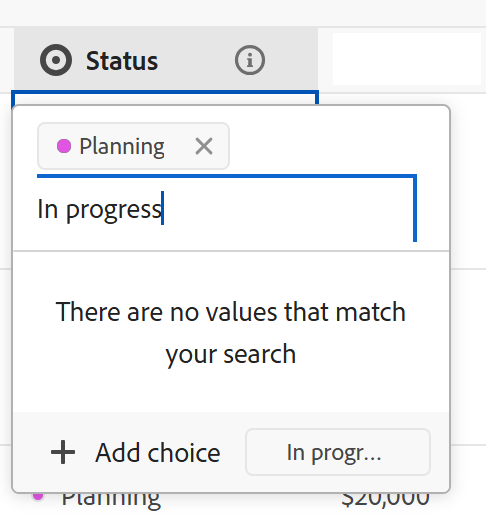

# 编辑字段设置

<!--leave the choice value information in yellow till January 2026-->

此页面上高亮显示的信息引用了尚未公开的功能。 它仅在“预览”环境中对所有客户可用。 在每月发布到生产环境后，生产环境中为启用快速发布的客户提供了相同的功能。

有关快速发布的信息，请参阅[为您的组织启用或禁用快速发布](/help/quicksilver/administration-and-setup/set-up-workfront/configure-system-defaults/enable-fast-release-process.md)。

{{planning-important-intro}}

您可以在Adobe Workfront规划中编辑现有字段的设置。

有关创建Adobe Workfront Planning字段的信息，请参阅[创建字段](/help/quicksilver/planning/fields/create-fields.md)。

本文介绍了如何编辑Workfront Planning字段的设置。 有关编辑记录的字段值的信息，请参阅[编辑记录](/help/quicksilver/planning/records/edit-records.md)。

## 访问权限要求

+++ 展开以查看本文中各项功能的访问要求。 

<table style="table-layout:auto"> 
<col> 
</col> 
<col> 
</col> 
<tbody> 
    <tr> 
<tr> 
</tr>   
<tr> 
   <td role="rowheader">
Adobe Workfront 包
</td> 
   <td> 

任何Workfront和任何Planning包
 
任何工作流和任何计划包

有关每个Workfront Planning包中所包含内容的更多信息，请联系您的Workfront客户代表。 
 
   </td> 
  <tr> 
   <td role="rowheader">
Adobe Workfront许可证
</td> 
   <td>
标准

   </td> 
  </tr> 
  <tr> 
   <td role="rowheader">
对象权限
</td> 
   <td>   
管理工作区的权限
  
   
系统管理员对所有工作区具有权限，包括他们未创建的工作区
  </td> 
  </tr>  
</tbody> 
</table>

有关Workfront访问要求的详细信息，请参阅Workfront文档中的[访问要求](/help/quicksilver/administration-and-setup/add-users/access-levels-and-object-permissions/access-level-requirements-in-documentation.md)。

+++     

<!--
Old:

<table style="table-layout:auto"> 
<col> 
</col> 
<col> 
</col> 
<tbody> 
    <tr> 
<tr> 
<td> 
   
 Products
 </td> 
   <td> 
   <ul><li>
 Adobe Workfront
</li> 
   <li>
 Adobe Workfront Planning
</li></ul></td> 
  </tr>   
<tr> 
   <td role="rowheader">
Adobe Workfront plan*
</td> 
   <td> 

Any of the following Workfront plans:
 
<ul><li>Select</li> 
<li>Prime</li> 
<li>Ultimate</li></ul> 

Workfront Planning is not available for legacy Workfront plans
 
   </td> 
<tr> 
   <td role="rowheader">
Adobe Workfront Planning package*
</td> 
   <td> 

Any 
 

For more information about what is included in each Workfront Planning plan, contact your Workfront account manager. 
 
   </td> 
 <tr> 
   <td role="rowheader">
Adobe Workfront platform
</td> 
   <td> 

Your organization's instance of Workfront must be onboarded to the Adobe Unified Experience to be able to access Workfront Planning.
 

For more information, see <a href="/help/quicksilver/workfront-basics/navigate-workfront/workfront-navigation/adobe-unified-experience.md">Adobe Unified Experience for Workfront</a>. 
 
   </td> 
   </tr> 
  </tr> 
  <tr> 
   <td role="rowheader">
Adobe Workfront license*
</td> 
   <td>
 Standard 

   
Workfront Planning is not available for legacy Workfront licenses
 
  </td> 
  </tr> 
  <tr> 
   <td role="rowheader">
Access level configuration
</td> 
   <td> 
There are no access level controls for Adobe Workfront Planning
   
</td> 
  </tr> 
<tr> 
   <td role="rowheader">
Object permissions
</td> 
   <td>   
Manage permissions to a workspace and record type</a> 
  
   
System Administrators have permissions to all workspaces, including the ones they did not create
</td> 
  </tr> 
</tbody> 
</table>
-->

## 有关编辑字段设置的注意事项

在对字段配置进行更改之前，必须考虑以下事项：

* 您只能从记录类型表中编辑字段设置。
* 不能在记录页面或表格视图之外的任何其他视图中编辑字段设置。
* 保存字段后，您无法编辑字段类型。
* 如果附加到“数字”、“百分比”或“货币”字段的记录中已经存储了负值，则不能取消选择以前选择的“允许负数”设置。
* 保存字段后，可以编辑以下字段元素的配置：

   * 任何字段的名称或描述
   * 单选或多选字段<!--and their default choices-->的选项。
     <!--* The default choices of a People field.-->
   * “公式”字段的表达式。

  >[!WARNING]
  >
  >当公式表达式发生更改，或者在select-type字段中添加或删除选项时，如果记录中已存储信息且这些信息的字段修改了配置，则这些记录的数据将会丢失。
  >
  >在更改字段配置时，没有警告或指示可能发生此数据丢失。
  >
  >不会通知其他用户字段配置已更改。

* 您可以从连接的记录中编辑现有查找字段。
* 除了按照本文的[编辑字段设置](#edit-field-settings-1)部分中所述编辑字段外，在表视图中编辑记录时，在更新字段值时，还可以编辑单选或多选字段的选项。 有关信息，请参阅本文中在表视图](#add-new-choices-to-an-existing-select-field-when-editing-records-in-the-table-view)中编辑记录时[将新选择添加到现有选择字段。

<!--at production - April 10, 2025 - remove the last bullet altogether-->

<!--
this is not yet true, but it might come later:
* You can deselect Allow negative numbers option from a Number, Percentage, or Currency field after you save the field. 
-->

## 编辑字段设置

{{step1-to-planning}}

1. 单击要编辑其记录字段的工作区。

   工作区将打开，工作区中的所有记录类型都显示在信息卡上。

1. 单击记录类型的卡。

   这将打开记录类型的页面。

1. （视情况而定）单击&#x200B;**表视图**&#x200B;的选项卡。

   与记录类型关联的所有现有记录都会显示在表格视图的行中。
1. 将鼠标悬停在要编辑的字段的列标题上，单击字段名称后面的向下箭头，然后单击“**编辑字段**”

   或

   双击该字段的列标题。

   在表标题中突出显示的字段名称后面的

1. 更新有关该字段的信息并单击&#x200B;**保存**。

   有关信息，请参阅[创建字段](/help/quicksilver/planning/fields/create-fields.md)。

   <!--insert screen shot when finalized-->

   >[!TIP]
   >
   >* 保存字段后无法更新字段类型。
   >
   >* 修改字段配置（字段选项或公式表达式）时，已修改字段中包含信息的记录将实时更新其值。 字段配置更改触发的值更改没有警告和审核日志。 所有查看字段的用户将立即看到经过修改的新值。

1. （视情况而定）如果您要更新的字段是请求表单的一部分，则会显示&#x200B;**审核字段更改**&#x200B;框以指示将受到更改影响的表单。 执行以下操作之一：

   

   * 单击向右箭头以显示受更改影响的表单，然后单击表单名称以在新选项卡中打开表单并决定是保留表单上的字段还是对表单进行其他更改。
   * 单击&#x200B;**保留更改**，这将更新显示字段的所有区域中的字段。

   

   字段信息会针对每个有权查看工作区的用户而更新。

1. （视情况而定）对于连接的记录字段，单击&#x200B;**编辑查找字段**&#x200B;并从连接的记录类型中添加或删除任何查找字段。

   有关详细信息，请参阅[连接记录类型](/help/quicksilver/planning/architecture/connect-record-types.md)。

## 在表格视图中编辑记录时，将新选择添加到现有选择字段

<!--some of this information is also available in Edit records article - update both when necessary-->

在表格视图中编辑记录时，可以将新选择添加到现有单选或多选字段。

>[!IMPORTANT]
>
>本节中介绍的功能仅在表视图中可用。 它不适用于显示单选或多选字段的任何其他区域。

**示例**

您可能有一个名为Status的单选字段，该字段具有选项New和Closed，并且您要为In progress状态添加选项。 您可以通过执行以下操作之一来添加选择：

* 编辑字段。 有关信息，请参阅本文中的[编辑字段设置](#edit-field-settings-1)部分。
* 在表格视图中编辑记录时添加新选项，如下所述。

要在编辑记录时向现有选择字段添加新选择，请执行以下操作：

1. 转到记录类型页面并打开表格视图。
1. 在表格视图中添加要向其添加选择的单选或多选字段作为新列。

   有关信息，请参阅[创建字段](/help/quicksilver/planning/fields/create-fields.md)。

1. 通过双击字段的单元格，开始内联编辑字段。

1. 键入要添加选择的名称，然后单击&#x200B;**添加选择**。

   

   新选项会立即添加到单选字段中。

   每个选项也会增加一个新值。 您可以在API调用或其他集成中使用选择值。 有关信息，请参阅[创建字段](/help/quicksilver/planning/fields/create-fields.md)。

