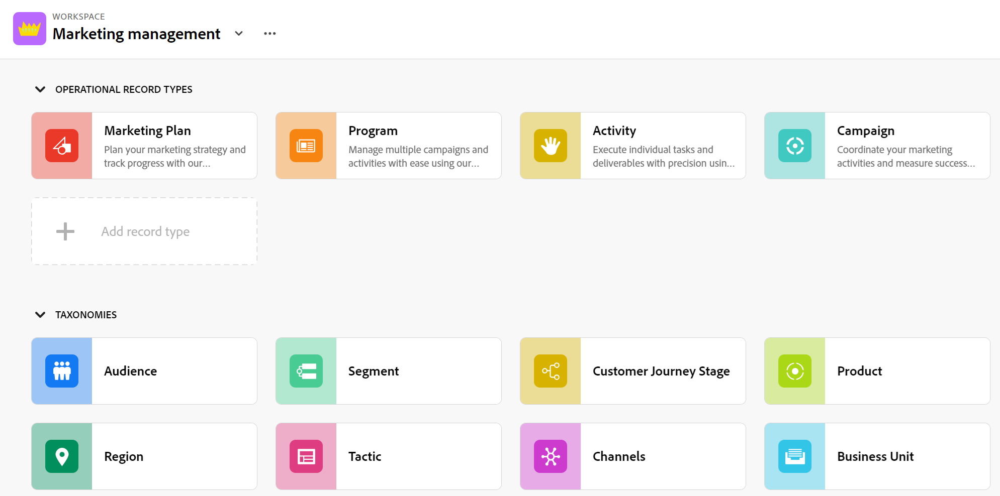
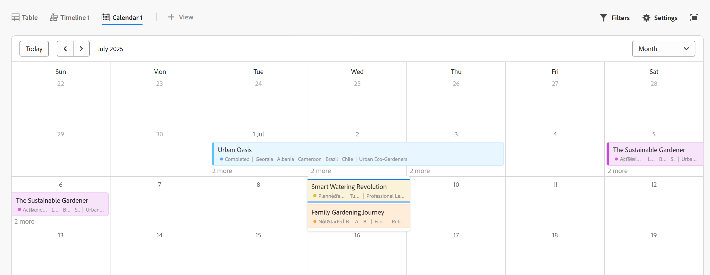

# Adobe Workfront规划概述

<!--this article is linked to the WF Planning landing page - do not change URL or move it; send the team a new URL after we add the redirects for this page-->

<!--do not use the snippet for IMPORTANT as it links to this article-->

<!--The highlighted information on this page refers to functionality not yet generally available. It is available only in the Preview environment for all customers. After the monthly releases to Production, the same features are also available in the Production environment for customers who enabled fast releases.    

For information about fast releases, see [Enable or disable fast releases for your organization](/help/quicksilver/administration-and-setup/set-up-workfront/configure-system-defaults/enable-fast-release-process.md).  -->

>[!IMPORTANT]
>
>本文中的信息介绍了Adobe Workfront Planning，它是Adobe Workfront的一项附加功能。
>
>要完全访问Workfront Planning中的所有功能，您必须具备以下条件：
>
>* 新的Workfront包和许可证。 Workfront Planning不适用于旧版Workfront包或许可证。
>* Workfront计划包。
>* 您组织的Workfront实例必须载入到Adobe Unified Experience。
>
> 有关访问Workfront Planning的完整要求列表，请参阅[Adobe Planning访问概述](/help/quicksilver/planning/access/access-overview.md)。
> 

本文包含有关Workfront Planning的一般信息。

有关包含Workfront Planning文档的文章的完整列表，请参阅[Adobe Workfront Planning：文章索引](/help/quicksilver/planning/planning-information.md)。

## Adobe Workfront Planning简介

Adobe Workfront Planning是Adobe Workfront的一项附加功能。 Workfront Planning的目的是全面了解企业的运营详细信息，并回答工作管理生命周期各阶段的关键业务问题。

Workfront Planning可以回答类似下面的问题：

* 我们在欧洲、中东和非洲地区针对第4季度运行了多少营销活动？
* 并行营销活动之间是否存在任何受众重叠？
* 认识项目目前进展如何？
* 特定营销活动的资产是什么样的？ 其中哪些仍必须获得批准？

要回答这些问题，领导力需要一种解决方案，能够全面了解从规划到执行、从交付到结果衡量的每个工作阶段。 目前，各组织拥有一些工具，可以涵盖流程的某些部分，但许多组织没有与工作的所有阶段建立良好的联系，也无法可靠地提供结果。

以下是一些主要功能：

* 解决跨所有阶段和参与工作流程的所有利益相关者管理工作的问题。
* 全面自定义工作流，从决定组织使用哪些对象类型（或记录类型）到配置这些对象如何相互链接。
* 链接到来自其他系统的对象类型，为所有进程创建一致的框架。

<!--
## Currently available Workfront Planning features
(*****for GA just make a list of what features ARE included in Planning and eliminate the last 2 columns; also update the title of this section*****)

(*****at GA: update the link below to the new place for release notes *****)

For information about new features and when they are released, see [Adobe Workfront Planning release activity for 2024](/help/quicksilver/planning/general/release-activity.md). 

The following features are currently available in Workfront Planning:

* Create workspaces             
* Create record types             
* Create record custom fields             
(************ * Import record types and fields using an Excel or CSV file*****)
          
* Display records in a table view            
* Display records in a timeline view            
* Display records in a calendar view            
* Filter, sort, and group records in a table view
* Filter, group, and color code records in the timeline view
* Filter records in the calendar view 
* Search for records in the table and timeline views             
* Connect records that belong to the same workspace  
* Connect records that belong to different workspaces   
* Connect Workfront Planning records to Workfront projects, programs, portfolios, companies, groups             
* Connect Workfront Planning records to Adobe Experience Manager assets          
    You must have an Adobe Experience Manager Assets license and an integration between AEM Assets and Workfront.
    For information, see [Adobe Workfront for Experience Manager Assets and Assets Essentials: article index](/help/quicksilver/documents/adobe-workfront-for-experience-manager-assets-essentials/workfront-for-aem-asset-essentials.md). 
* View record information in the Details tab
* View record connections in the Connections tab
* Customize the layout of a record's page             
* Share workspaces             
* Share views             
* Share views publicly with any external resource, even people who are not Workfront users         
* Duplicate views             
* Submit requests to create records            
* Export record details to Word and PDF.
* Add comments to records             
* Receive in-app notifications             
* Receive email notifications             
* Add thumbnails and cover pages to records             
* View the history of changes on a record             
* Rich Text formatting for Paragraph fields             
* Access Planning records from Workfront objects             
* Connect and disconnect Planning records from Workfront objects 
* Create Planning records by submitting a request form            
* Workfront Planning public API             
* Adobe Workfront Planning modules for Adobe Workfront Fusion             
* Workfront Planning AI Assistant
* Reporting on Workfront Planning information
    You can report on Planning information using the Canvas Dashboard. For information, see [Canvas Dashboards overview](/help/quicksilver/reports-and-dashboards/canvas-dashboards/canvas-dashboards-overview.md). 

-->

<!--OLD: 

|       Feature                                      |     Available now  |     Coming soon   |     In research  |
|----------------------------------------------------|:-----------------------------:|:--------------------------------:|:----------------:|
|     Create workspaces                              |   ✓                           |                                  |                  |
|     Create record types                |   ✓                           |                                  |                  |
|     Create record custom fields                    |   ✓                           |                                  |                  |
|     Import record types and fields using an Excel  or CSV file                              |                              |           ✓                       |                  |
|     Link records                                   |   ✓                           |                                  |                  |
|     View records in a table                        |   ✓                           |                                  |                  |
|     View records in a timeline                     |   ✓                           |                                  |                  |
|     View records in a calendar                     |   ✓                           |                                  |                  |
|     Filter records                                 |   ✓                           |                                  |                  |
|     Group records in the timeline view             |   ✓                           |                                  |                  |
|     Group records in the table view                | ✓                              |                                 |                  |
|     Sort records in the table view                                 |  ✓                             |                                 |                  |
|     Sort records in the timeline view                                 |                               |   ✓                              |                  |
|     Sort groupings in the table view                                 |                               |   ✓                              |                  |
|     Sort groupings in the timeline view                                 |                               |   ✓                              |                  |
|   Search for records in the table view    | ✓    |   |
|   Search for records in the timeline view    | ✓    |   |
|     Connect Workfront Planning records to Workfront projects, programs, portfolios, companies, groups  |   ✓                            |                                 |                  |
|     Connect Workfront Planning records to Adobe Experience Manager assets                                  |      ✓                         |                                  |                 |
|     Connect Planning records from different workspaces                                  |      ✓                         |                                  |                 | 
|     Record page with detailed information                            |   ✓                           |                                  |                  |
|     Update the layout of the record's page              |    ✓                           |                                 |                  |
|  Share workspaces | ✓| |  |
|  Share views |✓ | |  |
|  Share views publicly with external resources |✓ | |  |
|  Duplicate views |✓ | |  |
|     Submit requests                                |                               |          ✓                        |                 |
|     Export record details to Word                                 |    ✓                           |                                  |                 |
|     Export record details to PDF                                 |                               |                                  |       ✓          |
|     Customize the color and icon of a record                                 |      ✓                         |                                  |                 |
|     Add comments to records                                 | ✓                              |                                  |                 |
|     Receive in-app notifications                                 | ✓                              |                                  |                 |
|     Receive email notifications                                 | ✓                              |                                  |                 |
|     Add thumbnails to records                                 | ✓                              |                                  |                 |
|     View history of changes on a record                                 | ✓                              |                                  |                 |
|     Rich Text formatting for Paragraph fields                                 |      ✓                         |                                  |                 | 
|     Adobe Workfront Planning modules for Adobe Workfront Fusion                                 |      ✓                         |                                  |                 | 
|     Copy and paste information from one field to another                                  |      ✓                         |                                  |                 | 
|     Access Planning records from Workfront objects                                  |      ✓                         |                                  |                 |
|     Connect Planning records from Workfront objects                                  |      ✓                         |                                  |                 |
|     Workfront Planning public API                                 |      ✓                         |                                  |                 |
|     Workfront Planning AI Assistant*                                 |      ✓                         |                                  |                 |
|     Reporting on Workfront Planning information (Canvas Dashboard)                              |                               |       ✓                           |                 |
-->

## 为Workfront实例中的用户启用Workfront Planning

贵组织购买Workfront Planning包后，作为Workfront管理员，您必须确保满足以下要求才能访问Workfront Planning：

* 在主菜单中向以下用户分配一个包含Planning的布局模板：

   * 将布局模板分配给轻量级和Contribute用户。

     默认情况下，标准用户和系统管理员已启用Planning。

  有关详细信息，请参阅[使用布局模板自定义主菜单](/help/quicksilver/administration-and-setup/customize-workfront/use-layout-templates/customize-main-menu.md)和[将用户分配给布局模板](/help/quicksilver/administration-and-setup/customize-workfront/use-layout-templates/assign-users-to-layout-template.md)。

* 为用户分配Workfront许可证和Workfront Planning权限，以便他们能够在Workfront Planning中查看或创建对象。 有关授予他人访问权限以及允许他人使用Workfront Planning的更多信息，请参阅[Adobe Planning访问概述](/help/quicksilver/planning/access/access-overview.md)。

## Workfront Planning术语

虽然Workfront Planning是Workfront的一部分，但它附带了专有的概念和术语。 在开始为组织设置Workfront计划之前，请确保您熟悉这些概念。

Workfront Planning的框架是完全可自定义的。 您可以创建所有记录类型、其属性以及与其关联的任何字段，以满足贵组织的确切需求。

您可以创建的Workfront Planning对象数存在限制。 有关详细信息，请参阅[Adobe Workfront Planning对象限制概述](/help/quicksilver/planning/general/limitations-overview.md)。

以下是主要的Workfront Planning对象和概念：

* **Workspace**：定义特定组织的运营生命周期的记录类型集合。 工作区是组织单位的工作框架。

  

  有关详细信息，请参阅[创建工作区](/help/quicksilver/planning/architecture/create-workspaces.md)。

* **记录类型**： Workfront Planning中对象类型的名称。

  记录类型填充工作区。

  与Workfront中预定义的对象类型不同，在Workfront Planning中，您可以创建自己的对象类型。

  例如，在Workfront中，已创建Program、Portfolio、Project、Task或Issue的对象类型。

  在Workfront Planning中，您可以创建符合组织工作流程的任何记录类型。 稍后，您可以定义记录类型如何相互关联或表单从属关系。

  有关详细信息，请参阅[记录类型概述](/help/quicksilver/planning/architecture/overview-of-record-types.md)。

* **记录**：记录类型的实例。

  

  将记录类型添加到工作区后，您可以开始在该记录类型的页面上添加该类型的记录。

  例如，“Campaign”可以是记录类型，“Summer Campaign for EMEA”是Campaign记录类型的记录。

  有关详细信息，请参阅[创建记录](/help/quicksilver/planning/records/create-records.md)。

* **Workspace模板**：您可以使用预定义的模板创建工作区。 您可以使用模板中的预定义记录类型和字段，也可以添加自己的类型和字段。

  

  Adobe Workfront Planning包含以下模板：

   * 基本：营销管理
   * 高级：营销管理
   * 企业：营销管理
   * 销售管理
   * 产品管理

  有关详细信息，请参阅[工作区模板列表](/help/quicksilver/planning/architecture/workspace-templates.md)。

* **字段**：字段是可以添加到记录类型的属性。 字段包含有关记录类型的信息。<!--check the shot below, "Connection" needs to be in lowercase-->

  

  有关记录字段的注意事项：

   * 您为记录类型添加的字段会自动与该类型的所有记录相关联，并可用于捕获有关这些记录的数据。

   * 字段在应用于记录类型页的“表”视图中显示为列。 它们也会显示在记录的页面中。

   * 字段对于记录类型是唯一的，不会从一种记录类型转移到另一种记录类型。

   * 字段可完全自定义，并且只能在Workfront Planning中访问。 您无法从Workfront访问Workfront Planning字段。

  有关详细信息，请参阅[创建字段](/help/quicksilver/planning/fields/create-fields.md)。

  默认情况下，新记录类型与以下预定义字段相关联：

   * 名称
   * 描述
   * 开始日期
   * 结束日期
   * 状态

  您可以创建以下类型的自定义字段：

   * 单行文本
   * 段落
   * 多选
   * 单选
   * 日期
   * 数字
   * 百分比
   * 货币
   * 复选框
   * 公式
   * 人员
   * 创建者
   * 创建日期
   * 上次修改者
   * 上次修改日期

* **连接的记录类型**、**连接的记录**&#x200B;和&#x200B;**连接的字段**：您可以在Workfront Planning中的以下实体之间创建连接：

   * 两种Workfront Planning记录类型。
   * 记录类型和Workfront项目、项目群、项目组合、公司或组对象类型。
   * 记录类型和Adobe Experience Manager资源或文件夹。

     您必须拥有Adobe Experience Manager许可证才能将记录类型与Experience Manager对象连接。

     

  在记录类型之间建立连接后，可以将这些类型的单个记录或对象彼此连接。 记录之间的连接显示为已连接的记录字段或连接。

  当有多种类型的工作对象相互影响时，连接记录类型会很有用。 例如，您可以与营销活动配合使用，每个营销活动可能适合多个品牌。 要指示这种关系，您可以将营销活动关联到品牌。 此外，每个营销活动的工作可能会在Workfront的多个项目中规划。 要指示这一点，您可以将营销策划关联到相关项目。 在Workfront Planning中，连接记录类型并随后连接单个记录即可实现这种关系。

* **查找字段**（或链接字段）：在两个记录类型之间建立连接并将单个记录连接在一起后，可以从要连接的记录中引用已连接记录的字段。

  例如，如果将Campaign记录类型与Workfront Project对象类型连接，则可以在营销活动记录中显示已连接项目的“预算”字段。

  

  >[!TIP]
  >
  > 不能将以下字段类型添加为已连接记录或对象类型中的查找字段：
  >
  >* 人员
  >* 创建者
  >* 上次修改者
  >* Workfront预输入字段（包括项目所有者或项目发起人等字段）

  有关连接记录类型、记录和创建链接字段的信息，请参阅以下文章：

   * [连接记录类型](/help/quicksilver/planning/architecture/connect-record-types.md)
   * [连接记录](/help/quicksilver/planning/records/connect-records.md)

<!--not yet:* Fields are reusable across Record Types.  -->

* **视图**：记录以不同类型的视图显示在各自记录类型页面下。

  

  视图包含特定视图类型的个性化设置，如字段列表（列）、记录列表（行）、其顺序（排序）、应用或适用的过滤器和分组。

  以下是可应用于记录类型页面的视图类型：

   * **表视图**：以表格式显示记录及其字段，包括连接和查找字段。 表的行是单独的记录，列是记录字段。 表格视图是默认视图。

     

   * **时间线视图**：在时间线中显示至少有两个日期类型字段的记录。 您最多可以在时间轴视图中显示5个连接的记录类型及其记录。

     

   * **日历视图**：以日历格式显示至少有两个日期类型字段的记录。

     

有关详细信息，请参阅[管理记录视图](/help/quicksilver/planning/views/manage-record-views.md)。

## 找到Adobe Workfront Planning

要找到Adobe Planning，请确保贵组织已获得Workfront Planning的访问权限，且您的系统或组管理员已将Planning区域添加到主菜单。 有关信息，请参阅[Adobe计划访问概述](/help/quicksilver/planning/access/access-overview.md)。

要找到Workfront Planning，请执行以下操作：

1. 登录到Workfront。

{{step1-click-main-menu}}

1. 单击&#x200B;**Planning** 。

   Workfront Planning主页将打开。

   

   >[!TIP]
   >
   >    您的Workfront管理员可以将Planning区域添加到布局模板中的“选择登陆页面”选项，以便您一登录到Workfront即可打开Planning。 有关信息，请参阅[使用布局模板自定义登陆页面](/help/quicksilver/administration-and-setup/customize-workfront/use-layout-templates/customize-landing-page.md)。

1. （视情况而定，可选）如果您是Workfront管理员，请单击以下选项卡之一：
   * **我所在的工作区**：显示您创建的工作区或与您共享的工作区。
   * **其他工作区**：显示系统中的所有其他工作区。

   对于所有其他用户，他们创建或与他们共享的工作区都显示在&#x200B;**工作区**&#x200B;区域中。

1. （可选并推荐）继续执行以下某些操作以构建您的工作结构：

   1. 从头开始或使用模板创建工作区。 有关信息，请参阅[创建工作区](/help/quicksilver/planning/architecture/create-workspaces.md)。

   1. 向新工作区中添加部分。 有关信息，请参阅[编辑工作区](/help/quicksilver/planning/architecture/edit-workspaces.md)。
   1. 重命名新工作区中的现有节。
   1. 将记录类型添加到新工作区。 有关信息，请参阅[创建记录类型](/help/quicksilver/planning/architecture/create-record-types.md)。

   1. 单击记录类型的名称以打开记录类型的页面。 默认情况下，记录类型页面会在“表”视图中打开。

      您还可以创建时间轴或日历视图。 有关信息，请参阅[管理记录视图](/help/quicksilver/planning/views/manage-record-views.md)。

   1. 在表视图中，通过添加行来开始添加记录

      或

      通过添加列开始添加记录字段。

      有关信息，请参阅以下文章：

      * [创建记录](/help/quicksilver/planning/records/create-records.md)
      * [创建字段](/help/quicksilver/planning/fields/create-fields.md)。

## Workfront Planning发布活动

<!--update this with the new release activity page - the article index for all Planning releases-->

我们将定期为Workfront Planning发布新功能。

有关已发布功能的最新列表，请参阅[Adobe Workfront Planning发布活动：文章索引](/help/quicksilver/product-announcements/product-releases/planning-release-activity/planning-release-activity-article-index.md)。

## Workfront Planning的其他资源

* [Adobe Workfront Planning：文章索引](/help/quicksilver/planning/planning-information.md)：包含有关Workfront Planning文档的所有文章的索引，按关注区域分组。
* [Adobe Workfront Planning AI助手概述](/help/quicksilver/planning/general/planning-ai-assistant-overview.md)：使用Workfront AI Assistant for Planning，您可以使用命令搜索记录，或者创建、更新和删除记录，并让助手为您完成工作。
  <!--
    >[!NOTE]
    >
    >    The Workfront AI Assistant has been temporarily removed and it will be available at a later date.-->

* [适用于Workfront Fusion的Adobe Workfront规划模块](https://experienceleague.adobe.com/en/docs/workfront-fusion/using/references/apps-and-their-modules/adobe-connectors/workfront-planning-modules)：使用Adobe Workfront规划模块，可以在Workfront规划中发生事件时触发方案。 您还可以创建、读取、更新和删除记录，或对Adobe Workfront Planning帐户执行自定义API调用。

* [Adobe Workfront Planning API基础知识](/help/quicksilver/planning/general/planning-api-basics.md)： Adobe Workfront Planning API的目标是通过引入通过HTTP运行的REST-ful架构，简化与Planning的生成集成。

* **Workfront Planning报告功能**：您现在可以使用Workfront Canvas Dashboard在Workfront的报告中查看Workfront Planning信息。 有关信息，请参阅[画布功能板概述](/help/quicksilver/reports-and-dashboards/canvas-dashboards/canvas-dashboards-overview.md)。

