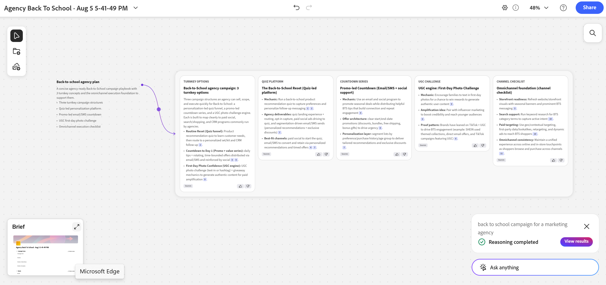

# 从构思空间简报创建计划记录

<!--
Will this release JUST to preview? If not - hide the preview portion below
-->

<!--
I started with this under Records first but what if Ideation will be added to other products and it will generate record types in those products? keep it here so it can be moved, if needed, to a standalone product one day?
-->

<!--
*********************** IMPORTANT ***************
THIS ARTICLE HAS 2 DRAFTS IN 2 SEPARATE AREAS FROM CLAUDE - THEY WERE CREATED AT DIFFERENT TIMES - WHICH ONE WOULD YOU KEEP OR MERGE THEM INTO ONE ARTICLE
-->

此页面上的信息引用了尚未公开的功能。 它只能作为&#x200B;**构思空间Beta**&#x200B;程序的一部分提供。

有关详细信息，请参阅[Adobe Workfront规划构思空间入门](/help/quicksilver/planning/ideation/get-started-with-planning-ideation.md)。

{{planning-important-intro}}

使用Adobe Workfront Planning的新功能Ideation Space，您可以将简报转换为Planning记录。 导出的摘要可创建新记录或更新现有记录。

本文介绍了如何使用构思空间创建或编辑现有Planning记录。

## 访问权限要求

+++ 展开以查看本文中各项功能的访问要求。 

<!--
are there additional license restrictions or packages to be purchased to have access to Ideation space?? If yes, update the table below
-->

<table style="table-layout:auto"> 
<col> 
</col> 
<col> 
</col> 
<tbody> 
    <tr> 
<tr> 
</tr>   
<tr> 
   <td role="rowheader">
Adobe Workfront 包
</td> 
   <td> 
<ul> 
<li>
带规划包的任何Workfront或工作流
</li>
或
<li>
作为独立产品购买时的任何Planning包
</li></ul>
   </td>

<tr> 
   <td role="rowheader">
其他产品
</td> 
   <td><ul>
   <li>
Adobe GenStudio for Performance Marketing
</li>
   <!--
   <li>
Adobe Customer Journey Analytics
</li>
   -->
   </ul>
   </td> 
  </tr> 
  <tr> 
   <td role="rowheader">
Adobe工作流许可证
</td> 
   <td>
标准

   </td> 
  </tr> 
<tr> 
   <td role="rowheader">
Adobe计划许可证
</td> 
   <td>
标准

   </td> 
  </tr> 
<tr> 
   <td role="rowheader">
访问级别配置
</td> 
   <td> 
   <ul>
   <li>
当您同时具有Workflow和Planning包时，必须将工作流和Planning许可证类型添加到访问级别
   </li>
   <li>
必须取消选择访问级别中的禁用创意空间设置
</li>
</td> 
  </tr>  
   <tr> 
   <td role="rowheader">
对象权限
</td> 
   <td> 
为要添加记录的工作区和记录类型提供或更高权限 

      
系统管理员对所有工作区具有权限，包括他们未创建的工作区

      
查看对Workfront对象的权限以将其添加到摘要 <!--not sure if this is available-->

      
创意空间上的编辑器权限以创建摘要

   </td> 
  </tr>  
   <tr> 
   <td role="rowheader">
Adobe GenStudio for Performance Marketing用户角色
</td> 
   <td>
<ul><li>用于访问营销活动、产品和角色的任何GenStudio用户角色</li>
   <li>用于访问激活的GenStudio系统管理器 <!--and Events--></li></ul>
   有关信息，请参阅<a href="https://experienceleague.adobe.com/zh-hans/docs/genstudio-for-performance-marketing/user-guide/intro/user-roles">用户角色和权限</a>。 
   

  </td> 
  </tr> 
</tbody> 
</table>

有关Workfront访问要求的详细信息，请参阅Workfront文档中的[访问要求](/help/quicksilver/administration-and-setup/add-users/access-levels-and-object-permissions/access-level-requirements-in-documentation.md)。

+++  

## 关于使用构思空间创建记录的注意事项

* 在创建或编辑记录时，您只能从Workfront Planning中启动创意空间。 在Workfront Planning之外不存在构思空间。
* 要访问创意力空间，您必须在Workfront Planning中拥有工作区和记录类型。
* 新记录始终以占位符内容开头，无论您如何创建它们。
* 删除链接到构思简介的Planning记录时，该简介保留在构思空间中，并且构思空间中的相关画布未删除。
* 信息同步仅从构思空间到Workfront Planning进行。 从Planning记录到Ideation space brief之间没有反向同步或自动同步。
* 在Workfront Planning中创建、编辑或删除字段时存在以下情况：

  * 在链接到构思简报的记录上创建的新字段每天都添加到该简报中。 新字段在构思简介中显示为空。
  * 删除的字段保留在摘要中并保持其先前的值。
  * 重命名的字段会更新摘要中的名称。
* 您可以将文档作为卡片添加到构思空间中。 这还包括图像。

  支持以下文件类型：PDF、Excel、CSV、PNG（和其他图像格式）、Word、PowerPoint。 不支持视频。

  所有上传的文档都将在后端转换为PDF进行处理。
* 您可以将记录直接从Workfront Planning拖放到空间中，记录与手动上传文件的显示方式相同。

## 使用构思空间创建记录

1. 在Workfront Planning登陆页面中，单击可管理的工作区的卡片。
1. 单击可向其添加记录的记录类型的卡。
1. 执行以下操作之一以创建记录：

   * 从记录类型页面的任何视图中，单击页面右上角的&#x200B;**新建记录**&#x200B;并在&#x200B;**选择添加记录的方式**&#x200B;框中单击&#x200B;**打开构思空间**，然后单击&#x200B;**继续**。
   * 滚动到记录表的底部，单击&#x200B;**新建行**，然后单击&#x200B;**打开构思空间**。

     >[!TIP]
     >
     >选择&#x200B;**不显示**&#x200B;将永久取消将来的提示。 单击“关闭”图标&#x200B;**X**&#x200B;可关闭此框，但下次您添加内联记录时，此框会重新出现。

   

   构思空间将在带有空提示的新选项卡中打开。

   记录会立即使用占位符文本创建。

1. （可选）单击提示框中的&#x200B;**使用现有摘要**&#x200B;以浏览并添加现有文档，创意空间将使用该文档创建摘要和未来记录。

   

1. （可选）单击提示框右上角的&#x200B;**打开以前的画布** <!--accurate??-->图标以打开现有的摘要

1. 在&#x200B;**中，您正在处理什么？** 提示框，描述您要创建的记录类型。

   您分享的详细信息越多，创意空间提供的信息就越有用。 例如，键入您计划进行的营销活动的描述：“返回营销机构的校园营销活动”。

1. 单击&#x200B;**开始构思**。

   构思空间在构建您的构思时按照以下步骤工作： <!--check some of these in the UI - there might have been UI text changes-->

   1. 了解您的目标和上下文
   2. 查看您的共享空间和选定的材料
   3. 从文档、Web和数据中收集证据
   4. 将发现综合成研究摘要
   5. 通过引用创建和优化卡片

   在此过程中，您会看到创意空间主动搜索Web上可用的已连接Workfront Planning数据或信息。

   例如，它可以搜索现有的项目、产品、角色或区域，以及在线提供的类似概念。<!--check on this with Et-->

   构思完成后，向构思空间添加下列内容：

   * AI结果的摘要，链接到几张卡片，其中包含有关要考虑的事项的详细信息。 详细信息卡片将显示在新部分中。 连接器指示哪个卡部分属于哪个摘要。

   * 创意空间左下角的&#x200B;**Brief**&#x200B;文件。 摘要是未来记录的草稿，它显示为记录的“详细信息”页面。

   

1. 继续将信息添加到构思空间以完成创建摘要。

1. （视情况而定）完成简介后，单击左下角的预览图像，然后单击以下任一项：

   * **导出到文件**&#x200B;以创建文件
   * **导出到Workfront Planning**&#x200B;以创建Planning记录

   有关将项目添加到简介并导出它的信息，请参阅[在构思空间中创建简介](/help/quicksilver/planning/ideation/create-briefs-in-ideation-space.md)。

   此操作会完成使用附加信息创建记录，并将其添加到您最初选择的记录类型。

## 编辑构思空间中的现有记录

您可以从现有记录中打开构思空间以更新它们。

不能批量编辑创意空间中的记录。

1. 转到Workfront Planning中的现有记录并打开其详细信息页面。

1. 单击&#x200B;**在构思空间**&#x200B;中打开。 这将在新选项卡中打开“构思”空间。

   如果记录的构思已存在，则会打开该空间。

   如果构思不存在，则创建构思空间和简短。

   >[!TIP]
   >
   >无法使用构思空间批量编辑记录。

   <!-- 
    I don't think these steps are still valid but the environment was not available to test: 
    - If a record is already linked to a Catalyze canvas, a link appears beneath the record title; clicking it opens the associated canvas.
    - If a linked canvas hasn't been exported/pushed back yet, the record shows a placeholder message ("This record has active Canvas...") even if the canvas itself has a real name in Catalyze.
    -->

1. 继续编辑摘要，如本文中[使用构思空间](#create-records-using-the-ideation-space)创建记录一节中所述。

<!-- this is from Claude, but rephrased and included most of this above: 

## Step 5: Open the Workfront Planning Records panel

To bring real Workfront Planning records into your canvas (rather than just AI-generated ideas), click the **records icon** in the left-hand toolbar (third icon down). This opens the **Workfront Planning Records** panel, listing all **Connected Record types** available in your Planning environment — for example:

- Products
- Regions
- Personas
- Channels
- Activations
- Project
- Test Record
- Experience Manager Assets

## Step 6: Drag real records onto the canvas

Search or browse within a record type (e.g., **Products** or **Personas**), then drag the record you want directly onto the canvas. In the example, an existing **Nike product** record and a **Deep testing** persona record were both dragged in and positioned near the relevant concept cards.

This lets you visually connect your AI-generated ideas to the actual records that already exist in Workfront Planning, grounding the ideation in real data rather than hypothetical entities.

---

## Step 7: Refine with follow-up prompts

Use the **Ask anything** box in the bottom-right corner at any time to refine the canvas — for example, typing `regenerate` against a specific card to have Catalyze redo that section using updated context. Catalyze will re-run its reasoning steps (searching, synthesizing, citing) and update the affected cards in place.

---

## Step 8: Review the full canvas

Zoom out to see the complete picture: your original campaign goal, all AI-generated concept cards with citations, the real Workfront Planning records you've pulled in (Products, Personas, etc.), and a **Campaign Brief** summary card in the corner pulling it all together.

---

## Tips

- **Be specific in Step 2** — richer campaign descriptions produce more relevant, better-grounded cards.
- **Check citations** before trusting a generated fact — click **Sources** on any card.
- **Mix AI cards with real records** — dragging in actual Products, Personas, Regions, etc. keeps the canvas tied to your real Planning data, not just AI speculation.
- Responses are AI-generated and may be inaccurate — always verify against the linked sources before finalizing a record.

***************SECOND DRAFT FROM CLAUDE*******************
# Creating and Managing Records with Catalyze Ideation

> This workflow reflects the Closed Beta experience and is expected to evolve before Open Beta and GA. Confirm current behavior before publishing to customers.

This guide explains how to create and ideate on records using Catalyze within Workfront Planning. It covers all entry points, system behavior, data sync rules, and file-upload support.

## Before you start

- You must have access to a record list within Workfront Planning.
- Catalyze always opens in a **new browser tab** — this is consistent across every entry point.
- Any record created through Catalyze starts with **placeholder text** until you begin ideating.

## Option 1: Create a record via the top-level "New Record" button

1. Navigate to your record list in Workfront Planning.
2. Click the **New Record** button at the top of the page.
3. From the dropdown menu, select **Ideate in Catalyze**.
4. A new browser tab opens automatically, launching the Catalyze canvas.
5. A new record is created in Workfront Planning with placeholder text.
6. Begin ideation directly in Catalyze.

**Additional access from the record view:** Open the newly created record and, in its detail modal, click **Ideate in Catalyze**. This opens Catalyze in a new tab (same behavior as above).

## Option 2: Create a record via inline record creation (bottom of table)

1. Scroll to the bottom of the record table.
2. Click **New Record**.
3. The record is created immediately with placeholder text.
4. A pop-up appears with these options:
   - **Open Catalyze** — launches Catalyze in a new browser tab
   - **Don't Show Again** — permanently dismisses the future prompt
   - **X (Close)** — closes the pop-up; it will reappear next time
5. Click **Open Catalyze** to begin ideation.

## Working with existing records

**Contextual actions (bottom selection bar)**
- **Single record selected:** an "Ideate in Canvas" / "Open in Canvas" action appears.
  - If a canvas already exists, it opens that canvas.
  - If no canvas exists, it creates a new one.
- **Multiple records selected:** the Ideate/Open in Canvas action is **not available** — bulk ideation is not supported.

**Record detail panel**
- If no canvas is connected, an **Ideate in Catalyze** button appears in the record header.
- If a record is already linked to a Catalyze canvas, a link appears beneath the record title; clicking it opens the associated canvas.
- If a linked canvas hasn't been exported/pushed back yet, the record shows a placeholder message ("This record has active Canvas...") even if the canvas itself has a real name in Catalyze.

**When can you create a canvas for a record?**
A canvas can be created for a record that is in Workfront Planning and still in **draft** state (not yet marked "ready").

## Record deletion behavior

If a Planning record linked to a Catalyze canvas is deleted:
- The canvas remains intact in Catalyze.
- No data is removed from Catalyze.

## Data synchronization rules

**Sync direction:** One-way only, from Catalyze → Workfront Planning. There is no reverse or automatic sync from Planning back to Catalyze.

**Export process:**
1. In Catalyze, click **Export to Planning**.
2. Data is pushed to the connected Workfront Planning record.
3. The export **overwrites all existing field data** in the record.

**Important notes:**
- Changes made directly in Workfront Planning do **not** sync back to Catalyze.
- Data refresh in Workfront Planning is manual only (Beta behavior) — there is no scheduled/automatic sync.
- Schema updates do sync one direction: once connected, Planning schema changes propagate to Catalyze daily — added fields appear empty, removed fields keep their prior values, and renamed fields update in place.

## Uploading documents into the Catalyze canvas

- Files can be added as a "document card" on the canvas — this works the same whether the file is an image or another document type.
- You can drag and drop files directly from Workfront Planning onto the canvas, and they appear the same way as manually uploaded files.
- All uploaded documents are converted to PDF on the backend for processing.
- Supported file types (as of the Aug 2026 beta): **PDF, Excel, CSV, PNG (and likely other image formats), Word, PowerPoint.**
- **Not supported:** video files.
- You can include images directly in a prompt and Catalyze will recognize their content, though small-format legibility is still being refined.

## Key takeaways

- Use **Ideate in Catalyze** to connect records to the AI-assisted ideation workflow.
- Catalyze always launches in a separate browser tab.
- New records always start with placeholder content, regardless of entry point.
- Data flow between Catalyze and Planning is manual and one-directional (Catalyze → Planning).
- Deleting a Planning record does not delete its associated Catalyze canvas.

-->

<!--
Internal info: 

## The Ideation space and Adobe GenStudio

Adobe GenStudio for Performance Marketing is Adobe's end-to-end content supply chain solution, spanning five stages:

1. Strategy and Ideation
2. Workflow and Planning
3. Asset Management
4. Creation and Production
5. Delivery and Activation

The Ideation space fits in the **Strategy and Ideation** stage — the front door of the content supply chain — and is designed to work natively with the rest of GenStudio, so the briefs and strategic direction it generates flow directly into Workfront Planning for execution.
-->

